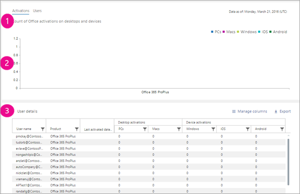

# Rapports Microsoft 365 dans le centre d’administration-activations de Microsoft Office

Le tableau de bord **rapports** Microsoft 365 affiche une vue d’ensemble de l’activité sur les produits de votre organisation. Il vous permet d'explorer les rapports au niveau de chaque produit afin d'offrir des informations plus précises sur les activités pour chaque produit. Consultez [la rubrique Présentation des rapports](activity-reports.md).
  
Le rapport Activation d'Office vous offre un aperçu des utilisateurs ayant activé leur abonnement Office sur au moins un appareil. Elle fournit une répartition des activations d’abonnements Microsoft 365 apps pour Enterprise, Project et Visio Pro pour Office 365, ainsi que la répartition des activations sur les ordinateurs de bureau et les appareils. Ce rapport peut vous permettre d'identifier les utilisateurs qui pourraient avoir besoin d'assistance pour activer leur abonnement Office.
  
> [!NOTE]
> Vous devez être un administrateur général, un lecteur global ou un lecteur de rapports dans Microsoft 365 ou un administrateur Exchange, SharePoint, teams, Team communications ou Skype entreprise pour afficher des rapports.  
  
## Accès au rapport Activations d'Office

1. Dans le centre d’administration, accédez à la page **Rapports** \> <a href="https://go.microsoft.com/fwlink/p/?linkid=2074756" target="_blank">Utilisation</a>.

    
2. Dans la liste déroulante **Sélectionner un rapport** , sélectionnez **Office 365** \> **activations**Office 365. 
  
## Interprétation du rapport Activations d'Office

Les graphiques **Activations** et **Utilisateurs** vous offrent un aperçu des activations d'Office dans votre organisation. 
  

  
|Item|Description|
|:-----|:-----|
|1    |Le rapport Activations d'Office présente l'état actuel des données d'activation de licences Office [à la date du rapport présentée en haut à droite du graphique].    |
|2     |Les données de chaque rapport couvrent généralement les 24 à 48 heures.    |
|3     |Le graphique **Activations** indique le nombre d'activations d'Office sur des ordinateurs et appareils.    |
|4     |Le graphique **Utilisateurs** indique le nombre d'utilisateurs activés et le nombre d'utilisateurs ayant activé l'abonnement Office sur un ordinateur ou un appareil.    |
|5     | Sur le graphique **Activations**, l'axe Y représente le nombre d'activations d'Office.     Sur le graphique **Utilisateurs**, l'axe Y représente l'activité d'activation d'Office des utilisateurs.     L'axe X sur les deux graphiques représente la plage de dates sélectionnée pour ce rapport particulier.    |
|6     |Vous pouvez filtrer les graphiques que vous voyez en sélectionnant un élément dans la légende. Par exemple, dans le graphique **activations** , sélectionnez **Windows OS**, **Mac OS**, **Windows 10 Mobile**, **iOS** ou **Android** pour afficher uniquement les informations relatives à chacun d’eux. Cette sélection ne modifie nullement les informations figurant dans le tableau grille.       |
|7     | Le tableau présente le détail des activations d'Office au niveau de l'utilisateur. Il s'agit de la liste de tous les utilisateurs ainsi que le produit Office qui leur est attribué. Vous pouvez ajouter des colonnes au tableau.      **Nom d'utilisateur** indique l'adresse de courrier de l'utilisateur.    **Nom** complet est le nom complet de l’utilisateur.    Les **licences de produits** sont les produits qui sont affectés à cet utilisateur.    **Date de la dernière activation** désigne la date à laquelle l'utilisateur a activé Office sur un ordinateur ou un appareil.    L' **activation d’ordinateurs partagés utilisés** est true si l’utilisateur a utilisé Office par le biais de l’activation d’ordinateurs partagés.   **Windows** fait référence au nombre de bureaux Windows sur lesquels l’utilisateur a activé Office.    **Mac** fait référence au nombre de bureaux Mac sur lesquels un utilisateur a activé Office.    **Windows 10 Mobile** fait référence au nombre d’appareils mobiles Windows 10 sur lesquels l’utilisateur a activé Office.    **iOS** fait référence au nombre d’appareils iOS sur lesquels un utilisateur a activé Office.    **Android** fait référence au nombre d’appareils Android sur lesquels un utilisateur a activé Office.     Si la politique de votre organisation vous empêche de consulter les rapports sur lesquels figurent des informations propres aux utilisateurs, vous pouvez modifier les paramètres de confidentialité de tous ces rapports. Consultez la section **Masquer les détails de l’utilisateur dans les rapports** des [rapports d’activité dans le centre d’administration 365 de Microsoft](activity-reports.md).    |
|||
   

