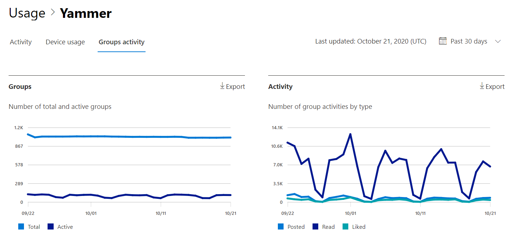

# Rapports Microsoft 365 dans le centre d’administration-rapport d’activité des groupes Yammer

Le tableau de bord **rapports** Microsoft 365 affiche une vue d’ensemble de l’activité sur les produits de votre organisation. Il vous permet d'explorer les rapports au niveau de chaque produit afin d'offrir des informations plus précises sur les activités pour chaque produit. Voir [la rubrique Présentation des rapports](activity-reports.md). Dans le rapport d'activité des groupes Yammer, vous pouvez obtenir des informations sur l'activité des groupes Yammer de votre organisation et voir combien de groupes Yammer sont créés et utilisés.
  
> [!NOTE]
> Vous devez être un administrateur général, un lecteur global ou un lecteur de rapports dans Microsoft 365 ou un administrateur Exchange, SharePoint, teams, Team communications ou Skype entreprise pour afficher des rapports.  
 
## Comment puis-je accéder au rapport d’activité des groupes Yammer ?

1. Dans le centre d’administration, accédez à la page **Rapports** \> <a href="https://go.microsoft.com/fwlink/p/?linkid=2074756" target="_blank">Utilisation</a>. 
2. À partir de la page d’accueil du tableau de bord, cliquez sur le bouton **afficher plus** sur la carte Yammer.

  
## Interpréter le rapport d'activité des groupes Yammer

Vous pouvez afficher les activités des groupes dans le rapport yammer en sélectionnant l’onglet **activité des groupes** . 

Sélectionnez **choisir les colonnes** pour ajouter ou supprimer des colonnes dans le rapport.    

Vous pouvez également exporter les données du rapport dans un fichier. csv Excel en sélectionnant le lien **Exporter** . Cela a pour effet d'exporter les données de tous les utilisateurs afin d'effectuer un tri et un filtrage simples à des fins d'analyse approfondie. Si vous avez moins de 2000 utilisateurs, vous pouvez trier et filtrer dans le tableau, au sein du rapport proprement dit. Si vous avez plus de 2000 utilisateurs, pour filtrer et trier les données, vous devez préalablement les exporter. 
  
|Item|Description|
|:-----|:-----|
|**Métrique**|**Définition**|
|Nom du groupe    |Nom du groupe.   |
|Administrateur de groupe    |Nom de l’administrateur de groupe ou propriétaire.    |
|Deleted    |Nombre de groupes Yammer supprimés. Si le groupe est supprimé, mais qu'il a connu une activité dans la période du rapport, il apparaît dans la grille avec cet indicateur défini sur true.    |
|Type    |Type de groupe, public ou privé.   |
|Connecté à Office 365    |Indique si le groupe Yammer est également un groupe Microsoft 365.   |
|Date de la dernière activité (UTC)    | Dernière date à laquelle un message a été lu, publié ou aimé par le groupe.    |
|Members    | Nombre de membres dans le groupe.    |
|Publié    |Nombre de messages publiés dans le groupe Yammer pendant la période couverte par le rapport.  |
|Lecture    |Nombre de conversations lues dans le groupe Yammer pendant la période couverte par le rapport.    |
|Aimé    |Nombre de messages aimés dans le groupe Yammer pendant la période couverte par le rapport.  |
|Nom du réseau    |Nom complet du réseau auquel appartient le groupe. |
|||