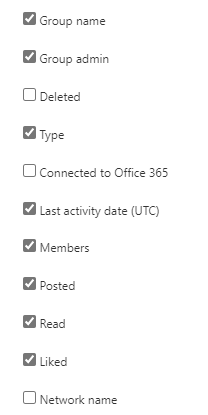

# Rapports Microsoft 365 dans le Centre d’administration - Rapport Yammer’activité des groupes

Le tableau de  bord Rapports Microsoft 365 vous présente la vue d’ensemble de l’activité sur les produits de votre organisation. Il vous permet d'explorer les rapports au niveau de chaque produit afin d'offrir des informations plus précises sur les activités pour chaque produit. Voir [la rubrique Présentation des rapports](activity-reports.md). Dans le rapport d'activité des groupes Yammer, vous pouvez obtenir des informations sur l'activité des groupes Yammer de votre organisation et voir combien de groupes Yammer sont créés et utilisés.
  
> [!NOTE]
> Vous devez être un administrateur général, un lecteur global ou un lecteur de rapports dans Microsoft 365 ou un administrateur Exchange, SharePoint, Teams Service, Teams Communications ou Skype Entreprise pour voir les rapports.  

## Comment accéder au rapport d'activité des groupes Yammer

1. Dans le centre d’administration, accédez à la page **Rapports** \> <a href="https://go.microsoft.com/fwlink/p/?linkid=2074756" target="_blank">Utilisation</a>.

    
2. Dans la **down select a report,** select **Yammer** \> **Groups activity**.
  
## Interpréter le rapport d'activité des groupes Yammer

Vous pouvez visualiser l'activité des groupes Yammer en examinant les graphiques **Groupes** et **Activité**. 
  
|Élément|Description|
|:-----|:-----|
|1.    |Le rapport **Activité des groupes Yammer** permet d'observer les tendances des 7, 30, 90 ou 180 derniers jours. Toutefois, si vous sélectionnez un jour particulier dans le rapport, le tableau (7) affiche les données jusqu’à 28 jours à partir de la date actuelle (et non la date à laquelle le rapport a été généré).    |
|2.    |Les données de chaque rapport couvrent généralement jusqu’aux dernières 24 à 48 heures.   |
|3.    |L'affichage **Groupes** indique le nombre total de groupes qui ont existé et combien ont connu des activités de conversation de groupe.    |
|4.    |L'affichage **Activité** indique le nombre de messages Yammer publiés, lus et aimés dans des groupes.    |
|5.    | Sur le graphique **Groupes**, l'axe Y représente le nombre total de groupes ou le nombre de groupes actifs.     Sur le graphique **Activité**, l'axe Y représente le nombre d'activités spécifiées pour les groupes Yammer.     L'axe X sur les trois graphiques représente la plage de dates sélectionnée pour ce rapport en particulier.    |
|6.    |Vous pouvez filtrer les séries que vous voyez sur le graphique en sélectionnant un élément dans la légende. Par exemple, dans le graphique **Groupes,** sélectionnez **Total** ou Total **actif** et Icônes Active pour voir uniquement les informations  d’elles.   Cette sélection ne modifie nullement les informations figurant dans le tableau grille.    |
|7.    | La liste des groupes à afficher est déterminée par l'ensemble de tous les groupes qui ont existé (non supprimés) dans l'intervalle de temps de création de rapports (180 jours) le plus large. Le nombre d'activités (messages reçus) varie en fonction de la date choisie.    REMARQUE : vous ne verrez peut-être pas tous les éléments de la liste ci-dessous dans les colonnes tant que vous ne les avez pas ajoutés. **Nom du groupe** correspond au nom du groupe.    **Administrateur de groupe** correspond au nom de l'administrateur ou du propriétaire du groupe.    **Supprimé** est le nombre de groupes Yammer supprimés. Si le groupe est supprimé, mais qu'il a connu une activité dans la période du rapport, il apparaît dans la grille avec cet indicateur défini sur true.    **Type** correspond au type de groupe, public ou privé.    **La connexion à Office 365** indique si le groupe Yammer est également un groupe Microsoft 365.    **La date de la** dernière activité est la date à laquelle un message a été lu, publié ou aimé par le groupe.    **Membres** correspond au nombre de membres du groupe.    **Publié** correspond au nombre de messages publiés dans le groupe Yammer pendant la période couverte par le rapport.    **Lu** correspond au nombre de conversations lues dans le groupe Yammer pendant la période couverte par le rapport.    **Aimé** correspond au nombre de messages aimés dans le groupe Yammer pendant la période couverte par le rapport.   **Le nom du** réseau est le nom complet du réseau à qui appartient le groupe.    Si la politique de votre organisation vous empêche de consulter les rapports sur lesquels figurent des informations propres aux utilisateurs, vous pouvez modifier les paramètres de confidentialité de tous ces rapports. Consultez la section **Comment puis-je masquer les détails** au niveau de l’utilisateur ? dans rapports d’activité dans le Centre d’administration [Microsoft 365.](activity-reports.md)    |
|8.    |Sélectionnez **Colonnes** pour ajouter ou supprimer des colonnes dans le rapport.    |
|9.    |Vous pouvez également exporter les données du rapport dans un fichier .csv Excel en sélectionnant le lien **Exporter.** Cela a pour effet d'exporter les données de tous les utilisateurs afin d'effectuer un tri et un filtrage simples à des fins d'analyse approfondie. Si vous avez moins de 2000 utilisateurs, vous pouvez trier et filtrer dans le tableau, au sein du rapport proprement dit. Si vous avez plus de 2000 utilisateurs, pour filtrer et trier les données, vous devez préalablement les exporter.    |
|||
   

