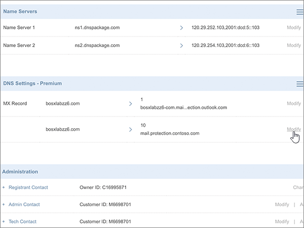
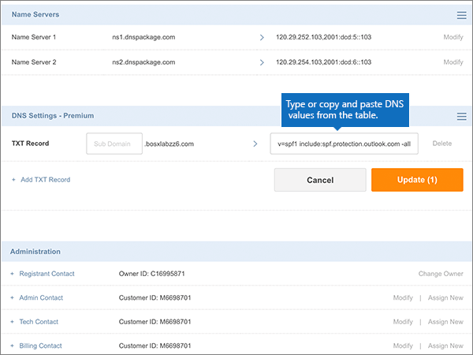

# Créer des enregistrements DNS à des domaines bizarres pour Microsoft

 **[Consultez les Forums aux questions des domaines](../setup/domains-faq.yml)** si vous ne trouvez pas ce que vous recherchez. 
  
Si Crazy Domains est votre fournisseur d'hébergement DNS, suivez les étapes décrites dans cet article pour vérifier votre domaine et configurer les enregistrements DNS pour le courrier, Skype Entreprise Online, etc.
  
Une fois que vous avez ajouté ces enregistrements à des domaines bizarres, votre domaine est configuré pour utiliser les services Microsoft.
  

  
> [!NOTE]
> L'application des enregistrements DNS modifiés prend généralement 15 minutes. Il peut toutefois arriver que la répercussion d'une modification dans le système DNS sur Internet prenne davantage de temps. Si vous rencontrez des problèmes avec le flux de messages ou d'autres problèmes suite à l'ajout des enregistrements DNS, voir [Résolution des problèmes suite à la modification de votre nom de domaine ou des enregistrements DNS](../get-help-with-domains/find-and-fix-issues.md). 
  
## Ajouter un enregistrement TXT à des fins de vérification

Avant que vous puissiez utiliser votre domaine avec Microsoft, nous devons vérifier qu’il vous appartient. Votre capacité à vous connecter à votre compte auprès de votre bureau d’enregistrement de domaines et à créer l’enregistrement DNS prouve à Microsoft que le domaine vous appartient.
  
> [!NOTE]
> Cet enregistrement sert uniquement à vérifier que vous êtes propriétaire du domaine. Vous pouvez éventuellement le supprimer ultérieurement. 
  
1. Pour commencer, accédez à la page de vos domaines sur le site Crazy Domains en utilisant [ce lien](https://manage.crazydomains.com/members/domains/). Avant toute chose, vous serez invité à vous connecter.
    
    
  
2. Dans la section **mon compte** , sélectionnez **domaines**.
    
    
  
3. Dans la page **noms de domaine** , dans la section **domaine** , sélectionnez le nom du domaine que vous mettez à jour. 
    
    
  
4. Dans la section **paramètres DNS** , sélectionnez l’icône de la liste déroulante. 
    
    
  
5. Sélectionnez **Ajouter un enregistrement**.
    
    
  
6. Choisissez **Enregistrement TXT** dans la liste déroulante **Ajouter un enregistrement**. 
    
    
  
7. Sélectionnez **Ajouter**.
    
    
  
8. Dans les zones du nouvel enregistrement, tapez ou copiez-collez les valeurs du tableau suivant.
    
    |**Sub Domain (Sous-domaine)**|**Text Record (Enregistrement texte)**|
    |:-----|:-----|
    |(Laissez ce champ vide.)    |MS=ms *XXXXXXXX*    **Remarque :** il s'agit d'un exemple. Utilisez votre valeur spécifique d’**Adresse de destination ou de pointage** ici, à partir du tableau.           [Comment trouver cette valeur ?](../get-help-with-domains/information-for-dns-records.md)          |
   
    
  
9. Sélectionnez **Mettre à jour**.
    
    
  
10. Patientez quelques minutes, le temps que l'enregistrement que vous venez de créer soit mis à jour sur Internet.
    
L’enregistrement étant désormais ajouté sur le site de votre bureau d’enregistrement de domaines, revenez sur Microsoft et demandez l’enregistrement.
  
Lorsque Microsoft trouve l’enregistrement TXT approprié, votre domaine est vérifié.
  
1. Dans le centre d’administration Microsoft, accédez à la page **Paramètres** \> <a href="https://go.microsoft.com/fwlink/p/?linkid=834818" target="_blank">Domaines</a>.

    
2. Dans la page **Domaines**, sélectionnez le domaine que vous vérifiez. 
    
    
  
3. Dans la page **Configuration**, sélectionnez **Démarrer la configuration**.
    
    
  
4. Dans la page **Vérifier le domaine**, sélectionnez **Vérifier**.
    
    
  
> [!NOTE]
>  L'application des enregistrements DNS modifiés prend généralement 15 minutes. Il peut toutefois arriver que la répercussion d'une modification dans le système DNS sur Internet prenne davantage de temps. Si vous rencontrez des problèmes avec le flux de messages ou d'autres problèmes suite à l'ajout des enregistrements DNS, voir [Résolution des problèmes suite à la modification de votre nom de domaine ou des enregistrements DNS](../get-help-with-domains/find-and-fix-issues.md). 
  
## Ajouter un enregistrement MX afin que les courriers électroniques pour votre domaine soient transférés vers Microsoft

1. Pour commencer, accédez à la page de vos domaines sur le site Crazy Domains en utilisant [ce lien](https://manage.crazydomains.com/members/domains/). Avant toute chose, vous serez invité à vous connecter.
    
    
  
2. Dans la section **mon compte** , sélectionnez **domaines**.
    
    
  
3. Dans la page **noms de domaine** , dans la section **domaine** , sélectionnez le nom du domaine que vous mettez à jour. 
    
    
  
4. Dans la section **paramètres DNS** , sélectionnez l’icône de la liste déroulante. 
    
    
  
5. Sélectionnez **Ajouter un enregistrement**.
    
    
  
6. Choisissez **MX Record** (Enregistrement MX) dans la liste déroulante **Add Record** (Ajouter un enregistrement). 
    
    
  
7. Sélectionnez **Ajouter**.
    
    
  
8. Dans les zones du nouvel enregistrement, tapez ou copiez-collez les valeurs du tableau suivant.
    
    (Choisissez la valeur **Priority** dans la liste déroulante.) 
    
    |**Mail For Zone (Courrier pour la zone)**|**Priority (Priorité)**|**Assigned To Server (Affecté au serveur)**|
    |:-----|:-----|:-----|
    |(Laissez ce champ vide.)    |1     Pour plus d'informations sur la priorité, voir [Qu'est-ce que la priorité MX ?](https://docs.microsoft.com/microsoft-365/admin/setup/domains-faq).   | *\<domain-key\>*  .mail.protection.outlook.com    **Remarque :** Obtenir votre  *\<domain-key\>*  à partir de votre compte Microsoft.           [Comment trouver cette valeur ?](../get-help-with-domains/information-for-dns-records.md)          |
       
   
  
9. Sélectionnez **Mettre à jour**.
    
    
  
10. Si d’autres enregistrements MX sont répertoriés dans la section **MX record (enregistrement MX** ), sélectionnez **Modify (modifier** ) pour l’un de ces enregistrements. 
    
    
  
11. Sélectionnez **Supprimer**.
    
    
  
12. Sélectionnez **Update (mettre à jour** ) pour confirmer la suppression. 
    
    
  
13. Procédez de la même manière pour supprimer tous les autres enregistrements MX de la liste, jusqu'à ce qu'il ne reste plus que celui que vous avez ajouté précédemment dans cette procédure.
    
## Ajouter les six enregistrements CNAMe requis pour Microsoft

1. Pour commencer, accédez à la page de vos domaines sur le site Crazy Domains en utilisant [ce lien](https://manage.crazydomains.com/members/domains/). Avant toute chose, vous serez invité à vous connecter.
    
    
  
2. Dans la section **mon compte** , sélectionnez **domaines**.
    
    
  
3. Dans la page **noms de domaine** , dans la section **domaine** , sélectionnez le nom du domaine que vous mettez à jour. 
    
    
  
4. Dans la section **paramètres DNS** , sélectionnez l’icône de la liste déroulante. 
    
    
  
5. Sélectionnez **Ajouter un enregistrement**.
    
    
  
6. Choisissez **CNAME Record** (Enregistrement CNAME) dans la liste déroulante **Add Record** (Ajouter un enregistrement). 
    
    
  
7. Sélectionnez **Ajouter**.
    
    
  
8. Ajoutez le premier des six enregistrements CNAME.
    
    Dans les zones du nouvel enregistrement, tapez ou copiez-collez les valeurs de la première ligne du tableau suivant.
    
    |**Sub Domain (Sous-domaine)**|**Alias for (Alias pour)**|
    |:-----|:-----|
    |autodiscover    |autodiscover.outlook.com    |
    |sip    |sipdir.online.lync.com    |
    |lyncdiscover    |webdir.online.lync.com    |
    |enterpriseregistration    |enterpriseregistration.windows.net    |
    |enterpriseenrollment    |enterpriseenrollment-s.manage.microsoft.com    |
   
    
  
9. Sélectionnez **Ajouter un enregistrement CNAME**.
    
    
  
10. Ajoutez le deuxième enregistrement CNAME.
    
    Dans les zones du nouvel enregistrement, utilisez les valeurs de la ligne suivante du tableau, puis sélectionnez de nouveau ajouter un **enregistrement CNAME**.
    
    Répétez cette procédure jusqu'à avoir créé les 6 enregistrements CNAME.
    
11. Sélectionnez **mettre à jour** pour enregistrer vos modifications. 
    
    
  
## Ajoutez un enregistrement TXT pour SPF afin d'éviter le courrier indésirable

> [!IMPORTANT]
> Vous ne pouvez avoir qu’un enregistrement TXT pour SPF pour un domaine. Si votre domaine comporte plusieurs enregistrements SPF, vous rencontrez des erreurs au niveau de la transmission du courrier électronique ainsi que des problèmes de remise du courrier et de classification en tant que courrier indésirable. Si vous avez déjà un enregistrement SPF pour votre domaine, il n’est pas nécessaire d’en créer un nouveau pour Microsoft. Ajoutez plutôt les valeurs Microsoft requises à l’enregistrement actuel afin de disposer d’un  *seul*  enregistrement SPF qui inclut les deux ensembles de valeurs. 
  
1. Pour commencer, accédez à la page de vos domaines sur le site Crazy Domains en utilisant [ce lien](https://manage.crazydomains.com/members/domains/). Avant toute chose, vous serez invité à vous connecter.
    
    
  
2. Dans la section **mon compte** , sélectionnez **domaines**.
    
    
  
3. Dans la page **noms de domaine** , dans la section **domaine** , sélectionnez le nom du domaine que vous mettez à jour. 
    
    
  
4. Dans la section **paramètres DNS** , sélectionnez l’icône de la liste déroulante. 
    
    
  
5. Sélectionnez **Ajouter un enregistrement**.
    
    
  
6. Choisissez **TXT Record** (Enregistrement TXT) dans la liste déroulante **Add Record** (Ajouter un enregistrement). 
    
    
  
7. Sélectionnez **Ajouter**.
    
    
  
8. Dans les zones du nouvel enregistrement, tapez ou copiez-collez les valeurs du tableau suivant.
    
    |**Sub Domain (Sous-domaine)**|**Text Record (Enregistrement texte)**|
    |:-----|:-----|
    |(Laissez ce champ vide.)    |v=spf1 include:spf.protection.outlook.com -all    **Remarque :** nous vous recommandons de copier et coller cette entrée, afin que l’espacement reste correcte.           |
   
    
  
9. Sélectionnez **Mettre à jour**.
    
    
  
## Ajoutez les deux enregistrements SRV requis pour Microsoft

1. Pour commencer, accédez à la page de vos domaines sur le site Crazy Domains en utilisant [ce lien](https://manage.crazydomains.com/members/domains/). Avant toute chose, vous serez invité à vous connecter.
    
    
  
2. Dans la section **mon compte** , sélectionnez **domaines**.
    
    
  
3. Dans la page **noms de domaine** , dans la section **domaine** , sélectionnez le nom du domaine que vous mettez à jour. 
    
    
  
4. Dans la section **paramètres DNS** , sélectionnez l’icône de la liste déroulante. 
    
    
  
5. Sélectionnez **Ajouter un enregistrement**.
    
    
  
6. Choisissez **SRV Record** (Enregistrement SRV) dans la liste déroulante **Add Record** (Ajouter un enregistrement). 
    
    
  
7. Sélectionnez **Ajouter**.
    
    
  
8. Ajoutez le premier des deux enregistrements SRV.
    
    Dans les zones du nouvel enregistrement, tapez ou copiez-collez les valeurs de la première ligne du tableau suivant.
    
    |**Record Type (Type d'enregistrement)**|**Sub Domain (Sous-domaine)**|**Priority (Priorité)**|**Weight (Poids)**|**Port (Port)**|**Target (Cible)**|
    |:-----|:-----|:-----|:-----|:-----|:-----|
    |SRV Record (Enregistrement SRV)    |_sip._tls    |100    |1     |443    |sipdir.online.lync.com    |
    |SRV Record (Enregistrement SRV)    |_sipfederationtls._tcp    |100    |1     |5061    |sipfed.online.lync.com    |
   
    
  
9. Sélectionnez **Ajouter un enregistrement SRV**.
    
    
  
10. Ajoutez l'autre enregistrement SRV.
    
    Dans les zones du nouvel enregistrement, utilisez les valeurs de la deuxième ligne du tableau.
    
11. Sélectionnez **mettre à jour** pour enregistrer vos modifications. 
    
    
  
> [!NOTE]
> L'application des enregistrements DNS modifiés prend généralement 15 minutes. Il peut toutefois arriver que la répercussion d'une modification dans le système DNS sur Internet prenne davantage de temps. Si vous rencontrez des problèmes avec le flux de messages ou d'autres problèmes suite à l'ajout des enregistrements DNS, voir [Résolution des problèmes suite à la modification de votre nom de domaine ou des enregistrements DNS](../get-help-with-domains/find-and-fix-issues.md). 
  
