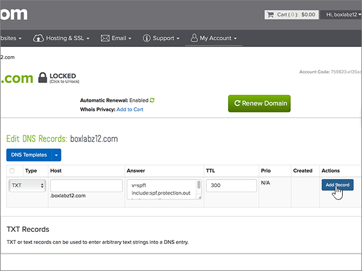
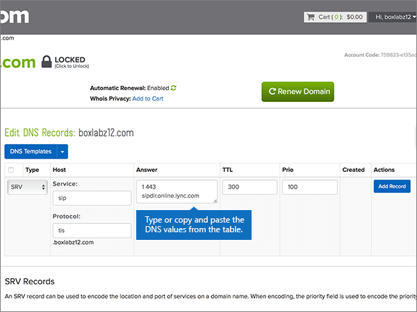

# Créer des enregistrements DNS sur name.com pour Microsoft

 **[Consultez les Forums aux questions des domaines](../setup/domains-faq.md)** si vous ne trouvez pas ce que vous recherchez. 
  
Si name.com est votre fournisseur d'hébergement DNS, suivez les étapes décrites dans cet article pour vérifier votre domaine et configurer les enregistrements DNS pour le courrier, Skype Entreprise Online, etc.
  
Une fois ces enregistrements ajoutés sur name.com, votre domaine est configuré pour utiliser les services Microsoft.
  
Pour en savoir plus sur l’hébergement Web et le DNS pour les sites Web avec Microsoft, consultez [la rubrique utiliser un site Web public avec Microsoft](https://support.office.com/article/choose-a-public-website-3325d50e-d131-403c-a278-7f3296fe33a9).
  
> [!NOTE]
> L'application des enregistrements DNS modifiés prend généralement 15 minutes. Il peut toutefois arriver que la répercussion d'une modification dans le système DNS sur Internet prenne davantage de temps. Si vous rencontrez des problèmes avec le flux de messages ou d'autres problèmes suite à l'ajout des enregistrements DNS, voir [Résolution des problèmes suite à la modification de votre nom de domaine ou des enregistrements DNS](../get-help-with-domains/find-and-fix-issues.md). 
  
## Ajouter un enregistrement TXT à des fins de vérification

Avant d’utiliser votre domaine avec Microsoft, vous devez vous assurer que vous en êtes propriétaire. Votre capacité à vous connecter à votre compte auprès de votre bureau d’enregistrement de domaines et à créer l’enregistrement DNS prouve à Microsoft que vous êtes propriétaire du domaine.
  
> [!NOTE]
> Cet enregistrement sert uniquement à vérifier que vous êtes propriétaire du domaine. Vous pouvez éventuellement le supprimer ultérieurement. 
  
1. Pour commencer, accédez à la page de vos domaines sur le site name.com en utilisant [ce lien](https://www.name.com/account/domain). Avant toute chose, vous serez invité à vous connecter.
    
    
  
2. Sous **Mes domaines**, sélectionnez le nom du domaine à modifier.
    
    
  
3. Dans la colonne **Détails** , sélectionnez * * enregistrements DNS * *. 
    
    
  
4. Dans les zones du nouvel enregistrement, tapez ou copiez-collez les valeurs du tableau suivant.
    
    (Choose the **Type** value from the drop-down list.) 
    
    |||||
    |:-----|:-----|:-----|:-----|
    |**Type**   |**Host (Hôte)**   |**Answer (Réponse)**   |**TTL**   |
    |TXT    |(Leave this field empty.)    |MS=ms *XXXXXXXX*    **Remarque :** il s'agit d'un exemple. Utilisez votre **adresse de destination ou de pointage** spécifique ici, à partir du tableau.           [Comment trouver cette valeur ?](../get-help-with-domains/information-for-dns-records.md)          |Use the default value (300).    |
   
    
  
5. Sélectionnez **Ajouter un enregistrement**.
    
    
  
6. Patientez quelques minutes, le temps que l'enregistrement que vous venez de créer soit mis à jour sur Internet.
    
À présent que vous avez ajouté l’enregistrement sur le site de votre bureau d’enregistrement de domaines, vous allez revenir à Microsoft et demander l’enregistrement.
  
Lorsque Microsoft trouve l’enregistrement TXT correct, votre domaine est vérifié.
  
1. Dans le centre d’administration, accédez à la page **Paramètres** \> <a href="https://go.microsoft.com/fwlink/p/?linkid=834818" target="_blank">Domaines</a>.
    
2. Dans la page **Domaines**, sélectionnez le domaine que vous vérifiez. 
    
    
  
3. Dans la page **Configuration**, sélectionnez **Démarrer la configuration**.
    
    
  
4. Dans la page **Vérifier le domaine**, sélectionnez **Vérifier**.
    
    
  
> [!NOTE]
> L'application des enregistrements DNS modifiés prend généralement 15 minutes. Il peut toutefois arriver que la répercussion d'une modification dans le système DNS sur Internet prenne davantage de temps. Si vous rencontrez des problèmes avec le flux de messages ou d'autres problèmes suite à l'ajout des enregistrements DNS, voir [Résolution des problèmes suite à la modification de votre nom de domaine ou des enregistrements DNS](../get-help-with-domains/find-and-fix-issues.md). 
  
## Ajouter un enregistrement MX afin que les courriers électroniques pour votre domaine soient envoyés à Microsoft

1. Pour commencer, accédez à la page de vos domaines sur le site name.com en utilisant [ce lien](https://www.name.com/account/domain). Avant toute chose, vous serez invité à vous connecter.
    
    
  
2. Sous **Mes domaines**, sélectionnez le nom du domaine à modifier.
    
    
  
3. Dans la colonne **Détails** , sélectionnez **enregistrements DNS**. 
    
    
  
4. Dans les zones du nouvel enregistrement, tapez ou copiez-collez les valeurs du tableau suivant.
    
    (Choose the **Type** value from the drop-down list.) 
    
    |**Type**|**Host (Hôte)**|**Answer (Réponse)**|**TTL (Durée de vie)**|**Prio (Priorité)**|
    |:-----|:-----|:-----|:-----|:-----|
    |MX    |(Laissez ce champ vide.)    | *\<domain-key\>*  .mail.protection.outlook.com    **Remarque :** Obtenir votre * \<clé\> de domaine* à partir de votre compte Microsoft.           [Comment trouver cette valeur ?](../get-help-with-domains/information-for-dns-records.md)          |Use the default value (300).    |0    Pour plus d'informations sur la priorité, voir [Qu'est-ce que la priorité MX ?](https://support.office.com/article/2784cc4d-95be-443d-b5f7-bb5dd867ba83.aspx).   |
   
   
  
5. Sélectionnez **Ajouter un enregistrement**.
    
    
  
6. S'il existe d'autres enregistrements MX, supprimez chacun d'eux à l'aide de la procédure en deux étapes suivante :
    
    Pour chaque autre enregistrement MX, sélectionnez **supprimer** dans la colonne **actions** . 
    
    
  
    Pour confirmer chaque suppression, sélectionnez **supprimer** dans la colonne **actions** . 
    
    
  
    Répétez cette procédure en deux étapes jusqu'à avoir supprimé tous les autres enregistrements MX.
    
## Ajouter les enregistrements CNAMe requis pour Microsoft

1. Pour commencer, accédez à la page de vos domaines sur le site name.com en utilisant [ce lien](https://www.name.com/account/domain). Avant toute chose, vous serez invité à vous connecter.
    
    
  
2. Sous **Mes domaines**, sélectionnez le nom du domaine à modifier.
    
    
  
3. Dans la colonne **Détails** , sélectionnez **enregistrements DNS**. 
    
    
  
4. Ajoutez le premier enregistrement CNAME.
    
    Dans les zones du nouvel enregistrement, tapez ou copiez-collez les valeurs de la première ligne du tableau suivant.
    
    (Choisissez la valeur **Type (Type)** dans la liste déroulante.) 
    
    |**Type**|**Host (Hôte)**|**Answer (Réponse)**|**TTL (Durée de vie)**|
    |:-----|:-----|:-----|:-----|
    |CNAME    |autodiscover    |autodiscover.outlook.com    |Utilisez la valeur par défaut (300).    |
    |CNAME    |sip    |sipdir.online.lync.com    |Utilisez la valeur par défaut (300).    |
    |CNAME    |lyncdiscover    |webdir.online.lync.com    |Utilisez la valeur par défaut (300).    |
    |CNAME    |enterpriseregistration    |enterpriseregistration.windows.net    |Utilisez la valeur par défaut (300).    |
    |CNAME    |enterpriseenrollment    |enterpriseenrollment-s.manage.microsoft.com    |Utilisez la valeur par défaut (300).    |
   
   
  
5. Sélectionnez **Add record (ajouter un enregistrement** ) pour ajouter le premier enregistrement. 
    
    
  
6. Ajoutez le deuxième enregistrement CNAME.
    
    Utilisez les valeurs de la deuxième ligne du tableau ci-dessus, puis sélectionnez **Add record (ajouter un enregistrement** ) pour ajouter le deuxième enregistrement. 
    
    Ajoutez les enregistrements restants de la même manière, en utilisant les valeurs des troisième, quatrième, cinquième et sixième lignes du tableau.
    
## Ajoutez un enregistrement TXT pour SPF afin d'éviter le courrier indésirable

> [!IMPORTANT]
> Vous ne pouvez avoir qu’un enregistrement TXT pour SPF pour un domaine. Si votre domaine comporte plusieurs enregistrements SPF, vous rencontrez des erreurs au niveau de la transmission du courrier électronique ainsi que des problèmes de remise du courrier et de classification en tant que courrier indésirable. Si vous disposez déjà d’un enregistrement SPF pour votre domaine, n’en créez pas pour Microsoft. Ajoutez plutôt les valeurs Microsoft requises à l’enregistrement actuel afin de disposer d’un *seul* enregistrement SPF qui inclut les deux ensembles de valeurs. 
  
1. Pour commencer, accédez à la page de vos domaines sur le site name.com en utilisant [ce lien](https://www.name.com/account/domain). Avant toute chose, vous serez invité à vous connecter.
    
    
  
2. Sous **Mes domaines**, sélectionnez le nom du domaine à modifier.

    
  
3. Dans la colonne **Détails** , sélectionnez **enregistrements DNS**. 
    
    
  
4. Dans les zones du nouvel enregistrement, tapez ou copiez-collez les valeurs du tableau suivant.
    
    (Choose the **Type** value from the drop-down list.) 
    
    |**Type**|**Host (Hôte)**|**Answer (Réponse)**|**TTL**|
    |:-----|:-----|:-----|:-----|
    |TXT    |(Leave this field empty.)    |v=spf1 include:spf.protection.outlook.com -all    **Remarque :** nous vous recommandons de copier et coller cette entrée, afin que l’espacement reste correcte.           |Use the default value (300).    |
   
   
  
5. Sélectionnez **Ajouter un enregistrement**.
    
    
  
## Ajouter les deux enregistrements SRV requis pour Microsoft

1. Pour commencer, accédez à la page de vos domaines sur le site name.com en utilisant [ce lien](https://www.name.com/account/domain). Avant toute chose, vous serez invité à vous connecter.
    
    
  
2. Sous **Mes domaines**, sélectionnez le nom du domaine à modifier.
    
    
  
3. Dans la colonne **Détails** , sélectionnez **enregistrements DNS +**. 
    
    
  
4. Ajoutez le premier enregistrement SRV :
    
    Dans les zones du nouvel enregistrement, tapez ou copiez-collez les valeurs de la première ligne du tableau suivant.
    
    (Choisissez la valeur **Type (Type)** dans la liste déroulante.) 
    
    |**Type**|**Service**|**Weight (Poids)**|**TTL (Durée de vie)**|**Prio (Priorité)**|**Protocol (Protocole)**|**Port**|**Target (Cible)**|
    |:-----|:-----|:-----|:-----|:-----|:-----|:-----|:-----|
    |SRV|sip|0,1|Utilisez la valeur par défaut (300).|100|tls|443|sipdir.online.lync.com   **Remarque :** nous vous recommandons de copier et coller cette entrée, afin que l’espacement reste correcte.           |
    |SRV|sipfederationtls|0,1|Utilisez la valeur par défaut (300).|100|tcp|5061|sipfed.online.lync.com  **Remarque :** nous vous recommandons de copier et coller cette entrée, afin que l’espacement reste correcte.           |
   
   
  
5. Sélectionnez **Ajouter un enregistrement**.

    
  
6. Ajoutez le deuxième enregistrement SRV :

Utilisez les valeurs de la ligne suivante du tableau ci-dessus, puis sélectionnez **Add record (ajouter un enregistrement** ) pour ajouter le deuxième enregistrement.

>[!NOTE]
>L'application des enregistrements DNS modifiés prend généralement 15 minutes. Il peut toutefois arriver que la répercussion d'une modification dans le système DNS sur Internet prenne davantage de temps. Si vous rencontrez des problèmes avec le flux de messages ou d'autres problèmes suite à l'ajout des enregistrements DNS, voir [Résolution des problèmes suite à la modification de votre nom de domaine ou des enregistrements DNS](../get-help-with-domains/find-and-fix-issues.md).
