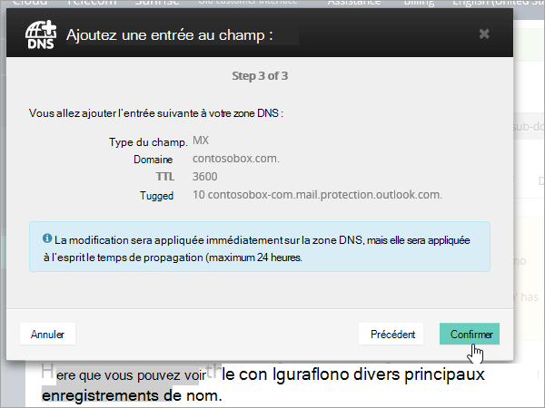
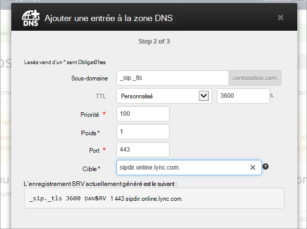

# Créer des enregistrements DNS sur OVH pour Microsoft

[Consultez les Forums aux questions sur les domaines](../setup/domains-faq.yml) si vous ne trouvez pas ce que vous recherchez. 
  
Si OVH est votre fournisseur d’hébergement DNS, suivez les étapes de cet article pour vérifier votre domaine et configurer les enregistrements DNS pour le courrier, Skype Entreprise Online, etc.
  
Voici les principaux enregistrements à ajouter. 
  
- [Créer des enregistrements DNS sur OVH pour Microsoft](#create-dns-records-at-ovh-for-microsoft)
    
- [Ajouter un enregistrement MX afin que les courriers électroniques pour votre domaine soient transférés vers Microsoft](#add-an-mx-record-so-email-for-your-domain-will-come-to-microsoft)
    
- [Ajouter les enregistrements CNAME requis pour Microsoft](#add-the-cname-records-that-are-required-for-microsoft)
    
- [Ajouter un enregistrement TXT pour SPF afin d'éviter le courrier indésirable](#add-a-txt-record-for-spf-to-help-prevent-email-spam)
    
- [Ajoutez les deux enregistrements SRV requis pour Microsoft](#add-the-two-srv-records-that-are-required-for-microsoft)
    
Une fois ces enregistrements ajoutés sur OVH, votre domaine est installé pour fonctionner avec les services Microsoft.

  
> [!NOTE]
>  L'application des enregistrements DNS modifiés prend généralement 15 minutes. Il peut toutefois arriver que la répercussion d'une modification dans le système DNS sur Internet prenne davantage de temps. Si vous rencontrez des problèmes avec le flux de messages ou d'autres problèmes suite à l'ajout des enregistrements DNS, voir [Résolution des problèmes suite à la modification de votre nom de domaine ou des enregistrements DNS](../get-help-with-domains/find-and-fix-issues.md). 
  
## Ajouter un enregistrement TXT à des fins de vérification

Avant que vous puissiez utiliser votre domaine avec Microsoft, nous devons vérifier qu’il vous appartient. Votre capacité à vous connecter à votre compte auprès de votre bureau d’enregistrement de domaines et à créer l’enregistrement DNS prouve à Microsoft que le domaine vous appartient.
  
> [!NOTE]
> Cet enregistrement sert uniquement à vérifier que vous êtes propriétaire du domaine. Vous pouvez éventuellement le supprimer ultérieurement. 
  
1. To get started, go to your domains page in OVH by using [this link](https://www.ovh.com/manager/). You'll be prompted to log in.
    
    
  
2. Sous **Domaines,** sélectionnez le nom du domaine à modifier.
    
    
  
3. Sélectionnez **la zone DNS.**
    
    
  
4. Sélectionnez **Ajouter une entrée.**
    
    
  
5. Sélectionnez **TXT**
    
    
  
6. Dans les zones du nouvel enregistrement, tapez ou copiez-collez les valeurs du tableau suivant. Pour affecter une valeur TTL, choisissez **Personnalisé dans** la liste de listes, puis tapez la valeur dans la zone de texte. 
    
    |**Type d'enregistrement**|**Sous-domaine**|**TTL (Durée de vie)**|**Value (Valeur)**|
    |:-----|:-----|:-----|:-----|
    |TXT    |(Laisser vide)    |3600 (secondes)    |MS=msxxxxxxxx    **Remarque :** il s'agit d'un exemple. Utilisez votre valeur spécifique d’**Adresse de destination ou de pointage** ici, à partir du tableau.           [Comment trouver cette valeur ?](../get-help-with-domains/information-for-dns-records.md)          |
   
7. Sélectionnez  **Confirmer**. 
    
    
  
8. Patientez quelques minutes, le temps que l'enregistrement que vous venez de créer soit mis à jour sur Internet.
    
L’enregistrement étant désormais ajouté sur le site de votre bureau d’enregistrement de domaines, revenez sur Microsoft et demandez l’enregistrement.
  
Lorsque Microsoft trouve l’enregistrement TXT approprié, votre domaine est vérifié.
  
1. Dans le centre d’administration, accédez à la page **Paramètres** \> <a href="https://go.microsoft.com/fwlink/p/?linkid=834818" target="_blank">Domaines</a>.
    
2. Dans la page **Domaines**, sélectionnez le domaine que vous vérifiez. 
    
    
  
3. Dans la page **Configuration**, sélectionnez **Démarrer la configuration**.
    
    
  
4. Dans la page **Vérifier le domaine**, sélectionnez **Vérifier**.
    
    
  
> [!NOTE]
>  L'application des enregistrements DNS modifiés prend généralement 15 minutes. Il peut toutefois arriver que la répercussion d'une modification dans le système DNS sur Internet prenne davantage de temps. Si vous rencontrez des problèmes avec le flux de messages ou d'autres problèmes suite à l'ajout des enregistrements DNS, voir [Résolution des problèmes suite à la modification de votre nom de domaine ou des enregistrements DNS](../get-help-with-domains/find-and-fix-issues.md). 
  
## Ajouter un enregistrement MX afin que les courriers électroniques pour votre domaine soient transférés vers Microsoft

1. To get started, go to your domains page in OVH by using [this link](https://www.ovh.com/manager/). You'll be prompted to log in.
    
    
  
2. Sous **Domaines,** sélectionnez le nom du domaine à modifier.
    
    
  
3. Sélectionnez **la zone DNS.**
    
    
  
4. Sélectionnez **Ajouter une entrée.**
    
    
  
5. Sélectionnez **MX**.
    
    
  
6. Dans les zones du nouvel enregistrement, tapez ou copiez-collez les valeurs du tableau suivant. Pour affecter une valeur TTL, choisissez **Personnalisé dans** la liste de listes, puis tapez la valeur dans la zone de texte. 
    
    > [!NOTE]
    > Par défaut, la notation OVH utilise une notation relative pour la cible, ce qui ajoute le nom de domaine à la fin de l’enregistrement cible. Pour utiliser une notation absolue à la place, ajoutez un point à l’enregistrement cible, comme indiqué dans le tableau ci-dessous. 
  
    |**Type d'enregistrement**|**Sous-domaine**|**TTL (Durée de vie)**|**Priority (Priorité)**|**Target**|
    |:-----|:-----|:-----|:-----|:-----|
    |MX    |(Laisser vide)    |3600 (secondes)    |10     Pour plus d'informations sur la priorité, voir [Qu'est-ce que la priorité MX ?](https://docs.microsoft.com/microsoft-365/admin/setup/domains-faq).   |\<domain-key\>.mail.protection.outlook.com.    **Remarque :** Obtenez votre  *\<domain-key\>*  compte Microsoft.  [Comment trouver cette valeur ?](../get-help-with-domains/information-for-dns-records.md)  |
   
    
  
7. Sélectionnez **Suivant**.
    
    
  
8. Sélectionnez  **Confirmer**.
    
    
  
9. S’il existe d’autres enregistrements MX, supprimez-les tous dans la liste de la page de **zone DNS.** Sélectionnez chaque enregistrement, puis, dans la colonne **Actions,** sélectionnez l’icône **Supprimer la corbeille.** 
    
    
  
10. Sélectionnez  **Confirmer**.
    
## Ajouter les enregistrements CNAME requis pour Microsoft

1. To get started, go to your domains page in OVH by using [this link](https://www.ovh.com/manager/). You'll be prompted to log in.
    
    
  
2. Sous **Domaines,** sélectionnez le nom du domaine à modifier.
    
    
  
3. Sélectionnez **la zone DNS.**
    
    
  
4. Sélectionnez **Ajouter une entrée.**
    
    
  
5. Sélectionnez **CNAME**.
    
    
  
6. Créez le premier enregistrement CNAME.
    
    Dans les zones du nouvel enregistrement, tapez ou copiez-collez les valeurs de la première ligne du tableau suivant. Pour affecter une valeur TTL, choisissez **Personnalisé dans** la liste de listes, puis tapez la valeur dans la zone de texte. 
    
    |**Type d'enregistrement**|**Sous-domaine**|**Target (Cible)**|**TTL (Durée de vie)**|
    |:-----|:-----|:-----|:-----|
    |CNAME    |autodiscover    |autodiscover.outlook.com.    |3 600 secondes    |
    |CNAME    |sip    |sipdir.online.lync.com.    |3 600 secondes    |
    |CNAME    |lyncdiscover    |webdir.online.lync.com.    |3 600 secondes    |
    |CNAME    |enterpriseregistration    |enterpriseregistration.windows.net.    |3 600 secondes    |
    |CNAME    |enterpriseenrollment    |enterpriseenrollment-s.manage.microsoft.com.    |3 600 secondes    |
   
    
  
7. Sélectionnez **Suivant**.
    
    
  
8. Sélectionnez  **Confirmer**.
    
9. Répétez les étapes précédentes pour créer les cinq autres enregistrements CNAME.
    
    Pour chaque enregistrement, tapez ou copiez-collez les valeurs de la ligne suivante du tableau ci-dessus dans les zones de cet enregistrement.
    
## Ajoutez un enregistrement TXT pour SPF afin d'éviter le courrier indésirable

> [!IMPORTANT]
> Vous ne pouvez avoir qu’un enregistrement TXT pour SPF pour un domaine. Si votre domaine comporte plusieurs enregistrements SPF, vous rencontrez des erreurs au niveau de la transmission du courrier électronique ainsi que des problèmes de remise du courrier et de classification en tant que courrier indésirable. Si vous avez déjà un enregistrement SPF pour votre domaine, il n’est pas nécessaire d’en créer un nouveau pour Microsoft. Ajoutez plutôt les valeurs Microsoft requises à l’enregistrement actuel afin de n’avoir qu’un seul  *enregistrement*  SPF qui inclut les deux ensembles de valeurs. 
  
1. To get started, go to your domains page in OVH by using [this link](https://www.ovh.com/manager/). You'll be prompted to log in.
    
    
  
2. Sous **Domaines,** sélectionnez le nom du domaine à modifier.
    
    
  
3. Sélectionnez **la zone DNS.**
    
    
  
4. Sélectionnez **Ajouter une entrée.**
    
    
  
5. Sélectionnez **TXT**.
    
6. In the boxes for the new record, type or copy and paste the following values.
    
    |**Type d'enregistrement**|**Sous-domaine**|**TTL (Durée de vie)**|**VALEUR TXT**|
    |:-----|:-----|:-----|:-----|
    |TXT    |(Laisser vide)    |3600 (secondes)    |v=spf1 include:spf.protection.outlook.com -all    **Remarque :** nous vous recommandons de copier et coller cette entrée, afin que l’espacement reste correcte.           |
   
    
  
7. Sélectionnez **Suivant**.
    
    
  
8. Sélectionnez  **Confirmer**.
    
    
  
## Ajoutez les deux enregistrements SRV requis pour Microsoft

1. To get started, go to your domains page in OVH by using [this link](https://www.ovh.com/manager/). You'll be prompted to log in.
    
    
  
2. Sous **Domaines,** sélectionnez le nom du domaine à modifier.
    
    
  
3. Sélectionnez **la zone DNS.**
    
    
  
4. Sélectionnez **Ajouter une entrée.**
    
    
  
5. Sélectionnez **SRV**.
    
    
  
6. Créez le premier enregistrement SRV.
    
    Dans les zones du nouvel enregistrement, tapez ou copiez-collez les valeurs de la première ligne du tableau suivant. Pour affecter une valeur TTL, choisissez **Personnalisé dans** la liste de listes, puis tapez la valeur dans la zone de texte. 
    
    |**Type d'enregistrement**|**Sous-domaine**|**Priority (Priorité)**|**Weight (Poids)**|**Port (Port)**|**TTL (Durée de vie)**|**Target**|
    |:-----|:-----|:-----|:-----|:-----|:-----|:-----|
    |SRV (Service)    |_sip._tls    |100    |1     |443    |3600 (secondes)    |sipdir.online.lync.com.    |
    |SRV (Service)    |_sipfederationtls._tcp    |100    |1     |5061    |3600 (secondes)    |sipfed.online.lync.com.    |
       
    
  
7. Sélectionnez **Suivant**.
    
    
  
8. Sélectionnez  **Confirmer**.
    
9. Répétez les étapes précédentes pour créer l’autre enregistrement SRV. Tapez ou copiez-collez les valeurs de la deuxième ligne du tableau ci-dessus dans les zones du deuxième enregistrement.
    
> [!NOTE]
>  L'application des enregistrements DNS modifiés prend généralement 15 minutes. Il peut toutefois arriver que la répercussion d'une modification dans le système DNS sur Internet prenne davantage de temps. Si vous rencontrez des problèmes avec le flux de messages ou d'autres problèmes suite à l'ajout des enregistrements DNS, voir [Résolution des problèmes suite à la modification de votre nom de domaine ou des enregistrements DNS](../get-help-with-domains/find-and-fix-issues.md). 
  
