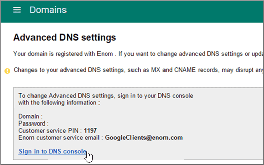

# Créer des enregistrements DNS lorsque votre domaine est géré par Google (eNom)Create DNS records when your domain is managed by Google (eNom)

 **[Consultez les Forums aux questions des domaines](../setup/domains-faq.md)** si vous ne trouvez pas ce que vous recherchez.**[Check the Domains FAQ](../setup/domains-faq.md)** if you don't find what you're looking for. 
  
Pour migrer vos comptes de courrier vers Office 365, vous devez créer un enregistrement DNS via votre bureau d'enregistrement de domaines.To migrate your mail accounts to Office 365, you need to create a DNS record at your domain registrar.
  
Si vous avez acheté votre domaine par le biais de Google lors de votre inscription à votre compte **Google Apps for Work** , vos enregistrements DNS sont gérés par Google, mais enregistrés auprès de eNom.If you purchased your domain through Google while signing up for your **Google Apps for Work** account, your DNS records are managed by Google but registered with eNom. 
  
Vous pouvez accéder à eNom et créer DNS, via la page Google **Domains** .You can access eNom, and create DNS, through the Google **Domains** page. Suivez simplement les étapes décrites dans cet article.Just follow the steps in this article. 
  
## Créer l'enregistrement DNSCreate the DNS record

1. Dans la [console d’administration Google](https://www.google.com/work/apps/business), sélectionnez **se connecter**.At the [Google Admin console](https://www.google.com/work/apps/business), select **Sign In**.
    
    
  
2. Entrez votre nom de domaine, puis sélectionnez **OK**.Enter your domain name, and then select **Go**.
    
    
  
3. Au bas de la page, sélectionnez **autres contrôles**.At the bottom of the page, select **More controls**.
    
    
  
4. Sélectionnez **Domaines**.Select **Domains**.
    
    
  
5. Dans la page **domaines** , sélectionnez **Ajouter/supprimer des domaines**.On the **Domains** page, select **Add/remove domains**.
    
    
  
6. Dans la page **domaines** , sélectionnez **paramètres DNS avancés**.On the **Domains** page, select **Advanced DNS settings**.
    
    > [!NOTE]
    > Si vous n'avez pas acheté un nom de domaine via Google lors de la création de votre compte **Google Apps for Work**, vous n'aurez de **Paramètres DNS avancés** sur votre page **Domaines**.If you didn't purchase a domain name through Google while signing up for your **Google Apps for Work** account, you won't have **Advanced DNS settings** on your **Domains** page. Au lieu de cela, vous devez aller directement au site web de l'hôte de votre domaine pour accéder à vos paramètres DNS et effectuer cette étape ainsi que les étapes suivantes.Instead, you must go directly to your domain host's web site to access your DNS settings and to perform this and the following steps. Pour plus d’informations, consultez [la rubrique accéder aux paramètres de votre domaine G suite](https://support.google.com/a/answer/54693?hl=en) .See [Access your G Suite domain settings](https://support.google.com/a/answer/54693?hl=en) for more information. 
  
    
  
7. Sur la page **paramètres DNS avancés** , sélectionnez **se connecter à la console DNS**.On the **Advanced DNS settings** page, select **Sign in to DNS Console**. Notez les informations **Nom de connexion** et **Mot de passe**.Note the **Sign-in name** and **Password** information. Vous en aurez besoin à l'étape suivante.You'll need it in the next step. 
    
    
  
8. Connectez-vous au **Gestionnaire de domaine** Google en utilisant les **Nom de connexion** et **Mot de passe** mentionnés dans la page **Paramètres DNS avancés**.Log in to the Google **Domain Manager** using the **Sign-in name** and **Password** from the **Advanced DNS settings** page. 
    
    
  
9. Sur la page ***domain_name*** , dans la section **Host Records (enregistrements d’hôte** ), sélectionnez Edit ( **modifier**).On the ***domain_name*** page, in the **Host Records** section, select **Edit**.
    
    
  
10. Dans la section **Host Records (enregistrements d’hôte** ), sélectionnez **Add New (Ajouter nouveau**).In the **Host Records** section, select **Add New**.
    
    
  
11. Dans les zones du nouvel enregistrement, tapez ou copiez-collez les valeurs du tableau suivant.In the boxes for the new record, type or copy and paste the values from the following table.
    
    |**HOST (HÔTE)****HOST**|**TXT VALUE****TXT VALUE**|**TYPE D’ENREGISTREMENT****RECORD TYPE**|
    |:-----|:-----|:-----|
    |@    ||TXTTXT    |

    > [!NOTE]
    > This is an example.This is an example. Utilisez votre valeur **Adresse de destination ou de pointage** spécifique ici, à partir du tableau dans Office 365.Use your specific **Destination or Points to Address** value here, from the table in Office 365. 
  
    [Comment trouver cette valeur ?How do I find this?](../get-help-with-domains/information-for-dns-records.md)
  
12. Cliquez sur **Enregistrer**.Select **Save**.
    
    
  
13. Sélectionnez **enregistrer les modifications**.Select **Save Changes**.
    
    
  
> [!NOTE]
>  L'application des enregistrements DNS modifiés prend généralement 15 minutes. Il peut toutefois arriver que la répercussion d'une modification dans le système DNS sur Internet prenne davantage de temps. Si vous rencontrez des problèmes avec le flux de messages ou d'autres problèmes suite à l'ajout des enregistrements DNS, voir [Résolution des problèmes suite à la modification de votre nom de domaine ou des enregistrements DNS](../get-help-with-domains/find-and-fix-issues.md).Typically it takes about 15 minutes for DNS changes to take effect. However, it can occasionally take longer for a change you've made to update across the Internet's DNS system. If you're having trouble with mail flow or other issues after adding DNS records, see [Troubleshoot issues after changing your domain name or DNS records](../get-help-with-domains/find-and-fix-issues.md). 
  
