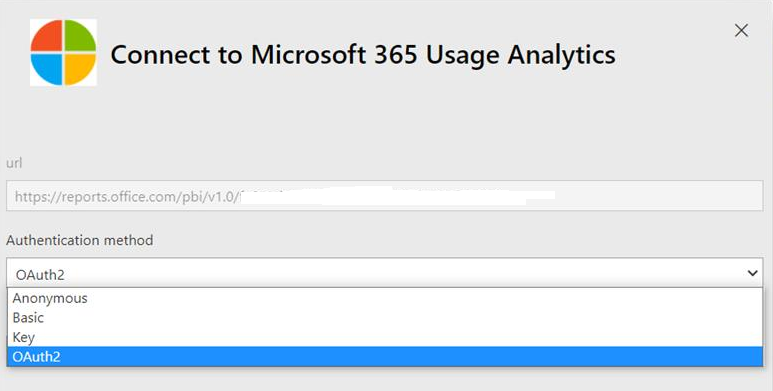

# Activation de l'analyse de l'utilisation de Microsoft 365

L’analyse de l’utilisation de Microsoft 365 n’est pas encore disponible pour la communauté Microsoft 365 pour le gouvernement américain.
  
## Procédure d’analyse de l’utilisation de Microsoft 365

Pour commencer à utiliser l’analyse de l’utilisation de Microsoft 365, vous devez d’abord rendre les données disponibles dans le Centre d’administration Microsoft 365, puis lancer l’application modèle dans Power BI.
  
### Obtenir Power BI

Si vous n’avez pas encore Power BI, vous pouvez vous [inscrire à Power BI Pro.](https://go.microsoft.com/fwlink/p/?linkid=845347) Sélectionnez **Essayer gratuitement** de vous inscrire à une version d’essai ou **achetez** maintenant pour obtenir Power BI Pro.
  
  
Vous pouvez également développer **Produits** pour acheter une version de Power BI. 

> [!NOTE]
> Vous avez besoin d’une licence Power BI Pro pour installer, personnaliser et distribuer une application de modèle. Pour plus d’informations, voir [Conditions préalables.](/power-bi/service-template-apps-install-distribute?source=docs#prerequisites)

Pour partager vos données, vous et les personnes avec qui vous partagez les données, vous avez besoin d’une licence Power BI Pro ou le contenu doit se trouver dans un espace de travail dans un [service Premium Power BI.](/power-bi/service-premium-what-is) 
  
### Activer l’application de modèle

Pour activer l’application de modèle, vous devez être administrateur **général.**
  
Pour plus [d’informations, voir](../add-users/about-admin-roles.md) les rôles d’administrateur. 
  
1. Dans le centre d’administration, accédez à la page **Rapports** \> <a href="https://go.microsoft.com/fwlink/p/?linkid=2074756" target="_blank">Utilisation</a>. 
    
2. Dans la page **Utilisation,** recherchez la carte d’analyse de l’utilisation **de Microsoft 365,** puis sélectionnez **Commencer.**
    
3. Dans le panneau Rapports qui s’ouvre, définissez Rendre les données disponibles pour l’analyse de l’utilisation de **Microsoft 365** pour Power BI sur **Sur** \> **Enregistrer.** 
  
Le processus de collecte de données se terminera dans deux à 48 heures en fonction de la taille de votre client. Le **bouton Aller à Power BI** est activé (plus gris) lorsque la collecte de données est terminée. 
    
### Démarrer l’application de modèle

Pour démarrer l’application de modèle, vous devez être administrateur **général,** lecteur de **rapports,** administrateur **Exchange,** administrateur **Skype** Entreprise ou **administrateur SharePoint.** 
  
1. Copiez l’ID de client et **sélectionnez Go to Power BI**.
    
2.  Lorsque vous accédez à Power BI, connectez-vous. Sélectionnez **ensuite Applications** -> **Obtenir des applications** dans le menu de navigation.    
  
3. Dans **l’onglet** Applications, tapez Microsoft 365 dans la zone de recherche, puis sélectionnez Analyse de l’utilisation **de Microsoft 365** \> **Obtenez-le maintenant.**

    
    
4.  Une fois l’application installée. Sélectionnez la vignette pour l’ouvrir.

5.  Sélectionnez **Explorer l’application** pour afficher l’application avec des exemples de données. Choisissez **Se** connecter pour connecter l’application aux données de votre organisation.

6.  Choose **Connect**, on the **Connect to Microsoft 365 usage analytics** screen, then type in the tenant ID (without dashes) you copied in step (1), and select **Next**.
    
7. Dans l’écran suivant, sélectionnez **OAuth2 en** tant que méthode **d’authentification,** \> **connectez-vous.** Si vous choisissez une autre méthode d’authentification, la connexion à l’application de modèle échoue.
    
    
  
8. Une fois l’application de modèle ins instantiée, le tableau de bord d’analyse de l’utilisation de Microsoft 365 sera disponible dans Power BI sur le web. Le chargement initial du tableau de bord prendra entre 2 et 30 minutes.
  
Les agrégats au niveau du client seront disponibles dans tous les rapports après l’avoir choisi. Les détails au niveau de l’utilisateur ne seront disponibles qu’autour du 5 du mois calendaire suivant **après l’avoir choisi.** Cela aura un impact sur tous les rapports sous Activité de l’utilisateur (voir Parcourir et utiliser les rapports dans l’analyse de l’utilisation de [Microsoft 365](navigate-and-utilize-reports.md) pour obtenir des conseils sur la façon d’afficher et d’utiliser ces rapports).
    
## Anonymiser les données collectées

Pour anonymiser les données collectées pour tous les rapports, vous devez être administrateur général. Cela masquera les informations identifiables telles que les noms d’utilisateur, de groupe et de site dans les rapports et dans l’application de modèle.
  
1. Dans le Centre d’administration, sélectionnez **Paramètres** de l’organisation \> **paramètres,** puis sous **l’onglet Services,** choisissez **Rapports.**
    
2. Sélectionnez **Rapports,** puis choisissez **d’afficher les identificateurs anonymes.** Ce paramètre est appliqué à la fois aux rapports d’utilisation et à l’application de modèle.
  
3. Sélectionnez **Enregistrer les modifications**.