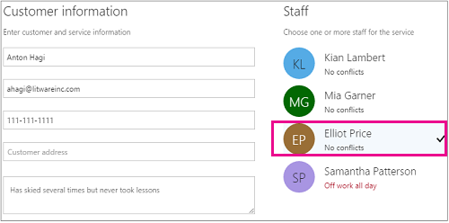

# Créer une réservation manuelle

Les réservations peuvent être planifiées et affectées de deux manières différentes. La première consiste à utiliser une page de réservation autonome ou une page de réservation incorporée que vous ajoutez à votre site Web. Autrement dit, vous ou un de vos employés devez entrer les réservations manuellement, par exemple lorsqu’un client appelle pour un rendez-vous. Cet article décrit le scénario manuel.

> [!NOTE]
> Bookings est activé par défaut pour les clients qui disposent des abonnements Microsoft 365 Business standard, Microsoft 365 a3 ou Microsoft 365 a5. Bookings est également disponible pour les clients disposant d’Office 365 entreprise E3 et d’Office 365 entreprise E5, mais il est désactivé par défaut. Pour commencer, consultez la rubrique [obtenir l’accès à Microsoft bookings](get-access.md). Pour activer ou désactiver les réservations, reportez-vous à [la rubrique activer ou désactiver des réservations pour votre organisation](turn-bookings-on-or-off.md).

1. Dans Microsoft 365, sélectionnez le lanceur d’applications, puis **livres**.

   

1. Dans le volet de navigation, **Calendar** sélectionnez \> **nouvelle réservation**de calendrier.

   

1. Sélectionnez le service à fournir. Consultez [la rubrique define Your Service Offerings dans Microsoft bookings](define-service-offerings.md) for Service Setup instructions.

1. Entrez les informations client, y compris le nom, l’adresse de messagerie, le numéro de téléphone et d’autres informations pertinentes.

1. Sélectionnez le membre du personnel chargé de fournir le service. La liste des membres du personnel affiché est basée sur les éléments que vous avez configurés dans la page services.

   

1. Entrez les détails du service, notamment la date, l’heure, le lieu et d’autres informations pertinentes. Une fois que vous avez entré une adresse de messagerie valide pour le client, le bouton **Enregistrer** prend la forme **Envoyer**et vous verrez une note indiquant qu’une confirmation sera envoyée au client. La confirmation du client inclut une pièce jointe à ajouter à son calendrier. Les membres du personnel sélectionné recevront également des invitations aux réunions avec les informations de rendez-vous afin qu’ils puissent les ajouter à leurs calendriers personnels.

1. Sélectionnez **Ajouter un rappel par courrier électronique**.

1. Spécifiez à quel moment le rappel doit être envoyé, où il doit être envoyé (**client**, **personnel**, **tous les participants**) et le message de rappel.

1. Sélectionnez **Enregistrer** l' \> **envoi**.

   Voici un exemple de message électronique du rappel que votre client recevra :

:::image type="content" source="../media/bookings-confirmed-email.png" alt-text="Capture d’écran : exemple de courrier électronique de confirmation provenant d’une réservation manuelle":::