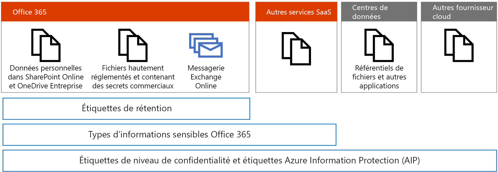
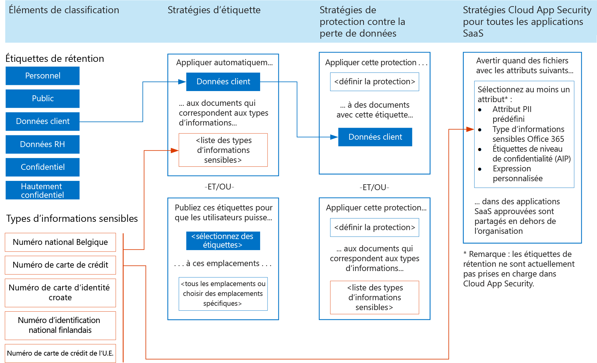
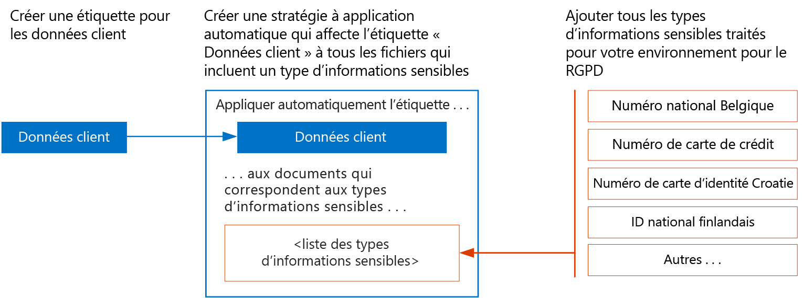

# Application d’étiquettes à des données personnelles dans Office 365

 Utilisez cette rubrique si vous utilisez des étiquettes de classification dans le cadre de votre plan de protection RGPD. 

Si vous utilisez des étiquettes pour la protection des données personnelles dans Office 365, Microsoft recommande que vous commenciez avec des[étiquettes de rétention](labels.md). Avec les étiquettes de rétention, vous pouvez effectuer les actions suivantes :
- La gouvernance des données avancée permet d’appliquer automatiquement des étiquettes basées sur les types d’informations sensibles ou d’autres critères.
- Utilisez des étiquettes de rétention avec la protection contre la perte de données pour appliquer la protection. 
- Utilisez des étiquettes avec eDiscovery et Recherche de contenu. 

Sécurité des applications cloud ne prend actuellement pas en charge les étiquettes de rétention, mais vous pouvez utiliser des types d’informations confidentielles Office 365 avec Sécurité des applications cloud pour surveiller les données personnelles qui se trouvent dans d’autres applications SaaS.

Les [étiquettes de sensibilité](sensitivity-labels.md) sont actuellement recommandées pour appliquer des étiquettes à des fichiers en local et dans d’autres services cloud et fournisseurs. Ceux-ci sont également recommandées pour les fichiers dans Office 365 nécessitant le chiffrement Azure Information Protection pour la protection des données, tels que les fichiers secrets commerciaux.

À ce stade, à l’aide d’Azure Information Protection pour appliquer le chiffrement n’est pas recommandée pour les fichiers dans Office 365 avec des données qui est soumis à la RGPD. Les services Office 365 ne peuvent pas lire actuellement dans les fichiers d’installation administrative chiffrés. Par conséquent, le service ne peut pas trouver de données confidentielles dans ces fichiers.

Les étiquettes de rétention peuvent être appliquées au courrier dans Exchange Online et ces étiquettes fonctionnent avec la prévention de perte de données Office 365. 

Dans cette illustration :

-   Utilisez des étiquettes de rétention pour les données personnelles et pour les fichiers contenant des données hautement réglementées et des secrets commerciaux dans SharePoint Online et OneDrive Entreprise.
-   Les types d’informations confidentielles Office 365 peuvent être utilisés dans Office 365 et avec Sécurité des applications cloud pour surveiller des données personnelles qui se trouvent dans d’autres applications SaaS.
-   Utilisez les étiquettes de sensibilité pour les fichiers contenant des données hautement réglementées et des secrets commerciaux, le courrier Exchange Online, les fichiers dans d’autres services SaaS, les fichiers dans des centres de données en local et les fichiers dans d’autres fournisseurs cloud.

## Utilisation des étiquettes Office et des types d’informations sensibles au sein de Microsoft 365 pour la protection des informations

L’image suivante montre comment les étiquettes Office et les types d’informations sensibles peuvent être utilisés dans les stratégies d’étiquetage, les stratégies de protection contre la perte de données et les stratégies Cloud App Security.

Concernant l’accessibilité, le tableau suivant fournit les mêmes exemples dans l’illustration.

<table>
<thead>
<tr class="header">
<th align="left"><strong>Éléments de classification</strong></th>
<th align="left"><strong>Stratégies d’étiquetage — 2 exemples</strong></th>
<th align="left"><strong>Stratégies de protection contre la perte de données — 2 exemples</strong></th>
<th align="left"><strong>Stratégies Cloud App Security pour toutes les applications SaaS — 1 exemple</strong></th>
</tr>
</thead>
<tbody>
<tr class="odd">
<td align="left">Étiquettes de rétention. Exemples : Personnel, Public, Données client, Données RH, Confidentiel, Hautement confidentiel</td>
<td align="left">
Appliquer automatiquement l’étiquette...

Données client

... aux documents qui correspondent aux types d’informations sensibles...

&lt;Liste des types d’informations sensibles disponibles&gt;
</td>
<td align="left">
Appliquer cette protection...

&lt;définir la protection&gt;

... à des documents avec cette étiquette...

Données client
</td>
<td align="left">
Avertir quand des fichiers avec les attributs suivants...

Sélectionnez au moins un attributs : attribut PII prédéfini, type d’informations confidentielles Office 365, étiquette de sensibilité (AIP), expression personnalisée

. . . dans des applications SaaS approuvées sont partagés en dehors de l’organisation

Remarque : les étiquettes de rétention ne sont actuellement pas prises en charge dans Sécurité des applications cloud.</td>
</tr>
<tr class="even">
<td align="left">Types d’informations sensibles. Exemples : numéro national belge, numéro de carte de crédit, numéro de carte d’identité en Croatie, ID national en Finlande</td>
<td align="left">
Publiez ces étiquettes pour que les utilisateurs puissent les appliquer manuellement...

&lt;sélectionner des étiquettes&gt;

... à ces emplacements...

&lt;tous les emplacements ou choisir des emplacements spécifiques&gt;
</td>
<td align="left">
Appliquer cette protection...

&lt;définir la protection&gt;

... aux documents qui correspondent à ces types d’informations sensibles&gt;
</td>
<td align="left"></td>
</tr>
</tbody>
</table>

## Hiérarchisation des stratégies d’étiquette à application automatique

Pour les données personnelles soumises au RGPD, Microsoft recommande l’application automatique des étiquettes à l’aide des types d’informations sensibles traités pour votre environnement. Il est important que les stratégies d’étiquettes à application automatique soient conçues correctement et testées pour s’assurer que le comportement attendu se produit.

L’ordre de création des stratégies d’application automatique et leur utilisation ou non par les utilisateurs ont une incidence sur le résultat. Par conséquent, il est important de planifier avec soin le déploiement. Voici ce que vous devez savoir.

### Une seule étiquette à la fois

Vous pouvez uniquement attribuer une seule étiquette à un document.

### Priorité des anciennes stratégies d’application automatique

S’il existe plusieurs règles attribuant une étiquette à application automatique et si le contenu remplit les critères de plusieurs règles, l’étiquette de la règle la plus ancienne est attribuée. C’est pourquoi il est important de planifier les stratégies d’étiquette avec soin avant de les configurer. Si une organisation a besoin de modifier la priorité des stratégies d’étiquette, elle devra les supprimer et les recréer.

### Priorité des étiquettes appliquées manuellement par l’utilisateur sur les étiquettes appliquées automatiquement

Les étiquettes appliquées manuellement par l’utilisateur sont prioritaires sur les étiquettes appliquées automatiquement. Les stratégies d’application automatique ne peuvent pas remplacer une étiquette déjà appliquée par un utilisateur. Les utilisateurs peuvent remplacer les étiquettes qui sont appliquées automatiquement.

### Possibilité de mise à jour des étiquettes attribuées automatiquement

Les étiquettes attribuées automatiquement peuvent être mises à jour par de nouvelles stratégies d’étiquetage plus récentes ou par l’actualisation de stratégies existantes.

Assurez-vous que le plan d’implémentation des étiquettes inclut :

- la priorisation de l’ordre dans lequel les stratégies d’application automatique sont créées ;

- l’octroi de suffisamment de temps pour que les étiquettes soient automatiquement appliquées avant de les déployer pour que les utilisateurs puissent les appliquer manuellement. L’application des étiquettes à tout le contenu remplissant les conditions peut durer sept jours au maximum.

### Exemple de priorité permettant de créer des stratégies d’application automatique

<table>
<thead>
<tr class="header">
<th align="left"><strong>Étiquettes</strong></th>
<th align="left"><strong>Ordre de priorité pour la création de stratégie d’application automatique</strong></th>
</tr>
</thead>
<tbody>
<tr class="odd">
<td align="left">Ressources humaines — Données des employés</td>
<td align="left">1</td>
</tr>
<tr class="even">
<td align="left">Données client</td>
<td align="left">2</td>
</tr>
<tr class="odd">
<td align="left">Hautement confidentiel</td>
<td align="left">3</td>
</tr>
<tr class="even">
<td align="left">Ressources humaines — Données salariales</td>
<td align="left">4</td>
</tr>
<tr class="odd">
<td align="left">Confidentiel</td>
<td align="left">5</td>
</tr>
<tr class="even">
<td align="left">Public</td>
<td align="left">6</td>
</tr>
<tr class="odd">
<td align="left">Personnelle</td>
<td align="left">Pas de stratégie d’application automatique</td>
</tr>
</tbody>
</table>

## Création d’étiquettes et de stratégies d’étiquetage à application automatique

Créez des étiquettes et des stratégies dans le Centre de sécurité ou de conformité.

<table>
<thead>
<tr class="header">
<th align="left"><strong>Étape</strong></th>
<th align="left"><strong>Description</strong></th>
</tr>
</thead>
<tbody>
<tr class="odd">
<td align="left">
Accordez des autorisations aux membres de votre équipe de conformité.
</td>
<td align="left">
Les membres de votre équipe de conformité qui créent des étiquettes ont besoin d’autorisations pour utiliser le Centre de sécurité et/ou de conformité. Accédez à des Autorisations dans le Centre de sécurité ou de conformité et modifiez les membres du groupe Administrateur de conformité.

Pour plus d’informations, voir<a href="https://support.office.com/en-ie/article/Give-users-access-to-the-Office-365-Security-Compliance-Center-2cfce2c8-20c5-47f9-afc4-24b059c1bd76">Autoriser l’accès aux utilisateurs au Centre de sécurité et/ou de conformité</a>.
</td>
</tr>
<tr class="even">
<td align="left">
Créer des étiquettes de rétention.
</td>
<td align="left">Accédez à Classifications dans le Centre de sécurité ou de conformité, sélectionnez les étiquettes de rétention, puis créez des étiquettes pour votre environnement.</td>
</tr>
<tr class="odd">
<td align="left">
Créez des stratégies d’application automatique pour les étiquettes.
</td>
<td align="left">Accédez à Classification dans le Centre de sécurité ou de conformité, sélectionnez les stratégies d’étiquetage et créez les stratégies d’application automatique des étiquettes. Veillez à créer ces stratégies par ordre de priorité.</td>
</tr>
</tbody>
</table>

L’image suivante montre comment créer une étiquette à application automatique pour l’étiquette de données Client.

Dans cette illustration :

- L’étiquette « Données client » est créée.

- Les types d’informations sensibles souhaitée pour le RGPD sont répertoriées : numéro national belge, numéro de carte de crédit, numéro de carte d’identité en Croatie, ID national en Finlande

- La création d’une stratégie d’application automatique attribue l’étiquette « Données client » à tous les fichiers qui incluent un des types d’informations sensibles que vous ajoutez à la stratégie.
