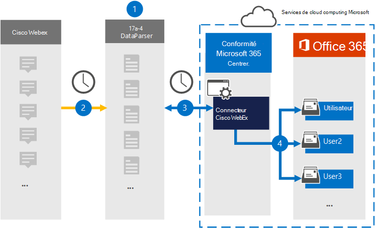

# Configurer un connecteur pour archiver des données Cisco Webex (aperçu)

Utilisez [Cisco Webex DataParser](https://www.17a-4.com/webex-dataparser/) de 17a-4 LLC pour importer et archiver des données à partir de la plateforme Cisco Webex vers les boîtes aux lettres des utilisateurs de Microsoft 365 organisation. DataParser inclut un connecteur Cisco Webex configuré pour capturer des éléments à partir d’une source de données tierce et importer ces éléments dans Microsoft 365. Le connecteur Cisco Webex DataParser convertit les données Cisco Webex au format de message électronique, puis importe ces éléments dans les boîtes aux lettres des utilisateurs Microsoft 365.

Une fois les données Cisco Webex stockées dans les boîtes aux lettres des utilisateurs, vous pouvez appliquer des fonctionnalités de conformité Microsoft 365 telles que la conservation pour litige, eDiscovery, les stratégies et étiquettes de rétention et la conformité des communications. L’utilisation d’un connecteur Cisco Webex pour importer et archiver des données dans Microsoft 365 peut aider votre organisation à respecter les stratégies gouvernementales et réglementaires.

## Vue d’ensemble de l’archivage des données Webex Cisco

La vue d’ensemble suivante explique le processus d’utilisation d’un connecteur de données pour archiver des données Cisco Webex dans Microsoft 365.

1. Votre organisation travaille avec 17a-4 pour configurer Cisco Webex DataParser.

2. Régulièrement, les éléments Cisco Webex sont collectés par DataParser. DataParser convertit également le contenu d’un message au format de message électronique.

3. Le connecteur Cisco Webex DataParser que vous créez dans le Centre de conformité Microsoft 365 se connecte à DataParser et transfère les messages vers un emplacement stockage Azure sécurisé dans le cloud Microsoft.

4. Un sous-dossier du dossier Boîte de réception nommé **Cisco Webex DataParser** est créé dans les boîtes aux lettres utilisateur et les éléments Webex Cisco sont importés dans ce dossier. Le connecteur détermine la boîte aux lettres dans laquelle importer des éléments à l’aide de la valeur de la *propriété Email.* Chaque élément Cisco Webex contient cette propriété, qui est remplie avec l’adresse e-mail de chaque participant.

## Avant de configurer un connecteur

- Créez un compte DataParser pour les connecteurs Microsoft. Pour ce faire, contactez [17a-4 LLC.](https://www.17a-4.com/contact/) Vous devez vous inscrire à ce compte lorsque vous créez le connecteur à l’étape 1.

- L’utilisateur qui crée le connecteur Cisco Webex DataParser à l’étape 1 (et le termine à l’étape 3) doit être affecté au rôle Importation/Exportation de boîte aux lettres dans Exchange Online. Ce rôle est requis pour ajouter des connecteurs sur la page **Connecteurs de données** dans la Centre de conformité Microsoft 365. Par défaut, ce rôle n’est pas attribué à un groupe de rôles dans Exchange Online. Vous pouvez ajouter le rôle Importation/Exportation de boîte aux lettres au groupe de rôles Gestion de l’organisation dans Exchange Online. Vous pouvez également créer un groupe de rôles, attribuer le rôle Importation/Exportation de boîte aux lettres, puis ajouter les utilisateurs appropriés en tant que membres. Pour plus d’informations, voir les [sections](/Exchange/permissions-exo/role-groups#modify-role-groups) Créer des groupes de rôles ou Modifier des groupes de rôles dans l’article « Gérer les groupes de rôles dans Exchange Online ». 

## Étape 1 : Configurer un connecteur Cisco Webex DataParser

La première étape consiste à accéder à la page Connecteurs de données dans le Centre de conformité Microsoft 365 et à créer un connecteur 17a-4 pour les données Cisco Webex.

1. Go to <https://compliance.microsoft.com> and then click Data **connectors**  >  **Cisco Webex DataParser**.

2. Dans la page de description du produit **Cisco Webex DataParser,** cliquez **sur Ajouter un connecteur.**

3. Dans la page **Conditions d’utilisation,** cliquez sur **Accepter.**

4. Entrez un nom unique qui identifie le connecteur, puis cliquez sur **Suivant**.

5. Connectez-vous à votre compte 17a-4 et complétez les étapes de l’Assistant Connexion Cisco Webex DataParser.

## Étape 2 : Configurer le connecteur Cisco Webex DataParser

Travaillez avec la prise en charge 17a-4 pour configurer le connecteur Cisco Webex DataParser.

## Étape 3 : Ma cartographier les utilisateurs

Le connecteur Cisco Webex DataParser masique automatiquement les utilisateurs à leurs adresses Microsoft 365 courrier avant d’importer des données dans Microsoft 365.

## Étape 4 : Surveiller le connecteur Cisco Webex DataParser

Après avoir créé un connecteur Cisco Webex DataParser, vous pouvez afficher l’état du connecteur dans le Centre de conformité Microsoft 365.

1. Go to <https://compliance.microsoft.com> and click **Data connectors** in the left nav.

2. Cliquez sur **l’onglet Connecteurs,** puis sélectionnez le connecteur Cisco Webex DataParser que vous avez créé pour afficher la page de présentation, qui contient les propriétés et les informations sur le connecteur.

3. Sous **État du connecteur avec source,** cliquez sur le lien Télécharger le journal pour ouvrir (ou enregistrer) le journal d’état du connecteur.  Ce journal contient des données qui ont été importées dans le cloud Microsoft.

## Problèmes connus

Pour l’instant, l’importation de pièces jointes ou d’éléments dont la taille est supérieure à 10 Mo n’est pas prise en charge. La prise en charge des éléments plus volumineux sera disponible à une date ultérieure.
