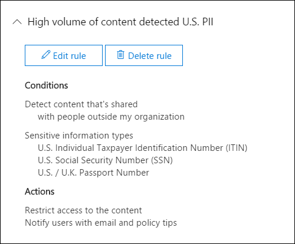
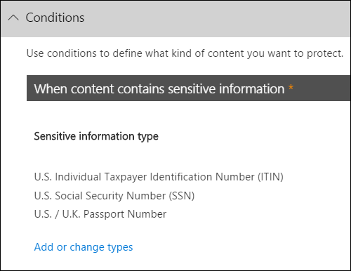
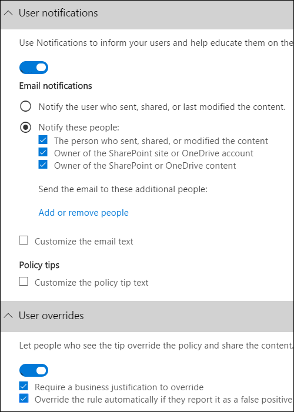

# Création d’une stratégie DLP à partir d’un modèle

La façon la plus simple et la plus courante de démarrer avec les stratégies DLP consiste à utiliser l’un des modèles inclus dans Office 365. Vous pouvez utiliser l’un de ces modèles tel qu’il est ou personnaliser les règles pour répondre aux exigences de conformité spécifiques de votre organisation.

Microsoft 365 comprend plus de 40 modèles prêts à l’emploi qui peuvent vous aider à répondre à un large éventail de besoins courants en matière de réglementation et de stratégie d’entreprise. Par exemple, il existe des modèles de stratégie DLP pour :

- La loi Gramm-Leach-Bliley Act (GLBA)
- La norme Payment Card Industry Data Security Standard (PCI-DSS)
- Les informations d’identification personnelle aux États-Unis (U.S. PII)
- La loi Health Insurance Act (HIPAA) aux États-Unis

Vous pouvez affiner un modèle en modifiant les règles existantes ou en ajoutant de nouvelles règles. Par exemple, vous pouvez ajouter de nouveaux types d’informations sensibles à une règle, modifier les décomptes dans une règle pour rendre son déclenchement plus facile ou plus difficile, permettre aux utilisateurs de remplacer les actions d’une règle en fournissant une justification ou modifier les destinataires des notifications et des rapports d’incident. Un modèle de stratégie DLP est un point de départ flexible pour de nombreux scénarios de conformité courants.

Vous pouvez également choisir le modèle personnalisé, sans règle par défaut, et configurer votre stratégie DLP de A à Z, pour répondre aux exigences de conformité spécifiques de votre organisation.

## Exemple : identifier les informations sensibles sur tous les sites OneDrive Entreprise et restreindre l’accès aux personnes extérieures à votre organisation

OneDrive Entreprise comptes d’utilisateurs vous permet de collaborer et de partager facilement des documents au sein de votre organisation. Mais un problème courant pour les responsables de la mise en conformité est que les informations sensibles stockées dans OneDrive Entreprise comptes peuvent être partagées par inadvertance avec des personnes extérieures à votre organisation. Une stratégie DLP peut aider à réduire ce risque.

Dans cet exemple, vous allez créer une stratégie DLP qui identifie les données piI des États-Unis, qui inclut les numéros d’identification du contribuable individuel (ITIN), les numéros de sécurité sociale et les numéros de passeport américains. Vous commencerez à utiliser un modèle, puis vous modifierez le modèle pour répondre aux exigences de conformité de votre organisation, notamment :

- Ajoutez quelques types d’informations sensibles (numéros de compte bancaire américain et numéros de permis de conduire aux États-Unis) afin que la stratégie DLP protège davantage vos données sensibles.

- Rendez la stratégie plus sensible, afin qu’une seule occurrence d’informations sensibles soit suffisante pour restreindre l’accès aux utilisateurs externes.

- Autorisez les utilisateurs à remplacer les actions en fournissant une justification professionnelle ou en signalant un faux positif. Ainsi, votre stratégie DLP n’empêche pas les membres de votre organisation de faire leur travail, à condition qu’ils ont une raison professionnelle valide de partager les informations sensibles.

### Créer la stratégie DLP à partir d’un modèle

1. Accédez à <https://compliance.microsoft.com>.

2. Connectez-vous à l’aide de votre compte scolaire ou professionnel. Vous êtes maintenant dans le Centre de conformité &amp; de sécurité.

3. Dans le Centre de conformité de sécurité navigation gauche Stratégie de protection contre la perte &amp; \> \> **de** \>  \> **données + Créer une stratégie**.

    

4. Choisissez le modèle de stratégie DLP qui protège les types d’informations sensibles dont vous avez \> besoin.

    Dans cet exemple, vous  allez sélectionner Les données d’informations d’identification personnelle \> **(PII)** des États-Unis, car elles incluent déjà la plupart des types d’informations sensibles que vous souhaitez protéger . Vous en ajouterez quelques-unes plus tard.

    Lorsque vous sélectionnez un modèle, vous pouvez lire la description à droite pour découvrir les types d’informations sensibles que le modèle protège.

    

5. Nommez la stratégie \> **Suivant**.

6. Pour choisir les emplacements que la stratégie DLP doit protéger, faites l’une des choses suivantes :

   - Choisissez **tous les emplacements dans Office 365** \> **suivant**.
   - Choose **Let me choose specific locations** \> **Next**. Pour cet exemple, sélectionnez ceci.

   Pour inclure ou exclure un emplacement entier tel que tous les e-mails  Exchange ou tous les comptes OneDrive de messagerie, mettez l’état de cet emplacement sur ou hors service.

   Pour inclure uniquement des sites SharePoint ou des comptes  OneDrive Entreprise spécifiques, sélectionnez État, puis cliquez sur les liens sous Inclure pour choisir des sites ou des comptes spécifiques.  Lorsque vous appliquez une stratégie à un site, les règles configurées dans cette stratégie sont automatiquement appliquées à tous les sous-sites de ce site.

   

   Dans cet exemple, pour protéger les informations sensibles stockées  dans tous les comptes OneDrive Entreprise, désactiver l’état  pour les sites de messagerie **Exchange** et **SharePoint** et laisser l’état sur pour les comptes **OneDrive.**

7. Choose **Use advanced settings** \> **Next**.

8. Un modèle de stratégie DLP contient des règles prédéfinies avec les conditions et actions qui détectent et agissent sur des types spécifiques d’informations sensibles. Vous pouvez modifier, supprimer ou désactiver l’une des règles existantes ou en ajouter de nouvelles. Lorsque vous avez terminé, cliquez sur **Suivant**.

    

    Dans cet exemple, le modèle de données piI pour les États-Unis comprend deux règles prédéfinie :

   - Faible volume de contenu détecté pour les données **d’pii** pour les États-Unis Cette règle recherche les fichiers contenant entre 1 et 10 occurrences de chacun des trois types d’informations sensibles (ITIN, SSN et numéros de passeport américains), où les fichiers sont partagés avec des personnes extérieures à l’organisation. Si elle est trouvée, la règle envoie une notification par courrier électronique à l’administrateur principal de la collection de sites, au propriétaire du document et à la personne qui a modifié le document pour la dernière fois.

   - Volume élevé de contenu détecté pour les données **d’pii** pour les États-Unis Cette règle recherche les fichiers contenant au moins 10 occurrences de chacun des trois types d’informations sensibles, où les fichiers sont partagés avec des personnes extérieures à l’organisation. Si elle est trouvée, cette action envoie également une notification par courrier électronique, plus elle restreint l’accès au fichier. Pour le contenu d’un compte OneDrive Entreprise, cela signifie que les autorisations pour le document sont restreintes pour tout le monde, à l’exception de l’administrateur principal de la collection de sites, du propriétaire du document et de la personne qui a modifié le document en dernier.

    Pour répondre aux exigences spécifiques de votre organisation, vous souhaitez peut-être faciliter le déclenchement des règles, afin qu’une seule occurrence d’informations sensibles soit suffisante pour bloquer l’accès pour les utilisateurs externes. Après avoir passé en compte ces règles, vous comprenez que vous n’avez pas besoin de règles de faible nombre et de nombre élevé ; vous n’avez besoin que d’une seule règle qui bloque l’accès si une occurrence d’informations sensibles est trouvée.

    Vous développez donc la règle nommée **Low volume of content detected U.S. PII** Delete \> **rule**.

    

9. Dans cet exemple, vous devez maintenant ajouter deux types d’informations sensibles (numéros de compte bancaire et numéros de permis de conduire aux États-Unis), autoriser les utilisateurs à remplacer une règle et modifier le nombre à n’importe quelle occurrence. Vous pouvez faire tout cela en éditant une règle, sélectionnez Donc, le volume élevé de contenu détecté aux **États-Unis** règle de modification piI \> .

    

10. Pour ajouter un type d’informations sensibles, dans la section **Conditions** \> **Ajouter ou modifier des types**. Then, under **Add or change types** choose \> **Add** \> select **U.S. Bank Account Number** and **U.S. Driver’s License Number** \> **Add** \> **Done**.

    

    

11. Pour modifier le nombre (nombre d’instances d’informations  sensibles requises pour déclencher la règle), sous Nombre d’instances, choisissez la valeur min pour chaque type et entrez \>  \> 1. Le nombre minimal ne peut pas être vide. Le nombre maximal peut être vide ; une valeur **maximale** vide convertie en **n’importe quel**.

    Lorsque vous avez terminé, le nombre minimum pour tous les types d’informations sensibles doit être **1** et le nombre maximum doit être **n’importe quel**. En d’autres termes, toute occurrence de ce type d’informations sensibles répond à cette condition.

    

12. Pour la personnalisation finale, vous ne souhaitez pas que vos stratégies DLP empêchent les utilisateurs de faire leur travail lorsqu’ils ont une justification professionnelle valide ou rencontrent un faux positif. Vous souhaitez donc que la notification de l’utilisateur inclue des options pour remplacer l’action de blocage.

    Dans la section **Notifications de** l’utilisateur, vous pouvez voir que les notifications par courrier électronique et les conseils de stratégie sont allumés par défaut pour cette règle dans le modèle.

    Dans la section **Remplacements de** l’utilisateur, vous pouvez voir que les remplacements pour une justification professionnelle sont désactivés, mais que les remplacements pour signaler les faux positifs ne le sont pas. Choose **Override the rule automatically if they report it as a false positive**.

    

13. En haut de l’éditeur de règles, modifiez le nom de cette règle en  le faisant changer de volume de contenu élevé par défaut détecté pour les données personnelles des **États-Unis** en Tout contenu détecté avec les données personnelles des États-Unis, car il est maintenant déclenché par toute occurrence de ses types d’informations sensibles.

14. En bas de l’éditeur de \> **règles, enregistrez**.

15. Examinez les conditions et actions de cette règle \> **suivante**.

    À droite, notez le changement **d’état** de la règle. Si vous désactiver une stratégie entière, toutes les règles contenues dans la stratégie sont également désactivées. Toutefois, vous pouvez désactiver une règle spécifique sans désactiver la stratégie entière. Cela peut être utile lorsque vous avez besoin d’examiner une règle qui génère un grand nombre de faux positifs.

16. Sur la page suivante, lisez et comprenez les choses suivantes, puis choisissez d’activer la règle ou de la tester en premier. \> 

     Avant de créer vos stratégies DLP, vous devez envisager de les déployer progressivement pour évaluer leur impact et tester leur efficacité avant de les appliquer pleinement. Par exemple, vous ne souhaitez pas qu’une nouvelle stratégie DLP bloque involontairement l’accès à des milliers de documents dont les personnes ont besoin pour faire leur travail.

    Si vous créez des stratégies DLP susceptibles d’avoir un impact important, nous vous recommandons de suivre l’ordre suivant :

17. Démarrez en mode test sans conseil de stratégie, puis utilisez les rapports DLP pour évaluer l’impact. Vous pouvez utiliser les rapports DLP pour connaître le nombre, l’emplacement, le type et la gravité des correspondances de stratégie. En fonction des résultats, vous pouvez affiner les règles, si nécessaire. En mode test, les stratégies DLP n’auront aucun impact sur la productivité des personnes qui travaillent dans votre organisation.

18. Passez en mode test avec notifications et conseils de stratégie pour commencer à faire découvrir vos stratégies de conformité aux utilisateurs et les préparer pour les règles qui vont être appliquées. À ce stade, vous pouvez également demander aux utilisateurs de signaler les faux positifs afin d’affiner les règles.

19. Activer les stratégies afin que les règles soient appliquées et que le contenu soit protégé. Continuez de surveiller les rapports DLP et tous les rapports ou notifications d’incident pour vous assurer que les résultats correspondent à ce que vous aviez prévu.

    

20. Examinez vos paramètres pour cette stratégie \> en **choisissant Créer.**

Après avoir créé et activer une stratégie DLP, elle est déployée sur toutes les sources de contenu qu’elle inclut, telles que les sites SharePoint Online ou les comptes OneDrive Entreprise, où la stratégie commence automatiquement à appliquer ses règles sur ce contenu.

## Affichage de l’état d’une stratégie DLP

À tout moment, vous pouvez afficher l’état de vos stratégies DLP dans la **page** Stratégie dans la **section** Protection contre la perte de données du Centre de conformité &amp; de sécurité. Vous y trouverez des informations importantes vous indiquant, par exemple, si une stratégie a bien été activée ou désactivée, et si elle est en mode test.

Voici les différents états et leur signification.

 

****

|État|Explication|
|---|---|
|**Activation en cours...**|La stratégie est déployée pour les sources de contenu qu’elle contient. La stratégie n’est pas encore appliquée sur toutes les sources.|
|**Test en cours, avec notifications**|La stratégie est en mode test. Les actions dans une règle ne sont pas appliquées, mais les correspondances de stratégie sont collectées et peuvent être consultées à l’aide des rapports DLP. Les notifications sur les correspondances de stratégie sont envoyées aux destinataires spécifiés.|
|**Test en cours, sans notifications**|La stratégie est en mode test. Les actions dans une règle ne sont pas appliquées, mais les correspondances de stratégie sont collectées et peuvent être consultées à l’aide des rapports DLP. Les notifications sur les correspondances de stratégie ne sont pas envoyées aux destinataires spécifiés.|
|**On**|La stratégie est appliquée et active. La stratégie a été correctement déployée sur toutes ses sources de contenu.|
|**En cas de non-off...**|La stratégie est supprimée des sources de contenu qu’elle contient. La stratégie peut être toujours active et appliquée sur certaines sources. La désactivation d’une stratégie peut prendre jusqu’à 45 minutes.|
|**Désactivé**|La stratégie n’est pas active et n’est pas appliquée. Les paramètres de la stratégie (sources, mots clés, durée, etc.) sont enregistrés.|
|**Suppression...**|La stratégie est en cours de suppression. La stratégie n’est pas active et n’est pas appliquée. La suppression d’une stratégie prend généralement une heure.|
|

## Désactivation d’une stratégie DLP

Vous pouvez modifier ou désactiver une stratégie DLP à tout moment. La désactivation d’une stratégie désactive toutes les règles de la stratégie.

Pour modifier ou désactiver une stratégie DLP, dans la page **Stratégie,** \> sélectionnez la stratégie \> **Modifier la stratégie.**

En outre, vous pouvez désactiver chaque règle individuellement en éditant  la stratégie, puis en issant l’état de cette règle, comme décrit ci-dessus.

## Plus d’informations

- [En savoir plus sur la protection contre la perte de données](dlp-learn-about-dlp.md)
- [Envoyer des notifications et afficher des conseils de stratégie pour les stratégies DLP](use-notifications-and-policy-tips.md)
- [Créer une stratégie DLP pour protéger les documents avec l’ICF ou d’autres propriétés](protect-documents-that-have-fci-or-other-properties.md)
- [Contenu des modèles de stratégie DLP](what-the-dlp-policy-templates-include.md)
- [Définitions d’entités des types d’informations sensibles](sensitive-information-type-entity-definitions.md)
