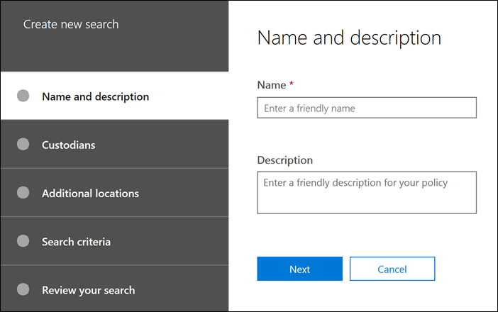

# Créer une rechercheCreate a search

Sous l’onglet **recherches** de votre cas, vous pouvez créer une nouvelle recherche en cliquant sur **nouvelle recherche** et en suivant l’Assistant.On the **Searches** tab in your case, you can create a new search by clicking **New search** and following the wizard.

## Nommez la recherche et donnez-lui une description.Name the search and give it a description

Chaque recherche avec un cas doit avoir un nom unique.Each search with a case should have a unique name. Vous pouvez éventuellement fournir une description pour votre recherche.You can optionally provide a description for your search. 

## Choisir les dépositaires et les lieux de rechercheChoose the custodians and custodial locations to search

Choisissez les emplacements de contenu de dépositaire à rechercher en spécifiant les dépositaires que vous avez ajoutés à l’incident.Choose custodian content locations to search by specifying that custodians you have added to the case. En sélectionnant un dépositaire, vous lancez la recherche par rapport à toutes les sources de données mappées au dépositaire.By selecting a custodian, you will run the search against all data sources mapped to the custodian. Vous avez également la possibilité de limiter la recherche aux sources de données sélectionnées pour chaque dépositaire.You also have the option to narrow the search to selected data sources for each custodian. Pour plus d’informations sur la façon d’ajouter des dépositaires et de gérer leurs sources de données, consultez la rubrique [work with dépositaires](managing-custodians.md).For more information about how to add custodians and manage their data sources, see [Work with custodians](managing-custodians.md).

## Choisir les emplacements non privatives de cœurChoose non-custodial locations

Dans certains cas, vous souhaiterez peut-être Rechercher des sources de données qui ne sont pas associées à un dépositaire.In some cases, you may want to search data sources that are not associated with a custodian. Dans ce cas, vous pouvez spécifier les emplacements de recherche, ou choisir de rechercher tous les emplacements de contenu d’un service Microsoft spécifique (par exemple, rechercher toutes les boîtes aux lettres Exchange ou tous les sites SharePoint et OneDrive).In this case, you can specify the locations you want to search, or choose to search all content locations for a specific Microsoft service (such as searching all Exchange mailboxes or all SharePoint sites and OneDrive accounts).

## Définir la requête de recherche et les conditionsDefine the search query and conditions

Vous pouvez définir la requête de mots clés et les conditions de la recherche à l’aide des cartes de condition prédéfinies ou du langage de requête de mot clé (KQL).You can define the keywords query and any conditions for the search by using the pre-built condition cards or using Keyword Query Language (KQL). Pour plus d’informations, consultez la rubrique [créer des requêtes de recherche](building-search-queries.md).For more information, see [Build search queries](building-search-queries.md).
