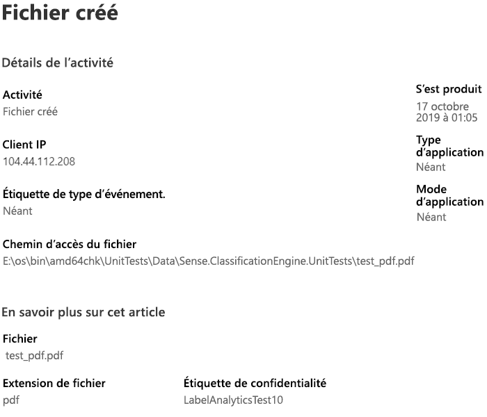

# Afficher l’activité sur votre contenu étiqueté (aperçu)View activity on your labeled content (preview)

Les onglets vue d’ensemble de la classification des données et explorateur de contenu vous permettent de voir quel contenu a été découvert et étiqueté, ainsi que son emplacement.The data classification overview and content explorer tabs give you visibility into what content has been discovered and labeled, and where that content is. L’explorateur d’activité complète cette suite de fonctionnalités en vous permettant de contrôler les opérations effectuées avec votre contenu étiqueté.Activity explorer rounds out this suite of functionality by allowing you to monitor what's being done with your labeled content. L’Explorateur d’activité permet de voir votre historique.Activity explorer provides a historical view.

Vous pouvez filtrer les données par :You can filter the data by:

- plage de datesdate range
- type d’activitéactivity type
- emplacementlocation
- utilisateuruser
- étiquette de confidentialitésensitivity label
- étiquette de rétentionretention label

Vous pouvez afficher les données sous la forme d’une liste ou d’un histogramme.You can view the data either as a list or a bar graph.

## Conditions préalablesPrerequisites

Chaque compte accédant et utilisant l’Explorateur d’activités doit posséder une licence pour l’un de ces abonnements :Every account that accesses and uses activity explorer must have a license assigned to it from one of these subscriptions:

- Microsoft 365 (E5)Microsoft 365 (E5)
- Office 365 (E5)Office 365 (E5)
- Complément Conformité avancée (E5)Advanced Compliance (E5) add-on
- Complément Threat Intelligence avancé (E5)Advanced Threat Intelligence (E5) add-on

## Type d’activitéActivity type

Microsoft 365 contrôle et signale 12 types d’activités dans SharePoint Online, OneDrive et les points de terminaison.Microsoft 365 monitors and reports on 12 types of activities across SharePoint Online, OneDrive and endpoints. Les points de terminaison sont des appareils utilisateur exécutant Windows 10.Endpoints are user devices running Windows 10.

- Fichier crééFile created
- Fichier modifiéFile modified
- Fichier renomméFile renamed
- Fichier copié dans le cloudFile copied to cloud
- Fichier consulté par une application non autoriséeFile accessed by unallowed app
- Fichier impriméFile printed
- Fichier copié sur un support amovibleFile copied to removable media
- Fichier copié sur le partage réseauFile copied to network share
- Fichier luFile read
- Fichier copié dans le Presse-papiersfile copied to clipboard
- Étiquette appliquéLabel applied
- Étiquette modifiée (mise à niveau, rétrogradée ou supprimé)Label changed (upgraded, downgraded, or removed)

L’intérêt de comprendre quelles actions sont accomplies avec votre contenu marqué par des étiquettes de confidentialité est de voir si les moyens de contrôle que vous avez déjà mis en place, comme les [stratégies de prévention de perte des données](data-loss-prevention-policies.md) sont efficaces ou non.The value of understanding what actions are being taken with your sensitive labeled content is that you can see if the controls that you have already put into place, such as [data loss prevention policies](data-loss-prevention-policies.md) are effective or not. Si ce n’est pas le cas ou si vous découvrez quelque chose d’inattendu tel qu’un grand nombre d’éléments qui sont étiquetés `highly confidential`et sont rétrogradés`general` vous pouvez gérer vos différentes stratégies et entreprendre de nouvelles actions pour limiter le comportement indésirable.If not, or if you discover something unexpected, such as a large number of items that are labeled `highly confidential` and are downgraded `general`, you can manage your various policies and take new actions to restrict the undesired behavior.

Une fois vos filtres définis, vous pouvez :Once your filters are set, you can:

- pointer votre curseur sur un segment de l’histogramme pour afficher le nombre d’éléments inclus dans cette catégorie hover over a segment of the bar chart to see the number of items that fall into that category 
- exporter les donnéesexport the data
- sélectionner un élément donné dans la liste et afficher les détails de l’action dans le menu volantselect any given item from the list and view the details of the action in the fly-out

## Voir aussiSee also
- [Étiquettes de confidentialitéSensitivity labels](sensitivity-labels.md)
- [Étiquettes de rétentionRetention labels](labels.md)
- [Éléments recherchés par les types d’informations sensiblesWhat the sensitive information types look for](what-the-sensitive-information-types-look-for.md)
- [Vue d’ensemble des stratégies de rétentionOverview of retention policies](retention-policies.md)
