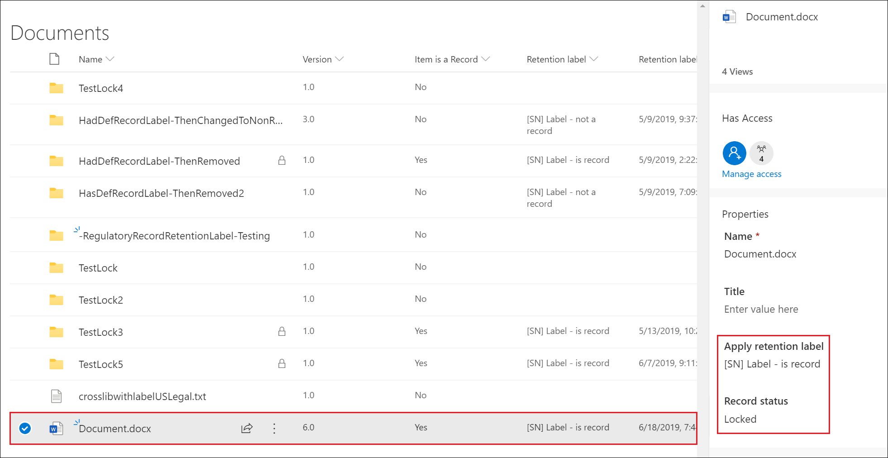

# Déclarer des enregistrements à l’aide d’étiquettes de rétention

>*[Guide de sécurité et conformité pour les licences Microsoft 365](https://aka.ms/ComplianceSD).*

Vous utilisez les [étiquettes de rétention](retention.md#retention-labels) pour marquer du contenu sous la forme d’un enregistrement. Vous pouvez soit publier ces étiquettes pour permettre aux utilisateurs et aux administrateurs de les appliquer manuellement au contenu, soit appliquer automatiquement ces étiquettes au contenu que vous voulez marquer comme enregistrement.

## Configuration d’étiquettes de rétention pour déclarer des enregistrements

Lorsque vous créez une [étiquette de rétention](retention.md#retention-labels), sélectionnez l’option permettant de marquer le contenu en tant qu’enregistrement.

>[!NOTE] 
> L’option de marquage du contenu en tant qu’enregistrement n’est pas disponible lorsque vous créez ou configurez des étiquettes de rétention depuis **Gouvernance des informations** dans le centre de conformité Microsoft 365. Au lieu de cela, vous devez utiliser**Gestion des enregistrements**.

1. Dans le [centre de conformité Microsoft 365](https://compliance.microsoft.com), accédez à **Gestion des enregistrements** \> **Plan de gestion de fichiers**. Dans la page **plan de fichiers**, cliquez **créer une étiquette**.

2. Sur la page **Paramètres d’étiquette** de l’Assistant, choisissez l’option permettant de classifier du contenu sous la forme d’un enregistrement.
    
   

3. Appliquez l’étiquette de rétention aux documents SharePoint ou OneDrive et aux messages électroniques Exchange, le cas échéant. Pour obtenir des instructions :
    
    - [Créer des étiquettes de rétention et les appliquer dans les applications](create-apply-retention-labels.md)
    
    - [Appliquer automatiquement une étiquette de rétention au contenu](apply-retention-labels-automatically.md)

## Application de l’étiquette de rétention configurée au contenu

Lorsque des étiquettes de rétention qui marquent le contenu en tant qu’enregistrement sont mises à la disposition des utilisateurs pour qu’ils les appliquent dans les applications :

- Pour Exchange, tout utilisateur disposant d’un accès en écriture à la boîte aux lettres peut appliquer ces étiquettes. 
- Pour SharePoint et OneDrive, tous les utilisateurs du groupe Membres par défaut (niveau d’autorisation Collaboration) peuvent appliquer ces étiquettes.

Exemple d’un document marqué en tant qu’enregistrement à l’aide d’une étiquette de rétention :

## Étapes suivantes

Si vous devez mettre à jour des enregistrements, consultez [Utiliser le contrôle de version des enregistrements pour mettre à jour les enregistrements stockés dans SharePoint ou OneDrive](record-versioning.md).

Si vous souhaitez en savoir plus sur la destruction des enregistrements, consultez [Disposition de contenu](disposition.md).
