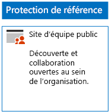
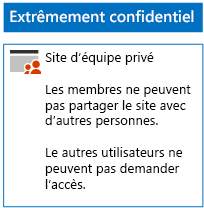

# Déployer des sites SharePoint Online pour trois niveaux de protectionDeploy SharePoint Online sites for three tiers of protection

Utilisez les étapes de cet article pour concevoir et déployer des sites d’équipe SharePoint Online de base de référence, sensibles et hautement confidentiels. Pour plus d’informations sur ces trois niveaux de protection, consultez [Sécuriser des sites et des fichiers SharePoint Online](../security/office-365-security/secure-sharepoint-online-sites-and-files.md).Use the steps in this article to design and deploy baseline, sensitive, and highly confidential SharePoint Online team sites. For more information about these three tiers of protection, see [Secure SharePoint Online sites and files](../security/office-365-security/secure-sharepoint-online-sites-and-files.md).
  
## Sites d’équipe SharePoint Online de base de référenceBaseline SharePoint Online team sites

La protection Base de référence inclut les sites d’équipe publics et privés. Les sites d’équipe publics peuvent être découverts et sont accessibles par toute personne de l’organisation. Les sites privés peuvent être découverts et sont accessibles seulement par les membres du groupe Microsoft 365 associé au site d’équipe. Ces deux types de sites d’équipe permettent aux membres de partager le site avec d’autres utilisateurs.Baseline protection includes both public and private team sites. Public team sites can be discovered and accessed by anybody in the organization. Private sites can only be discovered and accessed by members of the Microsoft 365 group associated with the team site. Both of these types of team sites allow members to share the site with others.
  
### PublicPublic

Pour créer un site d’équipe SharePoint Online de base de référence avec un accès et des autorisations publics, suivez [ces instructions](https://support.office.com/article/create-a-team-site-in-sharepoint-ef10c1e7-15f3-42a3-98aa-b5972711777d).To create a baseline SharePoint Online team site with public access and permissions, follow [these instructions](https://support.office.com/article/create-a-team-site-in-sharepoint-ef10c1e7-15f3-42a3-98aa-b5972711777d).

Voici la configuration finale.Here is your resulting configuration.
  

  
### PrivéPrivate

Pour créer un site d’équipe SharePoint Online de base de référence avec un accès et des autorisations privés, suivez [ces instructions](https://support.office.com/article/create-a-team-site-in-sharepoint-ef10c1e7-15f3-42a3-98aa-b5972711777d).To create a baseline SharePoint Online team site with private access and permissions, follow [these instructions](https://support.office.com/article/create-a-team-site-in-sharepoint-ef10c1e7-15f3-42a3-98aa-b5972711777d).
  
Voici la configuration finale.Here is your resulting configuration.
  

  
## Sites d’équipe SharePoint Online sensiblesSensitive SharePoint Online team sites

Un site d’équipe SharePoint Online sensible démarre en tant que site d’équipe privé.A sensitive SharePoint Online team site starts as a private team site.
  
Commencez par créer le site d’équipe privé SharePoint Online en suivant [ces instructions](https://support.office.com/article/create-a-team-site-in-sharepoint-ef10c1e7-15f3-42a3-98aa-b5972711777d).First, create the private SharePoint Online team site with [these instructions](https://support.office.com/article/create-a-team-site-in-sharepoint-ef10c1e7-15f3-42a3-98aa-b5972711777d).

Ensuite, dans le nouveau site d’équipe SharePoint Online, configurez d’autres paramètres autorisations en suivant ces étapes.Next, from the new SharePoint Online team site, configure additional permission settings with these steps.

1.  Dans la barre d’outils du site d’équipe SharePoint, cliquez sur l’icône Paramètres, puis cliquez sur **Autorisations du site**.In the tool bar of the SharePoint team site, click the settings icon, and then click **Site permissions**.
2.  Dans le volet **Autorisations de site**, sous **Paramètres de partage**, cliquez sur **Modifier les paramètres de partage**.In the **Site permissions** pane, under **Sharing Settings**, click **Change sharing settings**.
3.  Sous **Autorisations de partage**, sélectionnez **Seuls les propriétaires du site peuvent partager des fichiers, des dossiers et le site**, puis cliquez sur **Enregistrer**.Under **Sharing permissions**, choose **Only site owners can share files, folders, and the site**, and then click **Save**.

Voici les résultats que vous devez escompter :The results of these permission settings are:

- La possibilité pour les membres de partager avec d’autres membres est désactivée.The ability for members to share with other members is disabled.
- La possibilité pour les non-membres de demander l’accès est activée.The ability for non-members to request access is enabled.

Voici la configuration finale.Here is your resulting configuration.
  

  
Les membres du site, via l’appartenance à un des groupes d’accès, peuvent désormais collaborer sur les ressources du site de façon sécurisée.The members of the site, through group membership in one of the access groups, can now securely collaborate on the resources of the site.
  
## Sites d’équipe SharePoint Online hautement confidentielsHighly confidential SharePoint Online team sites

Un site d’équipe SharePoint Online hautement confidentiel est un site d’équipe privé avec des paramètres d’autorisations supplémentaires.A highly confidential SharePoint Online team site is a private team site with additional permissions settings.

Commencez par créer le site d’équipe privé SharePoint Online en suivant [ces instructions](https://support.office.com/article/create-a-team-site-in-sharepoint-ef10c1e7-15f3-42a3-98aa-b5972711777d).First, create the private SharePoint Online team site with [these instructions](https://support.office.com/article/create-a-team-site-in-sharepoint-ef10c1e7-15f3-42a3-98aa-b5972711777d).

Ensuite, dans le nouveau site d’équipe SharePoint Online, configurez d’autres paramètres autorisations en suivant ces étapes.Next, from the new SharePoint Online team site, configure additional permission settings with these steps.

1.  Dans la barre d’outils du site d’équipe SharePoint, cliquez sur l’icône Paramètres, puis cliquez sur **Autorisations du site**.In the tool bar of the SharePoint team site, click the settings icon, and then click **Site permissions**.
2.  Dans le volet **Autorisations de site**, sous **Paramètres de partage**, cliquez sur **Modifier les paramètres de partage**.In the **Site permissions** pane, under **Sharing Settings**, click **Change sharing settings**.
3.  Sous **Autorisations de partage**, sélectionnez **Seuls les propriétaires du site peuvent partager des fichiers, des dossiers et le site**.Under **Sharing permissions**, choose **Only site owners can share files, folders, and the site**.
4. Désactivez **Autoriser les demandes d’accès**, puis cliquez sur **Enregistrer**.Turn off **Allow access requests**, and then click **Save**.

Voici les résultats que vous devez escompter :The results of these permission settings are:

- La possibilité pour les membres de partager avec d’autres membres est désactivée.The ability for members to share with other members is disabled.
- La possibilité pour les non-membres de demander l’accès est désactivée.The ability for non-members to request access is disabled.

Voici la configuration finale.Here is your resulting configuration.
  

  
Les membres du site, via l’appartenance à un des groupes d’accès, peuvent désormais collaborer sur les ressources du site de façon sécurisée.The members of the site, through group membership in one of the access groups, can now securely collaborate on the resources of the site.
  
## Étape suivanteNext step

[Protéger les fichiers SharePoint Online avec des étiquettes et la protection contre la perte de donnéesProtect SharePoint Online files with labels and DLP](protect-sharepoint-online-files-with-office-365-labels-and-dlp.md)

## Voir aussiSee also

[Conseils de sécurité Microsoft pour les campagnes électorales, les organisations à but non lucratif et d’autres organisations flexiblesMicrosoft Security Guidance for Political Campaigns, Nonprofits, and Other Agile Organizations](../security/office-365-security/microsoft-security-guidance-for-political-campaigns-nonprofits-and-other-agile-o.md)
  
[Adoption du cloud et solutions hybridesCloud adoption and hybrid solutions](https://docs.microsoft.com/office365/enterprise/cloud-adoption-and-hybrid-solutions)
