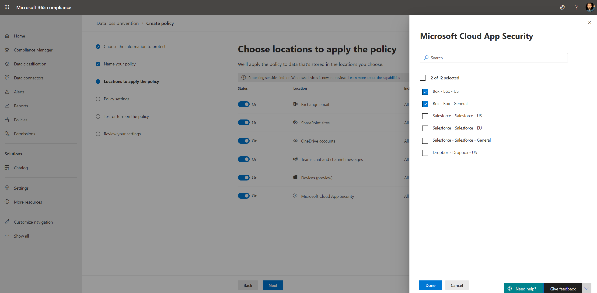
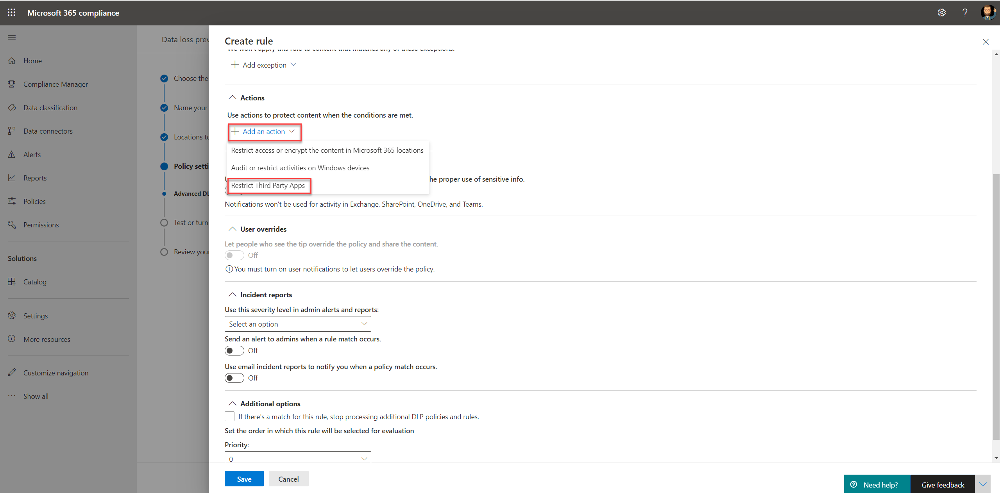

# Utiliser des stratégies de protection contre la perte de données pour les applications cloud non-Microsoft (aperçu)

Les stratégies de protection contre la perte de données (DLP) pour les applications cloud non Microsoft font partie de la suite de fonctionnalités DLP Microsoft 365 . À l’aide de ces fonctionnalités, vous pouvez découvrir et protéger les éléments sensibles dans les services Microsoft 365. Pour plus d’informations sur toutes les offres Microsoft DLP, voir [Vue d’ensemble de la protection contre la perte de données.](https://docs.microsoft.com/microsoft-365/compliance/data-loss-prevention-policies?view=o365-worldwide)

Vous pouvez utiliser des stratégies DLP pour les applications cloud non-Microsoft afin de surveiller et de détecter les cas où des éléments sensibles sont utilisés et partagés via des applications cloud non Microsoft. L’utilisation de ces stratégies vous donne la visibilité et le contrôle dont vous avez besoin pour vous assurer qu’elles sont correctement utilisées et protégées, et cela permet d’éviter les comportements risqués qui peuvent les compromettre.

## Avant de commencer

### Licences SKU/abonnements

Avant de commencer à utiliser des stratégies DLP pour les applications cloud autres que Microsoft, confirmez votre abonnement [Microsoft 365](https://www.microsoft.com/microsoft-365/compare-microsoft-365-enterprise-plans?rtc=1) et les modules. Pour accéder à cette fonctionnalité et l’utiliser, vous devez avoir l’un de ces abonnements ou modules:

- Microsoft 365 E5
- Microsoft 365 E5 Conformité
- Microsoft 365 E5 Sécurité

### Préparer votre environnement Cloud App Security

Les stratégies DLP pour les applications cloud non Microsoft utilisent les fonctionnalités DLP cloud app security. Pour l’utiliser, vous devez préparer votre environnement Cloud App Security. Pour obtenir des instructions, voir Définir des actions de visibilité, de protection et de gouvernance [instantanées pour vos applications.](https://docs.microsoft.com/cloud-app-security/getting-started-with-cloud-app-security#step-1-set-instant-visibility-protection-and-governance-actions-for-your-apps)

### Connecter une application cloud non-Microsoft

Pour utiliser la stratégie DLP sur une application cloud non-Microsoft spécifique, l’application doit être connectée à Cloud App Security. Pour plus d’informations, voir :

- [Zone de connexion](https://docs.microsoft.com/cloud-app-security/connect-box-to-microsoft-cloud-app-security)
- [Connecter Dropbox](https://docs.microsoft.com/cloud-app-security/connect-dropbox-to-microsoft-cloud-app-security)
- [Connect G-Suite](https://docs.microsoft.com/cloud-app-security/connect-google-apps-to-microsoft-cloud-app-security)
- [Connecter Salesforce](https://docs.microsoft.com/cloud-app-security/connect-salesforce-to-microsoft-cloud-app-security)
- [Connecter Cisco Webex](https://docs.microsoft.com/cloud-app-security/connect-webex-to-microsoft-cloud-app-security)

Après avoir connecté vos applications cloud à Cloud App Security, vous pouvez créer des stratégies DLP Microsoft 365 pour elles.

>[!NOTE]
>Il est également possible d’utiliser Microsoft Cloud App Security pour créer des stratégies DLP pour les applications cloud Microsoft. Toutefois, il est recommandé d’utiliser Microsoft 365 pour créer et gérer des stratégies DLP dans les applications cloud Microsoft.

## Créer une stratégie DLP pour une application cloud non-Microsoft

Lorsque vous sélectionnez un emplacement pour la stratégie DLP, activer l’emplacement **Microsoft Cloud App Security.**

- Pour sélectionner une application ou une instance spécifique, **sélectionnez Instance.**
- Si vous ne sélectionnez pas d’instance, la stratégie utilise toutes les applications connectées dans votre client Microsoft Cloud App Security.

   

   

Vous pouvez choisir différentes actions pour chaque application cloud non-Microsoft prise en charge. Pour chaque application, il existe différentes actions possibles (dépend de l’API de l’application cloud).

Lorsque vous créez une règle dans la stratégie DLP, vous pouvez sélectionner une action pour les applications cloud autres que Microsoft. Pour restreindre les applications tierces, **sélectionnez Restreindre les applications tierces.**

Pour plus d’informations sur la création et la configuration des stratégies DLP, voir Créer un test et [régler une stratégie DLP.](https://docs.microsoft.com/microsoft-365/compliance/create-test-tune-dlp-policy?view=o365-worldwide)

## Voir aussi

- [Créer un test et régler une stratégie DLP](https://docs.microsoft.com/microsoft-365/compliance/create-test-tune-dlp-policy?view=o365-worldwide)
- [Prise en main de la stratégie DLP par défaut](https://docs.microsoft.com/microsoft-365/compliance/get-started-with-the-default-dlp-policy?view=o365-worldwide)
- [Création d’une stratégie DLP à partir d’un modèle](https://docs.microsoft.com/microsoft-365/compliance/create-a-dlp-policy-from-a-template?view=o365-worldwide)
