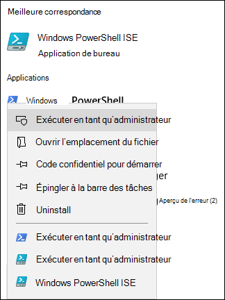
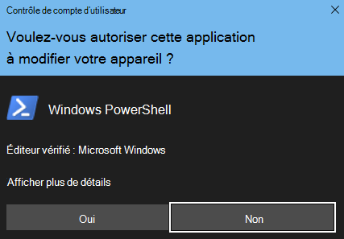

# Ensemble d’outils de migration FastTrack pour envoyer une demande de suppressionFastTrack Migration Toolset for Submitting Delete Request

## Objectif de l’ensemble d’outilsToolset purpose

Si vous êtes un client actuellement engagé dans les migrations FastTrack, la suppression du compte d’utilisateur n’entraîne pas la suppression de la copie des données détenue par l’équipe Microsoft FastTrack, conservée dans le seul but d’exécuter la migration. Si, lors de la migration, vous souhaitez que l’équipe Microsoft FastTrack supprime également la copie des données, envoyez une demande via cet ensemble d’outils. Dans le cours normal des activités, Microsoft FastTrack supprimera toutes les copies de données une fois la migration terminée.In the event that you are a customer currently engaged in FastTrack migrations, deleting the user account will not delete the data copy held by the Microsoft FastTrack team, which is held for the sole purpose of completing the migration. If during the migration you would like the Microsoft FastTrack team to also delete the data copy, submit a request via this tool set. In the ordinary course of business, Microsoft FastTrack will delete all data copies once the migration is complete.

### Plateformes prises en chargeSupported platforms
Microsoft prend en charge la version initiale de cet ensemble d’outils dans la console PowerShell et la plateforme Windows. Les plateformes connues suivantes sont prises en charge par cet ensemble d’outils :Microsoft supports the initial release of this  toolset in the Windows platform and PowerShell console. The following known platforms are supported by this toolset:
 
***Tableau 1 : plateformes prises en charge par cet ensemble d’outils******Table 1 — Platforms supported by this toolset***
 
<!--start table here HEADER -->
 
|||||||
|:-----|:-----|:-----|:-----|:-----|:-----|
| |**Windows 7****Windows 7**|**Windows 8****Windows 8**|**Windows 10****Windows 10**|**Windows Server 2012****Windows Server 2012**|**Windows Server 2016****Windows Server 2016**|
|PS 5.0PS 5.0|NonNot Pris en chargeSupported|Pris en chargeSupported|Pris en chargeSupported|Pris en chargeSupported|Pris en chargeSupported|
|PS 5.1PS 5.1|NonNot Pris en chargeSupported|Pris en chargeSupported|Pris en chargeSupported|Pris en chargeSupported|Pris en chargeSupported|
|||
 
<!-- end of table -->

### Obtention de l’ensemble d’outilsObtaining the toolset

Cet ensemble d’outils est disponible dans la galerie PowerShell sur l’application console PowerShell. Pour rechercher et charger ce module de cmdlet, ouvrez tout d’abord PowerShell en mode administrateur afin d’être autorisé à installer le module. Si vous n’avez jamais utilisé PowerShell, accédez à la barre des tâches Windows et saisissez « PowerShell » dans la zone de recherche. Faites un clic droit sur l’application console pour la sélectionner, choisissez **Exécuter en tant qu’administrateur**, puis cliquez sur **Oui** pour exécuter Windows PowerShell.This toolset is available in the PowerShell Gallery on the PowerShell console application.  To locate and load this cmdlet module, first open PowerShell in administrator mode so it has the appropriate permissions to install the module. If you have not used PowerShell previously go to your Windows Task Bar and in the search box type “PowerShell”. Select the console app using right-click and choose **Run as administrator**, then click **Yes** to run Windows PowerShell.

À présent que la console est ouverte, vous devez définir des autorisations pour l’exécution des scripts. Saisissez la commande suivante pour autoriser l’exécution des scripts : « Set-ExecutionPolicy ; ExecutionPolicy: Bypass ; Scope: Process »Now that the console is open, you need to set permissions for script execution. Type the following command to allow the scripts to run: ‘Set-ExecutionPolicy — ExecutionPolicy: Bypass — Scope: Process’

Vous serez invité à confirmer cette action, car l’administrateur peut modifier l’étendue à sa guise.You will be prompted to confirm this action, as the administrator can change the scope at their discretion.

***Définir la stratégie d’exécution******Set Execution Policy***

À présent que la console est configurée pour autoriser le script, exécutez la commande suivante pour installer le module :Now that the console is set to allow the script,  run this next command to install the module:

>`Install-Module -Name Microsoft.FastTrack ` -Repository PSGallery \``Install-Module -Name Microsoft.FastTrack ` -Repository PSGallery \`
>        
>               -WarningAction: SilentlyContinue `
>               -Force’

### Conditions préalables pour le modulePrerequisites for module
Pour exécuter correctement ce module, vous devrez peut-être installer des modules dépendants si ce n’est pas déjà fait. Vous devrez peut-être redémarrer PowerShell.To successfully execute this module, you may need to install dependent modules for use if they are not already installed. You may need to restart PowerShell.  

Pour envoyer une DSR, vous devez tout d’abord vous connecter à l’aide de vos identifiants Office 365 : saisissez les identifiants corrects pour valider votre statut d’administrateur général et collecter des informations client.In order to submit a DSR, you must first log in using your Office 365 credentials — entering the proper credentials will validate your global administrator status and collect tenant information. 

**Clé Api de la Recherche Rapide de Compte de la Connexion: \<API Key provided by FastTrack MVM\>****Login-FastTrackAccount -ApiKey: \<API Key provided by FastTrack MVM\>**

Une fois que vous êtes connecté, les identifiants et la clé sont stockés pour être utilisés avec les modules FastTrack pendant le reste de la session PowerShell actuelle.Once successfully logged in, the credentials and key will be stored for use with FastTrack modules for the remainder of the current PowerShell session.

Si vous avez besoin de vous connecter à un environnement cloud autre que commercial, vous devrez ajouter *-Environment* à la commande *Login* avec l’un des environnements valides suivants :If you need to connect to a cloud environment, other than commercial, *-Environment* will need to be added to *Log in* command with one of the following valid environments:
- AzureCloudAzureCloud
- AzureChinaCloudAzureChinaCloud
- AzureGermanCloudAzureGermanCloud
- AzureUSGovernmentCloudAzureUSGovernmentCloud

**Login-FastTrackAcccount -ApiKey\ <API Key provided by FastTrack MVM> -Environment: <cloud environment\>****Login-FastTrackAcccount -ApiKey\ <API Key provided by FastTrack MVM> -Environment: <cloud environment\>**

Pour envoyer une demande de DSR, exécutez la commande suivante : FastTrackGdprDsrRequest soumettre - DsrRequestUserEmail : SubjectUserEmail@mycompany.comTo submit a DSR request, run the following command: Submit-FastTrackGdprDsrRequest -DsrRequestUserEmail: SubjectUserEmail@mycompany.com

En cas de réussite, la cmdlet renvoie un objet d’ID de transaction. Veuillez conserver l’ID de transaction.On success — the cmdlet will return a Transaction ID object. Please retain the Transaction ID.

#### Vérification de l’état de transaction d’une demandeChecking the status of a request transaction

Exécutez la fonction suivante à l’aide de l’ID de transaction obtenu précédemment : Get-FastTrackGdprDsrRequest -TransactionID: “YourTransactionID”Run the following function using the previously obtained Transaction ID: Get-FastTrackGdprDsrRequest -TransactionID: “YourTransactionID”

#### Codes d’état de transactionTransaction Status Codes
<!--start table here no header -->

|||
|:-----|:-----|:-----|
|**Transaction****Transaction** |**État****Status**|
|**Créée****Created** |Demande crééeRequest has been created|
|**Échec****Failed**|Échec de la création de la demande : renvoyez-la ou contactez le support techniqueRequest failed to create, please resubmit, or contact support|
|**Terminée****Completed**|Demande terminée et purgéeRequest has been completed and sanitized|
|||

<!-- end of table -->

<!-- original version: **Created**  Request has been created **Failed** Request failed to create, please resubmit, or contact support **Completed** Request has been completed and sanitized -->

## En savoir plusLearn more
[Centre de gestion de la confidentialité MicrosoftMicrosoft Trust Center](https://www.microsoft.com/trust-center/privacy/gdpr-overview
)
