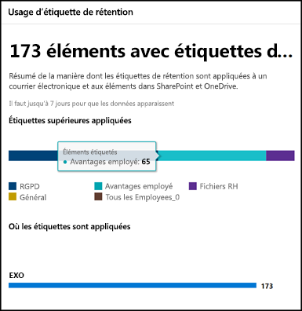
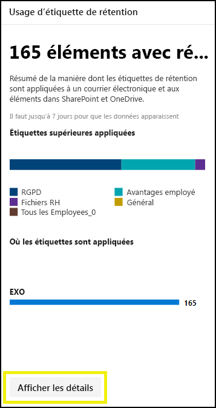
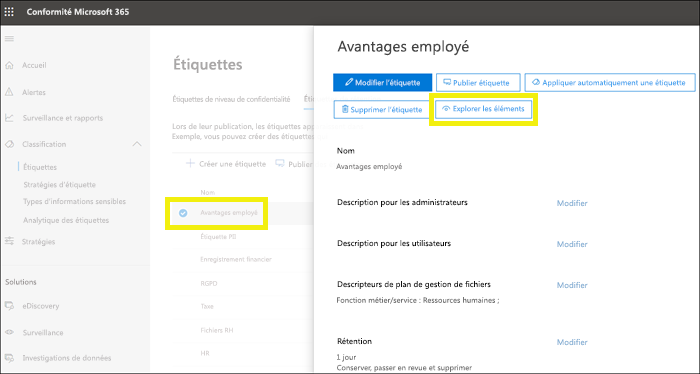
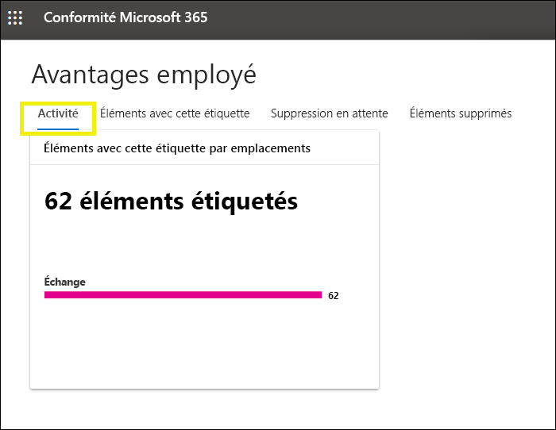
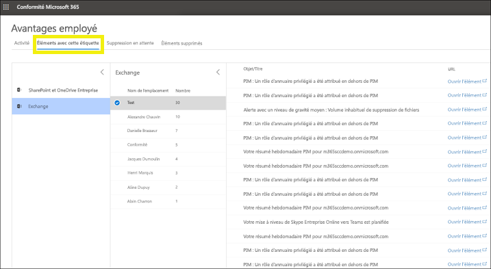

# Afficher l’utilisation d’étiquette grâce à la page Analyse des étiquettesView label usage with label analytics

Après avoir créé vos étiquettes de rétention et vos étiquettes de sensibilité, vous souhaiterez voir comment ils sont utilisés au sein de votre client.After you create your retention labels and sensitivity labels, you’ll want to see how they’re being used across your tenant. Les portails Centre de conformité Microsoft 365 et Centre de sécurité Microsoft 365 sont dotés d’une page intitulée Analyse des étiquettes. Elle indique les étiquettes les plus utilisées et leurs types d’applications.With label analytics in the Microsoft 365 compliance center and Microsoft 365 security center, you can quickly see which labels are used the most and where they’re being applied.

Par exemple, avec analytique étiquette, vous pouvez afficher:For example, with label analytics, you can view the:

- Le nombre total de rétention étiquettes et les étiquettes de sensibilité appliquées au contenu.Total number of retention labels and sensitivity labels applied to content.
- Les étiquettes supérieures et le nombre de compte pour lequel chaque étiquette a été appliquée.Top labels and the count of how many times each label was applied.
- Les emplacements où les étiquettes sont appliquées et le nombre pour chaque emplacement.Locations where labels are applied and the count for each location.
- Compter le nombre de fichiers et des dossiers pour lesquels l’étiquette de rétention a été modifiée ou supprimée.Count for how many files and folders had their retention label changed or removed.

Vous trouverez analytique étiquette dans la [centre de conformité de Microsoft 365](https://compliance.microsoft.com/labelanalytics) ou [centre de sécurité Microsoft 365](https://security.microsoft.com/labelanalytics) > **Classification**  >  \*\* Étiquettes analytique\*\*.You can find label analytics in the [Microsoft 365 compliance center](https://compliance.microsoft.com/labelanalytics) or [Microsoft 365 security center](https://security.microsoft.com/labelanalytics) > **Classification** > **Label analytics**.

## Étiquettes de niveau de confidentialitéSensitivity label usage

Les données sur l’utilisation de la sensibilité étiquette sont extraite des rapports pour Azure Information Protection-pour plus d’informations, voir [Central de création de rapports de Protection Informations Azure](https://docs.microsoft.com/azure/information-protection/reports-aip).The data on sensitivity label usage is pulled from the reports for Azure Information Protection – for more information, see [Central reporting for Azure Information Protection](https://docs.microsoft.com/azure/information-protection/reports-aip).

Notez que les rapports de Protection d’Informations Azure Information ont des[conditions préalables](/azure/information-protection/reports-aip#prerequisites) qui s’appliquent également à l’analytique d’étiquette sur les étiquettes de niveau de confidentialité dans le centre de conformité de Microsoft 365 et centre de sécurité Microsoft 365.Note that the Azure Information Protection reports have [prerequisites](/azure/information-protection/reports-aip#prerequisites) that also apply to label analytics on sensitivity labels in the Microsoft 365 compliance center and Microsoft 365 security center. Par exemple, vous avez besoin d’un abonnement Azure qui inclut le journal Analytique, car ces rapports sont le résultat de l’envoi d’informations d’événements d’audit d’une protection à partir de scanneurs et Azure Information Protection clients vers un emplacement centralisé basé sur Azure journal Service Analytique.For example, you need an Azure subscription that includes the Log Analytics because these reports are a result of sending information protection audit events from Azure Information Protection clients and scanners to a centralized location based on Azure Log Analytics service.

Usage d’étiquettes de niveau de confidentialité:For sensitivity label usage:

- Il n’existe aucune latence dans les données.There is no latency in the data. Il s’agit d’un rapport en temps réel.This is a real-time report.
- Pour afficher le nombre de chaque étiquette supérieure, pointez sur le graphique à barres et lire l’info-bulle qui s’affiche.To see the count for each top label, point to the bar graph and read the tool tip that appears.
- Le rapport indique où les étiquettes de niveau de confidentialité sont appliquées par application (tandis que les étiquettes de rétention sont affichées par emplacement).The report shows where sensitivity labels are applied per app (whereas retention labels are shown per location).

## Usage d’étiquette de rétentionRetention label usage

Ce rapport affiche un aperçu rapide de ce que sont les étiquettes supérieures et où elles sont appliquées.This report shows a quick view of what the top labels are and where they’re applied. Pour plus d’informations sur l’intitulé de contenu dans SharePoint et OneDrive, voir [Afficher l’activité des étiquettes pour les documents](view-label-activity-for-documents.md).For more detailed information on how content in SharePoint and OneDrive is labeled, see [View label activity for documents](view-label-activity-for-documents.md).

Usage d’étiquette de rétention:For retention label usage:

- Les données sont regroupées de manière hebdomadaire, aussi cela peut prendre jusqu'à sept jours pour que les données s’affichent dans le rapport.Data is aggregated weekly, so it may take up to seven days for data to appear in the report.
- Pour afficher le nombre de chaque étiquette supérieure, pointez sur le graphique à barres et lire l’info-bulle qui s’affiche.To see the count for each top label, point to the bar graph and read the tool tip that appears.
- Le rapport indique où les étiquettes de rétention sont appliquées par emplacement (tandis que les étiquettes de sensibilité sont affichées par application).The report shows where retention labels are applied per location (whereas sensitivity labels are shown per app).
- Pour les étiquettes de rétention, il s’agit d’une synthèse des données à tout-moment dans votre client ; elles ne sont pas filtrées pour une plage de dates spécifique.For retention labels, this is a summary of the all-time data in your tenant; it’s not filtered to a specific date range. En revanche, l’[étiquette d’activité Explorer](view-label-activity-for-documents.md) affiche les données 30 derniers jours uniquement.By contrast, the [Label Activity Explorer](view-label-activity-for-documents.md) shows data from only the past 30 days.

## Afficher tout le contenu portant une étiquette de rétention spécifiqueView all content with a specific retention label

Dans le rapport d’utilisation d’étiquette de rétention, vous pouvez rapidement explorer tout le contenu associé à cette étiquette appliquée.From the retention label usage report, you can quickly explore all content with that label applied. (Notez que nous travaillons actuellement sur cette fonctionnalité, afin que le processus prenne plus d’étapes pour afficher tout le contenu étiqueté).(Note that we're currently working on this feature, so that it will take fewer steps to view all the labeled content.)

Tout d’abord, choisissez **Afficher les détails** en bas du rapport.First, choose **View Details** at the bottom of the report.

Puis choisissez une étiquette de rétention > **Explorer les éléments** dans le volet droit.Then choose a retention label > **Explore items** in the right pane.

Pour cette étiquette, vous pouvez choisir l’onglet**activité**pour consulter un nombre d’éléments associé à cette étiquette selon l’emplacement.For that label, you can choose the **Activity** tab to view a count of items with that label by location.

Vous pouvez également choisir l’onglet**éléments avec cette étiquette**. Ensuite, vous pouvez explorer des emplacements spécifiques :You can also choose the **Items with this label** tab. Then you can drill into specific locations:

- Pour Exchange Online, consultez la liste de boîtes aux lettres avec le nombre d’éléments étiquetés dans chaque boîte aux lettres.For Exchange Online, you see a list of mailboxes with the count of labeled items in each mailbox.
- Pour SharePoint Online et OneDrive Entreprise, vous voyez une liste de collections de sites et les comptes OneDrive avec le nombre d’éléments étiquetés dans chaque emplacement.For SharePoint Online and OneDrive for Business, you see a list of site collections and OneDrive accounts with the count of labeled items in each location.

Lorsque vous choisissez une collection de boîte aux lettres ou un site, vous pouvez afficher une liste d’éléments associé à cette étiquette rétention dans cet emplacement.When you choose a mailbox or site collection, you can view a list of items with that retention label in that location.

## AutorisationsPermissions

Pour afficher analytique étiquette, vous devez être affecté parmi les rôles suivants dans Azure Active Directory :To view label analytics, you must be assigned one of the following roles in Azure Active Directory:

- Administrateur généralGlobal administrator
- Administrateur de conformitéCompliance administrator
- Administrateur de sécuritéSecurity administrator
- Lecteur SécuritéSecurity reader

Par ailleurs, notez que ces rapports utilisent Azure Monitor pour stocker les données dans un espace de travail journal Analytique appartenant à votre organisation.In addition, note these reports use Azure Monitor to store the data in a Log Analytics workspace that your organization owns. Par conséquent, l’utilisateur doit être ajouté en tant que lecteur à l’espace de travail Azure Monitor qui détient les données. Pour plus d’informations, voir [Autorisations nécessaires pour les analyses Azure Information Protection](https://docs.microsoft.com/azure/information-protection/reports-aip#permissions-required-for-azure-information-protection-analytics).Therefore, the user should be added as a reader to the Azure Monitoring workspace that holds the data - for more information, see [Permissions required for Azure Information Protection analytics](https://docs.microsoft.com/azure/information-protection/reports-aip#permissions-required-for-azure-information-protection-analytics).

