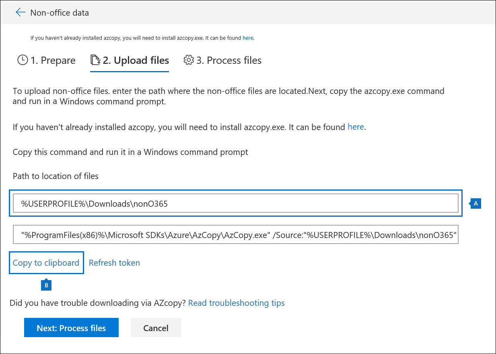

# Charger des données non-Microsoft 365 dans la preuve

Tous les documents que vous devrez peut-être analyser dans une enquête sur les données se trouvent dans Microsoft 365. Avec la fonctionnalité d’importation de contenu non-Microsoft 365, vous pouvez télécharger des documents qui ne résident pas dans Microsoft 365 dans des preuves afin qu’ils puissent être analysés lors d’une enquête de données.

## Avant de commencer

L’utilisation de la fonctionnalité Télécharger non-Microsoft 365, comme décrit dans cette procédure, nécessite que vous disposiez des éléments suivants :

- Un abonnement Microsoft 365 ou Office 365 E5.

- Tous les intérêts dont le contenu n’est pas Microsoft 365 seront téléchargés doivent disposer de la licence de complément E5 ou E5 appropriée.

- Un cas eDiscovery existant.

- Tous les fichiers de téléchargement rassemblé dans des dossiers où se trouve un dossier par dépositaire et le nom de ces dossiers est au format *alias@domainname*. Le *alias@domainname* doit être l’alias et le domaine de l’utilisateur. Vous pouvez collecter tous les dossiers *alias@domainname* dans un dossier racine. Le dossier racine ne peut contenir que les dossiers *alias@domainname* , il ne doit pas y avoir de fichiers libres dans le dossier racine.

- Un compte qui est un gestionnaire eDiscovery ou un administrateur eDiscovery outils de stockage Microsoft Azure installé sur un ordinateur ayant accès à la structure de dossiers de contenu non-Microsoft 365.

- Installez AzCopy en procédant comme suit :https://docs.microsoft.com/azure/storage/common/storage-use-azcopy

## Télécharger du contenu non-Microsoft 365 dans une enquête de données

1. Ouvrez les **enquêtes de données** et accédez à l’enquête sur laquelle les données non Microsoft 365 seront téléchargées.  Cliquez sur l’onglet **Evidence** , puis sélectionnez l’ensemble de preuves sur lequel vous souhaitez charger les données.  Si vous n’avez pas encore créé d’ensemble de preuves, vous pouvez le faire maintenant.  Enfin, cliquez sur **gérer les preuves** , puis afficher les **téléchargements** dans la section données.

2. Cliquez sur le bouton **Télécharger les fichiers** pour démarrer l’Assistant importation de données non-Microsoft 365.

3. La première étape de l’Assistant consiste à préparer un objet BLOB Azure sécurisé pour les fichiers à charger.  Une fois la préparation terminée, cliquez sur le bouton **suivant : charger des fichiers** .

 
4. Dans l’étape **Télécharger les fichiers** , spécifiez le chemin d' **accès à l’emplacement des fichiers**, c’est ici que se trouvent les données autres que Microsoft 365 que vous prévoyez d’importer.  La définition de l’emplacement correct garantit la mise à jour correcte de la commande AzCopy.

> [!NOTE]
> Si vous n’avez pas encore installé AzCopy, vous pouvez le faire à partir de là :https://docs.microsoft.com/azure/storage/common/storage-use-azcopy

5. Copiez la commande prédéfinie en cliquant sur le lien **copier dans le presse-papiers** . Démarrez une invite de commandes Windows, collez la commande et appuyez sur entrée.  Les fichiers sont téléchargés vers le stockage BLOB Azure sécurisé pour l’étape suivante.

6. Enfin, revenez à la sécurité & conformité et cliquez sur le bouton **suivant : traiter les fichiers** .  Cela lance le traitement, l’extraction de texte et l’indexation des fichiers téléchargés.  Vous pouvez suivre la progression du traitement ou dans l’onglet **travaux** .  Une fois terminé, les nouveaux fichiers sont disponibles dans l’ensemble de preuves.  Une fois le traitement terminé, vous pouvez faire disparaître l’Assistant.

