# Gestionnaire de conformité Microsoft (classique)

> [!NOTE]
> Cette documentation décrit une version antérieure de ce produit. Il est fortement déconseillé aux utilisateurs d’utiliser cette version du Gestionnaire de conformité. Ils sont encouragés à utiliser plutôt le nouveau [score de conformité Microsoft](compliance-score.md).

 *Le Gestionnaire de conformité n’est pas disponible dans Office 365 géré par 21Vianet, Office 365 Germany, Office 365 U.S. GCC High ou Office 365 Department of Defense.*
  
Le gestionnaire de conformité est un outil d’évaluation des risques des flux de travail disponible dans le [Portail d’approbation de services de Microsoft](https://docs.microsoft.com/microsoft-365/compliance/get-started-with-service-trust-portal). Il vous permet de suivre, d’affecter et de vérifier les activités de mise en conformité de votre organisation avec les réglementations liées aux services professionnels Microsoft et aux services de cloud computing Microsoft, tels que Microsoft Office 365, Microsoft Dynamics 365 et Microsoft Azure. 

Gestionnaire de conformité :
  
- Rassemble, d’une part, les informations détaillées fournies par Microsoft aux auditeurs et aux autorités de régulation dans le cadre des audits des services cloud de Microsoft menés par des tiers dans le but de vérifier le respect de différentes normes (par exemple, ISO 27001, ISO 27018 et NIST), et, d’autre part, les informations collectées en interne par Microsoft pour assurer sa conformité aux réglementations en vigueur (par exemple, la loi américaine HIPAA et le Règlement général sur la protection des données de l’UE, ou RGPD) en laissant votre organisation vérifier sa propre conformité avec ces normes et réglementations.
    
- Vous permet d’affecter, de suivre et d’enregistrer les activités de conformité et d’évaluation, pour aider vos équipes à contourner les obstacles à la réalisation des objectifs de conformité de votre organisation.
    
- Attribue un Score de conformité qui vous permet de suivre votre progression et de hiérarchiser les contrôles d’audit qui vous aideront à limiter les risques auxquels votre organisation s’expose.
    
- Vous offre un référentiel sécurisé pour charger et gérer les preuves et autres artefacts liés à vos activités de conformité.
    
- Génère des rapports détaillés dans Microsoft Excel qui documentent les activités de conformité effectuées par Microsoft et votre organisation, qui peuvent être fournis aux auditeurs, aux autorités de régulation et aux autres acteurs de la conformité.

Pour une brève démonstration du Gestionnaire de conformité, regardez cette vidéo [Gestionnaire de conformité](https://www.youtube.com/watch?v=r1vs8NdSXKQ).

    
> [!IMPORTANT]
> Compliance Manager is a dashboard that provides a summary of your data protection and compliance stature and recommendations to improve data protection and compliance. The Customer Actions provided in Compliance Manager are recommendations; it is up to each organization to evaluate the effectiveness of these recommendations in their respective regulatory environment prior to implementation. Recommendations found in Compliance Manager should not be interpreted as a guarantee of compliance.

    
## Qu’est-ce que le Gestionnaire de conformité ?

Compliance Manager is a workflow-based risk assessment tool designed to help you manage regulatory compliance within the shared responsibility model of the cloud. Compliance Manager provides you with a dashboard view of standards and regulations and assessments that contain Microsoft's control implementation details and test results and customer control implementation guidance and tracking for your organization to enter. Compliance Manager provides certification assessment control definitions, guidance on implementation and testing of controls, risk-weighted scoring of controls, role-based access management, and an in-place control action assignment workflow to track control implementation, testing status and evidence management. Compliance Manager optimizes compliance workload by enabling customers to logically group assessments together and apply assessment control testing to identical or related controls, reducing the duplication of effort that might otherwise be required to satisfy identical control requirements across different certifications.

## Évaluations dans le Gestionnaire de conformité

The core component of Compliance Manager is called an *Assessment*. An Assessment is an assessment of a Microsoft service against a certification standard or data protection regulation (such as ISO 27001:2013, and the GDPR). Assessments help you to discern your organization's data protection and compliance posture against the selected industry standard for the selected Microsoft cloud service. Assessments are completed by the implementation of the controls that map to the certification standard being assessed. 
  
La structure d’une évaluation repose sur la responsabilité partagée entre Microsoft et votre organisation pour évaluer les risques de sécurité et de conformité dans le cloud et pour implémenter les dispositifs de protection des données établis par une norme de conformité, une norme de protection des données, une réglementation ou une loi.
  
Une évaluation est constituée de plusieurs composants :
  
- **Services inclus** : chaque évaluation concerne un ensemble spécifique de services Microsoft, qui sont répertoriés dans la section Services cloud inclus. 
    
- **Microsoft-Managed Controls** - For each cloud service, Microsoft implements and manages a set of  *controls*  as part of Microsoft's compliance with various standards and regulations. These controls are organized into  *control families*  that align with the structure from the corresponding certification or regulation that the Assessment is aligned to. For each Microsoft-managed control, Compliance Manager provides details about how Microsoft implemented the control, along with how and when that implementation was tested and validated by an independent third-party auditor. 
    
    Voici un exemple de trois contrôles gérés par Microsoft dans la famille de contrôles **Sécurité** extraits d’une évaluation d’Office 365 par rapport au RGPD. 

    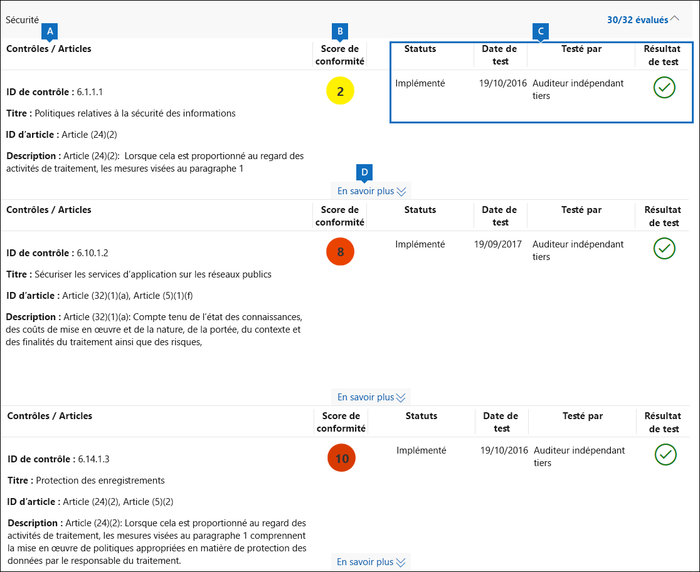
  
  a. Specifies the following information from the certification or regulation that maps to the Microsoft-managed control.

  - **ID du contrôle** : numéro de la section ou de l’article extrait de la certification ou de la réglementation qui renvoie au contrôle.
    
  - **Titre** : titre de la certification ou de la réglementation correspondante.
    
  - **ID de l’article** : ce champ apparaît uniquement pour les évaluations du RGPD, car il indique le numéro de l’article du RGPD correspondant.
    
  - **Description** : texte de la norme ou de la réglementation qui renvoie au contrôle géré par Microsoft sélectionné.

  b. The Compliance Score for the control, which indicates the level of risk (due to non-compliance or control failure) associated with each Microsoft-managed control. See [Understanding the Compliance Score](#understanding-the-compliance-score) for more information. Note that Compliance Scores are rated from 1 to 10 and are color-coded. Yellow indicates low risk controls, orange indicates medium-risk controls, and red indicated high-risk controls. 
    
  c. Information about the implementation status of a control, the date the control was tested, who performed the test, and the test result.
    
  d. For each control, you can click **More** to see additional information, including details about Microsoft's implementation of the control and details about how the control was tested and validated by an independent third-party auditor. 
    
- **Customer-Managed Controls** - This is the collection of controls that are managed by your organization. Your organization is responsible for implementing these controls as part of your compliance process for a given standard or regulation. Customer-managed controls are also organized into control families for the corresponding certification or regulation. Use the customer-managed controls to implement the recommended actions suggested by Microsoft as part of your compliance activities. Your organization can use the prescriptive guidance and recommended Customer Actions in each customer-managed control to manage the implementation and assessment process for that control.
    
    Customer-managed controls in Assessments also have built-in workflow management functionality that you can use to manage and track your organization's progress towards completing the Assessment. For example, a Compliance Officer in your organization can assign an Action Item to an IT admin who has the responsibility and necessary permissions to perform the actions that are recommended for the control. When that work is complete, the IT admin can upload evidence of their implementation tasks (for example, screenshots of configuration or policy settings) and then assign the Action Item back to the Compliance Officer to evaluate the collected evidence, test the implementation of the control, and record the implementation date and test results in Compliance Manager. For more information, see the [Managing the assessment process](#managing-the-assessment-process) section in the article. 
  
## Autorisations et contrôle d’accès en fonction du rôle

Le Gestionnaire de conformité utilise un modèle d’autorisation de contrôle d’accès basé sur les rôles. Seuls les utilisateurs dotés d’un rôle d’utilisateur peuvent accéder au Gestionnaire de conformité et les actions autorisées par utilisateur sont limitées par type de rôle.
  
Notez qu’il n’y a plus de rôle **Accès invité** par défaut. Chaque utilisateur doit se voir attribuer un rôle afin de pouvoir utiliser le Gestionnaire de conformité.
  
The following table describes each Compliance Manager permission and what it allows the user do. The table also indicates the role that each permission is assigned to.
  
||**Lecteur du Gestionnaire de conformité**|**Contributeur du Gestionnaire de conformité**|**Évaluateur du Gestionnaire de conformité**|**Administrateur du Gestionnaire de conformité**|**Administrateur du Portail**|
|:-----|:-----|:-----|:-----|:-----|:-----|
|**Lire les données** : les utilisateurs peuvent consulter les données sans pouvoir les modifier.    |             |             |             |             |            |
|**Modifier les données** : les utilisateurs peuvent modifier tous les champs à l’exception des champs Résultat de test et Date du test.    ||            |             |             |             |
|**Modifier les résultats de test** : les utilisateurs peuvent modifier les champs Résultat de test et Date du test.    ||  |             |             |             |
|**Gérer les évaluations** : les utilisateurs peuvent créer, archiver et supprimer des évaluations.    |||  |             |             |
|**Manage users** - Users can add other users in their organization to the Reader, Contributor, Assessor, and Administrator roles. Only those users with the Global Administrator role in your organization can add or remove users from the Portal Admin role.    ||||  |             |
   
## Présentation du Score de conformité

Sur le tableau de bord, le Gestionnaire de conformité affiche un score total pour les évaluations Office 365 dans l’angle supérieur droit de la vignette. Il s’agit du score de conformité total global de l’analyse, qui résulte de l’accumulation des points reçus pour chacune des analyses de contrôle qui a été marquée comme implémentée et testée dans le cadre de l’évaluation. Lors de l’ajout d’une évaluation, vous constaterez que le score de conformité est déjà en cours d’exécution, car les points pour les contrôles gérés par Microsoft qui ont été implémentés par Microsoft et testés par des tiers indépendants sont déjà appliqués.
  

  
Les points restants proviennent de l’évaluation réussie du contrôle du client, à la suite de l’implémentation et du test des contrôles gérés par le client, chaque étape correspondant à une valeur spécifique qui s’ajoute au score de conformité global. 
  
Chaque évaluation affiche un score de conformité basé sur le risque pour vous aider à évaluer le niveau de risque (en raison d’une non-conformité ou d’un échec de contrôle) associé à chacun des contrôles (gérés par Microsoft et par le client) d’une évaluation. Un nombre possible de points (appelé *classement de gravité) sur une échelle de 1 à 10 est attribué à chaque contrôle géré par le client. Plus le nombre de points attribués à un contrôle est important, plus le facteur de risque en cas d’échec du contrôle est élevé. 
  
Par exemple, le contrôle d’évaluation Gestion de l’accès utilisateur illustré ci-dessous présente un risque très élevé et affiche une valeur de 10.
  

  
 En comparaison, le contrôle d’évaluation Sauvegarde des informations ci-dessous présente un risque plus faible et affiche une valeur de 3. 
  

  
The Compliance Manager assigns a default severity ranking to each control. Risk rankings are calculated based on the following criteria:
  
- La présence d’un contrôle qui empêche les incidents (classement le plus élevé), détecte les incidents qui se sont produits, ou corrige l’impact d’un incident (classement le plus bas). En termes de degré de gravité, un contrôle obligatoire qui prévient une menace se voit attribuer le plus grand nombre de points ; les contrôles de détection ou de correction (qu’ils soient obligatoires ou discrétionnaires) se voient attribuer le plus petit nombre de points.
    
- Si un contrôle (une fois implémenté) est obligatoire et ne peut pas être contourné par les utilisateurs (par exemple, les utilisateurs devant réinitialiser leur mot de passe et respecter les caractères et longueur de mot de passe exigés), ou s’il est discrétionnaire et peut être contourné par les utilisateurs (par exemple, des règles métier qui obligent les utilisateurs à verrouiller leur écran quand leur ordinateur est laissé sans surveillance).
    
- Controls related to risks to data confidentiality, integrity, and availability, whether these risks come from internal or external threats, and whether the threat is malicious or accidental. For example, controls that would help prevent an external attacker from breaching that network and gaining access to personally identifiable information would be assigned more points than a control related to preventing an employee from accidentally mis-configuring a network router setting that results in a network outage).
    
- Les risques liés à des facteurs juridiques externes, tels que les contrats, les réglementations et les engagements publics, de chaque contrôle.
    
The displayed Compliance Score values for the control are applied  *in their entirety*  to the Total Compliance Score on a pass/fail basis--either the control is implemented and passes the subsequent assessment test or it does not; there is no partial credit for a partial implementation. Only when the control has its **Implementation Status** set to **Implemented** or **Alternative Implementation** and the **Test Result** is set to **Passed** are the assigned points added to the Total Compliance Score. 
  
L’essentiel est que le score de conformité peut vous aider à hiérarchiser les contrôles pour vous concentrer sur l’implémentation en indiquant quels contrôles sont associés à un risque potentiel plus élevé en cas d’échec. En plus de la hiérarchisation basée sur les risques, quand des contrôles d’évaluation portent sur d’autres contrôles (soit dans la même évaluation, soit dans une autre faisant partie du même groupe d’évaluations), l’accomplissement d’un seul contrôle peut entraîner une réduction significative de l’effort en fonction de la synchronisation des résultats des tests de contrôle.
  
Par exemple, dans l’image ci-dessous, l’évaluation GDPR-Office 365 est finalisée à 46 %, avec 51 contrôles sur 111 évalués et un score de conformité total de 289 sur un total possible de 600.
  

  
Au sein de l’analyse du contrôle RGPD, le contrôle 7.5.5 est lié à 5 autres contrôles (7.4.1, 7.4.3, 7.4.4, 7.4.8 et 7.4.9) chacun avec un score de gravité du risque modéré à élevé (de 6 ou 8). En utilisant le filtre d’évaluation, nous avons sélectionné tous ces contrôles afin de les rendre visibles dans la vue d’évaluation, et nous pouvons constater ci-dessous qu’aucun d’entre eux n’a été évalué. 
  
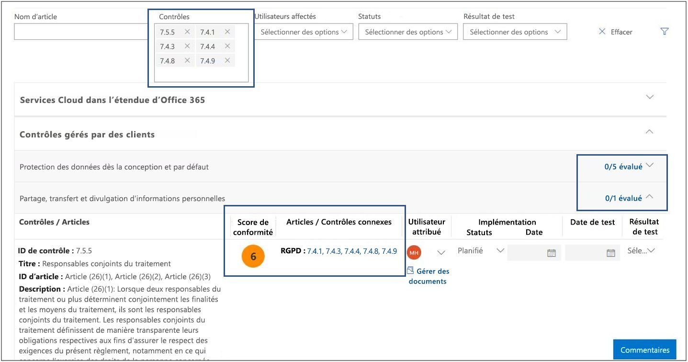 As those 6 controls are related, the completion of any one them will result in a synchronization of those test results across the related controls within this assessment (just as it will for any related controls in an assessment that is in the same assessment grouping). Upon completion of the implementation and testing of GDPR control 7.5.5, the control detail area refreshes to show that all 6 controls have been assessed, with a corresponding increase in the number of assessed controls to 57 and 51% assessed, and a change in total Compliance Score of +40. 
  
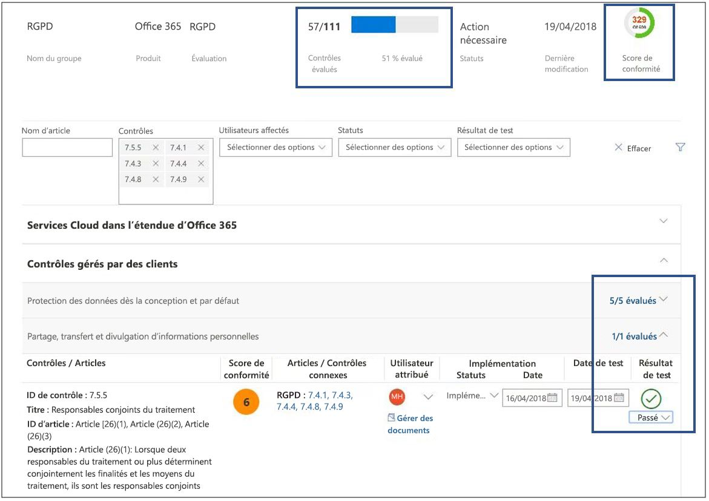
  
Cette boîte de dialogue de confirmation de mise à jour apparaît si vous êtes sur le point de modifier l’état d’implémentation d’un contrôle d’une manière qui influera sur les autres contrôles associés.
  
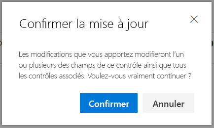
  
> [!NOTE]
> Currently, only Assessments for Office 365 cloud services include a Compliance Score. Assessments for Azure and Dynamics show an assessment status. 

## Méthodologie du Score de conformité

Le Score de conformité, à l’instar du Degré de sécurisation Microsoft, s’apparente à d’autres systèmes de notation basés sur le comportement ; l’activité de votre organisation peut augmenter son Score de conformité en effectuant des activités liées à la sécurité, la confidentialité et la protection des données.
  
> [!NOTE]
> The Compliance Score does not express an absolute measure of organizational compliance with any particular standard or regulation. It expresses the extent to which you have adopted controls which can reduce the risks to personal data and individual privacy. No service can guarantee that you are compliant with a standard or regulation, and the Compliance Score should not be interpreted as a guarantee in any way. 
  
Assessments in Compliance Manager are based on the shared responsibility model for cloud computing. In the shared responsibility model, Microsoft and each customer share responsibility for the protection of the customer's data when that data is stored in our cloud.
  
Comme illustré dans l’analyse RGPD Office 365 ci-dessous, Microsoft et ses clients sont conjointement responsables de la mise en œuvre des différentes actions permettant de répondre aux exigences de la norme ou de la réglementation évaluée. Pour rationaliser et comprendre les actions requises pour répondre aux exigences d’un large éventail de normes et réglementations, le Gestionnaire de conformité traite toutes les normes et réglementations comme s’il s’agissait de cadres de contrôle. Ainsi, les actions mises en œuvre par Microsoft et par les clients pour chaque évaluation impliquent l’implémentation et la validation de différents contrôles.
  

  
Voici le flux de travail standard d’une Action classique :
  
1. The Compliance, Risk, Privacy, and/or Data Protection Officer of an organization assigns the task to someone in the organization to implement a control. That person could be:

    - Le propriétaire d’une stratégie d’entreprise
    
    - Un ingénieur informatique
    
    - Une autre personne de l’organisation chargée d’accomplir cette tâche
    
2. That individual performs the tasks necessary to implement the control, uploads evidence of implementation into Compliance Manager, and marks the control(s) tied to the Action as implemented. Once these tasks are completed, they assign the Action to an Assessor for validation. Assessors can be:
    
    - Des évaluateurs internes qui valident les contrôles au sein d’une organisation
    
    - Des évaluateurs externes qui examinent, vérifient et certifient la conformité, telles que les organisations indépendantes tierces qui auditent les services de cloud computing Microsoft
    
3. L’évaluateur valide le contrôle et examine les preuves, puis il marque le ou les contrôles évalué(s) et les résultats de l’évaluation (par exemple, réussite).
    
Une fois que tous les contrôles associés à une évaluation ont été évalués, l’évaluation est considérée comme étant terminée.
  
Every Assessment in Compliance Manager comes pre-loaded with information that provides details about the Actions taken by Microsoft to satisfy the requirements of the controls for which Microsoft is responsible. This information includes details about how Microsoft has implemented each control and how and when Microsoft's implementation was assessed and verified by a third-party auditor. For this reason, the Microsoft Managed Controls for each Assessment are marked as Assessed, and the Compliance Score for the Assessment reflects this.
  
Each Assessment includes a total Compliance Score based on the shared responsibility model. Microsoft's implementation and testing of controls for Office 365 contributes a portion of the total possible points associated with a GDPR assessment. As the customer implements and tests each of the customer Actions, the Compliance Score for the Assessment will increase by the value assigned to the control. 
  
 ### Méthodologie du score basé sur les risques
  
Compliance Manager uses a risk-based scoring methodology with a scale from 1-10 that assigns a higher value to controls that represent a higher risk in the event the control fails or is non-compliant. The scoring system used by Compliance Score is based on several key factors, such as:
  
- La nature du contrôle
    
- Le niveau de risque du contrôle selon les types de menace auxquelles il est exposé
    
- Les facteurs externes au contrôle
    
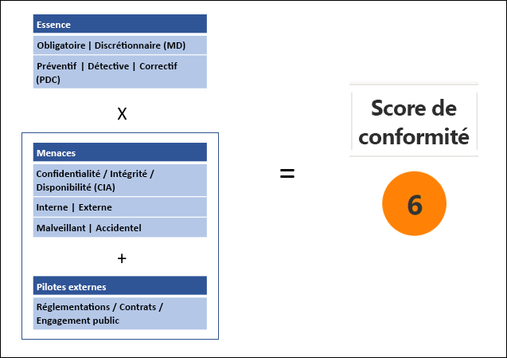
  
 ### Nature du contrôle
  
Un contrôle peut être Obligatoire ou Discrétionnaire, et Préventif, Détecteur ou Correctif.
  
 ### Obligatoire ou discrétionnaire
  
 *Mandatory controls*  are controls that cannot be bypassed either intentionally or accidentally. An example of a common mandatory control is a centrally-managed password policy that sets requirements for password length, complexity, and expiration. Users must comply with these requirements in order to access the system. 
  
 *Discretionary controls*  rely upon users to understand policy and act accordingly. For example, a policy requiring users to lock their computer when they leave it is a discretionary control because it relies on the user. 
  
 ### Préventif, détecteur ou correctif
  
 *Preventative controls*  are those that prevent specific risks. For example, protecting information at rest using encryption is a preventative control against attacks, breaches, etc. Separation of duties is a preventative control to manage conflict of interest and to guard against fraud. 
  
 *Detective controls*  are those that actively monitor systems to identify irregular conditions or behaviors that represent risk or that can be used to detect intrusions or determine if a breach has occurred. System access auditing and privileged administrative actions auditing are types of detective monitoring controls; regulatory compliance audits are a type of detective control used to find process issues. 
  
 *Corrective controls*  are those that try to keep the adverse effects of a security incident to a minimum, take corrective action to reduce the immediate effect, and reverse the damage, if possible. Privacy incident response is a corrective control to limit damage and restore systems to an operational state after a breach. 
  
En évaluant chaque contrôle à l’aide de ces facteurs, nous déterminons la nature du contrôle et lui attribuons une valeur par rapport au risque qu’il présente.
  
 **Menace**
  
||||
|:-----|:-----|:-----|
||**Obligatoire**   |**Discrétionnaire**   |
|**Préventif**   |Risque élevé    |Risque modéré    |
|**Détecteur**   |Risque modéré    |Risque faible    |
|**Correctif**   |Risque modéré    |Risque faible    |
   
Une menace désigne tout ce qui présente un risque pour la confidentialité, l’intégrité et la disponibilité des données, une norme de sécurité fondamentale universellement acceptée :
  
- La confidentialité signifie que les informations peuvent être lues et comprises uniquement par les personnes de confiance autorisées.
    
- L’intégrité signifie que les informations n’ont pas été modifiées ou détruites par des personnes non autorisées.
    
- La disponibilité signifie que les informations sont facilement accessibles selon un niveau de qualité de service élevé.
    
A failure of any of these characteristics is considered a compromise of the system as a whole. Threats can come from both internal and external sources, and an actor's intent can be accidental or malicious. These factors are estimated in a threat matrix that assigns threat levels of either High, Moderate, or Low to each combination of scenarios.

||**Interne** ||**Externe** ||||
|:-----|:-----|:-----|:-----|:-----|:-----|:-----|
||*Malveillant* |*Accidentel* |*Malveillant* |*Accidentel* |||
|**Confidentialité** |(E, M ou F)    |(E, M ou F)    |(E, M ou F)    |(E, M ou F)|
|**Intégrité** |(E, M ou F)    |(E, M ou F)    |(E, M ou F)    |(E, M ou F)|
|**Disponibilité** |(E, M ou F)    |(E, M ou F)    |(E, M ou F)    |(E, M ou F)|
   
 **Facteurs externes**
  
|**Contrats**|**Réglementations**|**Engagements publics**|
|:-----|:-----|:-----|
|(E, M ou F)    |(E, M ou F)    |(E, M ou F)    |
   
Les facteurs externes, tels que les réglementations en vigueur, les contrats et les engagements publics, peuvent influer sur les contrôles conçus pour protéger les données et prévenir les violations de données. Chacun de ces facteurs obtient une valeur de risque Élevé, Modéré ou Faible.
  
Le nombre estimé d’occurrences de ces valeurs de risque dans les 15 scénarios de risque possibles représentés dans les deux tableaux ci-dessus permet d’établir une pondération des risques, qui tient compte de l’importance de la probabilité et du nombre d’occurrences des risques à une valeur donnée, et qui est pris en compte dans le calcul du classement du contrôle selon sa gravité.
  
En fonction de la gravité du contrôle, le contrôle obtient un score de conformité, compris entre 1 (minimum) et 10 (maximum), selon le classement suivant :
  
|**Niveau de risque**|**Score du contrôle**|
|:-----|:-----|
|Faible    |1-3    |
|Modéré    |6    |
|Élevé    |8    |
|Grave    |10    |
   
En hiérarchisant les contrôles d’évaluation selon la valeur du score de conformité, l’organisation peut se concentrer sur les éléments qui présentent le risque le plus élevé. Ainsi, plus de points sont ajoutés au score de conformité total de l’évaluation pour chaque évaluation de contrôle terminée.
  
### Résumé de la méthodologie de notation
  
The Compliance Score is a core component of the way that Compliance Manager helps organizations understand and manage their compliance. The Compliance Score for an assessment is an expression of the company's compliance with a given standard or regulation as a number, where the higher the score (up to the maximum number of points allocated for the Assessment), the better the company's compliance posture. Understanding the compliance scoring methodology in which assessment controls are assigned risk severity values between 1- 10 (low to high), and how completed control assessments add to the total compliance score is crucial to organizations for prioritizing their actions.

## Regroupement des évaluations

Lorsque vous créez une analyse, vous êtes invité à créer un groupe auquel attribuer l’analyse ou à attribuer cette dernière à un groupe existant. Les groupes vous permettent d’organiser logiquement les analyses et de partager des informations courantes ainsi que des tâches de flux de travail entre les analyses dotées de contrôles gérés par le client similaires ou associés.
  
For example, you could group Assessments by year or teams, departments, or agencies within your organization or group them by year. Here are some examples of groups and the Assessments they might contain.
  
- Évaluations RGPD – 2018
    
  - Office 365 + RGPD
    
  - Azure + RGPD
    
  - Dynamics + RGPD
    
- Évaluations Azure – 2018
    
  - Azure + RGPD
    
  - Azure + ISO 27001:2013
    
  - Azure + ISO 27018:2014
    
- Évaluations de confidentialité et de sécurité des données
    
  - Office 365 + ISO 27001:2013
    
  - Office 365 + ISO 27018:2014
    
  - Azure + ISO 27001:2013
    
  - Azure + ISO 27018:2014
    
> [!TIP]
> Nous vous recommandons de déterminer une stratégie de regroupement pour votre organisation avant d’ajouter de nouvelles évaluations. 
  
Voici les conditions requises pour regrouper des évaluations :
  
- Le nom de chaque groupe (également appelé ID de groupe) doit être unique au sein de votre organisation. 
    
- Groups can contain Assessments for the same certification/regulation, but each group can only contain one Assessment for a specific cloud service/certification pair. For example, a group can't contain two Assessments for Office 365 and GDPR. Similarly, a group can contain multiple Assessments for the same cloud service as long as the corresponding certification/regulation for each one is different.
    
Une fois qu’une analyse a été ajoutée à un groupe d’analyses, il n’est plus possible de modifier celui-ci. Vous pouvez renommer le groupe d’analyses, ce qui a pour effet de modifier son nom pour toutes les analyses qui y sont associées. Vous pouvez créer une analyse et nouveau groupe d’analyses, puis copier les informations d’une analyse existante, ce qui a pour effet de créer une copie de cette analyse dans un autre groupe d’analyses. L’archivage d’une analyse rompt la relation entre cette analyse et le groupe d’analyse. Les mises à jour apportées aux autres analyses associées ne sont plus répercutées dans l’analyse archivée.
  
Comme expliqué précédemment, l’utilisation de groupes lorsque deux analyses du même groupe partagent le même contrôle géré par le client (et dès lors, les actions du client sont les mêmes pour chaque contrôle) présente l’avantage de synchroniser les détails de mise en œuvre, les informations de test et l’état du contrôle dans une analyse avec le même contrôle dans toute autre analyse du groupe. En d’autres termes, si des analyses partagent le même contrôle et que ces analyses appartiennent au même groupe, vous pouvez gérer le processus d’analyse du contrôle dans une même analyse. Les résultats de ce contrôle sont automatiquement synchronisés avec d’autres analyses. Par exemple, ISO 27001 et ISO 27018 possèdent un contrôle associé aux stratégies de mot de passe. Si le paramètre État du test correspondant au contrôle est défini sur « Réussi » dans une analyse, le contrôle est mis à jour (et marqué comme « Réussi ») dans l’autre analyse, tant que les deux analyses font partie du même groupe d’analyses.
  
À titre d’exemple, considérons ces deux contrôles d’analyse connexes ayant trait au chiffrement de données sur des réseaux publics, à savoir le contrôle 6.10.1.2 dans l’analyse Office 365 - RGPD et le contrôle SC-13 dans Office 365 - NIST 800- 53. Il s’agit de contrôles d’analyse connexes, dans deux analyses différentes faisant partie du groupe par défaut.  Dans un premier temps, aucune analyse n’a porté sur le contrôle du client, comme le montre le tableau de bord du Gestionnaire de conformité présentant ces deux analyses.
  
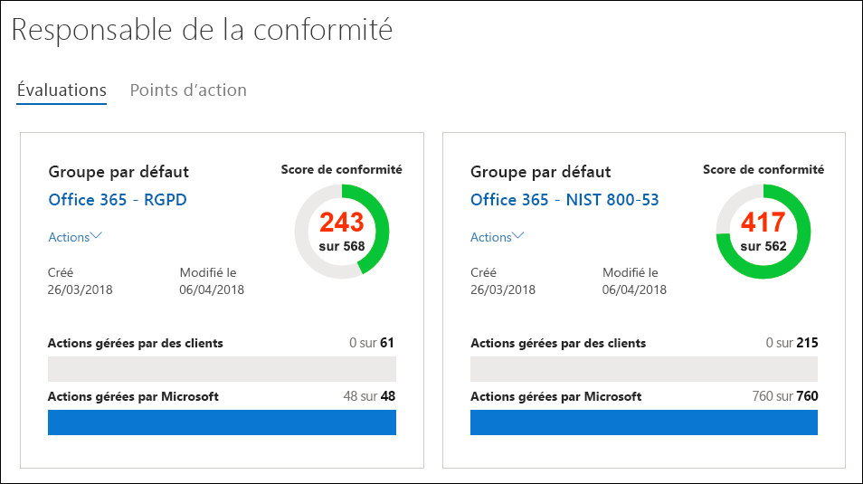
  
En cliquant sur l’évaluation **Office 365-GDPR**, et en utilisant les contrôles de filtre pour afficher le contrôle GDPR 6.10.1.2, nous pouvons voir que le contrôle NIST 800-53 SC-13 est répertorié dans la liste des contrôles associés.
  
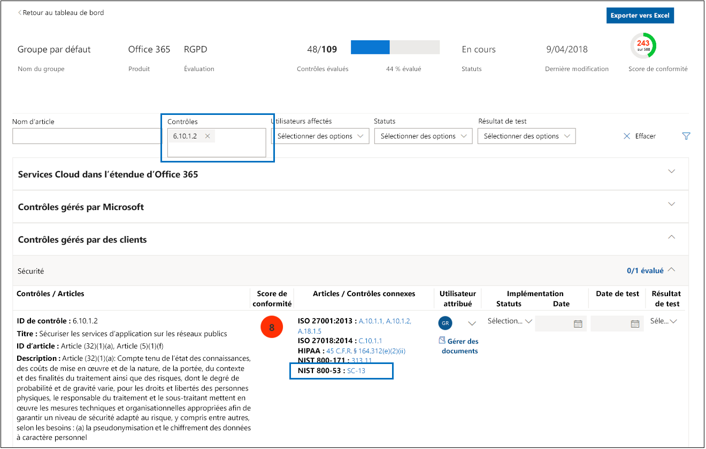
  
 Vous pouvez voir ci-dessous que l’implémentation et le test du contrôle GDPR 6.10.1.2 sont terminés. 
  

  
En accédant au contrôle associé de l’évaluation groupée, nous pouvons voir que le contrôle NIST 800-53 SC-13 a également été marqué comme terminé à la même date et à la même heure, alors qu’aucun effort n’a été déployé pour réaliser l’implémentation et le test de ce contrôle.
  

  
Dans le tableau de bord, nous pouvons voir que chaque évaluation comporte une évaluation de contrôle terminée et que le Score de conformité total de chaque évaluation a augmenté de 8 points (valeur du score de conformité de ce contrôle partagé).
  

## Fonctions d’administration

Certaines fonctions d’administration spécifiques sont uniquement disponibles dans le compte Administrateur client et visibles seulement si vous êtes connecté en tant qu’administrateur général.
  
> [!NOTE]
> The Access to Restricted Documents permission in the drop-down list will allow administrators to give users access to restricted documents that Microsoft shares on the Service Trust Portal. The Restricted Documents feature isn't available, but is coming soon. 
  
### Affectation des rôles du Gestionnaire de conformité aux utilisateurs

Each Compliance Manager role has slightly different permissions. You can view the permissions assigned to each role, see which users are in which roles, and add or remove users from that role through the Service Trust Portal by selecting the **Admin** menu item, and then choosing **Settings**. 
  

  
Pour ajouter ou supprimer des utilisateurs des rôles du Gestionnaire de conformité.
  
1. Accédez à [https://servicetrust.microsoft.com](https://servicetrust.microsoft.com).
    
2. Connectez-vous avec votre compte Administrateur général Azure Active Directory.
    
3. Dans la barre de menus supérieure du Portail d’approbation de services, cliquez sur **Administrateur**, puis **Paramètres**. 
    
4. Dans la liste déroulante **Sélectionner un rôle**, cliquez sur le rôle à gérer. 
    
5. Les utilisateurs ajoutés à chaque rôle figurent sur la page **Sélectionner un rôle**. 
    
6. To add users to this role, click **Add**. In the **Add Users** dialog, click the user field. You can scroll through the list of available users or begin typing the user name to filter the list based on your search term. Click the user to add that account to the **Add Users** list to be provisioned with that role. If you would like to add multiple users concurrently, begin typing a user name to filter the list, and then click the user to add to the list. Click **Save** to provision the selected role to these users. 
    
    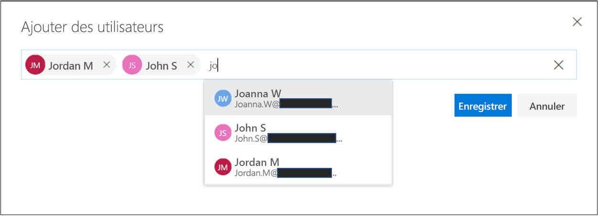
  
7. Pour supprimer des utilisateurs de ce rôle, sélectionnez le ou les utilisateurs, puis cliquez sur **Supprimer**. 
    
    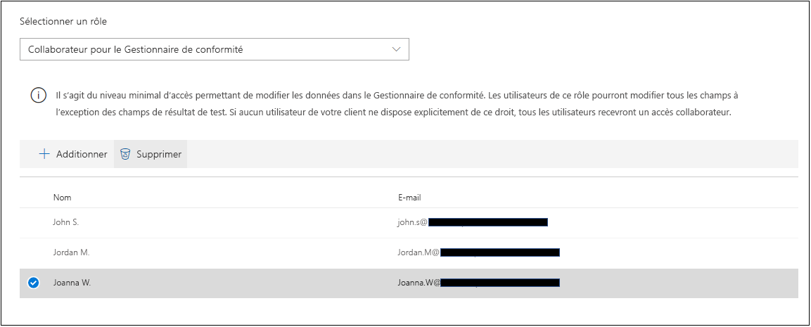
 
## Paramètres de confidentialité de l’utilisateur

Certain regulations require that an organization must be able to delete user history data. To enable this, Compliance Manager provides the **User Privacy Settings** functions, that allow administrators to: 
  
- [Rechercher un utilisateur](#search-for-a-user)

- [Exporter le rapport de l’historique des données d’un compte](#export-a-report-of-account-data-history)

- [Réaffecter des éléments d’action](#reassign-action-items)

- [Supprimer l’historique des données d’un utilisateur](#delete-user-data-history)
    

  
### Rechercher un utilisateur

Pour rechercher un compte d’utilisateur :
  
1. Entrez l’adresse e-mail de l’utilisateur en saisissant l’alias (informations situées à gauche du symbole @), puis choisissez le nom de domaine en cliquant sur la liste des suffixes de domaine à droite. S’il s’agit d’un client comportant plusieurs domaines inscrits, vous pouvez revérifier le suffixe du nom de domaine de l’adresse e-mail pour vous assurer qu’il est correct.
    
2. Une fois que le nom d’utilisateur est correctement entré, cliquez sur **Rechercher**. 
    
3. If the user account is not found, the error message 'User not found' will be displayed on the page. Check the user's email address information, make corrections as necessary and click **Search** to try again. 
    
4. Si le compte d’utilisateur est trouvé, le texte du bouton n’affichera plus **Rechercher** mais **Effacer**, ce qui indique que le compte d’utilisateur renvoyé peut utiliser les autres fonctions qui seront affichées ci-dessous, et que l’exécution de ces fonctions sera rattachée à ce compte d’utilisateur. 
    
5. Pour effacer les résultats de la recherche et rechercher un autre utilisateur, cliquez sur **Effacer**. 
    
### Exporter le rapport de l’historique des données d’un compte

Une fois le compte d’utilisateur identifié, vous pouvez générer un rapport sur les dépendances liées à ce compte. Cette information vous permettra de réattribuer des éléments d’action ouverts ou de garantir l’accès aux preuves précédemment chargées. 
  
 Pour générer et exporter un rapport :
  
1. Cliquez sur **Exporter** pour générer et télécharger un rapport sur les éléments d’action de contrôle du Gestionnaire de conformité actuellement attribués au compte d’utilisateur renvoyé, ainsi que la liste des documents chargés par cet utilisateur. En l’absence d’actions attribuées ou de documents chargés, un message d’erreur indique « Aucune données pour cet utilisateur ». 
    
2. Le rapport est téléchargé en arrière-plan de la fenêtre active du navigateur. Si aucune fenêtre de téléchargement n’apparaît, vérifiez l’historique de téléchargement de votre navigateur.
    
3. Ouvrez le document pour consulter les données du rapport.
    
> [!NOTE]
> This is not a historical report that retains and displays state changes to action item assignment history. The generated report is a snapshot of the control action items assigned at the time that the report is run (date and time stamp written into the report). For instance, any subsequent reassignment of action items will result in different snapshot report data if this report is generated again for the same user. 
  
### Réaffecter des éléments d’action

This function enables an organization to remove any active or outstanding dependencies on the user account by reassigning all action item ownership (which includes both active and completed action items) from the returned user account to a new user selected below. This action does not change document upload history for the returned user account. 
  
 Pour réaffecter des éléments d’action à un autre utilisateur :
  
1. Cliquez sur la zone d’entrée à rechercher et sélectionner un autre utilisateur de l’organisation auquel les éléments d’action de l’utilisateur renvoyé doivent être affectés.
    
2. Sélectionnez **Remplacer** pour réaffecter au nouvel utilisateur sélectionné tous les éléments d’action du contrôle de l’utilisateur renvoyé. 
    
3. Une boîte de dialogue de confirmation affiche le message suivant : « Tous les éléments d’action de contrôle de l’utilisateur actuel seront réattribués à l’utilisateur sélectionné. Cette action ne peut pas être annulée. Voulez-vous vraiment continuer ? »
    
4. Pour continuer, cliquez sur **OK**, sinon cliquez sur **Annuler**. 
    
> [!NOTE]
> All action items (both active and completed) will be assigned to the newly selected user. However, this action does not affect the document upload history; any documents uploaded by the previously assigned user will still show the date/time and name of the previously assigned user. 
  
Changing the document upload history to remove the previously assigned user will have to be done as a manual process. In that case, the administrator will need to:
  
1. Ouvrir le rapport d’exportation précédemment téléchargé.
  
2. Identifier l’élément d’action du contrôle souhaité et y accéder.
  
3. Cliquez sur **Gérer les documents** pour accéder au référentiel de preuves de ce contrôle. 
  
4. Télécharger le document.
  
5. Supprimer le document dans le référentiel de preuves.
  
6. Re-upload the document. The document will now have a new upload date, time and Uploaded By username. 
  
### Supprimer l’historique des données d’un utilisateur

This sets control action items to 'unassigned' for all action items assigned to the returned user. This also sets uploaded by value to 'user removed' for any documents uploaded by the returned user
  
 Pour supprimer un élément d’action du compte d’utilisateur et l’historique de chargement des documents :
  
1. Cliquez sur **Supprimer**. 

    A confirmation dialog will be displayed, stating "This will remove all control action item assignments and the document upload history for the selected user. This action cannot be undone. Are you sure you want to continue?"
    
3. Pour continuer, cliquez sur **OK**, sinon cliquez sur **Annuler**. 
  
## Utilisation du Gestionnaire de conformité

Le Gestionnaire de conformité propose des outils qui vous permettent d’affecter, de suivre et d’enregistrer les activités de conformité et d’évaluation, et aident vos équipes à atteindre les objectifs de conformité de votre organisation.
  
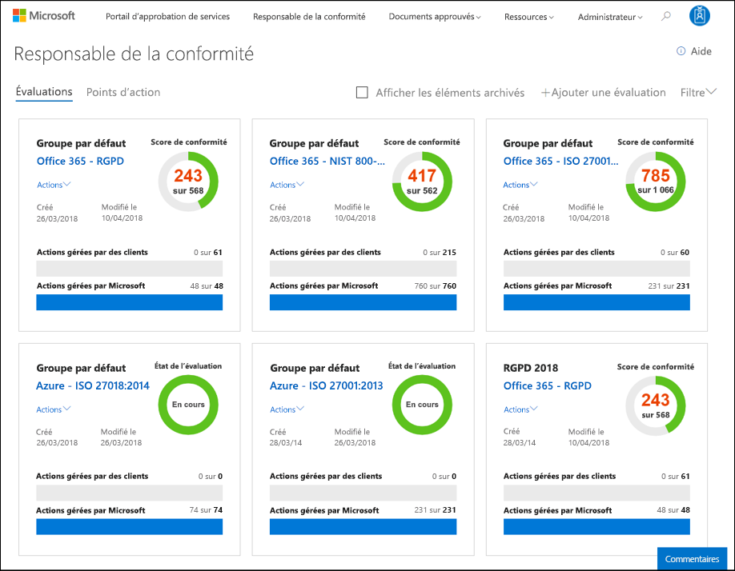

## Accès au Gestionnaire de conformité

You access Compliance Manager from the Service Trust Portal. Anyone with a Microsoft account or Azure Active Directory organizational account can access Compliance Manager.
  

  
1. Accédez à [https://servicetrust.microsoft.com](https://servicetrust.microsoft.com/).
    
2. Connectez-vous avec votre compte Azure Active Directory (Azure AD).
    
3. Dans le Portail d’approbation de services, cliquez sur **Gestionnaire de conformité**. 
    
4. When the Non-Disclosure Agreement is displayed, read it, and then click **Agree** to continue. You'll only have to do this once, and then the Compliance Manager dashboard is displayed. 

    Pour vous aider à prendre en main le Gestionnaire de conformité, nous avons ajouté les évaluations par défaut suivantes :
    
    
    
5. Cliquez sur  **Aide** pour suivre une présentation rapide du Gestionnaire de conformité. 
  
## Affichage des éléments d’action

Le Gestionnaire de conformité fournit une vue pratique de tous les points d’action d’analyse de contrôle qui vous sont attribués, ce qui vous permet d’agir rapidement et facilement sur ceux-ci. Vous pouvez afficher tous les points d’action ou sélectionner ceux qui correspondent à une certification spécifique en cliquant sur l’onglet associé à cette analyse. Par exemple, dans l’image ci-dessous, l’onglet RGPD sélectionné présente les contrôles liés à l’analyse RGPD.
  
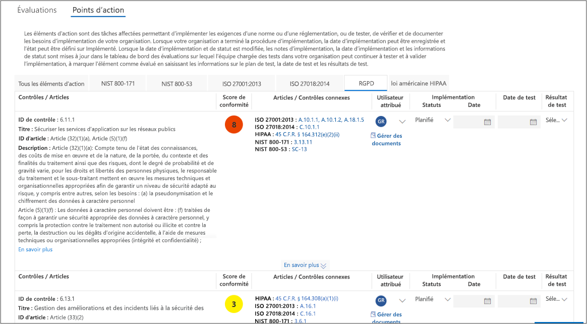
  
Pour afficher vos éléments d’action :
  
1. Accédez au tableau de bord du Gestionnaire de conformité
    
2. Cliquez sur le lien **Éléments d’action**. La page s’actualise pour afficher les éléments d’action qui vous ont été affectés. 
    
    By default, all action items are shown. If you have action items across multiple certifications, the names of the certifications will be listed in tabs across the top of the assessment control. To see the action items for a specific certification, click that tab.

## Ajout d’une évaluation

Pour ajouter une évaluation au Gestionnaire de conformité :
  
1. Dans le tableau de bord du Gestionnaire de conformité, cliquez sur  **Ajouter une évaluation**. 
    
2. In the **Add an Assessment** window, you can create a new group to add the Assessment to or you can add it to an existing group (the built-in group is named "Initial Group".) Depending on the option you choose, either type the name of a new group or select an existing group from the drop-down list. For more information, see [Grouping Assessments](#grouping-assessments).
    
    Si vous créez un groupe, vous avez également la possibilité de copier les informations d’un groupe existant vers la nouvelle analyse. Ainsi, les informations ajoutées dans les champs Détails de mise en œuvre, Plan du test et Réponse de gestion des contrôles gérés par le client des analyses du groupe à partir duquel vous effectuez la copie sont copiées vers les mêmes contrôles gérés par le client (ou associés) dans la nouvelle analyse. Si vous ajoutez une nouvelle analyse à un groupe existant, les informations courantes des analyses de ce groupe sont copiées vers la nouvelle analyse. Pour plus d’informations, voir [Copie d’informations à partir d’analyse existantes](#copying-information-from-existing-assessments).
    
3. Cliquez sur **Suivant**, puis :
    
    a. Sélectionnez un service de cloud computing Microsoft à des fins d’analyse de la conformité dans la liste déroulante **Sélectionner un produit**. 
    
    b. Sélectionnez une certification pour analyser le service de cloud computing dans la liste déroulante **Sélectionner une certification**. 
    
4. Cliquez sur **Ajouter au tableau de bord** pour créer l’évaluation. L’évaluation est ajoutée au tableau de bord du Gestionnaire de conformité dans une nouvelle vignette à la fin de la liste des vignettes existantes. 
    
    La **vignette de l’évaluation** dans le tableau de bord du Gestionnaire de conformité affiche le regroupement d’évaluations, le nom de l’évaluation (créé automatiquement en combinant le nom du service et la certification sélectionnée), la date de création et la date de dernière modification, le Score de conformité total (somme de toutes les valeurs de risque du contrôle affecté qui ont été implémentées, testées et réussies), et les indicateurs de progression qui indiquent le nombre de contrôles évalués. 
    
5. Cliquez sur le nom de l’évaluation pour l’ouvrir et afficher les détails de l’évaluation.
    
6. Cliquez sur le menu **Actions** pour consulter les éléments d’action affectés, renommer le groupe d’évaluations, exporter le rapport d’évaluation ou archiver l’évaluation. 
    
    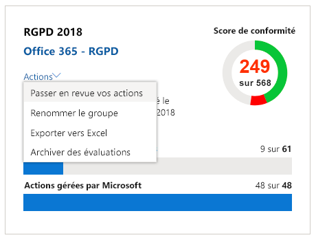

## Copie des informations des évaluations existantes

Comme indiqué précédemment, lorsque vous créez un groupe d’analyses, vous avez la possibilité de copier les informations des analyses d’un groupe existant vers la nouvelle analyse du nouveau groupe. Vous pouvez ainsi appliquer l’analyse et le processus de test effectués pour les mêmes contrôles gérés par le client à la nouvelle analyse. Par exemple, si vous disposez d’un groupe pour toutes les analyses RGPD associées au sein de votre organisation, vous pouvez copier les informations courantes d’une analyse existante lorsque vous ajoutez une nouvelle analyse au groupe.
  
Vous pouvez copier les informations suivantes d’un contrôle géré par le client dans une nouvelle évaluation :
  
- Assessment Users. An Assessment user is a user who the control is assigned to.
    
- État, Date du test et Résultats de test.
    
- Informations sur les détails de l’implémentation et le plan de test.
    
De même, les informations issues des contrôles gérés par le client partagés dans le même groupe d’analyses sont synchronisées. Les informations issues des contrôles gérés par le client associés dans la même analyse sont également synchronisées.

## Affichage des évaluations

1. Localisez la vignette de l’évaluation que vous souhaitez consulter, puis cliquez sur le nom de l’évaluation pour l’ouvrir et afficher les contrôles gérés par Microsoft et le client associés à l’évaluation, ainsi que la liste des services cloud inclus dans l’évaluation.  Voici un exemple d’évaluation liée à Office 365 et au RGPD.
    
    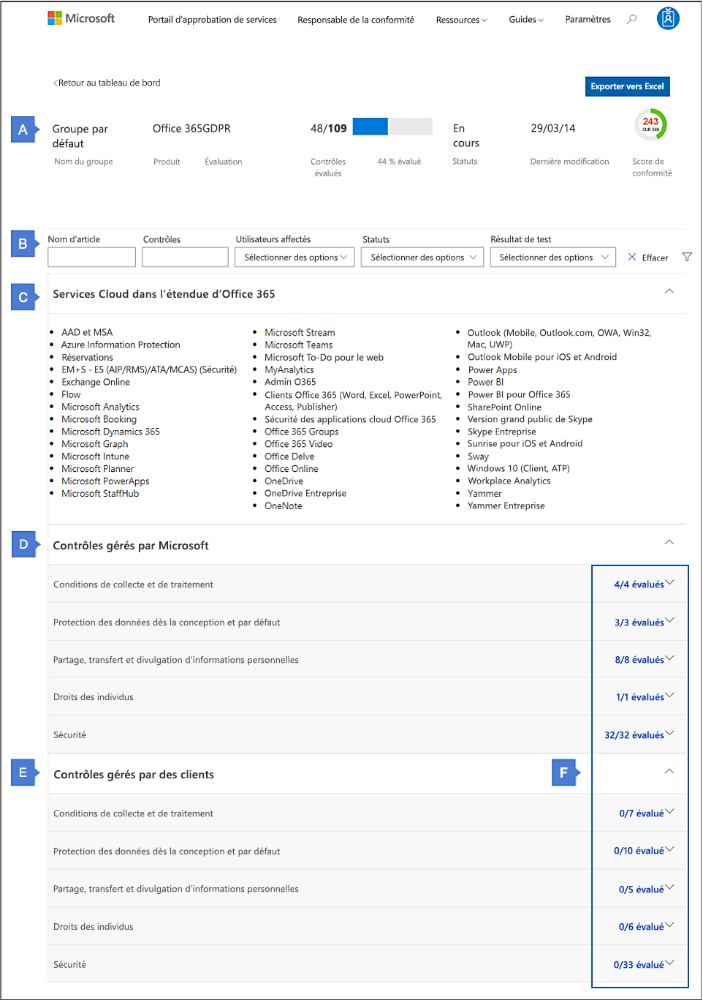
  
1. Cette section présente les informations récapitulatives de l’évaluation, notamment le nom du regroupement d’évaluations, le produit, le nom de l’évaluation et le nombre de contrôles évalués.
    
2. This section shows the Assessment Filter controls. For a more detailed explanation of how to use the Assessment Filter controls see the [Managing the assessment process](#managing-the-assessment-process) section. 
    
3. Cette section affiche les services cloud inclus dans l’évaluation.
    
4. Cette section contient les contrôles gérés par Microsoft. Les contrôles associés sont organisés par famille de contrôles. Cliquez sur une famille de contrôles pour la développer et afficher les contrôles individuels.
    
5. Cette section contient les contrôles gérés par le client, qui sont également organisés par famille de contrôles. Cliquez sur une famille de contrôles pour la développer et afficher les contrôles individuels.
    
6. Affiche le nombre total de contrôles de la famille de contrôles ainsi que le nombre de contrôles analysés. Le suivi de la progression de votre organisation en matière d’analyse des contrôles gérés par le client constitue une fonctionnalité clé du Gestionnaire de conformité. Pour plus d’informations, voir [Compréhension du score de conformité](#understanding-the-compliance-score). 

## Gestion du processus d’évaluation

Le créateur d’une analyse est dans un premier temps le seul utilisateur de l’analyse. Pour chaque contrôle géré par le client, vous pouvez attribuer un élément d’action à une membre de votre organisation pour permettre à ce membre de devenir utilisateur de l’analyse, d’effectuer les actions du client recommandées, de collecter et de charger des preuves. Lorsque vous attribuez un élément d’action, vous pouvez choisir d’envoyer un e-mail contenant les détails à une personne, notamment les actions du client recommandées ainsi que l’élément d’action prioritaire. La notification par e-mail comprend un lien vers le tableau de bord **Éléments d’action**, qui répertorie tous les éléments d’action attribués à cette personne. 
  
Voici une liste des tâches que vous pouvez effectuer à l’aide des fonctionnalités de flux de travail du Gestionnaire de conformité.
  
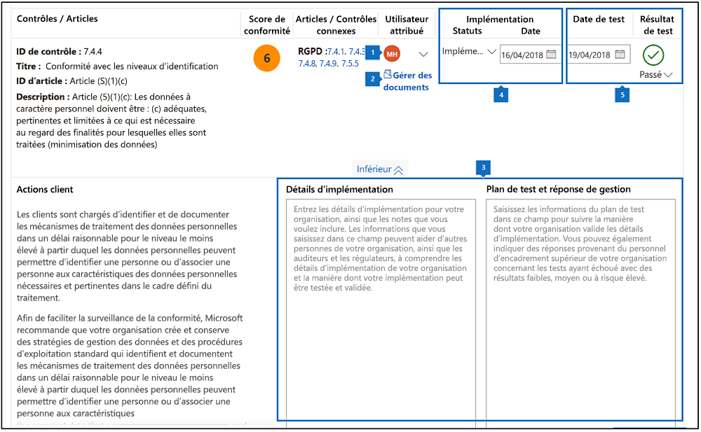
  
1. **Utilisez les options de filtrage pour trouver des contrôles d’évaluation spécifiques** : le Gestionnaire de conformité propose des **Options de filtrage** qui vous permettent d’afficher des contrôles d’évaluation selon des critères de sélection très précis et de concentrer vos efforts de mise en conformité sur des points spécifiques. 
    
    L’icône d’entonnoir du côté droit de la page permet d’afficher ou de masquer les contrôles **Options de filtre**. Ces contrôles vous permettent de spécifier des critères de filtre de façon à ce que seul les contrôles d’analyse correspondant à ceux-ci s’affichent en dessous. 
  
    - **Articles**: permet de filtrer sur le nom de l’article pour obtenir les contrôles d’analyse associés à celui-ci. Par exemple, en tapant « Article (5) », vous obtenez une liste de sélection répertoriant les articles dont le nom inclut cette chaîne, à savoir l’Article (5)(1)(a), l’Article (5)(1)(b), l’Article (5)(1)(c), etc. Sélectionner l’article (5)(1)(c) va renvoyer les contrôles associés à l’article (5)(1)(c). Il s’agit d’un champ à sélections multiples qui utilise un opérateur OU avec plusieurs valeurs. Par exemple, si vous sélectionnez Article (5)(1)(a), puis ajoutez Article (5)(1)(c), le filtre retourne les contrôles associés à l’Article (5)(1)(a) ou à l’Article (5)(1)(c). 
    
      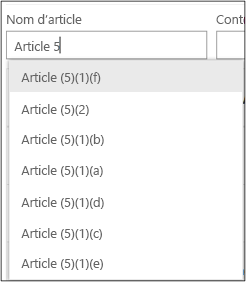
  
    - **Contrôles** : affiche la liste des contrôles dont le nom correspond au filtre. Par exemple, si vous tapez 7.3, une liste de sélection des éléments est renvoyée (par exemple, 7.3.1, 7.3.4, 7.3.5, etc.). Il s’agit d’un champ à sélection multiple qui utilise un opérateur OR à valeurs multiples. Par exemple, si vous sélectionnez 7.3.1, puis ajoutez 7.3.4, le filtre renvoie les contrôles associés à 7.3.1 ou 7.3.4. 
    
      
  
    - **Utilisateurs affectés** : affiche la liste des contrôles affectés à l’utilisateur sélectionné. 
    
    - **État** : affiche la liste des contrôles ayant l’état sélectionné. 
    
    - **Résultat de test** : affiche la liste des contrôles ayant le résultat de test sélectionné. 
    
    As you apply filter conditions, the view of applicable controls will change to correspond to your filter conditions. Expand the control family sections to show the control details below. 
    
    
  
2. If after selecting the desired filters no results are shown, that means there are no controls that correspond to the specified filter conditions. For instance, if you select a particular **Assigned User** and then choose a **Control** name that does correspond to the control assigned to that user, no assessments will be shown in the page below. 
    
3. **Assign an Action Item to a user** - You can assign an Action Item to a person to implement the requirements of a certification/regulation, or to test, verify, and document your organization's implementation requirements. When you assign an Action Item, you can choose to send an email to the person that contains details including the recommended Customer Actions and the Action Item priority. You can also unassign or reassign an Action Item to a different person. 
    
4. **Gérer les documents** Les contrôles gérés par le client permettent aussi de gérer les documents associés afin d’effectuer des tâches de mise en œuvre, ainsi que des tâches de test et de validation. Toute personne disposant des autorisations requises pour modifier les données dans le Gestionnaire de conformité peut charger des documents en cliquant sur **Gérer les documents**. Une fois le document chargé, cliquez sur **Gérer les documents** pour afficher et télécharger les fichiers. 
    
5. **Fournir des détails sur l’implémentation et le test** : tous les contrôles gérés par le client contiennent un champ modifiable où les utilisateurs peuvent ajouter des détails sur l’implémentation qui documentent les tâches effectuées par votre organisation pour répondre aux exigences de la certification/réglementation, et pour valider et documenter les actions effectuées par votre organisation pour y répondre.
    
6. **Set Status** - Set the Status for each item as part of the assessment process. Available status values are **Implemented**, **Alternative Implementation**, **Planned**, and **Not in Scope**. 
    
7. **Entrer la date du test et les résultats du test** La personne dotée du rôle Analyste du Gestionnaire de conformité peut vérifier la bonne exécution du test, revoir les détails de mise en œuvre, du plan du test, des résultats du test et toute autre preuve chargée, puis définir la Date du test et les Résultats du test. Les valeurs de résultat de test disponibles sont les suivantes : **Réussi**, **Échec avec faible risque**, **Échec avec risque intermédiaire** et **Échec avec risque élevé**. 

## Gestion des éléments d’action

Les employés impliqués dans le processus d’analyse de votre organisation peuvent utiliser le Gestionnaire de conformité pour examiner les contrôles gérés par le client de toutes les analyses pour lesquelles il existe des utilisateurs. Lorsqu’un utilisateur se connecte au Gestionnaire de conformité et ouvre le tableau de bord **Éléments d’action**, la liste des éléments d’action qui lui sont attribués s’affiche. Selon le rôle du Gestionnaire de conformité attribué à l’utilisateur, il peut fournir les détails de mise en œuvre et de test, mettre à jour l’état ou attribuer des éléments d’action. 
  
As certification controls are generally implemented by one person and tested by another, the control action item can be initially assigned to one person for implementation, and once that is complete, that person can reassign the control action item to the next person for control testing and uploading of evidence. This assignment/reassignment of control actions can be performed by any users who have a Compliance Manager role with sufficient permissions, allowing for central management of control assignments, or decentralized routing of control action items, from implementer to tester as appropriate.
  
Pour affecter un élément d’action :
  
1. Sur le tableau de bord du Gestionnaire de conformité, localisez la vignette de l’évaluation avec laquelle vous souhaitez travailler et cliquez sur le nom de l’évaluation pour accéder à la page de détails de l’évaluation.
    
2. Vous pouvez cliquer sur **Filtrer** et utiliser les contrôles de filtre pour trouver le contrôle d’évaluation spécifique à affecter, ou 
    
3. Faites défiler la page vers le bas jusqu’à la section Contrôles gérés par le client, développez la famille de contrôles et parcourez la liste de contrôles jusqu’à ce que vous trouviez le contrôle d’évaluation à affecter.
    
4. Sous la colonne **Utilisateur affecté**, cliquez sur **Affecter**. 
    
5. In the Assign Action Item dialog box, click the **Assign To** field to populate the list of users to whom the action can be assigned. You can scroll through the list to find the target user or start typing in the field to search for the username. 
    
6. Cliquez sur l’utilisateur pour lui affecter cet élément d’action.
    
7. Pour envoyer une notification par e-mail à l’utilisateur, vérifiez que la case **Envoyer une notification par e-mail** est cochée. 
    
8. Tapez des notes destinées à cet utilisateur et cliquez sur **Affecter**. 
 
    L’utilisateur recevra la notification qui l’informera de l’affectation de l’élément d’action, ainsi que les notes fournies.
    
The notes that are associated with the action item are persisted in the notes section, available for the next time the action item is assigned. These notes are not read-only, can be edited, replaced or removed by the person assigning the action item.

## Exportation des informations d’une évaluation

Vous pouvez exporter une analyse vers un fichier Excel. Celui-ci peut ensuite être examiné par les parties prenantes en matière de conformité de votre organisation, et mis à la disposition d’auditeurs et de régulateurs. Ce rapport d’analyse est un instantané de l’analyse aux date et heure de création du rapport. Il contient les détails des contrôles gérés par Microsoft et par le client pour cette analyse, à savoir l’état d’implémentation du contrôle, la date de test du contrôle, les résultats du test et des liens vers les documents de preuve chargés. Il est recommandé d’exporter le rapport d’analyse avant d’archiver une analyse, car les analyses archivées ne conservent pas les liens vers les documents chargés.
  
Pour exporter un rapport d’évaluation :
  
- Dans le tableau de bord du Gestionnaire de conformité, cliquez sur **Actions** sur la vignette de l’évaluation à exporter, puis sélectionnez **Exporter vers Excel**

  Ou
    
- Si vous affichez la page Détails de l’évaluation, cliquez sur le bouton **Exporter vers Excel** qui se trouve dans le coin supérieur droit de la page au-dessus du Score de conformité de l’évaluation.
    
The assessment report will be downloaded in your browser session. If you don't see a popup informing you of this, you may wish to check your browser's downloads folder.

## Archivage d’une évaluation

When you have completed an Assessment and no longer need it for compliance purposes, you can archive it. When an Assessment is archived, it is removed from Assessments dashboard.
  
> [!NOTE]
> When an Assessment is Archived, it cannot be 'unarchived' or restored to a read-write in progress state. Please note that Archived Assessments do not retain their links to uploaded evidence documents, so it is highly recommended that you perform an Export of the Assessment before archiving it, as the exported assessment report will contain links to the evidence documents, enabling you to continue to access them. 
  
Pour archiver une évaluation :
  
1. Dans la vignette du tableau de bord de l’évaluation souhaitée, cliquez sur **Actions**. 
    
2. Sélectionnez **Archiver l’évaluation**. 
 
    La boîte de dialogue **Archiver des évaluations** s’affiche pour vous demander de confirmer l’archivage de l’évaluation.
    
4. Pour continuer, cliquez sur **Archiver**, sinon cliquez sur **Annuler**. 
    
Pour afficher les évaluations archivées :
  
1. Sur le tableau de bord du Gestionnaire de conformité, cochez la case **Afficher les évaluations archivées**. 
    
    Les évaluations archivées sont affichées dans une nouvelle section en dessous des évaluations actives sous une barre intitulée **Évaluations archivées**.
    
3. Cliquez sur le nom de l’évaluation que vous souhaitez consulter.
    
Quand vous affichez une évaluation archivée, aucun contrôle habituellement modifiable (par exemple, Implémentation, Résultats de test) ne sera actif et le bouton **Documents gérés** ne sera pas affiché.

## Utilisation de la recherche

  
Click the magnifying glass in the upper right-hand corner of the page by to expand the Search input field, enter your search terms and press Enter. The Search control will appear, with the search term in the search pane input field, and search results will appear beneath.
  
By default, Search returns Document results, and you can use the Filter By dropdown lists to refine the list of documents displayed, to add or remove search results from view. You can use multiple filter attributes at the same time to narrow the returned documents to specific cloud services, categories of compliance or security practices, regions of the world, or industries. Click the document name link to download the document.
  
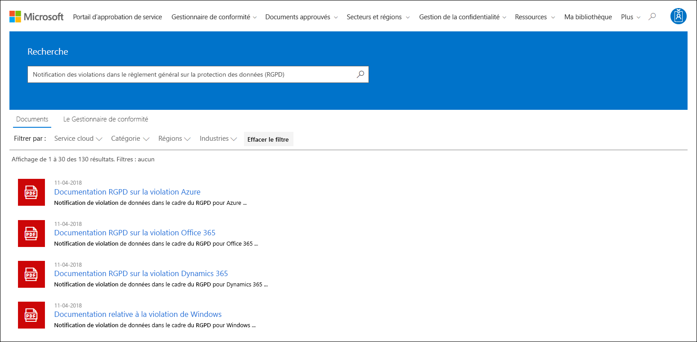
  
Cliquez sur le lien Gestionnaire de conformité afin d’afficher les résultats de la recherche pour les contrôles d’analyse du Gestionnaire de conformité. Les résultats de la recherche affichent la date de création de l’analyse, le nom du regroupement d’analyses, le service cloud applicable, et indiquent si les contrôles sont gérés par Microsoft ou le client.
  

  
> [!NOTE]
> Les rapports et les documents du Portail d’approbation de services peuvent être téléchargés dans les douze mois suivant leur publication ou jusqu’à ce qu’une nouvelle version du document soit disponible. 
 
## Prise en charge de localisation

Service Trust Portal enables you to view the page content in different languages. To change the page language, simply click on the globe icon in the lower left corner of the page and select the language of your choice. 
  

## Journal des modifications des contrôles gérés par le client

Le gestionnaire de conformité est conçu pour être mis à jour régulièrement afin qu’il prenne en compte les modifications apportées aux exigences réglementaires, ainsi que les modifications apportées à nos services cloud. Ces mises à jour incluent les modifications apportées aux contrôles gérés par les clients. Un journal des modifications est fourni afin de vous aider à comprendre l’impact de ces changements, par exemple, les détails du contenu ajouté ou modifié et des indications relatives à l’incidence des modifications sur les analyses existantes. En règle générale, il existe deux types de modifications :
  
- A **Major** change is a significant change to a Customer Action, such as the addition or removal of a control or specific numbered steps, or a change in the guidance around responsibilities, recommendations, or evidence. For Major changes, we recommend that you re-evaluate your implementation and/or assessment of the affected control.
    
- A **Minor** change is an insignificant change to a Customer Actions, such as fixing a typo or formatting issues, or updating or correcting hyperlinks. Minor changes generally do not require the control to be re-evaluated; however, we do recommend that you review the updated Customer Action.
  
### Contrôles gérés par le client - Journal des modifications de juillet 2018

|**ID de contrôle**|**Évaluation**|**Type de modification**|**Description de la modification**|**Actions recommandées aux clients**|
|:-----|:-----|:-----|:-----|:-----|:-----|:-----|:-----|:-----|
|45 C.F.R. § 164.308(a)(7)(ii)(A)  |Office 365 : HIPAA|Majeure|Ajout du contrôle HITECH à l’évaluation HIPAA pour Office 365 |Vérifiez le contrôle ajouté et les actions du client recommandées  |
|45 C.F.R.  164.312(a)(6)(ii)|Office 365 : HIPAA|Majeure|Ajout du contrôle HITECH à l’évaluation HIPAA pour Office 365|Vérifiez le contrôle ajouté et les actions du client recommandées |
45 C.F.R. § 164.312(c)(1)| Office 365 : HIPAA|Majeure| Ajout du contrôle HITECH à l’évaluation HIPAA pour Office 365 |Vérifiez le contrôle ajouté et les actions du client recommandées  |
45 C.F.R.  § 164.316(b)(2)(iii)| Office 365 : HIPAA|Majeure|Ajout du contrôle HITECH à l’évaluation HIPAA pour Office 365|Vérifiez le contrôle ajouté et les actions du client recommandées |
|

### Contrôles gérés par le client - Journal des modifications d’avril 2018

|**RGPD**|**Loi américaine HIPAA**|**ISO 27001**|**ISO 27018**|**NIST 800-53**|**NIST 800-171**|**Type de modification**|**Description de la modification**|**Actions recommandées aux clients**|
|:-----|:-----|:-----|:-----|:-----|:-----|:-----|:-----|:-----|
|6.13.2    |||C.16.1.1    |||Majeure    |Précédemment numérotée 6.12.1.1.    Ajout de détails aux recommandations.    |Ré-évaluez le contrôle : vérifiez l’aide mise à jour dans les actions du client et suivez les étapes recommandées pour implémenter et évaluer le contrôle.    |
||||||3.1.6    |Majeure    |Ajout d’étapes à l’aide, dont l’activation de l’audit et la recherche des journaux d’audit.    |Vérifiez les recommandations mises à jour dans les actions du client.    |
|6.8.2    |||A.10.2    |||Majeure    |Précédemment numérotée 6.7.2.9.    Aide mise à jour avec des recommandations et des éléments d’action supplémentaires.    |Ré-évaluez le contrôle : vérifiez l’aide mise à jour dans les actions du client et suivez les étapes recommandées pour implémenter et évaluer le contrôle.    |
|6.6.4    |45 C.F.R. § 164.312(a)(2)(i)              45 C.F.R. § 164.312(d)    |A.9.4.2    ||IA-2    |3.5.1    |Majeure    |Précédemment numérotée 6.5.2.3.    Aide mise à jour avec des recommandations et des éléments d’action supplémentaires.    |Ré-évaluez le contrôle : vérifiez l’aide mise à jour dans les actions du client et suivez les étapes recommandées pour implémenter et évaluer le contrôle.    |
|6.13.1    |45 C.F.R. § 164.308(a)(1)(i)    |A.16.1    |C.16.1    |IR-4(a)    |3.6.1    |Majeure    |Précédemment numérotée 6.12.1.    Aide mise à jour avec des recommandations et des éléments d’action supplémentaires.    |Ré-évaluez le contrôle : vérifiez l’aide mise à jour dans les actions du client et suivez les étapes recommandées pour implémenter et évaluer le contrôle.    |
|6.7    ||||||Majeure    |Précédemment numérotée 6.6.1.1.    Aide mise à jour avec des recommandations et des éléments d’action supplémentaires.    |Ré-évaluez le contrôle : vérifiez l’aide mise à jour dans les actions du client et suivez les étapes recommandées pour implémenter et évaluer le contrôle.    |
|6.6.5    |||A.10.8    |IA-3    |3.5.2    |Majeure    |Précédemment numérotée 6.5.4.2.    Aide mise à jour avec des recommandations et des éléments d’action supplémentaires.    |Ré-évaluez le contrôle : vérifiez l’aide mise à jour dans les actions du client et suivez les étapes recommandées pour implémenter et évaluer le contrôle.    |
|6.15.1    ||||||Majeure    |Précédemment numérotée 6.14.1.3.    Aide mise à jour avec des recommandations et des éléments d’action supplémentaires.    |Ré-évaluez le contrôle : vérifiez l’aide mise à jour dans les actions du client et suivez les étapes recommandées pour implémenter et évaluer le contrôle.    |
|||||AC-2(h)(2)    ||Mineure    |Ajout d’un lien au panneau Activer l’audit.    |Aucune action requise.    |
|||||AC-2(7)(b)    ||Mineure    |Ajout d’un lien au panneau Activer l’audit.    |Aucune action requise.    |
|||||AC-2(h)(1)    ||Mineure    |Ajout d’un lien au panneau Activer l’audit.    |Aucune action requise.    |
||45 C.F.R. § 164.308(a)(5)(ii)(C)    |||AC-2(g)    ||Mineure    |Ajout d’un lien au panneau Activer l’audit.    |Aucune action requise.    |
|||||AC-2(12)    ||Mineure    |Ajout d’un lien au panneau Activer l’audit.    |Aucune action requise.    |
||45 C.F.R. § 164.312(b)    |A.12.4.3    ||AU-2(d)    ||Mineure    |Ajout d’un lien au panneau Activer l’audit.    |Aucune action requise.    |
|||||AC-2(4)    ||Mineure    |Ajout d’un lien au panneau Activer l’audit.    |Aucune action requise.    |
||||||3.1.7    |Mineure    |Ajout d’un lien au panneau Activer l’audit.    |Aucune action requise.    |
|||A.16.1.7    |C.12.4.2, partie 2    |||Mineure    |Ajout d’un lien au panneau Activer l’audit.    |Aucune action requise.    |
|||||AC-2(h)(3)    ||Mineure    |Ajout d’un lien au panneau Activer l’audit.    |Aucune action requise.    |
|||A.12.4.2    ||||Mineure    |Ajout d’un lien au panneau Activer l’audit.    |Aucune action requise.    |
|||A.7.2.8    ||||Mineure    |Ajout de liens au panneau Recherche de contenu et au Portail des demandes d’accès aux données personnelles (DSR).    |Aucune action requise.    |
||45 C.F.R. § 164.308(a)(3)(ii)(C)    |||||Mineure    |Ajout de liens au tableau Activer l’audit et aux rubriques d’aide du rôle d’administrateur Office 365.    |Aucune action requise.    |
|5.2.1    ||||||Mineure    |Précédemment numérotée 5.2.2.    Clarification des responsabilités du client dans l’aide.    |Vérifiez les recommandations mises à jour dans les actions du client.    |
|masse 6.11.1    |45 C.F.R. § 164.312(e)(2)(ii)    |A.10.1.1          A.10.1.2          A.18.1.5    |C.10.1.1    |SC-13    |3.13.11    |Mineure    |Précédemment numérotée 6.10.1.2.    Correction d’une faute de frappe.    |Aucune action requise.    |
|7.5.1    ||||||Mineure    |Précédemment numérotée A.7.4.1.    Correction d’une faute de frappe.    |Aucune action requise.    |
|||A.8.2.3    |||3.1.3    |Mineure    |Suppression d’une phrase inutile.    |Aucune action requise.    |
||45 C.F.R. § 164.308(a)(4)(i)    |A.6.1.2    ||AC-5(a)    |3.1.2          3.1.4    |Mineure    |Aide mise à jour avec des recommandations et des éléments d’action supplémentaires.    |Vérifiez les recommandations mises à jour dans les actions du client.    |
||45 C.F.R. § 164.308(a)(7)(ii)(E)    |||RA-2(a)    ||Mineure    |Mise à jour du lien vers la rubrique d’aide du service d’importation en FWLink.    |Aucune action requise.    |
|

### Référence des modifications de l’ID de contrôle de l’évaluation RGPD – Journal des modifications de février 2018 

|**ID de contrôle précédent (Préversion de novembre 2017)**|**Nouvel ID de contrôle (mise à disposition générale de février 2018)**|
|:-----|:-----|
|5.2.2    |5.2.1    |
|5.2.3    |5.2.2    |
|5.2.4    |5.2.3    |
|6.1.1.1    |6.2    |
|6.10.1.2    |masse 6.11.1    |
|6.10.2.5    |6.11.2    |
|6.11.1.2    |6.12    |
|6.12.1    |6.13.1    |
|6.12.1.1    |6.13.2    |
|6.12.1.5    |6.13.3    |
|6.14.1.3    |6.15.1    |
|6.14.2.1    |6.15.2    |
|6.14.2.3    |6.15.3    |
|6.2.1.1    |6.3    |
|6.3.2.2    |6.4    |
|6.4.3.1    |6.5.2    |
|6.4.3.2    |6.8.1    |
|6.4.3.3    |6.5.3    |
|6.5.2    |6.6.1    |
|6.5.2.1    |6.6.2    |
|6.5.2.2    |6.6.3    |
|6.5.2.3    |6.6.4    |
|6.5.4.2    |6.6.5    |
|6.6.1.1    |6.7      |
|6.7.2.7    |6.8.1    |
|6.7.2.9    |6.8.2    |
|6.8.1.4    |6.9.1    |
|6.8.4.1    |6.9.3    |
|6.8.4.2    |6.9.4    |
|6.9.2.1    |6.10.1   |
|6.9.2.3    |6.10.2   |
|A.7.1.1    |7.2.1    |
|A.7.1.2    |7.2.2    |
|A.7.1.3    |7.2.3    |
|A.7.1.4    |7.2.4    |
|A.7.1.5    |7.2.5    |
|A.7.1.6    |7.2.6    |
|A.7.1.7    |7.2.7    |
|A.7.2.1    |7.3.1    |
|A.7.2.10   |7.3.9    |
|A.7.2.11   |7.3.10   |
|A.7.2.2    |7.3.2    |
|A.7.2.3    |7.3.3    |
|A.7.2.4    |7.3.4    |
|A.7.2.5    |7.3.5    |
|A.7.2.6    |7.3.6    |
|A.7.2.7    |7.3.7    |
|A.7.2.8    |7.3.8    |
|A.7.3.1    |7.4.1    |
|A.7.3.10   |7.4.10   |
|A.7.3.2    |7.4.2    |
|A.7.3.3    |7.4.3    |
|A.7.3.4    |7.4.4    |
|A.7.3.5    |7.4.5    |
|A.7.3.6    |7.4.6    |
|A.7.3.7    |7.4.7    |
|A.7.3.8    |7.4.8    |
|A.7.3.9    |7.4.9    |
|A.7.4.1    |7.5.1    |
|A.7.4.2    |7.5.2    |
|A.7.4.3    |7.5.3    |
|A.7.4.4    |7.5.4    |
|A.7.4.5    |7.5.5    |
|B.8.1.1    |8.2.1    |
|B.8.1.2    |8.2.2    |
|B.8.1.3    |8.2.3    |
|B.8.1.4    |8.2.4    |
|B.8.1.5    |8.2.5    |
|B.8.1.6    |8.2.6    |
|B.8.2.1    |8.3.1    |
|B.8.3.1    |8.4.1    |
|B.8.3.2    |8.4.2    |
|B.8.3.3    |8.4.3    |
|B.8.4.1    |8.5.1    |
|B.8.4.2    |8.5.2    |
|B.8.4.3    |8.5.4    |
|B.8.4.4    |8.5.5    |
|B.8.4.5    |8.5.3    |
|B.8.4.6    |8.5.6    |
|B.8.4.7    |8.5.7    |
|B.8.4.8    |8.5.8    |
|
   
## Voir aussi

- [Guide interactif sur le gestionnaire de conformité](https://content.cloudguides.com/guides/Compliance%20Manager)

- [Annonce de la mise à disposition générale du gestionnaire de conformité](https://techcommunity.microsoft.com/t5/Security-Privacy-and-Compliance/Announcing-Compliance-Manager-general-availability/ba-p/161922)

- [Microsoft 365 propose une stratégie de protection des données pour se conformer au RGPD](https://blogs.office.com/2018/02/22/microsoft-365-provides-an-information-protection-strategy-to-help-with-the-gdpr)
