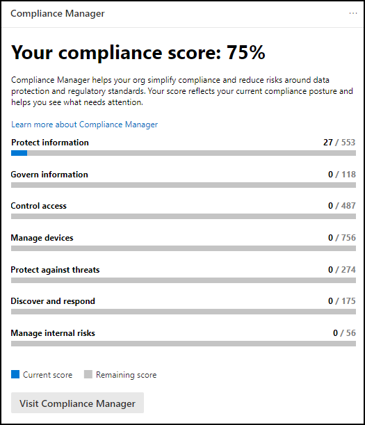
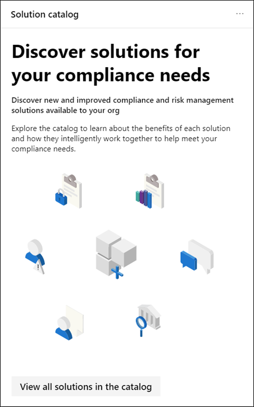
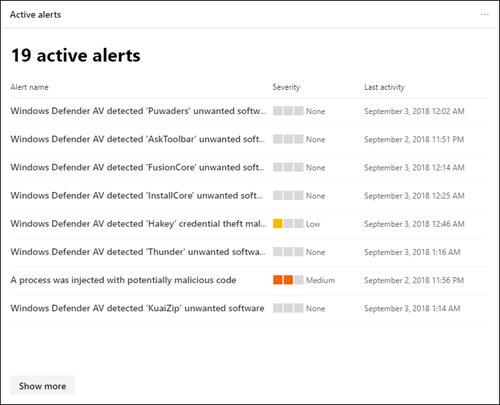

# Centre de conformité Microsoft 365

Si vous êtes intéressé par la posture de conformité de votre organisation, vous allez aimer le Centre de conformité [Microsoft 365.](https://compliance.microsoft.com) Le Centre de conformité Microsoft 365 offre un accès facile aux données et outils dont vous avez besoin pour gérer les besoins de votre organisation en matière de conformité.

Lisez cet article pour vous familiariser avec le Centre de conformité Microsoft 365, comment l’obtenir, les [questions](#frequently-asked-questions)fréquemment posées et les [étapes suivantes.](#next-steps)

## Bienvenue dans la conformité Microsoft 365

Lorsque vous allez à votre Centre de conformité Microsoft 365 pour la première fois, le message de bienvenue suivant s’offre à vous :

La bannière de bienvenue vous donne des pointeurs sur la façon de commencer, avec les étapes suivantes et une invitation à nous faire part de vos commentaires.

## Section Carte

Lorsque vous visitez le Centre de conformité Microsoft 365 pour la première fois, la section de carte de la page d’accueil vous montre d’un coup d’œil comment votre organisation se porte sur la conformité des données, quelles solutions sont disponibles pour votre organisation et un résumé des alertes actives.

À partir de là, vous pouvez :

- Examinez la **carte du Gestionnaire de conformité Microsoft,** ce qui vous conduit à la solution du Gestionnaire de [conformité.](compliance-manager.md) Le Gestionnaire de conformité simplifie la gestion de la conformité. Il calcule un score basé sur les risques qui mesure votre progression vers l’exécution des actions recommandées qui permettent de réduire les risques liés à la protection des données et aux normes réglementaires. Il fournit également des fonctionnalités de flux de travail et un mappage de contrôle intégré pour vous aider à effectuer efficacement des actions d’amélioration.

    

- Examinez la nouvelle **carte de catalogue solution,** qui contient des liens vers des collections de [solutions](microsoft-365-solution-catalog.md) intégrées que vous pouvez utiliser pour vous aider à gérer des scénarios de conformité de bout en bout. Les fonctionnalités et outils d’une solution peuvent inclure une combinaison de stratégies, d’alertes, de rapports, et bien plus encore.

    

- Consultez la carte **Alertes actives,** qui inclut un résumé des alertes les plus [actives](alert-policies.md) et inclut un lien où vous pouvez afficher des informations plus détaillées, telles que Gravité, État, Catégorie, etc.

    

Vous pouvez également  utiliser la fonctionnalité Ajouter des cartes pour ajouter des cartes supplémentaires, par exemple une montrant la conformité des applications cloud de votre organisation et une autre affichant des données sur les utilisateurs avec des fichiers partagés, avec des liens vers [Cloud App Security](/cloud-app-security/) ou d’autres outils où vous pouvez explorer des données.

## Navigation facile vers davantage de fonctionnalités et de fonctionnalités de conformité

Outre les liens dans les cartes sur la page d’accueil, vous verrez un volet de navigation sur le côté gauche de l’écran qui vous permet d’accéder facilement à vos alertes, [rapports,](reports-in-security-and-compliance.md) [stratégies,](../security/office-365-security/alerts.md)solutions de conformité, etc. Pour ajouter ou supprimer des options pour un volet de navigation personnalisé, utilisez le contrôle de **navigation** Personnaliser sur le volet de navigation. Cela ouvre les paramètres personnaliser votre volet de **navigation** afin que vous pouvez configurer les éléments qui apparaissent dans le volet de navigation.

|  |  |
|---------|---------|
|  | Sélectionnez **Accueil** pour revenir à la page principale du Centre de conformité Microsoft 365.   Visitez **le Gestionnaire de conformité** pour vérifier votre score de conformité et commencer à gérer la [conformité](compliance-manager.md) pour votre organisation.    Sélectionnez la section **Classification des** données pour accéder aux [classifieurs entraçables,](classifier-learn-about.md)aux définitions d’entités de types d’informations [sensibles,](sensitive-information-type-entity-definitions.md)au contenu et aux explorateurs [d’activités.](data-classification-activity-explorer.md)    Sélectionnez **connecteurs de données** [pour configurer des connecteurs](archiving-third-party-data.md) pour importer et archiver des données dans votre abonnement Microsoft 365.    Go to **Alerts** to view and resolve [alerts](alert-policies.md)   Consultez **les rapports** pour afficher les données sur l’utilisation et la rétention des étiquettes, les correspondances et les remplacements de stratégie DLP, les fichiers [partagés,](view-the-dlp-reports.md)les applications tierces en cours d’utilisation, etc.      Go to **Policies** to set up policies to govern data, manage devices, and receive [alerts](../security/office-365-security/alerts.md). Vous pouvez également accéder  à vos stratégies de rétention et [DLP.](data-loss-prevention-policies.md)   Sélectionnez **les autorisations** pour gérer les personnes de votre organisation qui ont accès au Centre de conformité Microsoft 365 pour afficher le contenu et effectuer des tâches.    Utilisez les liens de la section **Solutions** pour accéder aux solutions de conformité de votre organisation. Cela inclut ce qui suit :    [Catalog](microsoft-365-solution-catalog.md)   Découvrez, découvrez et commencez à utiliser les solutions intelligentes de gestion de la conformité et des risques disponibles pour votre organisation.    [Audit](search-the-audit-log-in-security-and-compliance.md)   Utilisez le journal d’audit pour examiner les problèmes courants de prise en charge et de conformité.    [Recherche de contenu](search-for-content.md)   Utilisez la recherche de contenu pour rechercher rapidement des messages électroniques dans des boîtes aux lettres Exchange, des documents dans des sites SharePoint et des emplacements OneDrive, ainsi que des conversations de messagerie instantanée dans Microsoft Teams et Skype Entreprise.    [Conformité des communications](communication-compliance.md)   Réduisez les risques de communication en capturant automatiquement les messages inappropriés, en enquêtant sur les violations de stratégie possibles et en prenant les mesures nécessaires pour y remédier.    [Protection contre la perte de données](data-loss-prevention-policies.md)   Détecter le contenu sensible tel qu’il est utilisé et partagé dans toute votre organisation, dans le cloud et sur les appareils, et permet d’éviter toute perte accidentelle de données.    [Demandes des personnes concernées](/compliance/regulatory/gdpr-manage-gdpr-data-subject-requests-with-the-dsr-case-tool)   Recherchez et exportez les données personnelles d’un utilisateur pour vous aider à répondre aux demandes des personnes qui en sont soumises au Règlement général sur la protection des données (R GDPR).    [eDiscovery](overview-ediscovery-20.md)   Développez cette section pour utiliser les fonctionnalités principales et Advanced eDiscovery pour la conservation, la collecte, la révision, l’analyse et l’exportation de contenu qui répond aux enquêtes internes et externes de votre organisation.    [Gouvernance des informations](manage-information-governance.md)   Gérez le cycle de vie de votre contenu à l’aide de fonctionnalités pour importer, stocker et classer des données critiques afin de conserver ce dont vous avez besoin et de supprimer ce dont vous n’avez pas besoin.    [Protection des informations](information-protection.md)   Découvrez, classifiez et protégez les contenus sensibles et critiques tout au long de leur cycle de vie au sein de votre organisation.    [Gestion des risques internes](insider-risk-management.md)   Détecter les activités risquées au sein de votre organisation pour vous aider à identifier, examiner et prendre rapidement des mesures contre les risques internes et les menaces.    [Gestion des enregistrements](records-management.md)   Automatisez et simplifiez la planification de rétention pour les enregistrements réglementaires, juridiques et critiques de votre organisation.

## Comment obtenir le centre de conformité ?

- Si vous n’avez pas encore le nouveau Centre de conformité Microsoft 365, vous le aurez bientôt. Le Centre de conformité Microsoft 365 est généralement disponible maintenant pour les clients de la référence Microsoft 365.

- Pour visiter le Centre de conformité Microsoft 365, en tant qu’administrateur général, administrateur de conformité ou administrateur de données de conformité, [https://compliance.microsoft.com](https://compliance.microsoft.com) connectez-vous.

## Questions fréquemment posées

**Pourquoi suis-je conduit au Centre de sécurité & conformité pour effectuer certaines tâches, telles que la définition de certaines stratégies ?**

Nous développons toujours le Centre de conformité Microsoft 365 et nous ajoutons d’autres fonctionnalités et solutions au cours des prochains mois. En attendant, vous devez effectuer quelques tâches dans le Centre de sécurité et de conformité ([https://protection.office.com](https://protection.office.com)). Dans ce cas, vous êtes dirigé automatiquement vers l’emplacement où vous pouvez effectuer la tâche en cours, comme la création ou la modification d’une stratégie de surveillance.

**Pourquoi le nouveau Centre de conformité Microsoft 365 ne s’est-il pas encore vu ?**

Tout d’abord, assurez-vous que vous avez les licences et autorisations appropriées. Ensuite, connectez-vous à [https://compliance.microsoft.com](https://compliance.microsoft.com) . Si vous ne voyez pas encore le nouveau centre de conformité, vous le verrez bientôt.

**Certaines de mes fonctionnalités de conformité ne sont pas disponibles dans le Centre de conformité Microsoft 365. Que dois-je faire ?**

Nous ajoutons toujours des fonctionnalités au Centre de conformité Microsoft 365. Si vous ne trouvez pas de données, telles que la recherche dans le journal d’audit, utilisez le Centre de sécurité & conformité ( [https://protection.office.com](https://protection.office.com) ). Vos configurations sont enregistrées automatiquement dans le Centre de sécurité & conformité et dans le nouveau Centre de conformité Microsoft 365.

To go there, in the Microsoft 365 compliance center, in the navigation pane on the left side of the screen, choose **More resources**, and then, under **Office 365 Security & Compliance Center**, choose **Open**.

## Étapes suivantes

- **Visitez le Gestionnaire de conformité Microsoft** pour consulter votre score de conformité et commencer à gérer la conformité pour votre organisation. Pour en savoir plus, [consultez le Gestionnaire de conformité.](compliance-manager.md)

- **Configurez les stratégies** de gestion des risques internes pour réduire les risques internes et vous permettre de détecter, d’examiner et de prendre des mesures pour les activités à risque dans votre organisation. Voir [Gestion des risques internes.](insider-risk-management.md)

- **Passer en revue les stratégies de** protection contre la perte de données de votre organisation et apporter les modifications nécessaires si nécessaire. Pour en savoir plus, voir [Vue d’ensemble des stratégies de protection contre la perte de données.](data-loss-prevention-policies.md)

- **Familiarisez-vous avec Microsoft Cloud App Security et définissez-le.** Voir [Démarrage rapide : mise en place de Microsoft Cloud App Security.](/cloud-app-security/getting-started-with-cloud-app-security)

- **Découvrez et créez des stratégies** de conformité des communications pour identifier et corriger rapidement les violations de stratégie de code de conduite d’entreprise. Voir [conformité des communications dans Microsoft 365.](communication-compliance.md)

- Visitez souvent votre Centre de conformité **Microsoft 365** et veillez à passer en revue les alertes ou les risques potentiels qui surviennent. Accédez à [https://compliance.microsoft.com](https://compliance.microsoft.com) et connectez-vous.