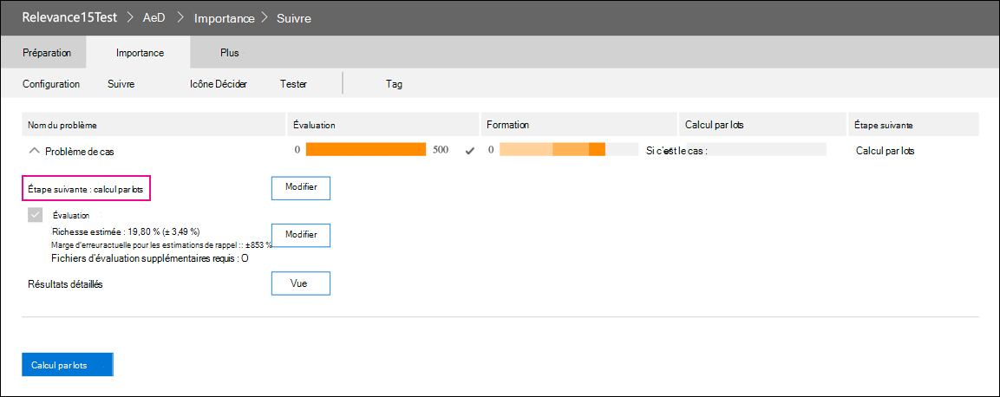

# Retrait du module de pertinence dans Advanced eDiscoveryRetirement of the Relevance module in Advanced eDiscovery

Le 10 mars 2021, nous allons retirer le module Pertinence dans Advanced eDiscovery.On March 10, 2021, we are retiring the Relevance module in Advanced eDiscovery. Ce retrait signifie que les organisations n’auront plus accès au module Pertinence (en accédant à Gérer l’ensemble de révision Pertinence dans un cas Advanced eDiscovery) ou ne pourront plus accéder aux modèles  >   Pertinence existants.This retirement means that organizations will no longer have access to the Relevance module (by going to **Manage review set** > **Relevance** in an Advanced eDiscovery case) or be able to access any existing Relevance models. Le module de pertinence actuel qui est retiré sera remplacé par une nouvelle solution de codage prédictif au T2 CY 2021.The current Relevance module that is being retired will be replaced with a new predictive coding solution in Q2 CY 2021. Cette nouvelle fonctionnalité permettra aux organisations de créer leurs propres modèles de codage prédictifs dans un flux de travail plus simple et plus intuitif.This new functionality will let organizations build their own predictive coding models in an easier and more intuitive workflow.

Pour préparer ce retrait à venir, nous recommandons aux organisations qui utilisent le module Pertinence d’exporter la sortie de leur modèle avant la date de retrait en exécutant un calcul Par lot pour tous les modèles existants.To prepare for this upcoming retirement, we recommend that organizations who use the Relevance module export their model’s output before the retirement date by running a Batch calculation for all existing models. Tous les scores de pertinence de votre modèle sont stockés définitivement dans le jeu à réviser correspondant et accessibles lorsque des documents sont exportés.All Relevance scores from your model will be permanently stored in the corresponding review set and accessible when documents are exported. Les scores de pertinence sont également conservés en tant que métadonnées dans le fichier de chargement.Relevance scores are also retained as metadata in the load file. En outre, vous pourrez toujours filtrer le contenu du jeu à réviser en fonction du score de pertinence et avoir accès à toutes les métadonnées produites par vos modèles de pertinence.Also, you will still be able to filter content in the review set based on relevance score and have access to all metadata produced by your Relevance models.

## Modèles inachevés completsComplete unfinished models

Pour les modèles de pertinence non terminés, veuillez effectuer une évaluation, une formation et un calcul par lot afin de pouvoir appliquer le modèle aux documents d’un jeu à réviser.For any unfinished Relevance models, please complete assessment, training, and Batch calculation so that you can apply the model to the documents in a review set. L’exécution du calcul batch permet de conserver les informations après la date de retrait du module de pertinence.Completing the Batch calculation will preserve the information after the retirement date of the Relevance module.

Voici les étapes à suivre pour effectuer les modèles non terminés :Here are the steps to complete any unfinished models:

1. Formez votre modèle jusqu’à ce qu’il soit stabilisé et prêt pour le calcul par lots.Train your model until it is stabilized and ready for Batch calculation. Voir [Formation au marquage et à la pertinence.](tagging-and-relevance-training-in-advanced-ediscovery.md)See [Tagging and Relevance training](tagging-and-relevance-training-in-advanced-ediscovery.md).

   La capture d’écran suivante montre un module prêt pour un calcul par lot.The following screenshot shows a module that is ready for a Batch calculation. Notez que l’évaluation et la formation sont terminées et que l’étape suivante consiste à exécuter le calcul par lots.Notice that the Assessment and Training is complete, and the next step is to run Batch calculation.

   

2. Exécutez le calcul par lots.Run the Batch calculation. Voir [Effectuer le calcul par lots.](track-relevance-analysis-in-advanced-ediscovery.md#performing-batch-calculation)See [Performing Batch calculation](track-relevance-analysis-in-advanced-ediscovery.md#performing-batch-calculation).

3. Vérifiez que le calcul par lots a réussi.Verify that Batch calculation was successful. Voir [les résultats de calcul par lot.](track-relevance-analysis-in-advanced-ediscovery.md#batch-calculation-results)See [Batch calculation results](track-relevance-analysis-in-advanced-ediscovery.md#batch-calculation-results).

Pour obtenir de l’aide sur la réalisation de modèles de pertinence non terminés, contactez le Support Microsoft.For help with completing unfinished Relevance models, contact Microsoft Support.
