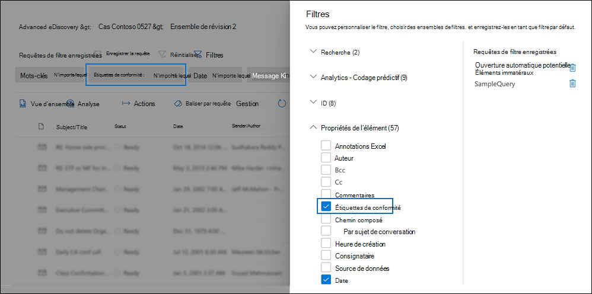
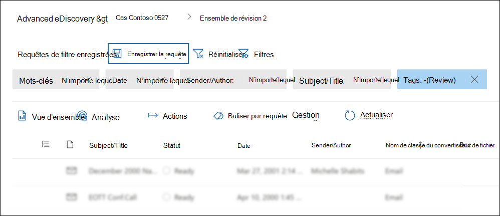
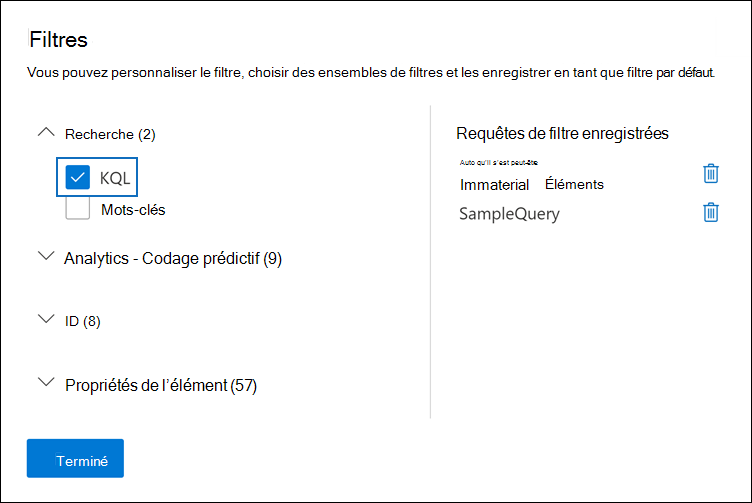

# Interroger et filtrer le contenu d’un jeu à réviserQuery and filter content in a review set

Dans la plupart des cas, il est utile d’approfondir le contenu d’un jeu à réviser et de l’organiser pour faciliter une révision plus efficace.In most cases, it will be useful to dig deeper into the content in a review set and organize it to facilitate a more efficient review. L’utilisation de filtres et de requêtes dans un ensemble de révision vous permet de vous concentrer sur un sous-ensemble de documents qui répondent aux critères de votre avis.Using filters and queries in a review set helps you focus on a subset of documents that meet the criteria of your review.

## Filtres par défautDefault filters

Dans un jeu à réviser, il existe cinq filtres par défaut qui sont pré-chargés dans le jeu à réviser :In a review set, there are five default filters that are pre-loaded in the review set:

- Mots-clésKeywords
- DateDate
- Sender/AuthorSender/Author
- Objet/TitreSubject/Title
- BalisesTags

Cliquez sur chaque filtre pour le développer et attribuer une valeur.Click each filter to expand it and assign a value. Cliquez en dehors du filtre pour appliquer automatiquement le filtre au jeu à réviser.Click outside the filter to automatically apply the filter to the review set. La capture d’écran suivante montre le filtre Date configuré pour afficher les documents dans une plage de dates.The following screenshot shows the Date filter configured to show documents within a date range.

## Ajouter ou supprimer des filtresAdd or remove filters

Pour ajouter ou supprimer des filtres qui sont affichés pour le jeu à réviser, sélectionnez **Filtres** pour ouvrir le panneau de filtrage, qui s’affiche sur une page volante.To add or remove filters that are displayed for the review set, select **Filters** to open the filter panel, which is displayed on a flyout page. 

Les filtres disponibles sont organisés en quatre sections :The available filters are organized in four sections:

- **Recherche**: filtres qui fournissent différentes fonctionnalités de recherche.**Search**: Filters that provide different search capabilities.

- **Codage analytique &** prédictif : filtre les propriétés générées et ajoutées aux documents lorsque vous exécutez le travail d’analyse de messagerie électronique **Document &** ou que vous utilisez des modèles de codage prédictifs.**Analytics & predictive coding**: Filters for properties generated and added to documents when you run the **Document & email analytic** job or use predictive coding models.

- **ID :** filtre toutes les propriétés d’ID des documents.**IDs**: Filters for all ID properties of documents.

- **Propriétés d’élément**: filtre les propriétés de document.**Item properties**: Filters for document properties. 

Développez chaque section et sélectionnez ou désélectionnez des filtres pour les ajouter ou les supprimer dans l’ensemble de filtres.Expand each section and select or deselect filters to add or remove them in the filter set. Lorsque vous ajoutez un filtre, il s’affiche dans le jeu de filtres.When you add a filter, it's displayed in the filter set. 

> [!NOTE]
> Lorsque vous développez une section dans le panneau de filtrage, vous remarquerez que les types de filtres par défaut sont sélectionnés.When you expand a section in the filter panel, you'll notice that the default filter types are selected. Vous pouvez conserver ces éléments sélectionnés ou les désélectionner et les supprimer du jeu de filtres.You can keep these selected or deselect them and removed them from the filter set. 

## Types de filtreFilter types

Chaque champ utilisable dans une recherche dans un jeu à réviser possède un filtre correspondant que vous pouvez utiliser pour filtrer des éléments en fonction d’un champ spécifique.Every searchable field in a review set has a corresponding filter that you can use for filter items based on a specific field.

Il existe plusieurs types de filtres :There are multiple types of filters:

- **Texte libre**: un filtre de texte libre est appliqué à des champs de texte tels que « Subject ».**Freetext**: A freetext filter is applied to text fields such as "Subject". Vous pouvez lister plusieurs termes de recherche en les séparant par une virgule.You can list multiple search terms by separating them with a comma.

- **Date**: un filtre de date est utilisé pour les champs de date tels que « Date de dernière modification ».**Date**: A date filter is used for date fields such as "Last modified date".

- **Options de** recherche : un filtre d’options de recherche fournit une liste des valeurs possibles (chaque valeur est affichée avec une case à cocher que vous pouvez sélectionner) pour des champs particuliers dans l’avis.**Search options**: A search options filter provides a list of possible values (each value is displayed with a checkbox that you can select) for particular fields in the review. Ce filtre est utilisé pour les champs, tels que « Expéditeur », où il existe un nombre fini de valeurs possibles dans le jeu à réviser.This filter is used for fields, such as "Sender", where there is a finite number of possible values in the review set.

- **Mot** clé : une condition de mot clé est une instance spécifique de condition de texte libre que vous pouvez utiliser pour rechercher des termes.**Keyword**: A keyword condition is a specific instance of freetext condition that you can use to search for terms. Vous pouvez également utiliser un langage de requête de type KQL dans ce type de filtre.You can also use KQL-like query language in this type of filter. Pour plus d’informations, voir les sections Langage de requête et Générateur de requêtes avancé dans cette rubrique.For more information, see the Query language and Advanced query builder sections in this topic.

## Inclure et exclure des relations de filtreInclude and exclude filter relationships

Vous avez la possibilité de modifier la relation Inclure et exclure pour un filtre particulier.You have the option to change the include and exclude relationship for a particular filter. Par exemple, dans le filtre Balise, vous pouvez exclure les éléments **marqués** avec une balise particulière en sélectionnant Égal à aucun des éléments du filtre de ladown.For example, in the Tag filter, you can exclude items that are tagged with a particular tag by selecting **Equals none of** in the dropdown filter. 

## Enregistrer des filtres en tant que requêtesSave filters as queries

Une fois que vous êtes satisfait de vos filtres, vous pouvez enregistrer la combinaison de filtres en tant que requête de filtre.After you are satisfied with your filters, you can save the filter combination as a filter query. Cela vous permet d’appliquer le filtre dans les prochaines sessions de révision.This lets you apply the filter in the future review sessions.

Pour enregistrer un filtre, **sélectionnez Enregistrer la requête et** nommez-la.To save a filter, select **Save the query** and name it. Vous ou d’autres réviseurs pouvez exécuter  des requêtes de filtre précédemment enregistrées en sélectionnant la dropdown des requêtes de filtre enregistrées et en sélectionnant une requête de filtre à appliquer aux documents de l’ensemble de révision.You or other reviewers can run previously saved filter queries by selecting the **Saved filter queries** dropdown and selecting a filter query to apply to review set documents. 

Pour supprimer une requête de filtre, ouvrez le panneau de filtrage et sélectionnez l’icône de corbeille en côté de la requête.To delete a filter query, open the filter panel and select the trashcan icon next to the query.

## Langage de requêteQuery language

En plus d’utiliser des filtres, vous pouvez également utiliser un langage de requête KQL dans le filtre Mots clés pour créer votre requête de recherche de jeu à réviser.In addition to using filters, you can also use a KQL-like query language in the Keywords filter to build your review set search query. Le langage de requête pour les requêtes de jeu à réviser prend en charge les opérateurs booléens standard, tels que **AND**, **OR**, **NOT** et **NEAR**.The query language for review set queries supports standard Boolean operators, such as **AND**, **OR**, **NOT**, and **NEAR**. Il prend également en charge un caractère générique à caractère unique (?) et un caractère générique à plusieurs caractères (\*).It also supports a single-character wildcard (?) and a multi-character wildcard (\*).

## Générateur de requêtes avancéAdvanced query builder

Vous pouvez également créer des requêtes plus avancées pour rechercher des documents dans un jeu à réviser.You can also build more advanced queries to search for documents in a review set.

1. Ouvrez le panneau de filtrage, **sélectionnez Filtres** et **développez** la section Recherche.Open the filter panel, select **Filters**, and expand the **Search** section.

  

2. Sélectionnez **le filtre KQL,** puis cliquez **sur Ouvrir le générateur de requêtes.**Select the **KQL** filter and click **Open query builder**.

   Dans ce panneau, vous pouvez créer des requêtes KQL complexes à l’aide du générateur de requêtes.In this panel, you can create complex KQL queries by using the query builder. Vous pouvez ajouter des conditions ou des groupes de conditions composés de plusieurs conditions connectées logiquement par des **relations AND** ou **OR.**You can add conditions or add condition groups that are made up of multiple conditions that are logically connected by **AND** or **OR** relationships.

   
