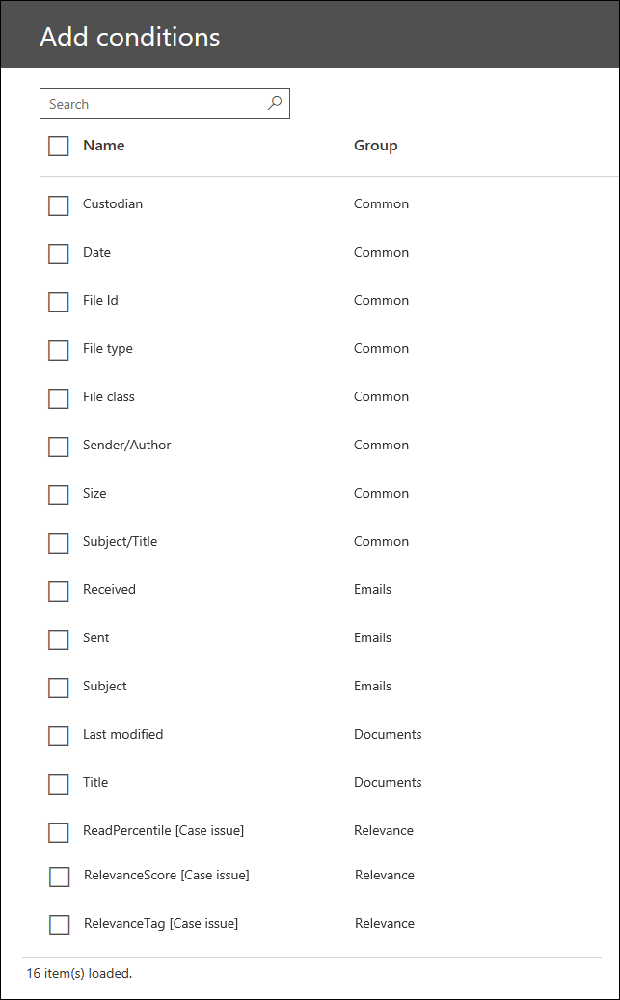

# Recherche et balisage

Dans Advanced eDiscovery, le module de recherche et de marquage vous permet de rechercher, de prévisualiser et d’organiser les documents dans votre cas. Actuellement, ce module est en version bêta. Pour une brève démonstration de la recherche et du balisage, voir la vidéo [gérer vos données à l’aide de la vidéo Advanced eDiscovery](https://www.youtube.com/watch?v=VaPYL3DHP6I) .

> [!NOTE]
> Advanced eDiscovery requires an Office 365 E3 with the Advanced Compliance add-on or an E5 subscription for your organization. If you don't have that plan and want to try Advanced eDiscovery, you can [sign up for a trial of Office 365 Enterprise E5](https://go.microsoft.com/fwlink/p/?LinkID=698279). 
  
## Rechercher les documents dans votre cas

Une fois que vous avez traité des documents dans un cas avancé eDiscovery (et si vous le souhaitez), vous pouvez utiliser la recherche et le balisage pour rechercher des documents, puis les organiser en appliquant des balises propres à la casse (également appelées étiquettes). Vous pouvez définir une requête de recherche à l’aide des cartes de condition fournies ou à l’aide d’un langage de requête KQL dans la carte de condition de mots-clés. La syntaxe KQL commune, telle que AND, OR, NOT et NEAR (n) sont prises en charge, ainsi que les caractères génériques à caractères multiples (*). 

Le tableau suivant répertorie les propriétés que vous pouvez rechercher à l’aide d’une requête de mot clé KQL. Vous pouvez également utiliser une carte de condition dans l’outil de recherche avancée eDiscovery pour ajouter une condition (pour les propriétés sélectionnées) à une requête de recherche.

|**Propriété**|**Description**|
|:-----|:-----|
|**caselabel**   | Nom de la balise créée/appliquée lorsqu’un document est balisé.   |
|**gardien**   | Dépositaire associé à un document ; soumis à des limitations.   |
|**date**   | Date d’envoi du courrier électronique ; Date de modification des documents de site.   |
|**combinaison**   | ID de fichier dans le cas.   |
|**filetype**   | Extension de fichier native.   |
|**fileclass**   | Courrier électronique, document ou pièce jointe.   |
|**senderauthor**   | Expéditeur du courrier électronique ; auteur des documents de site.   |
|**size**   | Taille du fichier en Ko.   |
|**subjecttitle**   | L’objet de la messagerie ; titre des documents de site.   |
|**bcc**   | Champ CCI d’un message électronique.   |
|**cc**   | Champ CC d’un message électronique.   |
|**participants**   | Adresse de messagerie de tous les participants d’un thread de messagerie, y compris pour les liens manquants.   |
|**received**   | Date à laquelle un message électronique a été reçu.   |
|**recipients**   | Destinataires d’un e-mail, inclus dans les champs à, CC ou CCI.   |
|**sender**   | Expéditeur d’un message électronique.   |
|**LastModifiedDate**   | Date de la dernière modification d’un document de site.   |
|**sent**   | Date d’envoi d’un message électronique.   |
|**to**   | Destinataire figurant dans le champ à d’un message électronique.   |
|**créés**   | Auteur d’un document de site.   |
|**title**   | Titre d’un document de site.   |
|**dominanttheme**\*   | Thème dominant d’un élément.   |
|**themeslist**\*   | Thèmes associés à un élément.   |
|**readpercentile_ [issuenum]**\*\*   | Centile de lecture d’un élément pour le problème défini par [issuenum].   |
|**relevancescore_ [issuenum]**\*\*   | Score de pertinence d’un élément pour le problème défini par [issuenum].   |
|**relevancetag_ [TagName]**\*\*   | Si un élément a été marqué manuellement pour des éléments de pertinence, la balise définie par [TagName].   |
|||

\*Disponible uniquement si le module thèmes a été exécuté.

\*\*Disponible uniquement si le module de pertinence a été exécuté.

Vous pouvez également utiliser une carte de condition dans l’outil de recherche avancée eDiscovery pour ajouter une condition (pour les propriétés sélectionnées) à une requête de recherche. La capture d’écran suivante montre les conditions qui peuvent être ajoutées à une requête. La colonne **Group** indique si la propriété s’applique aux messages électroniques, aux documents de site ou aux deux (indiqué par la valeur *Common*). Cette colonne identifie également les propriétés pouvant faire l’objet d’une recherche après l’exécution du module de pertinence.

Pour plus d’informations sur les propriétés pouvant faire l’objet d’une recherche, consultez la rubrique [requêtes de mots clés et conditions de recherche](keyword-queries-and-search-conditions.md).
  
## Voir aussi

[Advanced eDiscovery (classique)](office-365-advanced-ediscovery.md)
  
[Présentation de l’évaluation en matière de pertinence](assessment-in-relevance-in-advanced-ediscovery.md)
  
[Balisage et évaluation](tagging-and-assessment-in-advanced-ediscovery.md)
  
[Étiquetage et formation à la pertinence](tagging-and-relevance-training-in-advanced-ediscovery.md)
  
[Analyse de la pertinence](track-relevance-analysis-in-advanced-ediscovery.md)
  
[Choix en fonction des résultats](decision-based-on-the-results-in-advanced-ediscovery.md)
  
[Évaluation de l’analyse de pertinence](test-relevance-analysis-in-advanced-ediscovery.md)

