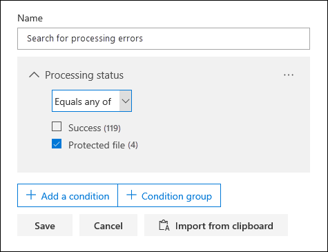

# Correction d’erreur sur élément unique

La correction des erreurs permet aux utilisateurs avancés de eDiscovery de corriger les problèmes de données qui empêchent Advanced eDiscovery de traiter correctement le contenu. Par exemple, les fichiers protégés par mot de passe ne peuvent pas être traités car ils sont verrouillés ou chiffrés. Auparavant, vous pouviez uniquement corriger les erreurs en bloc à l’aide de [ce flux de travail](error-remediation-when-processing-data-in-advanced-ediscovery.md). Toutefois, il n’est pas judicieux de corriger les erreurs dans plusieurs fichiers lorsque vous ne savez pas si un de ces fichiers répond au cas que vous êtes en train d’examiner. Il n’est pas non plus judicieux de corriger les erreurs avant que vous n’ayez eu le temps de passer en revue les métadonnées de fichier (telles que l’emplacement des fichiers ou les personnes ayant accès) pour vous aider à prendre des décisions optimales concernant la réactivité. Une nouvelle fonctionnalité appelée *Single Item Error* revisions donne aux gestionnaires de découverte électronique la possibilité d’afficher les métadonnées des fichiers avec une erreur de traitement et, si nécessaire, de corriger directement l’erreur dans l’ensemble de révision. Cet article explique comment identifier, ignorer et corriger les fichiers avec des erreurs de traitement dans un jeu de révision.

## Identifier les documents contenant des erreurs

Les documents contenant des erreurs de traitement dans un ensemble de révision sont maintenant identifiés (avec une bannière). Vous pouvez corriger ou ignorer l’erreur. La capture d’écran suivante montre la bannière d’erreur de traitement pour un document Word dans un jeu de révision protégé par mot de passe. Notez également que vous pouvez afficher les métadonnées de fichier des documents contenant des erreurs de traitement.

Vous pouvez également rechercher des documents qui contiennent des erreurs de traitement à l’aide de la condition **État de traitement** lors [de l’interrogation des documents dans un jeu de révision](review-set-search.md).

### Ignorer les erreurs

Vous pouvez ignorer une erreur de traitement en cliquant sur **Ignorer** dans la bannière traitement des erreurs. Lorsque vous ignorez une erreur, le document est supprimé du [flux de travail de correction des erreurs en bloc](error-remediation-when-processing-data-in-advanced-ediscovery.md). Lorsqu’une erreur est ignorée, la bannière de document change de couleur et indique que l’erreur de traitement a été ignorée. À tout moment, vous pouvez annuler la décision pour ignorer l’erreur en cliquant sur **rétablir**.

Vous pouvez également rechercher tous les documents contenant une erreur de traitement qui a été ignoré à l’aide de la condition *Erreurs de traitement ignorées* lors de l’interrogation des documents dans un jeu de révision.

## Correction d’un document avec des erreurs

Parfois, vous pouvez être amené à corriger une erreur de traitement dans les documents (en supprimant un mot de passe, en déchiffrant un fichier chiffré ou en récupérant un document endommagé), puis en ajoutant le document corrigé à l’ensemble de révision. Cela vous permet de passer en revue et d’exporter le document d’erreur avec les autres documents de l’ensemble de révision. 

Pour corriger un document unique, procédez comme suit :

1. Cliquez sur **Télécharger** > l'**original téléchargement** pour télécharger une copie du fichier sur un ordinateur local.

   

2. Corrigez l’erreur dans le fichier en mode hors connexion. Pour les fichiers chiffrés, qui nécessitent un logiciel de déchiffrement, pour supprimer la protection par mot de passe, fournissez le mot de passe et enregistrez le fichier ou utilisez un cracker de mot de passe. Une fois le fichier résolu, passez à l’étape suivante.

3. Dans l’ensemble de révision, sélectionnez le fichier avec l’erreur de traitement que vous avez corrigée, puis cliquez sur **Correction**.

   

4. Cliquez sur **Parcourir**, accédez à l’emplacement du fichier corrigé sur votre ordinateur local, puis sélectionnez le fichier.

   

    Après avoir sélectionné le fichier corrigé, il est automatiquement téléchargé vers l’ensemble de révision. Vous pouvez suivre l’état de traitement du fichier.

    

   Une fois le traitement terminé, vous pouvez afficher le document corrigé.

    

Pour plus d’informations sur ce qui se produit lorsqu’un document est résolu, voir [ce qui se passe lorsque les fichiers sont corrigés](error-remediation.md#what-happens-when-files-are-remediated).

## Rechercher des documents résolus

Vous pouvez rechercher tous les documents dans un jeu de révision qui ont été résolus à l’aide de la condition **Keywords** et en spécifiant la paire propriété : valeur suivante : **IsFromErrorRemediation : true**. Cette propriété est également disponible dans le fichier d’exportation de la charge lorsque vous exportez des documents à partir d’un jeu de révision.
