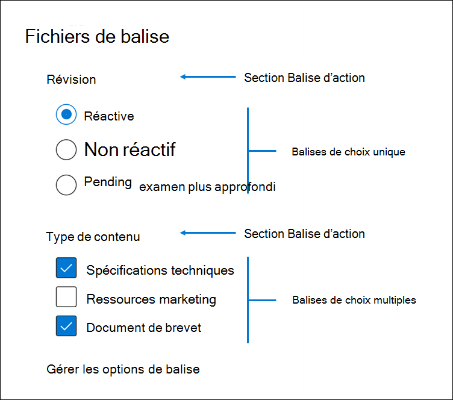
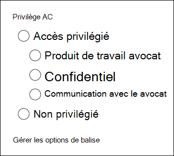

# Baliser des documents dans un jeu à réviser dans Advanced eDiscoveryTag documents in a review set in Advanced eDiscovery

L’organisation du contenu dans un ensemble de révision est importante pour effectuer différents flux de travail dans le processus eDiscovery.Organizing content in a review set is important to complete various workflows in the eDiscovery process. Cela inclut les opérations suivantes :This includes:

- Élimination de contenu inutileCulling unnecessary content

- Identification du contenu pertinentIdentifying relevant content
 
- Identification du contenu qui doit être examiné par un expert ou un avocatIdentifying content that must be reviewed by an expert or an attorney

Lorsque des experts, des avocats ou d’autres utilisateurs examinent le contenu d’un groupe de révision, leurs opinions relatives au contenu peuvent être capturées à l’aide de balises.When experts, attorneys, or other users review content in a review set, their opinions related to the content can be captured by using tags. Par exemple, si l’objectif est d’annuler le contenu inutile, un utilisateur peut baliser des documents avec une balise telle que « non réactif ».For example, if the intent is to cull unnecessary content, a user can tag documents with a tag such as "non-responsive". Une fois que le contenu a été révisé et balisé, une recherche de jeu à réviser peut être créée pour exclure tout contenu marqué comme « non réactif », ce qui élimine ce contenu des étapes suivantes du flux de travail eDiscovery.After content has been reviewed and tagged, a review set search can be created to exclude any content tagged as "non-responsive", which eliminates this content from the next steps in the eDiscovery workflow. Le panneau de balises peut être personnalisé pour chaque cas afin que les balises peuvent prendre en charge le flux de travail de révision prévu.The tag panel can be customized for every case so that the tags can support the intended review workflow.

## Types de balisesTag types

Advanced eDiscovery fournit deux types de balises :Advanced eDiscovery provides two types of tags:

- **Balises à choix unique** : limite la sélection d’une seule balise au sein d’un groupe.**Single choice tags** - Restricts users to select a single tag within a group. Cela peut être utile pour s’assurer que les utilisateurs ne sélectionnent pas de balises conflictuelles telles que « réactive » et « non réactive ».This can be useful to ensure users don't select conflicting tags such as "responsive" and "non-responsive". Celles-ci s’affichent sous la mesure des boutons d’radio.These will appear as radio buttons.

- **Balises de choix multiples** : autoriser les utilisateurs à sélectionner plusieurs balises au sein d’un groupe.**Multiple choice tags** - Allow users to select multiple tags within a group. Celles-ci s’affichent sous la mesure des case à cocher.These will appear as checkboxes.

## Structure des balisesTag structure

Outre les types de balises, la structure de l’organisation des balises dans le panneau de balises peut être utilisée pour rendre les documents de marquage plus intuitifs.In addition to the tag types, the structure of how tags are organized in the tag panel can be used to make tagging documents more intuitive. Les balises sont regroupées par sections.Tags are grouped by sections. La recherche de jeu à réviser prend en charge la possibilité de rechercher par balise et par section de balise.Review set search supports the ability to search by tag and by tag section. Cela signifie que vous pouvez créer une recherche de jeu à réviser pour récupérer les documents marqués avec n’importe quelle balise dans une section.This means you can create a review set search to retrieve documents tagged with any tag in a section.

Les balises peuvent être davantage organisées en les imbriquent dans une section.Tags can be further organized by nesting them within a section. Par exemple, si l’objectif est d’identifier et de baliser le contenu privilégié, l’imbrmbrage peut être utilisé pour indiquer clairement qu’un utilisateur peut marquer un document comme « privilégié » et sélectionner le type de privilège en vérifiant la balise imbrmbrée appropriée.For example, if the intent is to identify and tag privileged content, nesting can be used to make it clear that a user can tag a document as "Privileged" and select the type of privilege by checking the appropriate nested tag.

## Application de balisesApplying tags

Il existe plusieurs façons d’appliquer une balise au contenu.There are several ways to apply a tag to content.

### Marquage d’un document uniqueTagging a single document

Lorsque vous affichez un document dans un jeu à réviser, vous pouvez afficher les balises qu’un avis peut utiliser en cliquant sur **le panneau de marquage.**When viewing a document in a review set, you can display the tags that a review can use by clicking **Tagging panel**.

Cela vous permet d’appliquer des balises au document affiché dans la visionneuse.This will enable you to apply tags to the document displayed in the viewer.

### Marquage en blocBulk tagging

Le marquage en bloc peut être effectué en sélectionnant plusieurs fichiers  dans la grille des résultats, puis en utilisant les balises du panneau de marquage similaires au marquage de documents simples.Bulk tagging can be done by selecting multiple files in the results grid and then using the tags in the **Tagging panel** similar to tagging single documents. L’un-marquage en bloc peut être effectué en sélectionnant deux fois des balises . Le premier clic applique la balise, et la deuxième sélection garantit que la balise est effacée pour tous les fichiers sélectionnés.Bulk un-tagging can be done by selecting tags twice; the first click will apply the tag, and the second selection will ensure that tag is cleared for all selected files.

> [!NOTE]
> Lors du marquage en bloc, le panneau de marquage affiche le nombre de fichiers marqués pour chaque balise du panneau.When bulk tagging, the tagging panel will display a count of files that are tagged for each tag in the panel.

### Marquage dans d’autres panneaux d’avisTagging in other review panels

Lorsque vous examinez des documents, vous pouvez utiliser les autres panneaux de révision pour examiner d’autres caractéristiques des documents dans la grille des résultats.When reviewing documents, you can use the other review panels to review other characteristics of documents in the results grid. Cela inclut la révision d’autres documents connexes, threads de messagerie, quasi-doublons et hachages.This includes reviewing other related documents, email threads, near duplicates, and hash duplicates. Par exemple, lorsque vous examinez des documents  connexes (à l’aide du Panneau de révision de la famille de documents), vous pouvez réduire considérablement le temps de révision en balisé en bloc les documents associés.For example, when you're reviewing related documents (by using the **Document family** review panel), you can significantly reduce review time by bulk tagging related documents. Par exemple, si un message électronique a plusieurs pièces jointes et que vous souhaitez vous assurer que toute la famille est marquée de façon cohérente.For example, if an email message has several attachments and you want to ensure that the entire family is tagged consistently.

Par exemple, voici comment afficher  le panneau marquage lors de l’utilisation du panneau de révision de la famille **de** documents :For example, here's how to display the **Tagging panel** when using the **Document family** review panel:

1. Avec le panneau de révision ouvert pour un document sélectionné (par  exemple, affichage de la liste du contenu connexe dans le panneau révision de la famille de documents), cliquez sur **Baliser** les documents sous le panneau de révision de la famille de documents.With the review panel open for a selected document (for example, displaying the list of related content in the **Document family** review panel, click **Tag documents** under the document family review panel.

   Le panneau de marquage s’affiche en tant que fenêtre indépendant.The tagging panel is displayed as a pop-up window.

2. Choisissez une ou plusieurs balises pour appliquer le document sélectionné.Choose one or more tags to apply the selected document. 

3. Pour baliser tous les documents, sélectionnez tous les documents dans le panneau Famille de documents, cliquez sur Baliser les **documents,** puis choisissez les balises à appliquer à toute la famille de documents. To tag all documents, select all documents in the **Document family** panel, click **Tag documents**, and then choose the tags to apply to the entire family of documents.

