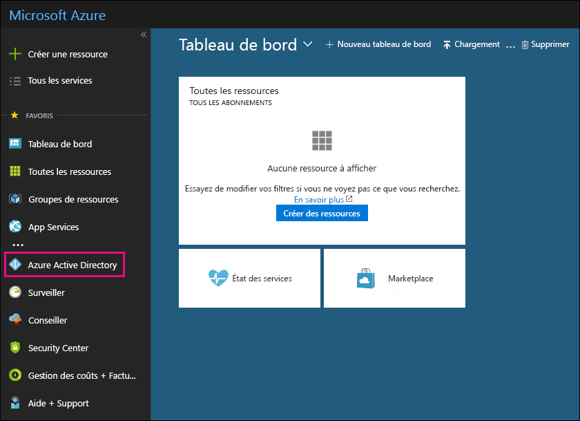

# Utiliser votre abonnement Azure Active Directory gratuit

If your organization has a paid subscription to Microsoft 365, Microsoft Dynamics CRM Online, Enterprise Mobility Suite, or other Microsoft services, you have a free subscription to Microsoft Azure Active Directory. You and other admins can use Azure AD to create and manage user and group accounts. To use Azure AD, just go to the Azure portal and sign in to your account.

## Ouvrir une session de navigation privée

Use a private browsing session (not a regular session) to access the Azure portal (in step 1 below) because this prevents the credentials that you're currently logged on with from being passed to Azure. To open an private browsing session:

- Dans Microsoft Edge (version héritée), Internet Explorer ou Mozilla FireFox, appuyez sur `CTRL+SHIFT+P`.

- Dans Microsoft Edge (version la plus récente) ou Google Chrome, appuyez sur `CTRL+SHIFT+N`.

## Accès à Azure Active Directory

1. Accédez à [portal.azure.com](https://portal.azure.com) et connectez-vous avec votre compte professionnel ou scolaire.

2. Dans le volet de navigation gauche du Portail Azure, cliquez sur **Azure Active Directory**.

    

    Le centre d’administration **Azure Active Directory** s’affiche.

## Plus d’informations

- Un abonnement Azure Active Directory gratuit n’inclut pas le rapport d’activité des connexions. Pour enregistrer l’activité de connexion (pouvant être utile en cas de violation de données), vous avez besoin d’un abonnement Azure Active Directory Premium. Pour plus d’informations, consultez [Pendant combien de temps les données sont-elles conservées par Azure AD ?](https://docs.microsoft.com/azure/active-directory/reports-monitoring/reference-reports-data-retention#how-long-does-azure-ad-store-the-data)

- Vous pouvez également accéder au Centre d’administration **Azure Active Directory** à partir du Centre d’administration Microsoft 365. Dans le volet de navigation gauche du Centre d’administration Microsoft 365, cliquez sur **Centres d’administration**\>**Azure Active Directory**.

- Pour savoir comment gérer les utilisateurs et les groupes et exécuter d’autres tâches de gestion des répertoires, consultez l’article [Gérer votre répertoire Azure AD](https://docs.microsoft.com/azure/active-directory/active-directory-administer).
