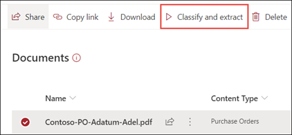
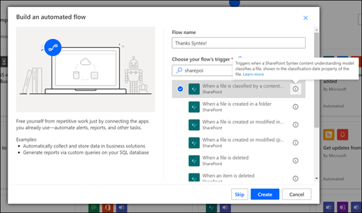

# Appliquer un modèle de présentation de document dans Microsoft SharePoint SyntexApply a document understanding model in Microsoft SharePoint Syntex

 

> [!VIDEO https://www.microsoft.com/videoplayer/embed/RE4CSoL]

 

Une fois que vous avez publié votre modèle de présentation de document, vous pouvez l’appliquer à une ou plusieurs bibliothèques de documents SharePoint dans votre client Microsoft 365.After publishing your document understanding model, you can apply it to one or more SharePoint document library in your Microsoft 365 tenant.

> [!NOTE]
> Vous pouvez uniquement appliquer le modèle aux bibliothèques de documents auxquelles vous avez accès.You are only able to apply the model to document libraries that you have access to.

## Appliquez votre modèle à une bibliothèque de documents.Apply your model to a document library.

Pour appliquer votre modèle à une bibliothèque de documents SharePoint :To apply your model to to a SharePoint document library:

1. Sur la page d’accueil du modèle, dans la vignette **Appliquer le modèle aux bibliothèques** , sélectionnez **Publier le modèle**.On model home page, on the **Apply model to libraries** tile, select **Publish model**. Vous pouvez également sélectionner **+ Ajouter une bibliothèque** dans la section **Bibliothèques avec ce modèle**.Or you can select  **+Add Library** in the **Libraries with this model** section.  

     

2. Vous pouvez ensuite sélectionner le site SharePoint contenant la bibliothèque de documents à laquelle vous voulez appliquer le modèle.You can then select the SharePoint site that contains the document library that you want to apply the model to. Si le site n’apparaît pas dans la liste, utilisez la zone de recherche pour le trouver.If the site does not show in the list, use the search box to find it. 

     

    > [!NOTE]
    > Vous devez disposer d’autorisations *Gérer la liste* ou de droits *Modifier* sur la bibliothèque de documents à laquelle vous appliquez le modèle.You must have *Manage List* permissions or *Edit* rights to the document library you are applying the model to. 

3. Une fois le site sélectionné, sélectionnez la bibliothèque de documents à laquelle vous voulez appliquer le modèle.After selecting the site, select the document library to which you want to apply the model. Dans l’exemple, sélectionnez la bibliothèque de documents *Documents* à partir du site de *Suivi de cas contoso*.In the sample, select the *Documents* document library from the *Contoso Case Tracking* site. 

     

4. Étant donné que le modèle est associé à un type de contenu, lorsque vous l’appliquez à la bibliothèque, le type de contenu et son affichage sont ajoutés aux étiquettes que vous avez extraites sous forme de colonnes.Since the model is associated to a content type, when you apply it to the library it will add the content type and its view with the labels you extracted showing as columns. Cet affichage est l’affichage par défaut de la bibliothèque par défaut, mais vous pouvez choisir de ne pas l’utiliser par défaut en sélectionnant **Paramètres avancés** et en désactivant la case à cocher **Définir cette nouvelle vue comme par défaut**.This view is the library's default view by default, but you can optionally choose to not have it be the default view by selecting **Advanced settings** and deselecting **Set this new view as default**. 

     

5. Sélectionnez **Ajouter** pour appliquer le modèle à la bibliothèque.Select **Add** to apply the model to the library. 
6. Dans la page d’accueil du modèle, dans la section **Bibliothèques avec ce modèle**, l’URL du site SharePoint doit apparaître.On the model home page, in the **Libraries with this model** section, you should see the URL to the SharePoint site listed. 

     

7. Accédez à votre bibliothèque de documents et vérifiez que vous êtes dans la vue bibliothèque de documents du modèle.Go to your document library and make sure you are in the model's document library view. Notez que si vous sélectionnez le bouton informations en regard du nom de la bibliothèque de documents, un message indique qu’un modèle est appliqué à la bibliothèque de documents.Notice that if you select the information button next to the document library name, a message notes that the document library has a model applied to it.

      

    Vous pouvez sélectionner **Afficher les modèles actifs** pour afficher des détails sur les modèles appliqués à la bibliothèque de documents.You can the select **View active models** to see details about any models that are applied to the document library.

8. Dans le volet **Modèles actifs**, vous pouvez afficher les modèles appliqués à la bibliothèque de documents.In the **Active models** pane, you can see the models that are applied to the document library. Sélectionnez un modèle pour afficher plus d’informations le concernant, par exemple une description du modèle, qui a publié le modèle et si le modèle applique une étiquette de rétention aux fichiers qu’il classifie.Select a model to see more details about it, such as a description of the model, who published the model, and if the model applies a retention label to the files it classifies.

      

Une fois le modèle appliqué à la bibliothèque de documents, vous pouvez commencer à télécharger des documents sur le site et afficher les résultats.After applying the model to the document library, you can begin uploading documents to the site and see the results.

Le modèle identifie les fichiers avec le type de contenu associé au modèle et les répertorie dans votre affichage.The model identifies any files with model’s associated content type and lists them in your view. Si votre modèle inclut des extracteurs, l’affichage affiche les colonnes des données que vous extrayez à partir de chaque fichier.If your model has any extractors, the view displays columns for the data you are extracting from each file.

### Appliquer le modèle aux fichiers figurant déjà dans la bibliothèque de documentsApply the model to files already in the document library

Lorsqu’un modèle appliqué traite tous les fichiers téléchargés vers la bibliothèque de documents une fois qu’il est appliqué, vous pouvez également effectuer les opérations suivantes pour exécuter le modèle sur des fichiers qui existent déjà dans la bibliothèque de documents avant l’application du modèle :While an applied model processes all files uploaded to the document library after it is applied, you can also do the following to run the model on files that already exists in the document library prior to the model being applied:

1. Dans votre bibliothèque de documents, sélectionnez les fichiers que vous voulez traiter par votre modèle.In your document library, select the files that you want to be processed by your model.
2. Une fois que vous avez sélectionné vos fichiers, **Classer et extraire** s’affiche dans le ruban de la bibliothèque de documents.After selecting your files, **Classify and extract** will appear in the document library ribbon. Sélectionnez **Classer et extraire**.Select **Classify and extract**.
3. Les fichiers que vous avez sélectionnés sont ajoutés à la file d’attente à traiter.The files you selected will be added to the queue to be processed.

        

> [!NOTE]
> Vous pouvez copier des fichiers individuels dans une bibliothèque et les appliquer à un modèle, mais pas des dossiers.You can copy individual files to a library and apply them to a model, but not folders.

### Champ Date de classificationThe Classification Date field

Lorsqu’un document SharePoint Syntex comprenant ou un modèle de traitement de formulaire est appliqué à une bibliothèque de documents, un champ <b>Date de classification</b> est inclus dans le schéma de bibliothèque.When a SharePoint Syntex document understanding or form processing model is applied to a document library, a <b> Classification date </b> field is included in the library schema. Par défaut, ce champ est vide, mais lorsque des documents sont traitées et classifiées par modèle, ce champ est mis à jour avec l’horodatage d’achèvement.By default this field is empty, but when documents are processed and classified by a model, this field is updated with a date-time stamp of completion. 

     

Le champ Date de classification est utilisé par le déclencheur [<b>Lorsqu’un fichier est classifié par un modèle de contenu</b>'](https://docs.microsoft.com/connectors/sharepointonline/#when-a-file-is-classified-by-a-content-understanding-model) pour exécuter un flux Power Automate après qu’un modèle de compréhension de contenu Syntex a terminé de traiter un fichier et mis à jour le champ « Date de classification ».The Classification date field is used by the [<b>When a file is classified by a content understanding model</b> trigger](https://docs.microsoft.com/connectors/sharepointonline/#when-a-file-is-classified-by-a-content-understanding-model) to run a Power Automate flow after a Syntex content understanding model has finished processing a file and updated the "Classification date" field.

    

Le déclencheur <b>Lorsqu'un fichier est classifié selon un modèle de compréhension du contenu</b> peut ensuite être utilisé pour démarrer un autre flux de travail à l’aide d’informations extraites du fichier.The <b>When a file is classified by a content understanding model</b> trigger can then be used to start another workflow using any  extracted information from the file.

## Voir aussiSee Also
[Créer un classificateurCreate a classifier](create-a-classifier.md)

[Créer un extracteurCreate an extractor](create-an-extractor.md)

[Présentation de la compréhension de documentDocument Understanding overview](document-understanding-overview.md)

