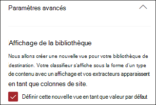

# Appliquer un modèle de présentation de document (aperçu)

> [!Note] 
> Le contenu de cet article est destiné à Project cortex privé preview. Pour [plus d’informations sur le projet cortex](https://aka.ms/projectcortex).

 

> [!VIDEO https://www.microsoft.com/videoplayer/embed/RE4CSoL]

 

Après avoir publié votre modèle de présentation de document, vous pouvez l’appliquer à une bibliothèque de documents SharePoint dans votre client Microsoft 365.

> [!Note]
> Vous ne pourrez appliquer le modèle qu’aux bibliothèques de documents auxquelles vous avez accès.

## Appliquer votre modèle à une bibliothèque de documents.

Pour appliquer votre modèle à une bibliothèque de documents SharePoint :

1. Sur la page d’accueil du modèle, dans la vignette **appliquer le modèle aux bibliothèques** , sélectionnez **publier le modèle**. Ou vous pouvez sélectionner l’option **+ Ajouter une bibliothèque** dans la section **bibliothèques avec ce modèle** .  

     

2. Vous pouvez ensuite sélectionner le site SharePoint qui contient la bibliothèque de documents à laquelle vous souhaitez appliquer le modèle. Si le site ne s’affiche pas dans la liste, utilisez la zone de recherche pour le trouver. 

     

    > [!Note]
    > Vous devez disposer des autorisations *gérer les listes* ou *modifier* les droits sur la bibliothèque de documents à laquelle vous appliquez le modèle. 

3. Après avoir sélectionné le site, vous devez sélectionner la bibliothèque de documents à laquelle vous souhaitez appliquer le modèle. Dans l’exemple, nous sélectionnons la bibliothèque de documents *documents* à partir du site de *suivi de cas contoso* . 

     

4. Étant donné que le modèle est associé à un type de contenu, lorsque vous l’appliquez à la bibliothèque, il crée un affichage pour le type de contenu avec les étiquettes extraites sous forme de colonnes. Cet affichage est l’affichage par défaut de la bibliothèque, mais vous pouvez choisir de ne pas l’afficher par défaut en sélectionnant **Paramètres avancés** et en désélectionnant **définir cette nouvelle vue comme valeur par défaut**. 

     

5. Sélectionnez **Ajouter** pour appliquer le modèle à la bibliothèque. 
6. Sur la page d’accueil du modèle, dans la section **bibliothèques avec ce modèle** , vous verrez l’URL du site SharePoint dans la zone. 

     

7. Accédez à votre bibliothèque de documents et assurez-vous que vous êtes dans la vue bibliothèque de documents du modèle. Vous remarquerez que si vous sélectionnez le bouton informations en regard du nom de la bibliothèque de documents, un message indique que votre modèle a été appliqué à la bibliothèque de documents.

      

Après avoir appliqué le modèle à la bibliothèque de documents, vous pouvez commencer à télécharger des documents sur le site et voir les résultats.

Le modèle identifie les fichiers dont le type de contenu est associé au modèle et les répertorie dans votre vue. Si votre modèle comporte des extracteurs, l’affichage affiche les colonnes des données que vous extrayez de chaque fichier.

### Appliquer le modèle aux fichiers figurant déjà dans la bibliothèque de documents

Lorsqu’un modèle appliqué traite tous les fichiers téléchargés vers la bibliothèque de documents après son application, vous pouvez également effectuer les opérations suivantes pour exécuter le modèle sur des fichiers qui existaient déjà dans la bibliothèque de documents avant l’application du modèle :

1. Dans votre bibliothèque de documents, sélectionnez les fichiers que vous souhaitez traiter par votre modèle.
2. Une fois que vous avez sélectionné vos fichiers, **classifier et extraire** apparaît dans le ruban de la bibliothèque de documents. Sélectionnez **classifier et extraire**.
3. Les fichiers que vous avez sélectionnés seront ajoutés à la file d’attente pour être traités.

        

## Voir aussi
[Créer un classifieur](create-a-classifier.md) 
[Créer un extracteur](create-an-extractor.md) 
[Présentation de l’explication des documents](document-understanding-overview.md) 
[Créer un modèle de traitement de formulaire](create-a-form-processing-model.md)  

