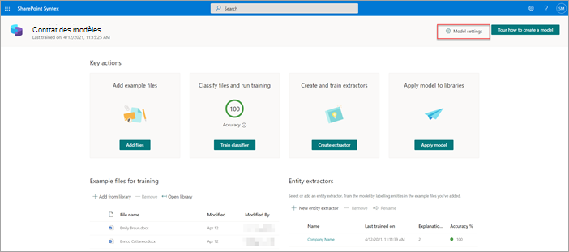
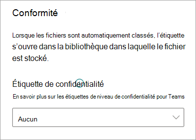

# Appliquer une étiquette de confidentialité à un modèle dans Microsoft SharePoint SyntexApply a sensitivity label to a model in Microsoft SharePoint Syntex

Vous pouvez facilement appliquer une [étiquette de confidentialité](../compliance/sensitivity-labels.md) à un modèle de compréhension de document dans Microsoft SharePoint Syntex.You can easily apply a [sensitivity label](../compliance/sensitivity-labels.md) to document understanding models in Microsoft SharePoint Syntex. Cette fonctionnalité n’est pas encore disponible pour les modèles de traitement de formulaire.This feature isn't available yet for form processing models.

Les étiquettes de confidentialité vous permettent d’appliquer des stratégies de chiffrement, de partage et d’accès conditionnel aux documents que vos modèles identifient.Sensitivity labels let you apply encryption, sharing, and conditional access policies to the documents that your models identify. Par exemple, vous souhaitez que votre modèle identifie non seulement les documents financiers qui contiennent des numéros de compte bancaire ou des numéros de carte de crédit chargés dans votre bibliothèque de documents, mais également qu’il leur applique une étiquette de confidentialité *Chiffrement* afin de restreindre l’accès à ce contenu et la façon dont il peut être utilisé.For example, you want your model to not only identify any financial documents that contain bank account numbers or credit card numbers that are uploaded to your document library, but also to apply an *Encryption* sensitivity label to them to restrict who can access that content and how it can be used. Les modèles Syntex respectent les règles d’[ordre d’étiquette](../compliance/apply-sensitivity-label-automatically.md?view=o365-worldwide#how-multiple-conditions-are-evaluated-when-they-apply-to-more-than-one-label) et ne remplacent pas non plus une étiquette existante qui a été appliquée manuellement par un utilisateur au fichier.Syntex models honor [label order](../compliance/apply-sensitivity-label-automatically.md?view=o365-worldwide#how-multiple-conditions-are-evaluated-when-they-apply-to-more-than-one-label) rules and also do not overwrite an existing label that was manually applied by a user to the file. 

Vous pouvez appliquer une étiquette de confidentialité préexistante à votre modèle via les paramètres du modèle sur la page d’accueil de celui-ci.You can apply a pre-existing sensitivity label to your model through your model settings on your model's home page. L’étiquette doit déjà être publiée pour pouvoir être sélectionnée dans les paramètres du modèle.The label must already be published to be available for selection from model settings.

> [!Important]
> Pour que les étiquettes de niveau de confidentialité soient disponibles et s’appliquent à votre modèle de compréhension de document, elles doivent être [créées et publiées dans le Centre de conformité Microsoft 365](../business-video/create-sensitivity-labels.md).For sensitivity labels to be available to apply to your document understanding models, they need to be [created and published in the Microsoft 365 Compliance Center](../business-video/create-sensitivity-labels.md).

## Appliquer une étiquette de confidentialité à un modèle de compréhension de documentAdd a sensitivity label to a document understanding model

1. Sur la page d’accueil du modèle, sélectionnez **Paramètres du modèle**.From the model home page, select **Model settings**.

   

2. Dans le volet **Paramètres du modèle**, dans la section **Conformité**, sélectionnez le menu **Étiquette de confidentialité** pour afficher la liste des étiquettes de confidentialité que vous pouvez appliquer au modèle.On **Model settings** pane, in the **Compliance** section, select the **Sensitivity label** menu to see a list of sensitivity labels that are available for you to apply to the model.

    

3. Sélectionnez l’étiquette de confidentialité que vous souhaitez appliquer au modèle, puis **Enregistrer**.Select the sensitivity label you want to apply to the model, and then select **Save**.

Après avoir appliqué l’étiquette de confidentialité à votre modèle, vous pouvez l’appliquer à une :After you apply the sensitivity label to your model, you can apply it to a:

- nouvelle bibliothèque de documentsNew document library
- bibliothèque de documents à laquelle le modèle est déjà appliquéDocument library to which the model is already applied
 
### Appliquer l’étiquette de confidentialité à une bibliothèque de documents à laquelle le modèle est déjà appliquéApply the sensitivity label to a document library to which the model is already applied

Si votre modèle de compréhension de document a déjà été appliqué à une bibliothèque de documents, vous pouvez effectuer les opérations suivantes pour synchroniser la mise à jour de votre étiquette de confidentialité afin de l’appliquer à la bibliothèque de documents :If your document understanding model has already been applied to a document library, you can do the following to sync your sensitivity label update to apply it to the document library:

1. Sur la page d’accueil du modèle, dans la section **Bibliothèques avec ce modèle**, sélectionnez la bibliothèque de documents à laquelle vous souhaitez appliquer la mise à jour de l’étiquette de confidentialité.On the model home page, in the **Libraries with this model** section, select the document library to which you want to apply the sensitivity label update.

2. Sélectionnez **Synchroniser**.Select **Sync**.

   

Après avoir appliqué la mise à jour et l'avoir synchronisée avec votre modèle, vous pouvez confirmer qu'elle a été appliquée en procédant comme suit :After you apply the update and sync it to your model, you can confirm that it has been applied by doing the following steps:

1. Dans le centre de contenu, dans la section **Bibliothèques avec ce modèle**, sélectionnez la bibliothèque à laquelle votre modèle mis à jour a été appliqué.In the content center, in the **Libraries with this model** section, select the library to which your updated model was applied. 

2. Dans l’affichage de votre bibliothèque de documents, sélectionnez l’icône Information pour vérifier les propriétés du modèle.In your document library view, select the information icon to check the model properties.

3. Dans la liste **Modèles actifs**, sélectionnez votre modèle mis à jour.In the **Active models** list, select your updated model.

4. Dans la section **Étiquette de confidentialité**, vous verrez le nom de l’étiquette de confidentialité appliquée.In the **Sensitivity label** section, you'll see the name of the applied sensitivity label.

Sur la page d’affichage de votre modèle, dans votre bibliothèque de documents, une nouvelle colonne **Étiquette de confidentialité** s’affiche.On your model's view page in your document library, a new **Sensitivity label** column will display. Lorsque votre modèle classe les fichiers qu’il identifie comme appartenant à son type de contenu et les répertorie dans l’affichage de la bibliothèque, la colonne **Éiquette de confidentialité** affiche également le nom de l’étiquette de confidentialité qui lui a été appliquée via le modèle.As your model classifies files it identifies as belonging to its content type and lists them in the library view, the **Sensitivity label** column will also display the name of the sensitivity label that has been applied to it through the model.

Par exemple, tous les documents financiers identifiés par votre modèle auront également l’étiquette de confidentialité *Chiffrement* appliquée, ce qui les empêchera d’être accessibles par des personnes non autorisées.For example, all financial documents that your model identifies also will have the *Encryption* sensitivity label applied to them, preventing them from being accessed by unauthorized people. Si une personne non autorisée tente d’accéder au fichier à partir de la bibliothèque de documents, une erreur s’affiche indiquant qu’il n’est pas autorisé en raison de l’étiquette de confidentialité appliquée.If an attempt is made to access the file from the document library by an unauthorized person, an error will display saying it isn't allowed because of the applied sensitivity label.

<!---
## Add a sensitivity label to a form processing model

> [!Important]
> For sensitivity labels to be available to apply to your form processing model, they need to be [created and published in the Microsoft 365 Compliance Center](../business-video/create-sensitivity-labels.md).

You can either apply a sensitivity label to a form processing model when you are creating a model, or apply it to an existing model.

### Add a sensitivity label when you create a form processing model

1. When you [create a new form processing model](create-a-form-processing-model.md), select **Advanced settings**.

2. In **Advanced settings**, in the **Sensitivity label** section, select the menu and then select the sensitivity label you want to apply to the model.

3.  After you've completed your remaining model settings, select **Create** to build your model.

### Add a sensitivity label to an existing form processing model

You can add a sensitivity label to an existing form processing model in different ways:

- Through the **Automate** menu in the document library
- Through the **Active model** settings in the document library 

#### Add a sensitivity label to an existing form processing model through the Automate menu

You can add a sensitivity label to an existing form processing model that you own through the **Automate** menu in the document library in which the model is applied.

1. In your document library to which the form processing model is applied, select the **Automate** menu, select **AI Builder**, and then select **View form processing model details**.

2. On the **Model details** pane, in the **Sensitivity label** section, select the sensitivity label you want to apply. Then select **Save**.

#### Add a sensitivity label to an existing form processing model in the active model settings

You can add a sensitivity label to an existing form processing model that you own through the **Active model** settings in the document library in which the model is applied.

1. In the SharePoint document library in which the model is applied, select the **View active models** icon, and then select **View active models**.

2. In **Active models**, select the form processing model to which you want to apply the sensitivity label.

3. On the **Model details** pane, in the **Sensitivity label** section, select the sensitivity label you want to apply. Then select **Save**.

   > [!NOTE]
   > You must be the model owner for the **Model settings** pane to be editable. 
--->

## Voir aussiSee also

[Appliquer une autre étiquette de rétentionApply a retention label](apply-a-retention-label-to-a-model.md)

[Créer un classificateurCreate a classifier](create-a-classifier.md)

[Créer un extracteurCreate an extractor](create-an-extractor.md)

[Présentation de la compréhension de documentDocument Understanding overview](document-understanding-overview.md)
