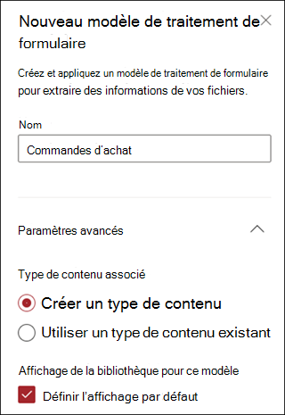
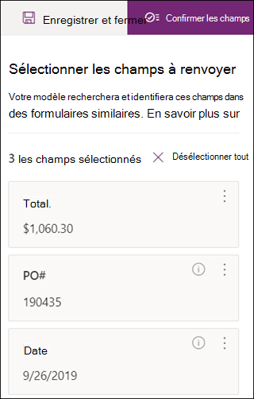

# Créer un modèle de traitement de formulaire dans Microsoft SharePoint Syntex

 

> [!VIDEO https://www.microsoft.com/videoplayer/embed/RE4GnhN]  

 

Grâce à [AI Builder](https://docs.microsoft.com/ai-builder/overview), une fonctionnalité de Microsoft PowerApps, les utilisateurs de SharePoint Syntex peuvent créer un [modèle de traitement de formulaire](form-processing-overview.md) directement à partir d’une bibliothèque de documents SharePoint. 

Pour créer un modèle de traitement de formulaire, vous devez suivre les étapes suivantes :
 - Étape 1 : créer le modèle de traitement de formulaire pour créer le type de contenu
 - Étape 2 : ajouter et analyser des fichiers d’exemple
 - Étape 3 : sélectionner vos champs de formulaire
 - Étape 4 : entraîner et tester votre modèle
 - Étape 5 : publier votre modèle
 - Étape 6 : utiliser votre modèle

## Conditions préalables

Vous pouvez créer un modèle de traitement de formulaire uniquement dans les bibliothèques de documents SharePoint pour lesquelles il est activé. Si le traitement de formulaire est activé, vous pouvez voir le **AI Builder** **« Créer un modèle de traitement de formulaire »** dans le menu **Automatiser** de votre bibliothèque de documents.  Si vous souhaitez que le traitement soit activé sur votre bibliothèque de documents, vous devez contacter votre administrateur SharePoint.

  

## Étape 1 : créer un modèle de traitement de formulaire

La première étape de la création d’un modèle de traitement de formulaire consiste à le nommer, à créer le nouveau type de contenu et à créer une nouvelle vue de bibliothèque de documents pour celui-ci.

1. Dans la bibliothèque de documents, sélectionnez le menu **Automatiser**, puis **AI Builder**, et enfin **Créer un modèle de traitement de formulaire**.

     

2. Dans le volet **Nouveau modèle de traitement de formulaire**, dans le champ **Nom**, saisissez un nom pour votre modèle (par exemple, *Bons de commande*).

      

3. Lorsque vous créez un modèle de traitement de formulaire, vous créez un nouveau type de contenu SharePoint. Un type de contenu SharePoint représente une catégorie de documents qui ont des caractéristiques communes et qui partagent une collection de colonnes ou de propriétés de métadonnées pour ce contenu spécifique. Les types de contenu SharePoint sont gérés via la [galerie des types de contenu]().

    Sélectionnez **Paramètres avancés** si vous souhaitez mapper ce modèle à un type de contenu existant dans la galerie des types de contenu SharePoint, pour utiliser son schéma. 

4. Votre modèle crée une nouvelle vue dans votre bibliothèque de documents pour vos données extraites. Si vous ne souhaitez pas que la vue par défaut soit définie, désélectionnez **Définir la vue par défaut**.

5. Sélectionnez **Créer**.

## Étape 2 : ajouter et analyser des documents

Après avoir créé votre nouveau modèle de traitement de formulaire, votre navigateur ouvre une nouvelle page de modèle de traitement de formulaires AI Builder dans PowerApps. Sur cette page, vous pouvez ajouter et analyser vos exemples de documents.  

> [!NOTE]
> Lorsque vous recherchez des exemples de fichiers à utiliser, consultez l’article [Configuration requise et limitations du modèle de traitement de formulaire](https://docs.microsoft.com/ai-builder/form-processing-model-requirements). 

     
 
1. Sélectionnez **Ajouter des documents** pour commencer à ajouter des exemples de documents analysés afin de déterminer les paires de valeurs nommées pouvant être extraites. Vous pouvez ensuite choisir de **Télécharger à partir du stockage local**, de **SharePoint** ou du **Stockage Blob Azure**. Vous devez utiliser au moins cinq fichiers pour la formation.

2. Après avoir ajouté des fichiers, sélectionnez **Analyser** pour vérifier les informations communes à tous les fichiers. Cette opération peut prendre quelques minutes.  
 
      

3. Une fois les fichiers analysés, dans la page **Sélectionnez les champs de formulaire à enregistrer**, sélectionnez le fichier pour afficher les champs détectés. 

      

## Étape 3 : sélectionner vos champs de formulaire

Après avoir analysé les documents pour les champs, vous pouvez maintenant voir les champs trouvés et identifier ceux que vous souhaitez enregistrer. Les champs enregistrés s’affichent sous forme de colonnes dans la vue de la bibliothèque de documents de votre modèle et montrent les valeurs extraites de chaque document.

1. La page suivante affiche l’un de vos exemples de fichiers et mettra en évidence tous les champs communs qui ont été automatiquement détectés par le système.  

      

2. Sélectionnez les champs que vous souhaitez enregistrer et cochez la case pour confirmer votre sélection. Par exemple, dans le modèle Bon de commande, choisissez de sélectionner les champs *Date*, *B.C.* et *Total*.  Notez que vous pouvez également choisir de renommer un champ si vous le souhaitez.  

      

3. Si un champ n’a pas été détecté par l’analyse, vous pouvez toujours choisir de l’ajouter. Sélectionnez les informations que vous souhaitez extraire et, dans la zone de nom, saisissez le nom souhaité. Cochez ensuite la case. Notez que vous devez confirmer les champs non détectés dans vos fichiers d’exemple restants.

4. Cliquez sur **Confirmer les champs** après avoir sélectionné les champs que vous souhaitez enregistrer.  
 
      
 
5. Sur la page **Sélectionnez les champs de formulaire que vous souhaitez enregistrer**, le nombre de champs que vous avez sélectionnés s’affiche. Sélectionnez **Terminé**.

## Étape 4 : entraîner et tester votre modèle

Après avoir sélectionné les champs que vous souhaitez enregistrer, la page **Résumé du modèle** vous permet d’entraîner et de tester votre modèle.

1. Sur la page **Résumé du modèle**, les champs enregistrés s’afficheront dans la section **Champs sélectionnés**. Sélectionnez **Entraîner** pour commencer la formation sur vos fichiers d’exemple. Notez que cette opération peut prendre quelques minutes. 

       

2. Lorsque vous voyez la notification indiquant que la formation est terminée, sélectionnez **Accéder à la page Informations**. 

3. Sur la page **Informations sur le modèle**, vous pouvez choisir de tester le fonctionnement de votre modèle en sélectionnant **Test rapide**. Cela vous permet de glisser et déposer des fichiers sur la page et de voir si les champs sont détectés.

      

2. Lorsque vous voyez la notification indiquant que la formation est terminée, sélectionnez **Accéder à la page Informations**. 

3. Sur la page **Informations sur le modèle**, choisissez de tester le fonctionnement de votre modèle en sélectionnant **Test rapide**. Cela vous permet de glisser et déposer des fichiers sur la page et de voir si les champs sont détectés.

## Étape 5 : publier votre modèle

1. Si vous êtes satisfait des résultats de votre modèle, sélectionnez **Publier** afin de pouvoir l’utiliser.

2. Une fois le modèle publié, sélectionnez **Utiliser le modèle**. Cela crée un flux PowerAutomate qui peut s’exécuter dans votre bibliothèque de documents SharePoint et qui extrait les champs qui ont été identifiés dans le modèle. Ensuite, sélectionnez **Créer un flux**.
  
3. Une fois terminé, vous verrez le message **Votre flux a été créé avec succès**.
 
## Étape 6 : utiliser votre modèle

Après avoir publié votre modèle et créé son flux PowerAutomate, vous pouvez l’utiliser dans votre bibliothèque de documents SharePoint.

1. Après avoir publié votre modèle, sélectionnez **Accéder à SharePoint** pour accéder à votre bibliothèque de documents.

2. Dans la vue du modèle de la bibliothèque de documents, notez que les champs que vous avez sélectionnés s’affichent désormais sous forme de colonnes. 

      

3. Notez que le lien Informations en regard de **Documents** indique qu’un modèle de traitement de formulaire est appliqué à cette bibliothèque de documents.

       

4. Téléchargez des fichiers dans votre bibliothèque de documents. Tous les fichiers que le modèle identifie comme son type de contenu répertorient les fichiers dans votre vue et affichent les données extraites dans les colonnes. 

       

## Voir aussi
  
[Documentation Power Automate](https://docs.microsoft.com/power-automate/)

[Formation : Améliorer les performances de votre entreprise avec AI Builder](https://docs.microsoft.com/learn/paths/improve-business-performance-ai-builder/?source=learn)
