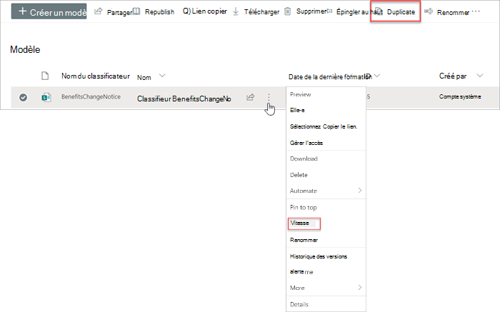

# Dupliquer un modèle dans Microsoft SharePoint SyntexDuplicate a model in Microsoft SharePoint Syntex

La duplication d'un modèle de compréhension de document peut vous faire gagner du temps et vous épargner des efforts si vous devez créer un nouveau modèle et si vous savez qu'un modèle existant est très similaire à ce dont vous avez besoin.Duplicating a document understanding model can save you time and effort if you need to create a new model, and know that an existing model is very similar to what you need.

Par exemple, un modèle existant nommé « Contrats » classe les mêmes fichiers que ceux avec lesquels vous devez travailler.For example, an existing model named “Contracts” classifies the same files you need to work with. Votre nouveau modèle extraira certaines des données existantes, mais devra être mis à jour pour extraire des données supplémentaires.Your new model will extract some of the existing data, but will need to be updated to extract some additional data. Au lieu de créer et de former un nouveau modèle à partir de zéro, vous pouvez utiliser la fonction de duplication de modèle pour faire une copie du modèle de contrats, qui copiera également tous les éléments de formation associés, tels que les fichiers d'exemple et les extracteurs d'entités.Instead of creating and training a new model from scratch, you can use the duplicate model feature to make a copy of the Contracts model, which will also copy all associated training items, such as example files and entity extractors.

Lorsque vous dupliquez le modèle, après l'avoir renommé (par exemple, en «Renouvellements de contrats»), vous pouvez ensuite le mettre à jour.When you duplicate the model, after you rename it (for example, to “Contract Renewals”), you can then make updates to it. Par exemple, vous pouvez choisir de supprimer certains des champs extraits existants dont vous n'avez pas besoin, puis entraîner le modèle à en extraire un nouveau (par exemple, «Date de renouvellement»).For example, you can choose to remove some of the existing extracted fields that you don’t need, and then train the model to extract a new one (for example, “Renewal date”).

## Dupliquer un modèleDuplicate a model

Suivez ces étapes pour dupliquer un modèle de compréhension de document.Follow these steps to duplicate a document understanding model.

1. Dans le centre de contenu, sélectionnez **Modèles** pour afficher la liste de vos modèles.From the content center, select **Models** to see your models list.

2. Sur la page **Modèles**, sélectionnez le modèle que vous souhaitez dupliquer.On the **Models** page, select the model you want to duplicate.

3. En utilisant le ruban ou le bouton **Afficher les actions** (à côté du nom du modèle), sélectionnez **Dupliquer**.By using either the ribbon or the **Show actions** button (next to the model name), select **Duplicate**. 

      

4. Dans le panneau **Dupliquer le modèle** :On the **Duplicate model** panel:

   a.a. Sous **Nom** , saisissez le nouveau nom du modèle que vous souhaitez dupliquer.Under **Name**, enter the new name of the model that you want to duplicate. 

      

   b.b. Sous **Description**, ajoutez une description de votre nouveau modèle.Under **Description**, add a description of your new model.

   c.c. (Facultatif) Sous **Paramètres avancés** , sélectionnez si vous voulez associer un [type de contenu](/sharepoint/governance/content-type-and-workflow-planning#content-type-overview) existant .(Optional) Under **Advanced settings**, select whether you want to associate an existing [content type](/sharepoint/governance/content-type-and-workflow-planning#content-type-overview).

5. Sélectionnez **Dupliquer**.Select **Duplicate**.

## Voir aussiSee Also
[Créer un classificateurCreate a classifier](create-a-classifier.md)

[Renommer un modèleRename a model](rename-a-model.md)

[Créer un extracteurCreate an extractor](create-an-extractor.md)

[Présentation de la compréhension de documentDocument Understanding overview](document-understanding-overview.md)

[Types d’explicationsExplanation types](explanation-types-overview.md)

[Appliquer un modèleApply a model](apply-a-model.md) 

[Mode d’accessibilité Syntex de SharePointSharePoint Syntex Accessibility Mode](accessibility-mode.md)