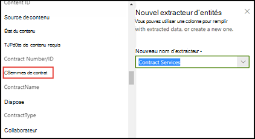

# Utiliser la taxonomie du magasin de termes lors de la création d’un extracteurLeverage term store taxonomy when creating an extractor

 

> [!VIDEO https://www.microsoft.com/videoplayer/embed/RE4GpJJ]  

 

Lorsque vous créez un extracteur dans votre modèle de compréhension de document via SharePoint Syntex, vous pouvez tirer parti des ensembles de termes globaux [Services de métadonnées gérées](https://docs.microsoft.com/sharepoint/managed-metadata) pour afficher les termes recommandés concernant les données extraites.When you create an extractor in your document understanding model using SharePoint Syntex, you can take advantage of global term sets in the [term store](https://docs.microsoft.com/sharepoint/managed-metadata) to display preferred terms for data that you extract.  

Par exemple, votre modèle identifie et classe tous les documents **Contrat** chargés dans la bibliothèque de documents.As an example, your model identifies and classifies all **Contract** documents that are uploaded to the document library.  De plus, le modèle extrait également une valeur de **service de contrat** de chaque contrat et l’affiche dans une colonne de la vue de la bibliothèque.Additionally, the model also extracts a **Contract Service** value from each contract, and will display it in a column in your library view. Les diverses valeurs de services des contrats incluent plusieurs éléments plus anciens, à présent inutilisés par votre société et renommés.Among the various Contract Services values in the contracts, there are several older values that your company no longer uses and have been renamed. Par exemple, toutes les références aux termes *Conception*, *Graphiques* ou *Topographie* (services de contrat) doivent à présent recevoir l’appellation *Créatif*.For example, all references to the terms *Design*, *Graphics*, or *Topography* contract services should now be called *Creative*. Chaque fois que votre modèle extrait l’un des termes obsolètes d’un document contractuel, il doit afficher le terme à jour, à savoir Créatif, dans la vue de la bibliothèque.Whenever your model extracts one of the outdated terms from a contract document, you want it to display the current term - Creative - in your library view. Dans l’exemple ci-après, lors de la formation du modèle, nous constatons qu’un exemple de document contient le terme obsolète *Conception*.In the example below, while training the model we see that one sample document contains the outdated term of *Design*.

    

## Utiliser une colonne de métadonnées gérées dans l’extracteurUse a Managed metadata column in your extractor

Les ensembles de termes sont configurés dans le magasin de termes Services de métadonnées gérées (MMS) dans le Centre d’administration SharePoint.Term sets are configured in the Managed Metadata services (MMS) term store in the SharePoint admin center. Dans l’exemple ci-dessous, *l’ensemble de termes* [Services de contrat](https://docs.microsoft.com/sharepoint/managed-metadata#term-set) est configuré pour inclure un certain nombre de termes, y compris *Créatif*.In the the example below, the *Contract Services* [term set](https://docs.microsoft.com/sharepoint/managed-metadata#term-set) is configured to include a number of terms, including *Creative*.  Les détails indiquent que le terme a trois synonymes (*Conception*, *Graphiques* et *Topographie*). Il convient de les renommer *Créatif*.The details for it show that the term has three synonyms (*Design*, *Graphics*, and *Topography*) and the synonyms should be translated to *Creative*. 

    

Plusieurs raisons peuvent expliquer le désir d’utiliser un synonyme de votre ensemble de termes.There could be a number of reasons why you might want to use a synonym in your term set. Par exemple, cet ensemble peut inclure des termes obsolètes, des termes renommés ou des termes différents en fonction des services de votre organisation.For example, there could be outdated terms, renamed terms, or variations between your organizations departments on naming.

Pour pouvoir sélectionner le champ de métadonnées gérées lorsque vous créez l’extracteur dans votre modèle, vous devez [l’ajouter en tant que colonne de site de métadonnées gérées](https://support.microsoft.com/office/8fad9e35-a618-4400-b3c7-46f02785d27f).To make the managed metadata field available for you to select when you create your extractor in your model, you need to [add it as a managed-metadata site column](https://support.microsoft.com/office/8fad9e35-a618-4400-b3c7-46f02785d27f). Après avoir ajouté la colonne de site, vous pouvez la sélectionner lorsque vous créez l’extracteur de votre modèle.After you add the site column, it will be available for you to select when you create the extractor for your model.

    

Une fois votre modèle appliqué à la bibliothèque de documents, lors du chargement des documents dans la bibliothèque, la colonne *Services de création* affiche le terme recommandé (*Créatif*) quand l’extracteur trouve l’une des valeurs synonymes (*Conception*, *Graphiques* et *Topographie*).After applying your model to the document library, when documents are uploaded to library, the *Creative Services* column will display the preferred term (*Creative*) when the extractor finds any of the synonym values (*Design*, *Graphics*, and *Topography*).

    

## Voir aussiSee Also
[Présentation des métadonnées géréesIntroduction to Managed Metadata](https://docs.microsoft.com/sharepoint/managed-metadata#terms)

[Créer un extracteurCreate an extractor](create-an-extractor.md)

[Créer une colonne de métadonnées géréesCreate a managed metadata column](https://support.microsoft.com/office/create-a-managed-metadata-column-8fad9e35-a618-4400-b3c7-46f02785d27f?redirectSourcePath=%252farticle%252fc2a06717-8105-4aea-890d-3082853ab7b7&ui=en-US&rs=en-US&ad=US)

