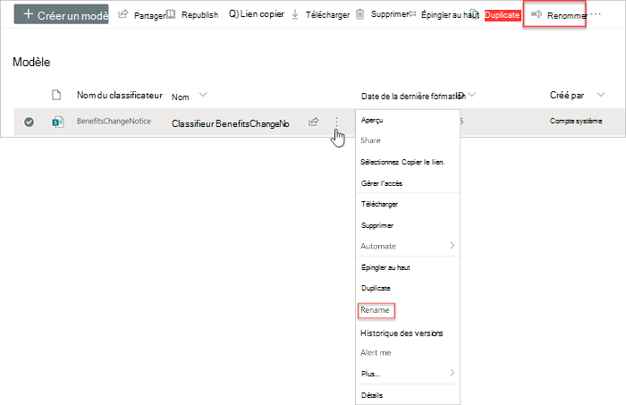
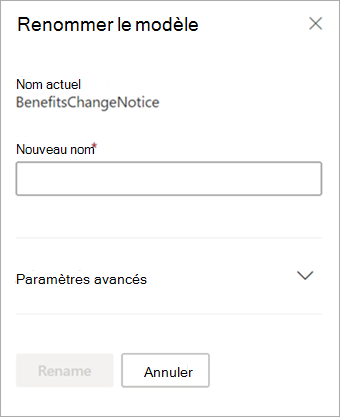

# Renommer un modèle dans Microsoft SharePoint SyntexRename a model in Microsoft SharePoint Syntex

À un moment donné, vous pouvez vouloir renommer un modèle de compréhension de document.At some point, you might want to rename a document understanding model. Par exemple, lorsque vous créez une première version d'un modèle, vous n'avez peut-être pas beaucoup réfléchi au nom final (par exemple, vous l'avez peut-être nommé «AlexWilburModel1»).A common example is when you create an initial draft of a model, you might not have given a lot of thought as to the final name (for example, you might have named it “AlexWilburModel1”). À l’approche de la finalisation du modèle et de l’utilisation du modèle, vous rendez compte qu’un nom plus approprié serait « Renouvellement du contrat » et que vous souhaitez le renommer.As you come closer to finalizing the model and putting it to use, you realize that a more proper name would be “Contract Renewals,” and you want to rename it.  

Un autre exemple est celui de la décision de votre organisation de désigner un processus ou un type de document par un nom différent.Another example is when your organization makes a decision to refer to a process or document type by a different name. Par exemple, une fois que vous avez créé votre modèle et que vous êtes prêt à l'appliquer, votre organisation peut décider que tous les «contrats» seront désormais officiellement appelés «accords».For example, after you create your model and are ready to apply it, your organization might mandate that all “Contracts” will now formally be referred to as “Agreements.” Si nécessaire, vous pouvez choisir de renommer votre modèle de «Renouvellement de contrat» en «Renouvellement d'accord».If needed, you can choose to rename your model from “Contract Renewals” to “Agreement Renewals.”

> [!IMPORTANT]
> Vous ne pouvez renommer un modèle de compréhension de document que s'il n'a pas été appliqué à une bibliothèque de documents.You can only rename a document understanding model if it has not been applied to a document library. 

En renommant un modèle, on renomme également le [type de contenu](/sharepoint/governance/content-type-and-workflow-planning#content-type-overview) qui lui est associé.Renaming a model also renames the [content type](/sharepoint/governance/content-type-and-workflow-planning#content-type-overview) that is associated with the model.

## Renommer un modèleRename a model

Suivez ces étapes pour renommer un modèle de compréhension de document.Follow these steps to rename a document understanding model.

1. Dans le centre de contenu, sélectionnez **Modèles** pour afficher la liste de vos modèles.From the content center, select **Models** to see your models list.

2. Sur la page **Modèles**, sélectionnez le modèle que vous souhaitez renommer.On the **Models** page, select the model you want to rename.

3. En utilisant le ruban ou le bouton **Afficher les actions** (à côté du nom du modèle), sélectionnez **Renommer** .By using either the ribbon or the **Show actions** button (next to the model name), select **Rename**.  

      

4. Dans le **renommer le modèle** panneau :On the **Rename model** panel:

   a.a. Sous **Nouveau nom** , entrez le nouveau nom du modèle que vous voulez renommer.Under **New name**, enter the new name of the model that you want to rename. 

      

   b.b. (Facultatif) Sous **Paramètres avancés** , sélectionnez si vous voulez associer un [type de contenu](/sharepoint/governance/content-type-and-workflow-planning#content-type-overview) existant .(Optional) Under **Advanced settings**, select whether you want to associate an existing [content type](/sharepoint/governance/content-type-and-workflow-planning#content-type-overview). Si vous choisissez **Utiliser un type de contenu existant**, le modèle sera renommé pour correspondre au type de contenu sélectionné.If you choose **Use an existing content type**, the model will be renamed to match the selected content type.

5. Sélectionnez **Renommer**.Select **Rename**.

## Voir aussiSee Also
[Créer un classificateurCreate a classifier](create-a-classifier.md)

[Créer un extracteurCreate an extractor](create-an-extractor.md)

[Renommer un extracteurRename an extractor](rename-an-extractor.md)

[Présentation de la compréhension de documentDocument Understanding overview](document-understanding-overview.md)

[Types d’explicationsExplanation types](explanation-types-overview.md)

[Appliquer un modèleApply a model](apply-a-model.md) 
