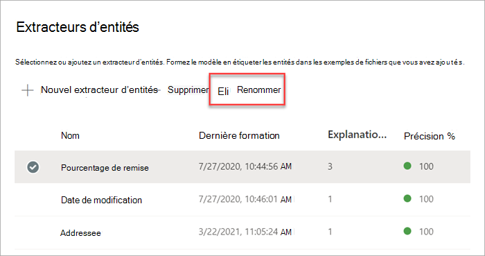

# Renommer un extracteur dans Microsoft SharePoint SyntexRename an extractor in Microsoft SharePoint Syntex

À un moment donné, vous devrez peut-être renommer un extracteur si vous souhaitez faire référence à un champ de données extrait par un nom différent.At some point, you might need to rename an extractor if you want to refer to an extracted data field by a different name. Par exemple, votre organisation décide d'apporter des modifications à ses documents contractuels et désigne les «clients» par le terme «clients» dans ses documents.For example, your organization decides to make changes to their contract documents, and refers to “customers” as “clients” in their documents. Si vous extrayez un champ «Client» dans votre modèle, vous pouvez choisir de le renommer en «Client».If you were extracting a “Customer” field in your model, you can choose to rename it to “Client.”

Lorsque vous synchronisez votre modèle mis à jour avec votre bibliothèque de documents SharePoint, vous verrez une nouvelle colonne «Client» dans la vue de votre bibliothèque de documents.When you sync your updated model to your SharePoint document library, you will see a new “Client” column in your document library view. Votre vue conservera la colonne «Client» pour les activités passées, mais mettra à jour la nouvelle colonne «Client» pour tous les nouveaux documents traités par votre modèle.Your view will retain the “Customer” column for past activity, but will update the new “Client” column for all new documents that are processed by your model. 

> [!IMPORTANT]
>  Assurez-vous de synchroniser votre modèle mis à jour avec les bibliothèques de documents où vous l'aviez précédemment appliqué pour que le nouveau nom de colonne s'affiche.Make sure to sync your updated model to the document libraries where you had previously applied it for the new column name to display. 

## Renommer un extracteurRename an extractor

Suivez ces étapes pour renommer un extracteur d'entité.Follow these steps to rename an entity extractor.

1. Dans le centre de contenu, sélectionnez **Modèles** pour afficher votre liste de modèles.From the content center, select **Models** to see your models list.

2. Sur la page **Modèles**, dans la colonne **Nom**, sélectionnez le modèle pour lequel vous souhaitez renommer un extracteur.On the **Models** page, in the **Name** column, select the model for which you want to rename an extractor.

3. Sous **'entité**, sélectionnez le nom de l’extracteur que vous voulez renommer, puis sélectionnez **Renommer**.Under **Entity extractors**, select the name of the extractor you want to rename, and then select **Rename**. 

      

4. Sur **le panneau de l'extracteur** d'entité Renommer :On the **Rename entity extractor** panel:

   a.a. Sous **Nouveau nom**, saisissez le nouveau nom de l'extracteur.Under **New name**, enter the new name of the extractor. 

      

   b.b. (Facultatif) Sous **Paramètres avancés**, sélectionnez si vous voulez associer une colonne de site existante.(Optional) Under **Advanced settings**, select whether you want to associate an existing site column.

5. Sélectionnez **Renommer**.Select **Rename**.

## Voir aussiSee Also
[Créer un extracteurCreate an extractor](create-an-extractor.md)

[Créer un classificateurCreate a classifier](create-a-classifier.md)

[Renommer un modèleRename a model](rename-a-model.md)

[Types d’explicationsExplanation types](explanation-types-overview.md)

[Utiliser la taxonomie du magasin de termes lors de la création d’un extracteurLeverage term store taxonomy when creating an extractor](leverage-term-store-taxonomy.md)

[Présentation de la compréhension de documentDocument Understanding overview](document-understanding-overview.md)

[Appliquer un modèleApply a model](apply-a-model.md) 
