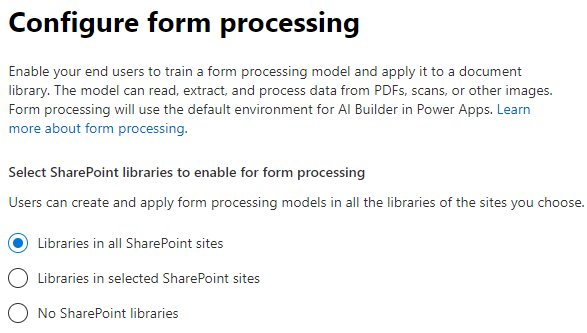

# Configurer la présentation du contenu (aperçu)

> [!Note] 
> Le contenu de cet article est destiné à Project cortex privé preview. Pour [plus d’informations sur le projet cortex](https://aka.ms/projectcortex).

Les administrateurs peuvent utiliser le centre d’administration Microsoft 365 pour configurer et configurer la compréhension du contenu. 

Avant de procéder à l’installation, veillez à planifier la meilleure façon de configurer et de configurer la compréhension du contenu dans votre environnement. Par exemple, vous devez prendre en compte les éléments suivants :
- Quels sites SharePoint allez-vous activer le traitement de formulaires ? Tous les sites, certains d’entre eux ou certains sites sélectionnés ?
- Nom de votre centre de contenu, et qui est l’administrateur de site principal ?

Un administrateur peut également modifier les paramètres sélectionnés à tout moment après l’installation par le biais des paramètres de présentation du contenu du centre d’administration 365 de Microsoft.

## Configuration requise 
Vous devez disposer d’autorisations d’administrateur général ou d’administrateur SharePoint pour pouvoir accéder au centre d’administration Microsoft 365 et configurer le mémorandum d’accord sur le contenu.

## Pour configurer la présentation du contenu

1. Dans le centre d’administration 365 de Microsoft, sélectionnez **configuration**, puis affichez la section connaissances de l' **organisation** .
2. Dans la section connaissances de l' **organisation** , sélectionnez **automatiser la compréhension du contenu**. 

     

3. Sur la page **automatiser le contenu** , cliquez sur **prise en main** pour vous guider tout au long du processus de configuration. 

     

4. Sur la page **configurer le traitement du formulaire** , vous pouvez choisir d’autoriser les utilisateurs à utiliser le générateur ai pour créer des modèles de traitement de formulaires dans des bibliothèques de documents SharePoint spécifiques. Une option de menu est disponible dans le ruban bibliothèque de documents pour **créer un modèle de traitement de formulaire** dans les bibliothèques de documents SharePoint dans lesquelles il est activé.
 
     Pour **que les bibliothèques SharePoint affichent l’option permettant de créer un modèle de traitement de formulaire**, vous pouvez sélectionner : 
    - **Toutes les bibliothèques SharePoint** pour les mettre à la disposition de toutes les bibliothèques SharePoint dans votre client. 
    - **Uniquement les bibliothèques de sites sélectionnés**, puis sélectionnez les sites dans lesquels vous souhaitez les mettre à disposition. 
    - **Aucune bibliothèque SharePoint** si vous ne souhaitez pas le mettre à la disposition de tous les sites (vous pouvez modifier ce paramètre après l’installation).
 

   
 

   > [!Note]
   > L’activation de ce paramètre sur une bibliothèque de documents SharePoint n’affecte pas les modèles existants appliqués à la bibliothèque ou la possibilité d’appliquer des modèles de présentation de document à une bibliothèque. 

    
5. Sur la page **créer un centre de contenu** , vous pouvez créer un site Centre de contenu SharePoint sur lequel vos utilisateurs peuvent créer et gérer des modèles de présentation de documents.  
    a. Pour **nom du site**, tapez le nom que vous souhaitez donner à votre site Centre de contenu. 
    b. L' **adresse du site** indique l’URL de votre site, en fonction de ce que vous avez sélectionné pour le nom du site. 

    > [!Note] 
    > Bien que vous puissiez sélectionner n’importe quelle langue prise en charge, Notez que les modèles de présentation du contenu ne peuvent être créés que pour l’anglais. 

       

    Sélectionnez **Suivant**.
6. Sur la page **Terminer et vérifier** , vous pouvez examiner le paramètre que vous avez sélectionné et choisir d’effectuer des modifications. Si vos sélections vous conviennent, sélectionnez **activer**.

7. La page **content Understanding activation** s’affiche, confirmant que le système a ajouté vos préférences de traitement de formulaire et créé le site du centre de contenu. Sélectionnez **Terminé**.

8. Vous serez redirigé vers la page **automatiser le contenu** . À partir de cette page, vous pouvez sélectionner **gérer** pour modifier vos paramètres de configuration. 

## Voir aussi

  

