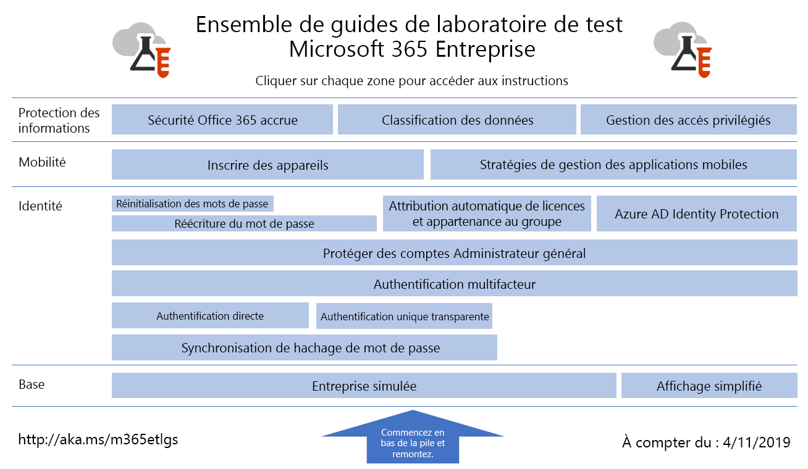

# Guides de laboratoire de test Microsoft 365 pour entreprise

*Sont valables pour Microsoft 365 pour entreprise et Office 365 Entreprise*.

Test Lab Guides (TLGs) help you quickly learn about Microsoft products. They provide prescriptive instructions to configure simplified but representative test environments. You can use these environments for demonstration, customization, or creation of complex proofs of concept for the duration of a trial or paid subscription. 

TLGs are designed to be modular. They build upon each other to create multiple configurations that more closely match your learning or test configuration needs. The "I built it out myself and it works" hands-on experience helps you understand the deployment requirements of a new product or scenario so you can better plan for hosting it in production.

Les guides de laboratoire de test vous permettent également de créer des environnements représentatifs pour le développement et le test d’applications, également connus sous le nom d’environnements de développement/test.
  

Accédez à [Test Lab Guide Stack](../media/m365-enterprise-test-lab-guides/Microsoft365EnterpriseTLGStack.pdf) pour afficher le plan visuel de tous les articles de l’ensemble des guides de laboratoire de test de Microsoft 365 pour entreprise.

## Configuration de base

First, you create a test environment for [Microsoft 365 for enterprise](https://docs.microsoft.com/microsoft-365-enterprise/) that includes Office 365 E5, Enterprise Mobility + Security (EMS) E5, and Windows 10 Enterprise. You can create two different types of base configurations:

- Utilisez la [configuration de base minimale](lightweight-base-configuration-microsoft-365-enterprise.md) pour configurer et faire une démonstration des fonctionnalités de Microsoft 365 pour entreprise dans un environnement cloud uniquement, sans aucun composant local.

- Utilisez la [configuration de base d’une entreprise simulée](simulated-ent-base-configuration-microsoft-365-enterprise.md) pour configurer et démontrer des fonctionnalités de Microsoft 365 pour entreprise dans un environnement cloud hybride, qui utilise des composants locaux à l’instar d’un domaine Windows Server Active Directory (AD DS).

Vous pouvez également créer des environnements de test pour Office 365 E5 sans ajouter la licence Microsoft 365 E5 à votre version d’évaluation ou à votre environnement de test de production.
    
## Identité

Pour obtenir une description des fonctionnalités liées à l’identité, reportez-vous aux ressources suivantes :

- [Synchronisation de hachage de mot de passe](password-hash-sync-m365-ent-test-environment.md)
  
   Activez et testez la synchronisation de répertoires basée sur le hachage de mots de passe à partir d’un contrôleur de domaine AD DS.

- [Authentification directe](pass-through-auth-m365-ent-test-environment.md)
  
   Activez et testez l’authentification directe à un contrôleur de domaine Windows Server AD DS.

- [Authentification fédérée](federated-identity-for-your-office-365-dev-test-environment.md)
  
   Activez et testez l’authentification fédérée à un contrôleur de domaine Windows Server AD DS.

- [Authentification unique transparente Azure AD](single-sign-on-m365-ent-test-environment.md)
  
   Activer et tester l’authentification unique transparente Azure AD (SSO) avec un contrôleur de domaine Windows Server AD.

- [Authentification multifacteur](multi-factor-authentication-microsoft-365-test-environment.md)
  
   Activez et testez l’authentification multifacteur sur smartphone pour un compte utilisateur spécifique.

- [Protéger des comptes Administrateur général](protect-global-administrator-accounts-microsoft-365-test-environment.md)
 
   Verrouillez vos comptes d’administrateur général avec des stratégies d’accès conditionnel.

- [Écriture différée de mot de passe](password-writeback-m365-ent-test-environment.md)

   Utilisez l’écriture différée de mot de passe pour modifier le mot de passe de votre compte d’utilisateur Windows Server AD DS à partir d’Azure AD.

- [Réinitialisation des mots de passe](password-reset-m365-ent-test-environment.md)

   Utilisez la réinitialisation du mot de passe en libre-service (SSPR) pour réinitialiser votre mot de passe.

- [Attribution automatique de licences et appartenance au groupe](automate-licenses-group-membership-microsoft-365-test-environment.md)

   Facilitez l’administration des nouveaux comptes grâce à l’attribution automatique de licences et l’appartenance au groupe dynamique.

- [Azure AD Identity Protection](azure-ad-identity-protection-microsoft-365-test-environment.md)

   Recherchez des vulnérabilités dans vos comptes utilisateur actuel.

- [Accès aux identités et appareils](identity-device-access-m365-test-environment.md)

   Créez un environnement pour tester les configurations recommandées pour l’accès aux identités aux appareils et les stratégies d’accès conditionnel.

## Gestion des appareils mobiles

Pour obtenir une description des fonctionnalités liées à la gestion des appareils mobiles, reportez-vous aux ressources suivantes :

- [Stratégies de conformité d’appareil](mam-policies-for-your-microsoft-365-enterprise-dev-test-environment.md)
    
   Créez un groupe d’utilisateurs et une stratégie de conformité d’appareil pour les appareils Windows 10.
    
- [Inscription d’appareils iOS et Android](enroll-ios-and-android-devices-in-your-microsoft-enterprise-365-dev-test-environ.md)
   
   Inscrivez des appareils iOS ou Android et gérez-les à distance.

## Protection des informations

Pour faire la démonstration de fonctionnalités liées à la protection des informations, reportez-vous à :

- [Sécurité Microsoft 365 renforcée](increased-o365-security-microsoft-365-enterprise-dev-test-environment.md)
    
   Configurez les paramètres pour une sécurité Microsoft 365 renforcée et examinez les outils de sécurité intégrée.
  
- [Classification des données](data-classification-microsoft-365-enterprise-dev-test-environment.md)
    
   Configurez et appliquez des étiquettes à un document dans un site d’équipe SharePoint Online.
    
- [Gestion des accès privilégiés](privileged-access-microsoft-365-enterprise-dev-test-environment.md)
    
   Configurez la gestion des accès privilégiés pour un accès juste-à-temps aux tâches élevées et privilégiées dans votre organisation.

