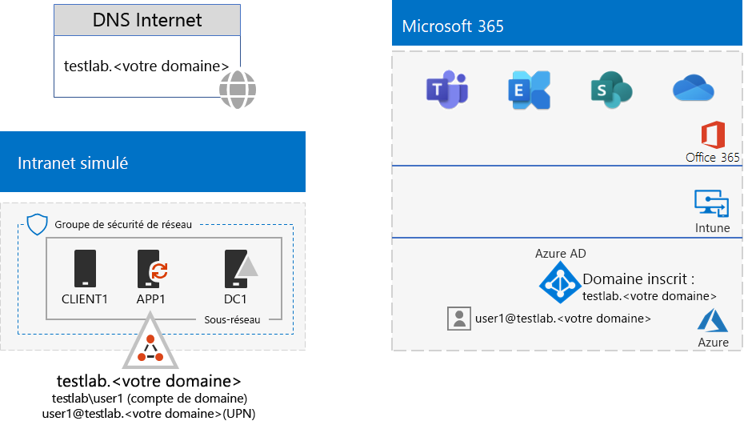

# <a name="identity-and-device-access-prerequisites-for-password-hash-synchronization-in-your-microsoft-365-test-environment"></a>Conditions préalables d’accès aux identités et appareils pour la synchronisation du hachage du mot de passe dans votre environnement de test Microsoft 365

*Ce Guide de Laboratoire Test peut uniquement être utilisé pour les environnements de test Microsoft 365 Entreprise*.

Les [configurations d’accès aux identités et appareils](microsoft-365-policies-configurations.md) sont un ensemble de configurations et stratégies d’accès conditionnel pour protéger l’accès à tous les services qui sont intégrés avec Azure Active Directory (Azure AD), dont Office 365 et Enterprise Mobility + Security dans Microsoft 365 Entreprise.

Cet article décrit comment configurer un environnement de test Microsoft 365 qui respecte les exigences de [configuration préalable de synchronisation du hachage du mot de passe Active Directory](identity-access-prerequisites.md#prerequisites) pour l’accès aux identités et appareils.

La configuration de cet environnement de test comprend huit étapes :

1.  Créer une entreprise simulée avec un environnement de test de synchronisation du hachage du mot de passe
2.  Configurer l’authentification unique transparente Azure AD
3.  Configurer des emplacements nommés
4.  Configurer la réécriture du mot de passe
5.  Configurer la réinitialisation de mot de passe en libre-service pour tous les comptes d’utilisateur
6.  Configurer l’authentification multifacteur pour tous les comptes d’utilisateur
7.  Activer Azure AD Identity Protection
8.  Activer l’authentification moderne pour Exchange Online et Skype Entreprise Online

## <a name="phase-1-build-out-your-simulated-enterprise-with-password-hash-sync-microsoft-365-test-environment"></a>Étape 1 : Construire votre entreprise simulée avec un environnement de test Microsoft 365 pour la synchronisation du hachage du mot de passe

Suivez les instructions de [Synchronisation du hachage du mot de passe](password-hash-sync-m365-ent-test-environment.md).
Voici la configuration obtenue.


 
## <a name="phase-2-configure-azure-ad-seamless-single-sign-on"></a>Étape 2 : Configurer l’authentification unique transparente Azure AD

Suivez les instructions de [Phase 2 du guide laboratoire test de l’authentification transparente unique Azure AD](single-sign-on-m365-ent-test-environment.md#phase-2-configure-azure-ad-connect-on-app1-for-azure-ad-seamless-sso).

## <a name="phase-3-configure-named-locations"></a>Étape 3 : configurer des emplacements nommés

Tout d’abord, déterminer les adresses IP publiques ou les plages d’adresse utilisées par votre organisation.

Ensuite, suivez les instructions de [configurer des emplacements nommé dans Azure Active Directory](https://docs.microsoft.com/azure/active-directory/reports-monitoring/quickstart-configure-named-locations) pour ajouter les adresses ou les plages d’adresses comme emplacements nommés. 

## <a name="phase-4-configure-password-writeback"></a>Étape 4 : configurer l’écriture différée du mot de passe

Suivez les instructions dans [Phase 2 du guide de laboratoire de test réinitialisation de mot de passe](password-writeback-m365-ent-test-environment.md#phase-2-enable-password-writeback-for-the-testlab-ad-ds-domain).

## <a name="phase-5-configure-self-service-password-reset"></a>Étape 5 : configurer la réinitialisation du mot de passe libre-service

Suivez les instructions du Guide de laboratoire de Test dans la [Phase 3 de la réinitialisation de mot de passe](password-reset-m365-ent-test-environment.md#phase-3-configure-and-test-password-reset). 

Lors de l’activation de réinitialisation de mot de passe pour les comptes dans un groupe Azure AD spécifique, ajoutez ces comptes au groupe **réinitialiser le mot de passe**:

- Utilisateur 2
- Utilisateur 3
- Utilisateur 4
- Utilisateur 5

Testez la réinitialisation de mot de passe pour le compte Utilisateur 2.

## <a name="phase-6-configure-multi-factor-authentication"></a>Étape 6 : configurer l’authentification multifacteur

Suivez les instructions de [Phase 2 de Guide de laboratoire de Test authentification multifacteur ](multi-factor-authentication-microsoft-365-test-environment.md#phase-2-enable-and-test-multi-factor-authentication-for-the-user-2-account) pour les comptes d’utilisateurs :

- Utilisateur 2
- Utilisateur 3
- Utilisateur 4
- Utilisateur 5

Testez l’authentification multifacteur uniquement pour le compte Utilisateur 2.

## <a name="phase-7-enable-azure-ad-identity-protection"></a>Étape 7 : activer Azure AD Identity Protection

Suivez les instructions de [Étape 2 du guide laboratoire test de l’authentification transparente unique Azure AD](azure-ad-identity-protection-microsoft-365-test-environment.md#phase-2-use-azure-ad-identity-protection). 

## <a name="phase-8-enable-modern-authentication-for-exchange-online-and-skype-for-business-online"></a>Étape 8 : activer l’authentification moderne pour Exchange Online et Skype Entreprise Online

Pour Exchange Online, suivez [ces instructions](https://docs.microsoft.com/Exchange/clients-and-mobile-in-exchange-online/enable-or-disable-modern-authentication-in-exchange-online#enable-or-disable-modern-authentication-in-exchange-online-for-client-connections-in-outlook-2013-or-later). 

Pour Skype Entreprise Online :

1. Se connecter à [Skype Entreprise Online](https://docs.microsoft.com/SkypeForBusiness/set-up-your-computer-for-windows-powershell/set-up-your-computer-for-windows-powershell).

2. Exécutez cette commande.

  ```powershell
  Set-CsOAuthConfiguration -ClientAdalAuthOverride Allowed
  ```

3. Vérifiez que la commande a correctement appliqué la modification.

  ```powershell
  Get-CsOAuthConfiguration
  ```

Le résultat est un environnement de test conforme aux exigences de [configuration préalable de synchronisation du hachage du mot de passe Active Directory](identity-access-prerequisites.md#prerequisites) pour l’accès aux identités et appareils. 

## <a name="next-step"></a>Étape suivante

Utilisez [Stratégies d’accès courantes identité et appareil](identity-access-policies.md) pour configurer les stratégies qui se basent sur les conditions préalables et protègent identités et appareils.

## <a name="see-also"></a>Voir aussi

[Guides de laboratoire de Test Autres identités](m365-enterprise-test-lab-guides.md#identity)

[Étape 2 : Identité](identity-infrastructure.md)

[Guides de laboratoire de test Microsoft 365 Entreprise](m365-enterprise-test-lab-guides.md)

[Déploiement de Microsoft 365 Entreprise](deploy-microsoft-365-enterprise.md)

[Documentation Microsoft 365 Entreprise](https://docs.microsoft.com/microsoft-365-enterprise/)
