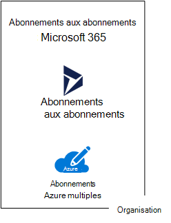
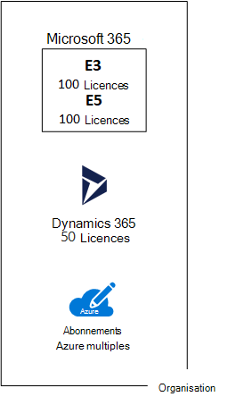

# Abonnements, licences, comptes et clients des offres de cloud de Microsoft

Microsoft fournit une hiérarchie d’organisations, d’abonnements, de licences et de comptes d’utilisateur pour une utilisation cohérente des identités et de la facturation dans ses offres cloud :
  
- Microsoft 365 et Microsoft Office 365
- Microsoft Azure
- Microsoft Dynamics 365

## Éléments de la hiérarchie

Voici les éléments de la hiérarchie :
  
### Organisation

Une organisation représente une entité commerciale qui utilise les offres de cloud Microsoft et qui est généralement identifiée par un ou plusieurs domaines DNS publics, par exemple contoso.com. L’organisation est un conteneur pour les abonnements.
  
### Abonnements

Un abonnement est un accord conclu avec Microsoft sur l’utilisation d’une ou de plusieurs plateformes ou services de cloud Microsoft, dont les frais applicables sont calculés sur la base de frais de licence par utilisateur ou selon la consommation des ressources de cloud. 

- Les offres SaaS (Software as a Service) basées sur le cloud de Microsoft (Microsoft 365 et Dynamics 365) facturent des frais de licence par utilisateur. 
- Les offres de cloud Microsoft Platform as a Service (PaaS) et Infrastructure as a Service (IaaS) (Azure) facturent des frais en fonction de la consommation des ressources de cloud.
 
Vous pouvez également utiliser un abonnement d’évaluation, mais l’abonnement expire après une certaine période ou des frais de consommation spécifiques. Vous pouvez convertir un abonnement d’évaluation en abonnement payant.
  
Les organisations peuvent avoir plusieurs abonnements pour les offres de cloud Microsoft, comme illustré dans la Figure 1. La Figure 1 présente une organisation unique avec plusieurs abonnements Microsoft 365, un abonnement Dynamics 365 et plusieurs abonnements Azure.

**Figure 1 : Exemple de plusieurs abonnements pour une organisation**

  
### Licences

Pour les offres de cloud SaaS de Microsoft, une licence permet à un compte d’utilisateur spécifique d’utiliser les services de l’offre de cloud. Vous payez un coût mensuel fixe dans le cadre de votre abonnement. Les administrateurs attribuent des licences à des comptes d’utilisateur individuels dans l’abonnement. Par exemple, dans la Figure 2, la société Contoso a un abonnement à Microsoft 365 E5 avec 100 licences, ce qui permet à un maximum de 100 comptes d’utilisateur individuels d’utiliser les services et fonctionnalités de Microsoft 365 E5.
  
**Figure 2 : Licences liées aux abonnements SaaS d’une organisation**

>[!Note]
>L’une des meilleures pratiques en matière de sécurité consiste à utiliser des comptes d’utilisateurs distincts qui ont des rôles spécifiques pour des fonctions d’administration. Il n’est pas nécessaire d’attribuer une licence à ces comptes d’administrateur dédiés pour les services cloud qu’ils gèrent. Par exemple, il n’est pas nécessaire d’attribuer une licence Microsoft 365 à un compte d’administrateur SharePoint.
>

Pour les services de cloud PaaS Azure, les licences logicielles sont intégrées dans la tarification du service.  
  
Pour les machines virtuelles IaaS Azure, des licences supplémentaires pour utiliser le logiciel ou une application installé(e) sur une image de machine virtuelle peuvent être exigées. Certaines images de machine virtuelle disposent de versions sous licence des logiciels installés et le coût est inclus dans le tarif par minute du serveur. Les images de machine virtuelle pour SQL Server 2014 et SQL Server 2016 en sont des exemples. 
  
Certaines images de machine virtuelle ont des versions d’évaluation des applications installées et ont besoin de licences logicielles supplémentaires pour une utilisation au-delà de la période d’évaluation. Par exemple, l’image de machine virtuelle de la version d’évaluation de SharePoint Server 2016 inclut une version d’évaluation de SharePoint Server 2016 préinstallée. Pour continuer à utiliser SharePoint Server 2016 après la date d’expiration de la version d’évaluation, vous devez acheter une licence SharePoint Server 2016 et des licences client auprès de Microsoft. Ces frais sont distincts de l’abonnement Azure et le tarif par minute relatif pour l’exécution de la machine virtuelle reste applicable.
  
### Comptes d’utilisateur

Les comptes d’utilisateur pour toutes les offres de cloud de Microsoft sont stockés dans un client Azure Active Directory (Azure AD) qui contient des comptes et groupes d’utilisateurs. Un client Azure AD peut être synchronisé avec vos comptes Active Directory Domain Services (AD DS) existants à l’aide d’Azure AD Connect, un service de serveur Windows. C’est ce que l’on appelle la synchronisation d’annuaires.
  
La Figure 3 illustre un exemple de plusieurs abonnements d’une organisation à l’aide d’un client Azure Active Directory commun qui contient les comptes de l’organisation.
  
**Figure 3 : Plusieurs abonnements d’une organisation qui utilisent le même client Azure AD**

  
### Clients

Pour les offres SaaS cloud, le client est l’emplacement régional qui héberge les serveurs fournissant des services de cloud. Par exemple, la société Contoso a choisi la région Europe pour héberger ses clients Microsoft 365, EMS et Dynamics 365 pour les 15 000 travailleurs de son siège social à Paris.
  
Les services PaaS Azure et les charges de travail basées sur une machine virtuelle hébergés dans IaaS Azure peuvent avoir une location dans n’importe quel centre de données Azure dans le monde entier. Vous spécifiez le centre de données Azure, appelé emplacement, lorsque vous créez l’application ou le service PaaS Azure, ou l’élément d’une charge de travail IaaS.
  
Un client Azure Active Directory est une instance spécifique d’Azure AD contenant des comptes et des groupes. Les abonnements d’évaluation ou payants de Microsoft 365 ou Dynamics 365 incluent un client Azure Active Directory gratuit. Ce client Azure Active Directory n’inclut pas les autres services Azure et n’est pas identique à un abonnement d’évaluation ou payant Azure.
  
### Résumé de la hiérarchie

Voici un récapitulatif rapide :
  
- Une organisation peut avoir plusieurs abonnements
    
  - Un abonnement peut avoir plusieurs licences
    
  - Des licences peuvent être affectées à des comptes d’utilisateur individuels
    
  - Les comptes d’utilisateur sont stockés dans un client Azure AD
    
Voici un exemple de relation des organisations, des abonnements, des licences et des comptes d’utilisateur :
  
- Une organisation identifiée par son nom de domaine public.
    
  - Un abonnement Microsoft 365 E3 avec licences utilisateur.
    
    Un abonnement Microsoft 365 E5 avec licences utilisateur.
    
    Un abonnement Dynamics 365 avec licences utilisateur.
    
    Abonnements Azure multiples
    
  - Les comptes d’utilisateurs de l’organisation dans un client Azure AD commun.
    
Plusieurs abonnements à des offres de cloud Microsoft peuvent utiliser le même client Azure AD, qui agit comme un fournisseur d’identité commun. Un client Azure AD central qui contient les comptes synchronisés de votre AD DS local fournit une identité IDaaS dans le cloud pour votre organisation. 
  
**Figure 4 : Comptes en local synchronisés et IDaaS pour une organisation**

  
La Figure 4 montre l’utilisation d’un client Azure AD commun par les offres cloud SaaS de Microsoft, les applications PaaS Azure et les machines virtuelles dans IaaS Azure qui utilisent Azure Active Directory Domain Services. Azure AD Connect synchronise la forêt AD DS locale avec le client Azure AD.
  
## Combiner les abonnements de plusieurs offres de cloud Microsoft

Le tableau suivant décrit la manière dont vous pouvez combiner plusieurs offres de cloud Microsoft en disposant déjà d’un abonnement pour un type d’offre de cloud (étiquettes actives vers le bas de la première colonne) et en ajoutant un abonnement pour une offre de cloud différente (à travers les colonnes).
  
||**Microsoft 365**|**Azure**|**Dynamics 365**|
|:-----|:-----|:-----|:-----|:-----|
|**Microsoft 365**   |N/A    |Vous ajoutez un abonnement Azure à votre organisation à partir du portail Azure.    |Vous ajoutez un abonnement Dynamics 365 à votre organisation à partir du Centre d’administration Microsoft 365.    |
|**Azure**   |Vous ajoutez un abonnement Microsoft 365 à votre organisation.    |N/A    |Vous ajoutez un abonnement Dynamics 365 à votre organisation.    |
|**Dynamics 365**   |Vous ajoutez un abonnement Microsoft 365 à votre organisation.    |Vous ajoutez un abonnement Azure à votre organisation à partir du portail Azure.    |N/A    |
   
Une solution simple pour ajouter des abonnements à votre organisation pour les services SaaS Microsoft consiste à utiliser le centre d’administration :
  
1. Connectez-vous au Centre d’administration Microsoft 365 ([https://admin.microsoft.com](https://admin.microsoft.com)) avec votre compte d’administrateur général.
    
2. À partir du volet de navigation gauche de la page d’accueil du **centre d’administration**, cliquez sur **Facturation**, puis **Acheter des services**.
    
3. Dans la page **Acheter des services**, achetez vos nouveaux abonnements.
    
Le centre d’administration affecte l’organisation et le client Azure AD de votre abonnement à Microsoft 365 aux nouveaux abonnements pour les offres cloud SaaS.
  
Pour ajouter un abonnement Azure disposant de la même organisation et du même client Azure Active Directory que votre abonnement Microsoft 365, procédez comme suit :
  
1. Connectez-vous au portail Azure ([https://portal.azure.com](https://portal.azure.com)) avec votre compte Administrateur général Microsoft 365.
    
2. Dans le volet de navigation gauche, cliquez sur **Abonnements**, puis sur **Ajouter**.
    
3. Dans la page **Ajouter un abonnement**, sélectionnez une offre et complétez l’accord et les informations de paiement.
    
Si vous avez obtenu séparément des abonnements Azure et Microsoft 365, et que vous souhaitez accéder au client Microsoft 365 Azure AD à partir de votre abonnement Azure, reportez-vous aux instructions décrites de l’article [Ajouter un abonnement Azure à votre locataire Azure Active Directory](/azure/active-directory/fundamentals/active-directory-how-subscriptions-associated-directory).
 
## Voir aussi

[Illustrations de documents sur le cloud Microsoft pour les architectes d’entreprise](../solutions/cloud-architecture-models.md)
  
[Modèles architecturaux pour SharePoint, Exchange, Skype Entreprise et Lync](architectural-models-for-sharepoint-exchange-skype-for-business-and-lync.md)
  
[Solutions hybrides](hybrid-solutions.md)

## Étape suivante

[Évaluation de la connectivité réseau Microsoft 365](assessing-network-connectivity.md)
