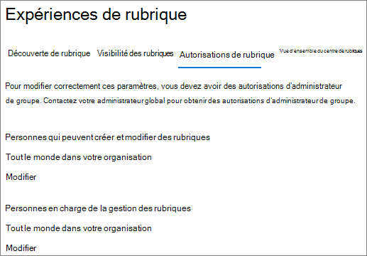

# Gérer les autorisations de rubrique dans Microsoft 365Manage topic permissions in Microsoft 365

Vous pouvez gérer les paramètres des autorisations de rubrique dans le [Centre d’administration 365 de Microsoft](https://admin.microsoft.com).You can manage topic permissions settings in the [Microsoft 365 admin center](https://admin.microsoft.com). Vous devez être un administrateur général ou un administrateur SharePoint pour effectuer ces tâches.You must be a global administrator or SharePoint administrator to perform these tasks.

Avec les paramètres d’autorisations de rubrique, vous pouvez choisir :With topic permissions settings you can choose:

- Les utilisateurs qui peuvent créer et modifier des rubriques : créer de nouvelles rubriques qui n’ont pas été trouvées lors de la découverte ou modifier des détails de rubrique existants.Which users can create and edit topics: Create new topics that were not found during discovery or edit existing topic details.
- Les utilisateurs qui peuvent gérer les rubriques : accéder au centre d’administration des rubriques et afficher les commentaires sur les sujets, ainsi que déplacer les sujets tout au long du cycle de vie.Which users can manage topics: Access the topic management center and view feedback on topics as well as move topics through the lifecycle.

## Pour accéder aux paramètres de gestion des rubriques :To access topics management settings:

1. Dans le centre d’administration Microsoft 365, cliquez sur **paramètres**, puis sur paramètres de l' **organisation**.In the Microsoft 365 admin center, click **Settings**, then **Org settings**.
2. Sous l’onglet **services** , cliquez sur le **réseau de connaissances**.On the **Services** tab, click **Knowledge network**.

     

3. Sélectionnez l’onglet **autorisations des rubriques** . Consultez les sections suivantes pour obtenir des informations sur chaque paramètre.Select the **Topic permissions** tab. See the following sections for information about each setting.

     

## Modifier les utilisateurs disposant des autorisations pour mettre à jour les détails des rubriquesChange who has permissions to update topic details

Pour mettre à jour les utilisateurs disposant des autorisations permettant de créer et de modifier des rubriques :To update who has permissions to create and edit topics:

1. Sous l’onglet **autorisations de rubrique** , sous **qui peut créer et modifier des rubriques**, sélectionnez **modifier**.On the **Topic permissions** tab, under **Who can create and edit topics**, select **Edit**.
2. Sur la page **qui peut créer et modifier des rubriques** , vous pouvez sélectionner :On the **Who can create and edit topics** page, you can select:
    - **Tout le monde dans votre organisation****Everyone in your organization**
    - **Uniquement les personnes ou les groupes de sécurité sélectionnés****Only selected people or security groups**
    - **Personne****No one**

      

3. Sélectionnez **Enregistrer**.Select **Save**.

Pour mettre à jour les personnes autorisées à gérer les rubriques, procédez comme suit :To update who has permissions to manage topics:

1. Sous l’onglet **autorisations de rubrique** , sous **qui peut gérer les rubriques**, sélectionnez **modifier**.On the **Topic permissions** tab, under **Who can manage topics**, select **Edit**.
2. Sur la page **qui peut gérer les rubriques** , vous pouvez sélectionner les éléments suivants :On the **Who can manage topics** page, you can select:
    - **Tout le monde dans votre organisation****Everyone in your organization**
    - **Personnes ou groupes de sécurité sélectionnés****Selected people or security groups**

      

3. Sélectionnez **Enregistrer**.Select **Save**.

## Voir aussiSee also

[Gestion de la découverte de rubrique dans Microsoft 365Manage topic discovery in Microsoft 365](topic-experiences-discovery.md)

[Gestion de la visibilité des rubriques dans Microsoft 365Manage topic visibility in Microsoft 365](topic-experiences-knowledge-rules.md)

[Modifier le nom du centre de rubrique dans Microsoft 365Change the name of the topic center in Microsoft 365](topic-experiences-administration.md)
