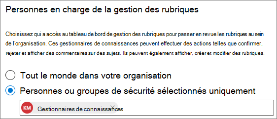

# Gérer les autorisations de rubrique dans Microsoft 365

Vous pouvez gérer les paramètres des autorisations de rubrique dans le [Centre d’administration 365 de Microsoft](https://admin.microsoft.com). Vous devez être un administrateur général ou un administrateur SharePoint pour effectuer ces tâches.

Avec les paramètres d’autorisations de rubrique, vous pouvez choisir :

- Les utilisateurs qui peuvent créer et modifier des rubriques : créer de nouvelles rubriques qui n’ont pas été trouvées lors de la découverte ou modifier des détails de rubrique existants.
- Les utilisateurs qui peuvent gérer les rubriques : accéder au centre d’administration des rubriques et afficher les commentaires sur les sujets, ainsi que déplacer les sujets tout au long du cycle de vie.

## Pour accéder aux paramètres de gestion des rubriques :

1. Dans le centre d’administration Microsoft 365, cliquez sur **paramètres**, puis sur paramètres de l' **organisation**.
2. Sous l’onglet **services** , cliquez sur le **réseau de connaissances**.

     

3. Sélectionnez l’onglet **autorisations des rubriques** . Consultez les sections suivantes pour obtenir des informations sur chaque paramètre.

     

## Modifier les utilisateurs disposant des autorisations pour mettre à jour les détails des rubriques

Pour mettre à jour les utilisateurs disposant des autorisations permettant de créer et de modifier des rubriques :

1. Sous l’onglet **autorisations de rubrique** , sous **qui peut créer et modifier des rubriques**, sélectionnez **modifier**.
2. Sur la page **qui peut créer et modifier des rubriques** , vous pouvez sélectionner :
    - **Tout le monde dans votre organisation**
    - **Uniquement les personnes ou les groupes de sécurité sélectionnés**
    - **Personne**

      

3. Sélectionnez **Enregistrer**.

Pour mettre à jour les personnes autorisées à gérer les rubriques, procédez comme suit :

1. Sous l’onglet **autorisations de rubrique** , sous **qui peut gérer les rubriques**, sélectionnez **modifier**.
2. Sur la page **qui peut gérer les rubriques** , vous pouvez sélectionner les éléments suivants :
    - **Tout le monde dans votre organisation**
    - **Personnes ou groupes de sécurité sélectionnés**

      

3. Sélectionnez **Enregistrer**.

## Voir aussi

[Gestion de la découverte de rubrique dans Microsoft 365](topic-experiences-discovery.md)

[Gestion de la visibilité des rubriques dans Microsoft 365](topic-experiences-knowledge-rules.md)

[Modifier le nom du centre de rubrique dans Microsoft 365](topic-experiences-administration.md)
