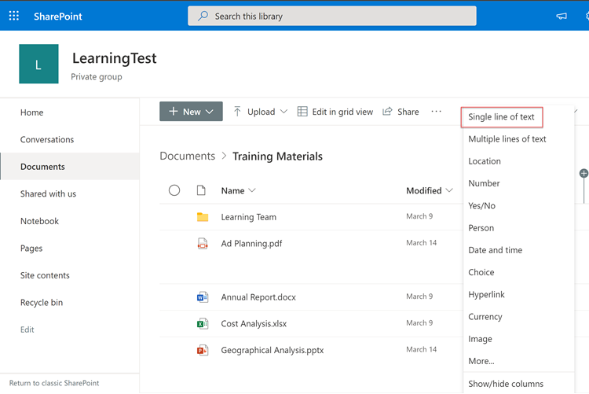
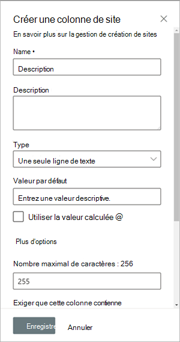
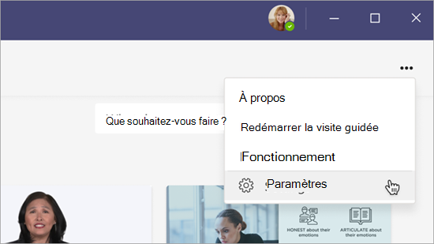

# Bientôt disponible : configurer SharePoint comme source de contenu d’apprentissage pour Microsoft Microsoft Learning (prévisualisation)

> [!NOTE]
> Les informations de cet article concernent un produit d’aperçu qui peut être considérablement modifié avant sa publication commerciale. 

Vous pouvez configurer SharePoint en tant que source de contenu d’apprentissage pour rendre le contenu propre à votre organisation disponible dans Learning Learning (Prévisualisation).

## Vue d'ensemble

L’administrateur du savoir (ou administrateur général) fournit une URL de site où le service d’apprentissage peut créer un emplacement centralisé vide(référentiel de contenu d’application d’apprentissage) sous la forme d’une liste SharePoint structurée. Cette liste peut être utilisée par votre organisation pour contenir des liens vers des dossiers SharePoint’entreprise contenant du contenu d’apprentissage. Les administrateurs sont chargés de collecter et de organiser une liste d’URL pour les dossiers. Ces dossiers doivent inclure uniquement le contenu qui peut être mis à disposition dans Learning (Prévisualisation).

Learning (Prévisualisation) prend en charge les types de documents suivants :

- Word, PowerPoint, Excel, PDF
- Audio (.m4a)
- Vidéo (.mov, .mp4, .avi)

Pour plus d’informations, [voir SharePoint limites.](/office365/servicedescriptions/sharepoint-online-service-description/sharepoint-online-limits?redirectSourcePath=%252farticle%252fSharePoint-Online-limits-8f34ff47-b749-408b-abc0-b605e1f6d498) 

## Autorisations

Les URL de dossier de bibliothèque de documents peuvent être collectées à partir de n’importe quel site SharePoint de l’organisation. Learning (Preview) suit toutes les autorisations de contenu existantes. Par conséquent, seul le contenu pour lequel un utilisateur a l’autorisation d’accéder est accessible et visible dans Learning (Preview). Tout contenu de ces dossiers est utilisable dans une recherche, mais seul le contenu pour lequel l’employé dispose d’autorisations peut être utilisé.

La suppression de contenu du référentiel de votre organisation n’est actuellement pas prise en charge.

Pour supprimer le contenu accidentellement surface, suivez les étapes suivantes :

1.  Pour restreindre l’accès à la bibliothèque de documents, sélectionnez l’option Afficher **les actions,** puis **sélectionnez Gérer l’accès.**
     
     

2.  Supprimez le document d’origine dans la bibliothèque de documents.

Pour plus d’informations, [voir Partage et autorisations dans l’SharePoint moderne.](/sharepoint/modern-experience-sharing-permissions) 

## Service d’apprentissage

Le service d’apprentissage utilise les URL de dossier fournies pour obtenir des métadonnées à partir de tout le contenu stocké dans ces dossiers. Dans un délai de 24 heures après la fourniture de l’URL du dossier dans le référentiel centralisé, les employés peuvent rechercher et utiliser le contenu de votre organisation dans Learning (Prévisualisation). Toutes les modifications apportées au contenu, y compris les métadonnées et autorisations mises à jour, seront également appliquées dans le service d’apprentissage dans les 24 heures.

## Configurer SharePoint comme source

Vous devez être un administrateur Microsoft 365 général, un administrateur SharePoint ou un administrateur du savoir pour effectuer ces tâches.

Pour configurer des SharePoint en tant que sources de contenu d’apprentissage dans Le Monde Learning (Prévisualisation), suivez les étapes suivantes :

1.  Dans le navigation gauche du centre d Microsoft 365'administration, Paramètres   >  **paramètres de l’organisation.**
 
2.  Dans la page **Paramètres de l’organisation,** sous l’onglet **Services,** **sélectionnez Learning (Prévisualisation).**

     

3.  Dans le **panneau Learning (Prévisualisation),** sous SharePoint, fournit l’URL du site SharePoint où vous souhaitez que Learning Learning (Preview) crée un référentiel centralisé.

     

4.  Une liste SharePoint est créée automatiquement dans le site SharePoint fourni.

     

     Dans le navigation gauche du site SharePoint, sélectionnez Contenu du **site** Référentiel de contenu  >  **d’application d’apprentissage.** 

      

5. Dans la page Référentiel de contenu **d’application** d’apprentissage, SharePoint la liste des url vers les dossiers de contenu d’apprentissage.

   1. Sélectionnez **Nouveau** pour afficher le **panneau Nouvel** élément. 

       
 
   2. Dans le **panneau Nouvel élément,** dans le champ **Titre,** ajoutez un nom de répertoire de votre choix. Dans le champ **URL du** dossier, ajoutez l’URL au dossier de contenu d’apprentissage. Cliquez sur **Enregistrer**.

       

   3. La page **Référentiel de contenu d’application d’apprentissage** est mise à jour avec le nouveau contenu d’apprentissage.

       

> [!NOTE]
> Pour permettre un accès plus large au référentiel de contenu d’application d’apprentissage, un lien vers la liste sera bientôt disponible dans l’interface Learning (Prévisualisation) dans laquelle les utilisateurs peuvent demander l’accès et, en fin de compte, contribuer à remplir la liste. Les propriétaires de site et les administrateurs globaux doivent accorder l’accès à la liste. L’accès est spécifique à la liste uniquement et ne s’applique pas au site où la liste est stockée. Pour plus d’informations, voir [Fournir](#provide-your-own-organizations-content) le contenu de votre propre organisation plus loin dans cet article.

### Curation de bibliothèque de documents d’URL de dossier

Les métadonnées par défaut (telles que la date de modification, créées par, le nom du document, le type de contenu et le nom de l’organisation) sont automatiquement extraites dans Learning Learning (Prévisualisation) par l’API Microsoft Graph.
 
Pour améliorer la pertinence globale de la recherche et de la découverte du contenu, nous vous recommandons d’ajouter une **colonne Description.**

Pour ajouter une **colonne Description** à la page de bibliothèque de documents, suivez les étapes suivantes :

1.  Dans la page **Documents,** sélectionnez **Ajouter une colonne.**

2. Sélectionnez **l’option Afficher les actions,** puis **sélectionnez Une seule ligne de texte.**

     

3. Dans le **panneau Créer une colonne,** dans le champ **Nom,** ajoutez un nom descriptif pour la colonne. Cliquez sur **Enregistrer**.

     
 
4. Dans la page **Documents,** dans la **colonne Description,** ajoutez des descriptions personnalisées pour chaque élément. Si aucune description n’est fournie, Learning (Prévisualisation) fournit un message par défaut qui met en évidence le contenu comme provenant de SharePoint bibliothèque. 

     
 
### Fournir le contenu de votre propre organisation

Les administrateurs du savoir peuvent accéder au référentiel de contenu des applications d’apprentissage de leur organisation dans SharePoint, où ils peuvent fournir des références à des bibliothèques de documents entre les organisations. Le contenu de ces bibliothèques sera ensuite présenté comme du contenu d’apprentissage dans Learning (Prévisualisation).

1. Dans Learning (Prévisualisation), sélectionnez **Plus d’options** (**...**), puis **sélectionnez Paramètres**.

     
     
2. Sous **Paramètres,** sélectionnez **Autorisations.**

     

3. Sélectionnez **Vérifier l’accès** pour vous connecter à la bibliothèque centralisée de votre organisation.
     
