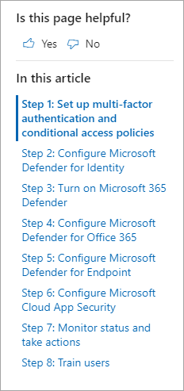

# Guide de navigation docs Microsoft 365Microsoft 365 docs navigation guide

Cette rubrique fournit des conseils et des astuces pour naviguer dans l’espace de la documentation technique de Microsoft 365.This topic provides some tips and tricks for navigating the Microsoft 365 technical documentation space.  

## Page HubHub page

La page Hub Microsoft 365 se trouve à [https://aka.ms/microsoft365docs](https://aka.ms/microsoft365docs) l’adresse et est le point d’entrée de la recherche de contenu Microsoft 365 pertinent.The Microsoft 365 hub page can be found at [https://aka.ms/microsoft365docs](https://aka.ms/microsoft365docs) and is the entry point for finding relevant Microsoft 365 content.

Vous pouvez toujours revenir à cette page en sélectionnant **Microsoft 365** dans l’en-tête en haut de chaque page de la documentation technique de Microsoft 365 :You can always navigate back to this page by selecting **Microsoft 365** from the header at the top of every page within the Microsoft 365 technical documentation set:

## Documentation hors connexionOffline documentation

Si vous souhaitez afficher la documentation de Microsoft 365 sur un système hors ligne, vous pouvez créer un fichier PDF à l’endroit où vous vous trouvez dans la documentation technique de Microsoft 365.If you would like to view the Microsoft 365 documentation on an offline system, you can create a PDF wherever you are in the Microsoft 365 technical documentation.

Si vous souhaitez créer un fichier PDF, sélectionnez le lien **Télécharger le PDF** situé en bas de chaque table des matières.If you'd like to create a PDF, select the **Download PDF** link found at the bottom of every table of contents.

## Recherche de table des matièresTOC search 
Dans docs.microsoft.com, vous pouvez effectuer des recherches dans le contenu de la table des matières en utilisant la zone de recherche de filtre en haut :On docs.microsoft.com, you can search the content in the table of contents by using the filter search box at the top:

## Filtre de versionVersion filter
La documentation technique de Microsoft 365 fournit du contenu pour des produits supplémentaires, notamment Office 365 Germany et Office 365 géré par 21 VIANET (Chine).The Microsoft 365 technical documentation provides content for additional products, including Office 365 Germany and Office 365 operated by 21 Vianet (China). Les fonctionnalités peuvent varier d’une version à une autre et, en tant que telles, le contenu lui-même peut varier.Features can vary between these versions, and as such, sometimes the content itself can vary.

Vous pouvez utiliser le filtre de version pour vous assurer que vous voyez du contenu pour la version appropriée de Microsoft 365 :You can use the version filter to ensure that you are seeing content for the appropriate version of Microsoft 365:

## BarresBreadcrumbs

Les arborescences hiérarchiques peuvent être recherchées sous l’en-tête et au-dessus de la table des matières, et indiquent où se trouve l’article actuel dans la table des matières.Breadcrumbs can be found below the header and above the table of contents, and indicate where the current article is located in the table of contents.  Non seulement cette opération permet de définir le contexte sur le type de contenu que vous lisez, mais elle vous permet également de naviguer dans l’arborescence de la table des matières :Not only does this help set the context to what type of content you're reading, but it also allows you to navigate back up the table of contents tree:

## Article navigation dans les sectionsArticle section navigation

Le volet de navigation de droite vous permet de naviguer rapidement dans les sections d’un article, ainsi que d’identifier votre emplacement au sein de l’article.The right-hand navigation pane allows you to quickly navigate to sections within an article, as well as identify your location within the article.  

## Envoyer des commentaires sur les documentsSubmit docs feedback

Si vous trouvez un problème dans un article, vous pouvez envoyer des commentaires à l’équipe de contenu SQL de cet article en faisant défiler la page vers le bas, puis en sélectionnant **contenu**.If you find something wrong within an article, you can submit feedback to the SQL Content team for that article by scrolling down to the bottom of the page and selecting **Content feedback**.

## Contribuer à la documentation Microsoft 365Contribute to Microsoft 365 documentation

Saviez-vous que vous pouviez modifier le contenu sur docs.microsoft.com vous-même ?Did you know that you could edit the content on docs.microsoft.com yourself? Si vous le faites, non seulement notre documentation sera améliorée, mais vous serez également crédité en tant que collaborateur à la page.If you do so, not only will our documentation improve, but you'll also be credited as a contributor to the page. Pour commencer, consultez les éléments suivants :To get started, see:

- [Guide de collaboration Microsoft docsMicrosoft Docs contributor guide](https://docs.microsoft.com/contribute/)

## Étapes suivantesNext steps

- Prise en main de la [documentation technique de Microsoft 365](index.yml).Get started with the [Microsoft 365 technical documentation](index.yml).
