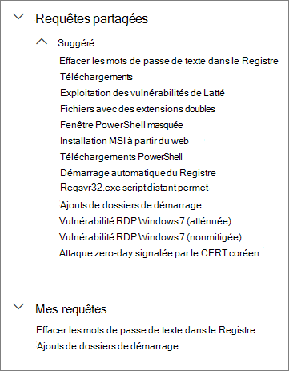
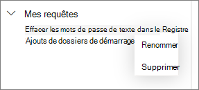

# Utiliser des requêtes partagées dans un repérage avancéUse shared queries in advanced hunting

[!INCLUDE [Microsoft 365 Defender rebranding](../../includes/microsoft-defender.md)]

**S’applique à :****Applies to:**
- [Microsoft Defender pour point de terminaisonMicrosoft Defender for Endpoint](https://go.microsoft.com/fwlink/p/?linkid=2154037)

>Vous souhaitez faire l’expérience de Defender pour point de terminaison ?Want to experience Defender for Endpoint? [Inscrivez-vous à un essai gratuit.Sign up for a free trial.](https://www.microsoft.com/microsoft-365/windows/microsoft-defender-atp?ocid=docs-wdatp-advancedhunting-abovefoldlink)

Les requêtes de [repérage avancé](advanced-hunting-overview.md) peuvent être partagées entre les utilisateurs au sein de la même organisation.[Advanced hunting](advanced-hunting-overview.md) queries can be shared among users in the same organization. Vous pouvez également trouver des requêtes partagées publiquement sur GitHub.You can also find queries shared publicly on GitHub. Ces requêtes vous permettent d’effectuer rapidement des scénarios de repérage de menace spécifiques sans avoir à créer des requêtes.These queries let you quickly pursue specific threat hunting scenarios without having to write queries from scratch.

## Enregistrer, modifier et partager une requêteSave, modify, and share a query
Vous pouvez enregistrer une requête nouvelle ou existante pour qu’elle soit uniquement accessible à vous-même ou partagée avec d’autres utilisateurs au sein de votre organisation.You can save a new or existing query so that it is only accessible to you or shared with other users in your organization.

1. Tapez une nouvelle requête ou chargez une requête existante sous Requêtes **partagées** ou **Mes requêtes.**Type a new query or load an existing one from under **Shared queries** or **My queries**.

2. Sélectionnez **Enregistrer** ou **Enregistrer en tant que dans** les options d’enregistrer.Select **Save** or **Save as** from the save options. Pour éviter l’écriture d’une requête existante, choisissez **Enregistrer sous**.To avoid overwriting an existing query, choose **Save as**.

3. Entrez un nom pour la requête.Enter a name for the query.

   

4. Sélectionnez le dossier dans lequel vous voulez enregistrer la requête.Select the folder where you'd like to save the query.
    - **Requêtes partagées** : partagées avec tous les utilisateurs de votre organisation**Shared queries** — shared to all users in your organization
    - **Mes requêtes** : accessibles uniquement à vous**My queries** — accessible only to you
    
5. Cliquez sur **Enregistrer**.Select **Save**.

## Supprimer ou renommer une requêteDelete or rename a query
1. Cliquez avec le bouton droit de la souris sur une requête que vous voulez renommer ou supprimer.Right-click on a query you want to rename or delete.

    

2. Sélectionnez **Supprimer** et confirmer la suppression.Select **Delete** and confirm deletion. Ou sélectionnez **Renommer** et attribuer un nouveau nom à la requête.Or select **Rename** and provide a new name for the query.

## Créer un lien direct vers une requêteCreate a direct link to a query
Pour générer un lien qui ouvre votre requête directement dans l’éditeur de requête de recherche avancée, finalisez votre requête et sélectionnez **Le lien partager.**To generate a link that opens your query directly in the advanced hunting query editor, finalize your query and select **Share link**.

## Accéder aux requêtes dans le référentiel GitHubAccess queries in the GitHub repository  
Les chercheurs en matière de sécurité Microsoft partagent régulièrement des requêtes de repérage avancée dans un [référentiel public désigné sur GitHub](https://github.com/Microsoft/WindowsDefenderATP-Hunting-Queries).Microsoft security researchers regularly share advanced hunting queries in a [designated public repository on GitHub](https://github.com/Microsoft/WindowsDefenderATP-Hunting-Queries). Ce référentiel est ouvert aux contributions.This repository is open to contributions. Si vous souhaitez contribuer, [ veuillez rejoindre GitHub gratuitement](https://github.com/).To contribute, [join GitHub for free](https://github.com/). 

>[!TIP]
>Les chercheurs en matière de sécurité Microsoft proposent également des requêtes de repérage avancé que vous pouvez utiliser pour localiser les activités et indicateurs associés aux menaces émergentes.Microsoft security researchers also provide advanced hunting queries that you can use to locate activities and indicators associated with emerging threats. Ces requêtes sont fournies dans le cadre du rapport de l’[analyse des menaces](threat-analytics.md) dans le Centre de sécurité Microsoft Defender.These queries are provided as part of the [threat analytics](threat-analytics.md) reports in Microsoft Defender Security Center.

## Sujets associésRelated topics
- [Vue d’ensemble du repérage avancéAdvanced hunting overview](advanced-hunting-overview.md)
- [Apprendre le langage de requêteLearn the query language](advanced-hunting-query-language.md)
- [Utiliser les résultats d’une requêteWork with query results](advanced-hunting-query-results.md)
- [Comprendre le schémaUnderstand the schema](advanced-hunting-schema-reference.md)
- [Appliquer les meilleures pratiques de requêteApply query best practices](advanced-hunting-best-practices.md)
- [Vue d’ensemble des détections personnaliséesCustom detections overview](overview-custom-detections.md)
