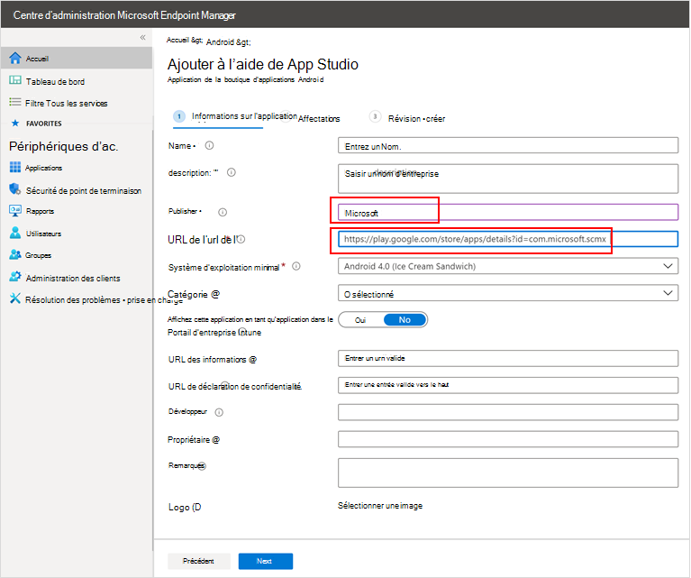
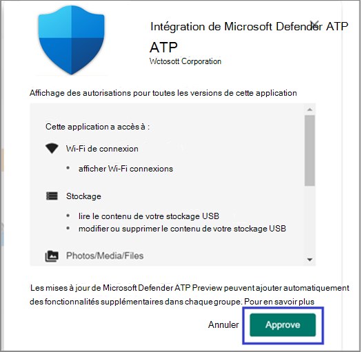
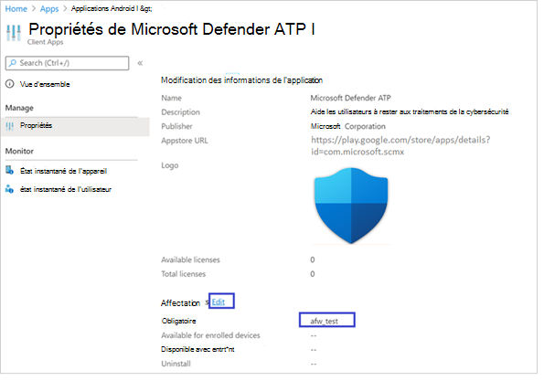
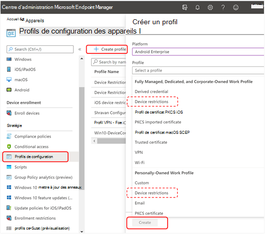
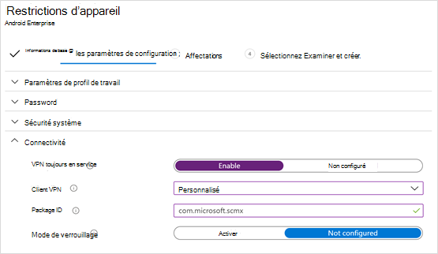
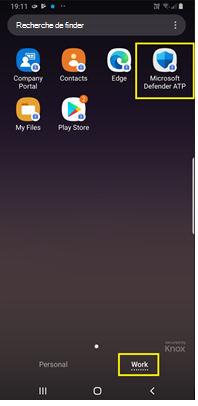
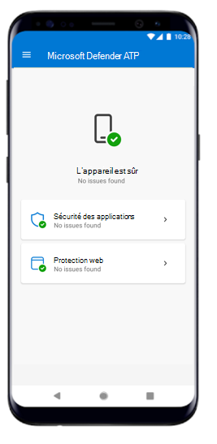

# Déployer Microsoft Defender pour endpoint pour Android avec Microsoft IntuneDeploy Microsoft Defender for Endpoint for Android with Microsoft Intune 

[!INCLUDE [Microsoft 365 Defender rebranding](../../includes/microsoft-defender.md)]

**S’applique à :****Applies to:**
- [Microsoft Defender pour point de terminaisonMicrosoft Defender for Endpoint](https://go.microsoft.com/fwlink/p/?linkid=2154037)
- [Microsoft 365 DefenderMicrosoft 365 Defender](https://go.microsoft.com/fwlink/?linkid=2118804)

> Vous souhaitez découvrir Microsoft Defender pour le point de terminaison ?Want to experience Microsoft Defender for Endpoint? [Inscrivez-vous à un essai gratuit.Sign up for a free trial.](https://www.microsoft.com/microsoft-365/windows/microsoft-defender-atp?ocid=docs-wdatp-exposedapis-abovefoldlink) 

Découvrez comment déployer Defender pour endpoint pour Android sur les appareils inscrits au portail d’entreprise Intune.Learn how to deploy Defender for Endpoint for Android on Intune Company Portal enrolled devices. Pour plus d’informations sur l’inscription d’appareils Intune, voir [Inscrire votre appareil.](https://docs.microsoft.com/mem/intune/user-help/enroll-device-android-company-portal)For more information about Intune device enrollment, see  [Enroll your device](https://docs.microsoft.com/mem/intune/user-help/enroll-device-android-company-portal).

> [!NOTE]
> **Defender pour le point de terminaison pour Android est désormais disponible sur [Google Play](https://play.google.com/store/apps/details?id=com.microsoft.scmx)****Defender for Endpoint for Android is now available on [Google Play](https://play.google.com/store/apps/details?id=com.microsoft.scmx)**  
> Vous pouvez vous connecter à Google Play à partir d’Intune pour déployer l’application Defender pour Endpoint sur les modes d’inscription Administrateur d’appareil et Android Entreprise.You can connect to Google Play from Intune to deploy Defender for Endpoint app across Device Administrator and Android Enterprise entrollment modes.
Les mises à jour de l’application sont automatiques via Google Play.Updates to the app are automatic via Google Play.

## Déployer sur les appareils inscrits à l’administrateur de périphériqueDeploy on Device Administrator enrolled devices

**Deploy Defender for Endpoint for Android on Intune Company Portal - Device Administrator enrolled devices****Deploy Defender for Endpoint for Android on Intune Company Portal - Device Administrator enrolled devices**

Découvrez comment déployer Defender pour endpoint pour Android sur le portail d’entreprise Intune - Appareils inscrits par l’administrateur d’appareil.Learn how to deploy Defender for Endpoint for Android on Intune Company Portal - Device Administrator enrolled devices. 

### Ajouter en tant qu’application de l’Android StoreAdd as Android store app

1. Dans [le Centre d’administration Microsoft Endpoint Manager,](https://go.microsoft.com/fwlink/?linkid=2109431) sélectionnez **Applications** Android Apps Ajouter une \>  \> **application de \> l’Android Store** et **sélectionnez Sélectionner.**In [Microsoft Endpoint Manager admin center](https://go.microsoft.com/fwlink/?linkid=2109431) , go to **Apps** \> **Android Apps** \> **Add \> Android store app** and choose **Select**.

   

2. Dans la page **Ajouter une** application et dans la section Informations sur *l’application,* entrez :On the **Add app** page and in the *App Information* section enter: 

   - **Name****Name** 
   - **Description****Description**
   - **Éditeur** en tant que Microsoft.**Publisher** as Microsoft.
   - **URL du Magasin d’applications** sous (URL du Google Play Store de l’application https://play.google.com/store/apps/details?id=com.microsoft.scmx Defender for Endpoint)**App store URL** as https://play.google.com/store/apps/details?id=com.microsoft.scmx (Defender for Endpoint app Google Play Store URL) 

   Les autres champs sont facultatifs.Other fields are optional. Sélectionnez **Suivant**.Select **Next**.

   

3. Dans la section *Affectations,* allez à la section **Obligatoire** et **sélectionnez Ajouter un groupe.**In the *Assignments* section, go to the **Required** section and select **Add group.** Vous pouvez ensuite choisir le ou les groupes d’utilisateurs que vous souhaitez cibler Defender pour l’application Endpoint pour Android.You can then choose the user group(s) that you would like to target Defender for Endpoint for Android app. Sélectionnez **Sélectionner,** puis **Suivant**.Choose **Select** and then **Next**.

    >[!NOTE]
    >Le groupe d’utilisateurs sélectionné doit être constitué d’utilisateurs inscrits à Intune.The selected user group should consist of Intune enrolled users.

    > [!div class="mx-imgBorder"]

    > 

4. Dans la section **Révision+Créer,** vérifiez que toutes les informations entrées sont correctes, puis sélectionnez **Créer.**In the **Review+Create** section, verify that all the information entered is correct and then select **Create**.

    Dans quelques instants, l’application Defender pour point de terminaison sera correctement créée et une notification s’affichera dans le coin supérieur droit de la page.In a few moments, the Defender for Endpoint app would be created successfully, and a notification would show up at the top-right corner of the page.

    

5. Dans la page d’informations sur l’application  qui s’affiche, dans la **section** Moniteur, sélectionnez État de l’installation de l’appareil pour vérifier que l’installation de l’appareil s’est correctement terminée.In the app information page that is displayed, in the **Monitor** section, select **Device install status** to verify that the device installation has completed successfully.

    > [!div class="mx-imgBorder"]
    > 

### Terminer l’intégration et vérifier l’étatComplete onboarding and check status

1. Une fois Que Defender pour le point de terminaison pour Android a été installé sur l’appareil, vous verrez l’icône de l’application.Once Defender for Endpoint for Android has been installed on the device, you'll see the app icon.

    

2. Appuyez sur l’icône de l’application Microsoft Defender ATP et suivez les instructions à l’écran pour terminer l’intégration de l’application.Tap the Microsoft Defender ATP app icon and follow the on-screen instructions to complete onboarding the app. Les détails incluent l’acceptation par l’utilisateur final des autorisations Android requises par Defender pour Endpoint pour Android.The details include end-user acceptance of Android permissions required by Defender for Endpoint for Android.

3. Une fois l’intégration réussie, l’appareil commence à s’afficher dans la liste Appareils dans le Centre de sécurité Microsoft Defender.Upon successful onboarding, the device will start showing up on the Devices list in Microsoft Defender Security Center.

    

## Déployer sur les appareils inscrits à Android EnterpriseDeploy on Android Enterprise enrolled devices

Defender pour le point de terminaison pour Android prend en charge les appareils inscrits à Android Enterprise.Defender for Endpoint for Android supports Android Enterprise enrolled devices.

Pour plus d’informations sur les options d’inscription pris en charge par Intune, voir [Options d’inscription.](https://docs.microsoft.com/mem/intune/enrollment/android-enroll)For more information on the enrollment options supported by Intune, see [Enrollment Options](https://docs.microsoft.com/mem/intune/enrollment/android-enroll).

**Actuellement, les appareils personnels avec profil de travail et les inscriptions d’appareils utilisateur entièrement gérées par l’entreprise sont pris en charge pour le déploiement.****Currently, Personally owned devices with work profile and Corporate-owned fully managed user device enrollments are supported for deployment.**

## Ajouter Microsoft Defender pour le point de terminaison pour Android en tant qu’application Google Play géréeAdd Microsoft Defender for Endpoint for Android as a Managed Google Play app

Suivez les étapes ci-dessous pour ajouter l’application Microsoft Defender for Endpoint à votre Google Play géré.Follow the steps below to add Microsoft Defender for Endpoint app into your managed Google Play.

1. Dans [le Centre d’administration Microsoft Endpoint Manager,](https://go.microsoft.com/fwlink/?linkid=2109431) allez à Apps  \> **Android Apps** \> **Add** et **sélectionnez Managed Google Play app**.In [Microsoft Endpoint Manager admin center](https://go.microsoft.com/fwlink/?linkid=2109431) , go to **Apps** \> **Android Apps** \> **Add** and select **Managed Google Play app**.

    > [!div class="mx-imgBorder"]
    > 

2. Sur votre page Google Play gérée qui se charge par la suite, allez dans la zone de recherche et **recherchez Microsoft Defender.**On your managed Google Play page that loads subsequently, go to the search box and lookup **Microsoft Defender.** Votre recherche doit afficher l’application Microsoft Defender for Endpoint dans votre Google Play géré.Your search should display the Microsoft Defender for Endpoint app in your Managed Google Play. Cliquez sur l’application Microsoft Defender pour le point de terminaison à partir du résultat de recherche Applications.Click on the Microsoft Defender for Endpoint app from the Apps search result.

    

3. Dans la page de description de l’application qui arrive ensuite, vous devriez être en mesure de voir les détails de l’application sur Defender for Endpoint.In the App description page that comes up next, you should be able to see app details on Defender for Endpoint. Examinez les informations sur la page, puis sélectionnez **Approuver.**Review the information on the page and then select **Approve**.

    > [!div class="mx-imgBorder"]
    > 

4. Les autorisations obtenues par Defender for Endpoint vous seront présentées pour qu’il fonctionne.You'll be presented with the permissions that Defender for Endpoint obtains for it to work. Examinez-les, puis sélectionnez **Approuver.**Review them and then select **Approve**.

    

5. La page Paramètres d’approbation s’présente.You'll be presented with the Approval settings page. La page confirme votre préférence pour gérer les nouvelles autorisations d’application que Defender pour endpoint pour Android peut demander.The page confirms your preference to handle new app permissions that Defender for Endpoint for Android might ask. Examinez les choix et sélectionnez votre option préférée.Review the choices and select your preferred option. Sélectionnez **Terminé**.Select **Done**.

    Par défaut, Google Play géré sélectionne *Conserver approuvé lorsque l’application demande de nouvelles autorisations*By default, managed Google Play selects *Keep approved when app requests new permissions*

    > [!div class="mx-imgBorder"]
    > 

6. Après avoir sélectionné la gestion des autorisations, sélectionnez **Synchroniser** pour synchroniser Microsoft Defender pour le point de terminaison avec votre liste d’applications.After the permissions handling selection is made, select **Sync** to sync Microsoft Defender for Endpoint to your apps list.

    > [!div class="mx-imgBorder"]
    > 

7. La synchronisation se terminera dans quelques minutes.The sync will complete in a few minutes.

    

8. Sélectionnez **le bouton** Actualiser dans l’écran des applications Android et Microsoft Defender ATP doit être visible dans la liste des applications.Select the **Refresh** button in the Android apps screen and Microsoft Defender ATP should be visible in the apps list.

    > [!div class="mx-imgBorder"]
    > 

9. Defender pour le point de terminaison prend en charge les stratégies de configuration d’application pour les appareils gérés via Intune.Defender for Endpoint supports App configuration policies for managed devices via Intune. Cette fonctionnalité peut être mise à profit pour obtenir automatiquement les autorisations Android applicables, de sorte que l’utilisateur final n’a pas besoin d’accepter ces autorisations.This capability can be leveraged to autogrant applicable Android permission(s), so the end user does not need to accept these permission(s).

    1. Dans la page **Applications,** go to **Policy > App configuration policies > Add > Managed devices**.In the **Apps** page, go to **Policy > App configuration policies > Add > Managed devices**.

       

    1. Dans la page **Créer une stratégie de configuration d’application,** entrez les détails suivants :In the **Create app configuration policy** page, enter the following details:
    
        - Nom : Microsoft Defender ATP.Name: Microsoft Defender ATP.
        - Choisissez **Android Entreprise comme** plateforme.Choose **Android Enterprise** as platform.
        - Choisissez **Profil de travail uniquement en** tant que type de profil.Choose **Work Profile only** as Profile Type.
        - Cliquez **sur Sélectionner l’application,** choisissez **Microsoft Defender ATP,** **sélectionnez OK,** puis **Suivant**.Click **Select App**, choose **Microsoft Defender ATP**, select **OK** and then **Next**.
    
        > [!div class="mx-imgBorder"]
        > 

    1. Dans la page **Paramètres,** cliquez sur Ajouter pour afficher la liste des autorisations prise en charge dans la section Autorisations.In the **Settings** page, go to the Permissions section click on Add to view the list of supported permissions. Dans la section Ajouter des autorisations, sélectionnez les autorisations suivantes :In the Add Permissions section, select the following permissions:

       - Stockage externe (lecture)External storage (read)
       - Stockage externe (écriture)External storage (write)

       Puis sélectionnez **OK**.Then select **OK**.

       > [!div class="mx-imgBorder"]
      > 

    1. Vous devez maintenant voir les autorisations répertoriées et maintenant vous pouvezgrant  automatiquement à la fois en choisissant legrant automatique dans la liste d’état d’autorisation, puis en sélectionnant **Suivant**.You should now see both the permissions listed and now you can autogrant both by choosing autogrant in the **Permission state** drop-down and then select **Next**.

       > [!div class="mx-imgBorder"]
       > 

    1. Dans la page **Affectations,** sélectionnez le groupe d’utilisateurs auquel cette stratégie de config d’application sera affectée.In the **Assignments** page, select the user group to which this app config policy would be assigned to. Cliquez **sur Sélectionner les groupes à inclure** et en sélectionnant le groupe applicable, puis sélectionnez **Suivant**.Click **Select groups to include** and selecting the applicable group and then selecting **Next**.  Le groupe sélectionné ici est généralement le même groupe que celui auquel vous affecteriez l’application Microsoft Defender pour Endpoint Android.The group selected here is usually the same group to which you would assign Microsoft Defender for Endpoint Android app. 

       > [!div class="mx-imgBorder"]
       > 
    

     1. Dans la page **Révision + Créer** qui arrive ensuite, examinez toutes les informations, puis sélectionnez **Créer.**In the **Review + Create** page that comes up next, review all the information and then select **Create**.  
    
        La stratégie de configuration de l’application pour Defender for Endpoint autogranting l’autorisation de stockage est désormais attribuée au groupe d’utilisateurs sélectionné.The app configuration policy for Defender for Endpoint autogranting the storage permission is now assigned to the selected user group.

        > [!div class="mx-imgBorder"]
        > 

10. Sélectionnez **l’application Microsoft Defender ATP** dans la liste \> **Propriétés** modifier les \> **affectations.** \> Select **Microsoft Defender ATP** app in the list \> **Properties** \> **Assignments** \> **Edit**.

    

11. Affectez l’application en *tant qu’application obligatoire* à un groupe d’utilisateurs.Assign the app as a *Required* app to a user group. Il est automatiquement installé  dans le profil de travail lors de la synchronisation suivante de l’appareil via l’application Portail d’entreprise.It is automatically installed in the *work profile* during the next sync of the device via Company Portal app. Cette affectation peut être effectuée en naviguant vers la section *Obligatoire* Ajouter un groupe, en sélectionnant le groupe d’utilisateurs, \>  puis en cliquant sur **Sélectionner.**This assignment can be done by navigating to the *Required* section \> **Add group,** selecting the user group and click **Select**.

    > [!div class="mx-imgBorder"]
    > 

12. Dans la page **Modifier l’application,** examinez toutes les informations entrées ci-dessus.In the **Edit Application** page, review all the information that was entered above. Sélectionnez **Ensuite Révision + Enregistrer,** puis **Réesser pour** commencer l’affectation.Then select **Review + Save** and then **Save** again to commence assignment.

### Configuration automatique du VPN toujours en serviceAuto Setup of Always-on VPN 
Defender pour le point de terminaison prend en charge les stratégies de configuration des appareils gérés via Intune.Defender for Endpoint supports Device configuration policies for managed devices via Intune. Cette fonctionnalité peut être mise à profit pour la configuration automatique du **VPN** toujours connecté sur les appareils inscrits à Android Enterprise, de sorte que l’utilisateur final n’a pas besoin de configurer le service VPN lors de l’intégration.This capability can be leveraged to **Auto setup of Always-on VPN** on Android Enterprise enrolled devices, so the end user does not need to set up VPN service while onboarding.
1.  Sur **les appareils,** sélectionnez **Profils** de configuration Créer une plateforme de profil Android Enterprise Sélectionner des restrictions d’appareil sous l’une des conditions  >    >    >   **suivantes,** en fonction du type d’inscription de votre appareilOn **Devices**, select **Configuration Profiles** > **Create Profile** > **Platform** > **Android Enterprise** Select **Device restrictions** under one of the following, based on your device enrollment type 
- **Profil de travail entièrement géré, dédié Corporate-Owned travail****Fully Managed, Dedicated, and Corporate-Owned Work Profile**
- **Profil de travail personnel****Personally owned Work Profile**

Sélectionnez **Créer**.Select **Create**.
 
   > 
    
2. **Paramètres de configuration** Fournissez **un nom et** une description **pour** identifier le profil de configuration de manière unique.**Configuration Settings** Provide a **Name** and a **Description** to uniquely identify the configuration profile. 

   > 
   
 3. Sélectionnez **Connectivité et** configurez vpn :Select **Connectivity** and configure VPN:
- Activez **le programme d’installation VPN** toujours activé d’un client VPN dans le profil professionnel pour vous connecter et vous reconnecter automatiquement au VPN dès que possible.Enable **Always-on VPN** Setup a VPN client in the work profile to automatically connect and reconnect to the VPN whenever possible. Un seul client VPN peut être configuré pour un VPN toujours connecté sur un appareil donné. Assurez-vous donc de n’avoir qu’une seule stratégie VPN toujours en service déployée sur un seul appareil.Only one VPN client can be configured for always-on VPN on a given device, so be sure to have no more than one always-on VPN policy deployed to a single device. 
- Select **Custom** in VPN client dropdown list Custom VPN in this case is Defender for Endpoint VPN which is used to provide the Web Protection feature.Select **Custom** in VPN client dropdown list Custom VPN in this case is Defender for Endpoint VPN which is used to provide the Web Protection feature. 
    > [!NOTE]
    > L’application Microsoft Defender ATP doit être installée sur l’appareil de l’utilisateur pour que la configuration automatique de ce VPN fonctionne.Microsoft Defender ATP app must be installed on user’s device, in order to functioning of auto setup of this VPN.

- Entrez **l’ID de package** de l’application Microsoft Defender ATP dans le Google Play Store.Enter **Package ID** of the Microsoft Defender ATP app in Google Play store. Pour l’URL de l’application https://play.google.com/store/apps/details?id=com.microsoft.scmx Defender, l’ID de package **est com.microsoft.scmx**For the Defender app URL https://play.google.com/store/apps/details?id=com.microsoft.scmx, Package ID is **com.microsoft.scmx**  
- **Mode verrouillage** Non configuré (valeur par défaut)**Lockdown mode** Not configured (Default) 

     
   
4. **Affectation** Dans la page  **Affectations,** sélectionnez le groupe d’utilisateurs auquel cette stratégie de config d’application   sera affectée.**Assignment** In the **Assignments** page, select the user group to which this app config policy would be assigned to. Cliquez **sur Sélectionner les** groupes à inclure et en sélectionnant le groupe applicable, puis cliquez sur **Suivant**.Click **Select groups** to include and selecting the applicable group and then click **Next**. Le groupe sélectionné ici est généralement le même groupe que celui auquel vous affecteriez l’application Microsoft Defender pour Endpoint Android.The group selected here is usually the same group to which you would assign Microsoft Defender for Endpoint Android app. 

     

5. Dans la page **Révision + Créer** qui arrive ensuite, examinez toutes les informations, puis sélectionnez **Créer.**In the **Review + Create** page that comes up next, review all the information and then select **Create**. Le profil de configuration de l’appareil est maintenant affecté au groupe d’utilisateurs sélectionné.The device configuration profile is now assigned to the selected user group.    

    

## Terminer l’intégration et vérifier l’étatComplete onboarding and check status

1. Confirmez l’état d’installation de Microsoft Defender pour le point de terminaison pour Android en cliquant sur l’état **d’installation de l’appareil.**Confirm the installation status of Microsoft Defender for Endpoint for Android by clicking on the **Device Install Status**. Vérifiez que l’appareil s’affiche ici.Verify that the device is displayed here.

    > [!div class="mx-imgBorder"]
    > 

2. Sur l’appareil, vous pouvez valider l’état d’intégration en allant au **profil professionnel.**On the device, you can validate the onboarding status by going to the **work profile**. Confirmez que Defender pour le point de terminaison est disponible et que vous êtes inscrit sur les appareils personnels **avec profil de travail.**Confirm that Defender for Endpoint is available and that you are enrolled to the **Personally owned devices with work profile**.  Si vous êtes inscrit à un appareil utilisateur entièrement géré par l’entreprise, vous disposez d’un profil unique sur l’appareil où vous pouvez confirmer que Defender pour le point de terminaison est disponible.If you are enrolled to a **Corporate-owned, fully managed user device**, you will have a single profile on the device where you can confirm that Defender for Endpoint is available.

    

3. Lorsque l’application est installée, ouvrez l’application et acceptez les autorisations, puis votre intégration doit réussir.When the app is installed, open the app and accept the permissions and then your onboarding should be successful.

    

4. À ce stade, l’appareil est correctement intégré à Defender for Endpoint pour Android.At this stage the device is successfully onboarded onto Defender for Endpoint for Android. Vous pouvez le vérifier dans le Centre de sécurité [Microsoft Defender](https://securitycenter.microsoft.com) en naviguant vers la page **Appareils.**You can verify this on the [Microsoft Defender Security Center](https://securitycenter.microsoft.com) by navigating to the **Devices** page.

    

## Voir aussiRelated topics
- [Vue d’ensemble de Microsoft Defender pour point de terminaison pour AndroidOverview of Microsoft Defender for Endpoint for Android](microsoft-defender-endpoint-android.md)
- [Configurer Microsoft Defender pour les fonctionnalités Endpoint pour AndroidConfigure Microsoft Defender for Endpoint for Android features](android-configure.md)
