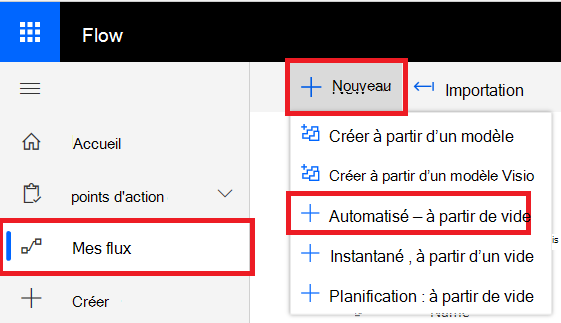

# Microsoft Power Automate (anciennement Microsoft Flow) et Azure FunctionsMicrosoft Power Automate (formerly Microsoft Flow), and Azure Functions

[!INCLUDE [Microsoft 365 Defender rebranding](../../includes/microsoft-defender.md)]

**S’applique à :****Applies to:**
- [Microsoft Defender pour point de terminaisonMicrosoft Defender for Endpoint](https://go.microsoft.com/fwlink/p/?linkid=2154037)
- [Microsoft 365 DefenderMicrosoft 365 Defender](https://go.microsoft.com/fwlink/?linkid=2118804)

- Vous souhaitez découvrir Microsoft Defender pour le point de terminaison ?Want to experience Microsoft Defender for Endpoint? [Inscrivez-vous à un essai gratuit.Sign up for a free trial.](https://www.microsoft.com/microsoft-365/windows/microsoft-defender-atp?ocid=docs-wdatp-exposedapis-abovefoldlink) 

L’automatisation des procédures de sécurité est une exigence standard pour chaque centre des opérations de sécurité moderne.Automating security procedures is a standard requirement for every modern Security Operations Center. L’absence de cyber-défenseurs professionnels force SOC à fonctionner de la manière la plus efficace et l’automatisation est une chose à faire.The lack of professional cyber defenders forces SOC to work in the most efficient way and automation is a must. Microsoft Power Automate prend en charge différents connecteurs qui ont été créés exactement pour cela.Microsoft Power Automate supports different connectors that were built exactly for that. Vous pouvez créer une automatisation de procédure de bout en bout en quelques minutes.You can build an end-to-end procedure automation within a few minutes.

L’API Microsoft Defender dispose d’un connecteur Flow officiel avec de nombreuses fonctionnalités.Microsoft Defender API has an official Flow Connector with many capabilities.

> [!NOTE]
> Pour plus d’informations sur les conditions préalables de licence des connecteurs premium, voir [Licensing for premium connectors](https://docs.microsoft.com/power-automate/triggers-introduction#licensing-for-premium-connectors).For more details about premium connectors licensing prerequisites, see [Licensing for premium connectors](https://docs.microsoft.com/power-automate/triggers-introduction#licensing-for-premium-connectors).

## Exemple d'utilisationUsage example

L’exemple suivant montre comment créer une Flow qui est déclenchée chaque fois qu’une nouvelle alerte se produit sur votre client.The following example demonstrates how to create a Flow that is triggered any time a new Alert occurs on your tenant.

1. Connectez-vous [à Microsoft Power Automate](https://flow.microsoft.com).Log in to [Microsoft Power Automate](https://flow.microsoft.com).

2. Go to **My flows**  >  **New**  >  **Automated-from blank**.Go to **My flows** > **New** > **Automated-from blank**.

    

3. Choisissez un nom pour votre Flow, recherchez « déclencheurs Microsoft Defender ATP » comme déclencheur, puis sélectionnez le nouveau déclencheur Alertes.Choose a name for your Flow, search for "Microsoft Defender ATP Triggers" as the trigger, and then select the new Alerts trigger.

    

Vous avez maintenant une Flow qui est déclenchée chaque fois qu’une nouvelle alerte se produit.Now you have a Flow that is triggered every time a new Alert occurs.

Il vous suffit maintenant de choisir les étapes suivantes.All you need to do now is choose your next steps.
Par exemple, vous pouvez isoler l’appareil si la gravité de l’alerte est élevée et envoyer un e-mail à son sujet.For example, you can isolate the device if the Severity of the Alert is High and send an email about it.
Le déclencheur d’alerte fournit uniquement l’ID d’alerte et l’ID de l’ordinateur.The Alert trigger provides only the Alert ID and the Machine ID. Vous pouvez utiliser le connecteur pour développer ces entités.You can use the connector to expand these entities.

### Obtenir l’entité Alerte à l’aide du connecteurGet the Alert entity using the connector

1. Choisissez **Microsoft Defender ATP** pour la nouvelle étape.Choose **Microsoft Defender ATP** for the new step.

2. Choose **Alerts - Get single alert API**.Choose **Alerts - Get single alert API**.

3. Définissez **l’ID d’alerte** de la dernière étape en tant **qu’entrée.**Set the **Alert ID** from the last step as **Input**.

    

### Isoler l’appareil si la gravité de l’alerte est élevéeIsolate the device if the Alert's severity is High

1. Ajoutez **condition** en tant que nouvelle étape.Add **Condition** as a new step.

2. Vérifiez si la gravité de **l’alerte est égale à** Élevée.Check if the Alert severity **is equal to** High.

   Si oui, ajoutez le Microsoft Defender ATP - Isoler l’action **de l’ordinateur** avec l’ID de l’ordinateur et un commentaire.If yes, add the **Microsoft Defender ATP - Isolate machine** action with the Machine ID and a comment.

    

3. Ajoutez une nouvelle étape pour l’envoi par courrier électronique de l’alerte et de l’isolation.Add a new step for emailing about the Alert and the Isolation. Il existe plusieurs connecteurs de messagerie très faciles à utiliser, tels que Outlook ou Gmail.There are multiple email connectors that are very easy to use, such as Outlook or Gmail.

4. Enregistrez votre flux.Save your flow.

Vous pouvez également créer un **flux programmé** qui exécute des requêtes de recherche avancée, et bien plus encore !You can also create a **scheduled** flow that runs Advanced Hunting queries and much more!

## Rubrique connexeRelated topic
- [API Microsoft Defender pour point de terminaisonMicrosoft Defender for Endpoint APIs](apis-intro.md)
