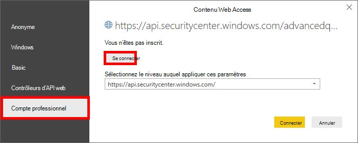

# <a name="create-custom-reports-using-power-bi"></a>Créer des rapports personnalisés à l'aide de Power BI

[!INCLUDE [Microsoft 365 Defender rebranding](../../includes/microsoft-defender.md)]

**S’applique à :**
- [Microsoft Defender pour point de terminaison](https://go.microsoft.com/fwlink/p/?linkid=2154037)
- [Microsoft 365 Defender](https://go.microsoft.com/fwlink/?linkid=2118804)


- Vous souhaitez découvrir Microsoft Defender pour le point de terminaison ? [Inscrivez-vous à un essai gratuit.](https://www.microsoft.com/microsoft-365/windows/microsoft-defender-atp?ocid=docs-wdatp-exposedapis-abovefoldlink) 

[!include[Microsoft Defender for Endpoint API URIs for US Government](../../includes/microsoft-defender-api-usgov.md)]

[!include[Improve request performance](../../includes/improve-request-performance.md)]

Dans cette section, vous allez apprendre à créer un rapport Power BI en plus des API Defender for Endpoint.

Le premier exemple montre comment connecter Power BI à l'API de recherche avancée et le deuxième exemple illustre une connexion à nos API OData, telles que les actions de l'ordinateur ou les alertes.

## <a name="connect-power-bi-to-advanced-hunting-api"></a>Connecter Power BI à l'API de recherche avancée

- Ouvrir Microsoft Power BI

- Click **Get Data** Blank  >  **Query**

    

- Cliquez sur **Éditeur avancé**

    

- Copiez le texte ci-dessous et collez-le dans l'éditeur :

```
    let 
        AdvancedHuntingQuery = "DeviceEvents | where ActionType contains 'Anti' | limit 20",

        HuntingUrl = "https://api.securitycenter.microsoft.com/api/advancedqueries",

        Response = Json.Document(Web.Contents(HuntingUrl, [Query=[key=AdvancedHuntingQuery]])),

        TypeMap = #table(
            { "Type", "PowerBiType" },
            {
                { "Double",   Double.Type },
                { "Int64",    Int64.Type },
                { "Int32",    Int32.Type },
                { "Int16",    Int16.Type },
                { "UInt64",   Number.Type },
                { "UInt32",   Number.Type },
                { "UInt16",   Number.Type },
                { "Byte",     Byte.Type },
                { "Single",   Single.Type },
                { "Decimal",  Decimal.Type },
                { "TimeSpan", Duration.Type },
                { "DateTime", DateTimeZone.Type },
                { "String",   Text.Type },
                { "Boolean",  Logical.Type },
                { "SByte",    Logical.Type },
                { "Guid",     Text.Type }
            }),

        Schema = Table.FromRecords(Response[Schema]),
        TypedSchema = Table.Join(Table.SelectColumns(Schema, {"Name", "Type"}), {"Type"}, TypeMap , {"Type"}),
        Results = Response[Results],
        Rows = Table.FromRecords(Results, Schema[Name]),
        Table = Table.TransformColumnTypes(Rows, Table.ToList(TypedSchema, (c) => {c{0}, c{2}}))

    in Table

```

- Cliquez sur **Terminé**

- Cliquez sur **Modifier les informations d'identification**

    

- Sélectionner un **compte d'organisation**  >  **pour se connecter**

    

- Entrez vos informations d'identification et attendez d'être connexion

- Cliquez sur **Se connecter**

    

- À présent, les résultats de votre requête s'affichent en tant que table et vous pouvez commencer à créer des visualisations au-dessus de celui-ci !

- Vous pouvez dupliquer cette table, la renommer et modifier la requête de recherche avancée à l'intérieur pour obtenir les données que vous souhaitez.

## <a name="connect-power-bi-to-odata-apis"></a>Connecter Power BI aux API OData

- La seule différence par rapport à l'exemple ci-dessus est la requête à l'intérieur de l'éditeur. 

- Copiez le texte ci-dessous et collez-le dans l'éditeur pour tirer toutes les **actions de** l'ordinateur de votre organisation :

```
    let

        Query = "MachineActions",

        Source = OData.Feed("https://api.securitycenter.microsoft.com/api/" & Query, null, [Implementation="2.0", MoreColumns=true])
    in
        Source

```

- Vous pouvez faire de même pour les alertes et les **ordinateurs.** 

- Vous pouvez également utiliser des requêtes OData pour les filtres de requêtes, voir [Utilisation de requêtes OData](exposed-apis-odata-samples.md)


## <a name="power-bi-dashboard-samples-in-github"></a>Exemples de tableau de bord Power BI dans GitHub
Pour plus d'informations, voir les [modèles de rapport Power BI.](https://github.com/microsoft/MicrosoftDefenderATP-PowerBI)

## <a name="sample-reports"></a>Exemples de rapports
Consultez les exemples de rapport Microsoft Defender pour Endpoint Power BI. Pour plus d'informations, voir [Parcourir les exemples de code.](https://docs.microsoft.com/samples/browse/?products=mdatp)


## <a name="related-topic"></a>Rubrique connexe
- [API Defender pour les points de terminaison](apis-intro.md)
- [API de recherche avancée de menaces](run-advanced-query-api.md)
- [Utilisation des requêtes OData](exposed-apis-odata-samples.md)
