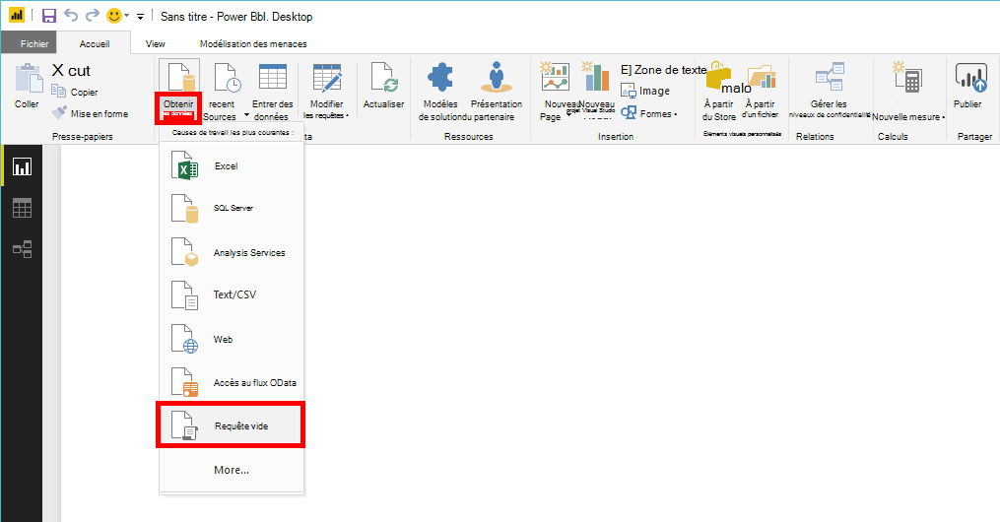

# <a name="create-custom-reports-using-power-bi"></a><span data-ttu-id="98db2-104">Créer des rapports personnalisés à l’aide Power BI</span><span class="sxs-lookup"><span data-stu-id="98db2-104">Create custom reports using Power BI</span></span>

[!INCLUDE [Microsoft 365 Defender rebranding](../../includes/microsoft-defender.md)]

<span data-ttu-id="98db2-105">**S’applique à :**</span><span class="sxs-lookup"><span data-stu-id="98db2-105">**Applies to:**</span></span>
- [<span data-ttu-id="98db2-106">Microsoft Defender pour point de terminaison</span><span class="sxs-lookup"><span data-stu-id="98db2-106">Microsoft Defender for Endpoint</span></span>](https://go.microsoft.com/fwlink/p/?linkid=2154037)
- [<span data-ttu-id="98db2-107">Microsoft 365 Defender</span><span class="sxs-lookup"><span data-stu-id="98db2-107">Microsoft 365 Defender</span></span>](https://go.microsoft.com/fwlink/?linkid=2118804)


- <span data-ttu-id="98db2-108">Vous souhaitez découvrir Microsoft Defender pour le point de terminaison ?</span><span class="sxs-lookup"><span data-stu-id="98db2-108">Want to experience Microsoft Defender for Endpoint?</span></span> [<span data-ttu-id="98db2-109">Inscrivez-vous à un essai gratuit.</span><span class="sxs-lookup"><span data-stu-id="98db2-109">Sign up for a free trial.</span></span>](https://www.microsoft.com/microsoft-365/windows/microsoft-defender-atp?ocid=docs-wdatp-exposedapis-abovefoldlink) 

[!include[Microsoft Defender for Endpoint API URIs for US Government](../../includes/microsoft-defender-api-usgov.md)]

[!include[Improve request performance](../../includes/improve-request-performance.md)]

<span data-ttu-id="98db2-110">Dans cette section, vous allez apprendre à créer un Power BI sur les API Defender for Endpoint.</span><span class="sxs-lookup"><span data-stu-id="98db2-110">In this section you will learn create a Power BI report on top of Defender for Endpoint APIs.</span></span>

<span data-ttu-id="98db2-111">Le premier exemple montre comment connecter des Power BI à l’API de recherche avancée et le deuxième exemple illustre une connexion à nos API OData, telles que les actions de l’ordinateur ou les alertes.</span><span class="sxs-lookup"><span data-stu-id="98db2-111">The first example demonstrates how to connect Power BI to Advanced Hunting API and the second example demonstrates a connection to our OData APIs, such as Machine Actions or Alerts.</span></span>

## <a name="connect-power-bi-to-advanced-hunting-api"></a><span data-ttu-id="98db2-112">Connecter Power BI à l’API de recherche avancée</span><span class="sxs-lookup"><span data-stu-id="98db2-112">Connect Power BI to Advanced Hunting API</span></span>

- <span data-ttu-id="98db2-113">Ouvrez Microsoft Power BI</span><span class="sxs-lookup"><span data-stu-id="98db2-113">Open Microsoft Power BI</span></span>

- <span data-ttu-id="98db2-114">Click **Get Data** Blank  >  **Query**</span><span class="sxs-lookup"><span data-stu-id="98db2-114">Click **Get Data** > **Blank Query**</span></span>

    

- <span data-ttu-id="98db2-116">Cliquez sur **Éditeur avancé**</span><span class="sxs-lookup"><span data-stu-id="98db2-116">Click **Advanced Editor**</span></span>

    

- <span data-ttu-id="98db2-118">Copiez le texte ci-dessous et collez-le dans l’éditeur :</span><span class="sxs-lookup"><span data-stu-id="98db2-118">Copy the below and paste it in the editor:</span></span>

```
    let 
        AdvancedHuntingQuery = "DeviceEvents | where ActionType contains 'Anti' | limit 20",

        HuntingUrl = "https://api.securitycenter.microsoft.com/api/advancedqueries",

        Response = Json.Document(Web.Contents(HuntingUrl, [Query=[key=AdvancedHuntingQuery]])),

        TypeMap = #table(
            { "Type", "PowerBiType" },
            {
                { "Double",   Double.Type },
                { "Int64",    Int64.Type },
                { "Int32",    Int32.Type },
                { "Int16",    Int16.Type },
                { "UInt64",   Number.Type },
                { "UInt32",   Number.Type },
                { "UInt16",   Number.Type },
                { "Byte",     Byte.Type },
                { "Single",   Single.Type },
                { "Decimal",  Decimal.Type },
                { "TimeSpan", Duration.Type },
                { "DateTime", DateTimeZone.Type },
                { "String",   Text.Type },
                { "Boolean",  Logical.Type },
                { "SByte",    Logical.Type },
                { "Guid",     Text.Type }
            }),

        Schema = Table.FromRecords(Response[Schema]),
        TypedSchema = Table.Join(Table.SelectColumns(Schema, {"Name", "Type"}), {"Type"}, TypeMap , {"Type"}),
        Results = Response[Results],
        Rows = Table.FromRecords(Results, Schema[Name]),
        Table = Table.TransformColumnTypes(Rows, Table.ToList(TypedSchema, (c) => {c{0}, c{2}}))

    in Table

```

- <span data-ttu-id="98db2-119">Cliquez sur **Terminé**</span><span class="sxs-lookup"><span data-stu-id="98db2-119">Click **Done**</span></span>

- <span data-ttu-id="98db2-120">Cliquez sur **Modifier les informations d’identification**</span><span class="sxs-lookup"><span data-stu-id="98db2-120">Click **Edit Credentials**</span></span>

    

- <span data-ttu-id="98db2-122">Sélectionner un **compte d’organisation**  >  **pour se connecter**</span><span class="sxs-lookup"><span data-stu-id="98db2-122">Select **Organizational account** > **Sign in**</span></span>

    

- <span data-ttu-id="98db2-124">Entrez vos informations d’identification et attendez d’être connexion</span><span class="sxs-lookup"><span data-stu-id="98db2-124">Enter your credentials and wait to be signed in</span></span>

- <span data-ttu-id="98db2-125">Cliquez **sur Connecter**</span><span class="sxs-lookup"><span data-stu-id="98db2-125">Click **Connect**</span></span>

    

- <span data-ttu-id="98db2-127">À présent, les résultats de votre requête s’affichent en tant que table et vous pouvez commencer à créer des visualisations au-dessus de celui-ci !</span><span class="sxs-lookup"><span data-stu-id="98db2-127">Now the results of your query will appear as table and you can start build visualizations on top of it!</span></span>

- <span data-ttu-id="98db2-128">Vous pouvez dupliquer cette table, la renommer et modifier la requête de recherche avancée à l’intérieur pour obtenir les données que vous souhaitez.</span><span class="sxs-lookup"><span data-stu-id="98db2-128">You can duplicate this table, rename it and edit the Advanced Hunting query inside to get any data you would like.</span></span>

## <a name="connect-power-bi-to-odata-apis"></a><span data-ttu-id="98db2-129">Connecter Power BI aux API OData</span><span class="sxs-lookup"><span data-stu-id="98db2-129">Connect Power BI to OData APIs</span></span>

- <span data-ttu-id="98db2-130">La seule différence par rapport à l’exemple ci-dessus est la requête à l’intérieur de l’éditeur.</span><span class="sxs-lookup"><span data-stu-id="98db2-130">The only difference from the above example is the query inside the editor.</span></span> 

- <span data-ttu-id="98db2-131">Copiez le texte ci-dessous et collez-le dans l’éditeur pour tirer toutes les **actions de** l’ordinateur de votre organisation :</span><span class="sxs-lookup"><span data-stu-id="98db2-131">Copy the below and paste it in the editor to pull all **Machine Actions** from your organization:</span></span>

```
    let

        Query = "MachineActions",

        Source = OData.Feed("https://api.securitycenter.microsoft.com/api/" & Query, null, [Implementation="2.0", MoreColumns=true])
    in
        Source

```

- <span data-ttu-id="98db2-132">Vous pouvez faire de même pour les alertes et les **ordinateurs.** </span><span class="sxs-lookup"><span data-stu-id="98db2-132">You can do the same for **Alerts** and **Machines**.</span></span>

- <span data-ttu-id="98db2-133">Vous pouvez également utiliser des requêtes OData pour les filtres de requêtes, voir [Utilisation de requêtes OData](exposed-apis-odata-samples.md)</span><span class="sxs-lookup"><span data-stu-id="98db2-133">You also can use OData queries for queries filters, see [Using OData Queries](exposed-apis-odata-samples.md)</span></span>


## <a name="power-bi-dashboard-samples-in-github"></a><span data-ttu-id="98db2-134">Power BI exemples de tableau de bord dans GitHub</span><span class="sxs-lookup"><span data-stu-id="98db2-134">Power BI dashboard samples in GitHub</span></span>
<span data-ttu-id="98db2-135">Pour plus d’informations, [voir Power BI modèles de rapport.](https://github.com/microsoft/MicrosoftDefenderATP-PowerBI)</span><span class="sxs-lookup"><span data-stu-id="98db2-135">For more information see the [Power BI report templates](https://github.com/microsoft/MicrosoftDefenderATP-PowerBI).</span></span>

## <a name="sample-reports"></a><span data-ttu-id="98db2-136">Exemples de rapports</span><span class="sxs-lookup"><span data-stu-id="98db2-136">Sample reports</span></span>
<span data-ttu-id="98db2-137">Affichez les exemples de rapport microsoft Defender pour Power BI de point de terminaison.</span><span class="sxs-lookup"><span data-stu-id="98db2-137">View the Microsoft Defender for Endpoint Power BI report samples.</span></span> <span data-ttu-id="98db2-138">Pour plus d’informations, voir [Parcourir les exemples de code.](/samples/browse/?products=mdatp)</span><span class="sxs-lookup"><span data-stu-id="98db2-138">For more information, see [Browse code samples](/samples/browse/?products=mdatp).</span></span>


## <a name="related-topic"></a><span data-ttu-id="98db2-139">Rubrique connexe</span><span class="sxs-lookup"><span data-stu-id="98db2-139">Related topic</span></span>
- [<span data-ttu-id="98db2-140">API Defender pour les points de terminaison</span><span class="sxs-lookup"><span data-stu-id="98db2-140">Defender for Endpoint APIs</span></span>](apis-intro.md)
- [<span data-ttu-id="98db2-141">API de recherche avancée de menaces</span><span class="sxs-lookup"><span data-stu-id="98db2-141">Advanced Hunting API</span></span>](run-advanced-query-api.md)
- [<span data-ttu-id="98db2-142">Utilisation des requêtes OData</span><span class="sxs-lookup"><span data-stu-id="98db2-142">Using OData Queries</span></span>](exposed-apis-odata-samples.md)
