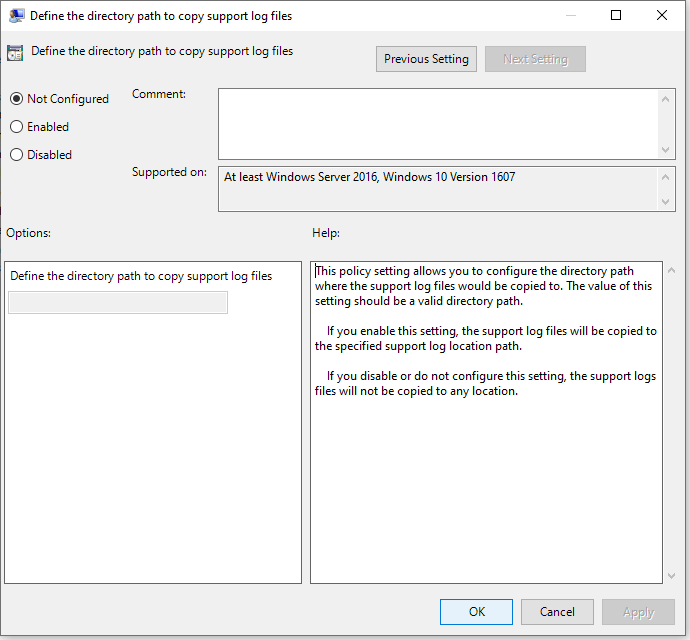

# <a name="collect-microsoft-defender-av-diagnostic-data"></a>Collecter les données de diagnostic de l'Antivirus Microsoft Defender

[!INCLUDE [Microsoft 365 Defender rebranding](../../includes/microsoft-defender.md)]


**S’applique à :**

- [Microsoft Defender pour point de terminaison](/microsoft-365/security/defender-endpoint/)

Cet article explique comment collecter des données de diagnostic qui peuvent être utilisées par le support microsoft et les équipes d'ingénierie pour vous aider à résoudre les problèmes que vous pouvez rencontrer lors de l'utilisation de l'Antivirus Microsoft Defender.

> [!NOTE]
> Dans le cadre du processus d'examen ou de réponse, vous pouvez collecter un package d'enquête à partir d'un appareil. Voici comment : Collecter un [package d'enquête à partir d'appareils.](/windows/security/threat-protection/microsoft-defender-atp/respond-machine-alerts#collect-investigation-package-from-devices)

Sur au moins deux appareils qui rencontrent le même problème, obtenez le fichier de diagnostic .cab en suivant les étapes ci-après :

1. Ouvrez une version de niveau administrateur de l'invite de commandes comme suit :

    a. Ouvrez **le** menu Démarrer.

    b. Tapez **cmd**. Cliquez avec le bouton droit sur **l'invite de commandes,** puis cliquez **sur Exécuter en tant qu'administrateur.**

    c. Entrez les informations d'identification de l'administrateur ou approuvez l'invite.

2. Accédez au répertoire Microsoft Defender. Par défaut, cette valeur est `C:\Program Files\Windows Defender`.

> [!NOTE]
> Si vous exécutez une version mise à jour de la plateforme [Microsoft Defender,](https://support.microsoft.com/help/4052623/update-for-microsoft-defender-antimalware-platform)exécutez-la à `MpCmdRun` partir de l'emplacement suivant : `C:\ProgramData\Microsoft\Windows Defender\Platform\<version>`

3. Tapez la commande suivante, puis appuyez sur **Entrée**  

    ```Dos
    mpcmdrun.exe -GetFiles
    ```
  
4. Un fichier .cab qui contient divers journaux de diagnostic est généré. L'emplacement du fichier est spécifié dans la sortie de l'invite de commandes. Par défaut, l'emplacement est `C:\ProgramData\Microsoft\Microsoft Defender\Support\MpSupportFiles.cab` .

> [!NOTE]
> Pour rediriger le fichier cab vers un chemin d'accès différent ou un partage UNC, utilisez la commande suivante : `mpcmdrun.exe -GetFiles -SupportLogLocation <path>`  <br/>Pour plus d'informations, voir [Rediriger les données de diagnostic vers un partage UNC.](#redirect-diagnostic-data-to-a-unc-share)

5. Copiez ces fichiers .cab vers un emplacement accessible par le support Microsoft. Par exemple, il peut s'agit d'un dossier OneDrive protégé par mot de passe que vous pouvez partager avec nous.

> [!NOTE]
>Si vous avez un problème avec la conformité des mises à jour, envoyez un courrier électronique à l'aide du modèle de courrier électronique de support update <a href="mailto:ucsupport@microsoft.com?subject=WDAV assessment issue&body=I%20am%20encountering%20the%20following%20issue%20when%20using%20Windows%20Defender%20AV%20in%20Update%20Compliance%3a%20%0d%0aI%20have%20provided%20at%20least%202%20support%20.cab%20files%20at%20the%20following%20location%3a%20%3Caccessible%20share%2c%20including%20access%20details%20such%20as%20password%3E%0d%0aMy%20OMS%20workspace%20ID%20is%3a%20%0d%0aPlease%20contact%20me%20at%3a">Compliance</a>et remplissez le modèle avec les informations suivantes :
>```
> I am encountering the following issue when using Microsoft Defender Antivirus in Update Compliance:
> I have provided at least 2 support .cab files at the following location:  
> <accessible share, including access details such as password>
>
>    My OMS workspace ID is:
>
>    Please contact me at:

## <a name="redirect-diagnostic-data-to-a-unc-share"></a>Rediriger les données de diagnostic vers un partage UNC
Pour collecter des données de diagnostic sur un référentiel central, vous pouvez spécifier le paramètre SupportLogLocation.

```Dos
mpcmdrun.exe -GetFiles -SupportLogLocation <path>
```

Copie les données de diagnostic dans le chemin d'accès spécifié. Si le chemin d'accès n'est pas spécifié, les données de diagnostic sont copiées à l'emplacement spécifié dans la configuration de l'emplacement du journal de support.

Lorsque le paramètre SupportLogLocation est utilisé, une structure de dossiers comme suit est créée dans le chemin d'accès de destination :

```Dos
<path>\<MMDD>\MpSupport-<hostname>-<HHMM>.cab
```

| champ  | Description   |
|:----|:----|
| chemin | Chemin d'accès spécifié sur la ligne de commande ou récupéré à partir de la configuration
| MMDD | Mois et jour où les données de diagnostic ont été collectées (par exemple, 0530)
| hostname | Nom d'hôte de l'appareil sur lequel les données de diagnostic ont été collectées
| HHMM | Heures et minutes de collecte des données de diagnostic (par exemple, 1422)

> [!NOTE]
> Lorsque vous utilisez un partage de fichiers, assurez-vous que le compte utilisé pour collecter le package de diagnostic dispose d'un accès en écriture au partage.  

## <a name="specify-location-where-diagnostic-data-is-created"></a>Spécifier l'emplacement où les données de diagnostic sont créées

Vous pouvez également spécifier l'endroit où le fichier .cab de diagnostic sera créé à l'aide d'un objet de stratégie de groupe (GPO). 

1. Ouvrez l'Éditeur de stratégie de groupe locale et recherchez l'po GPO SupportLogLocation à l':: `HKEY_LOCAL_MACHINE\SOFTWARE\Policies\Microsoft\Windows Defender\SupportLogLocation`
   
1. Sélectionnez **Définir le chemin d'accès du répertoire pour copier les fichiers journaux de prise en charge.**

      
        
       
3. À l'intérieur de l'éditeur de stratégie, **sélectionnez Activé.**
       
4. Spécifiez le chemin d'accès du répertoire où vous souhaitez copier les fichiers journaux de support dans le **champ Options.**
      
5. Sélectionnez **OK** ou **Appliquer.**

## <a name="see-also"></a>Voir aussi

- [Résoudre les problèmes de rapport de l'Antivirus Microsoft Defender](troubleshoot-reporting.md)